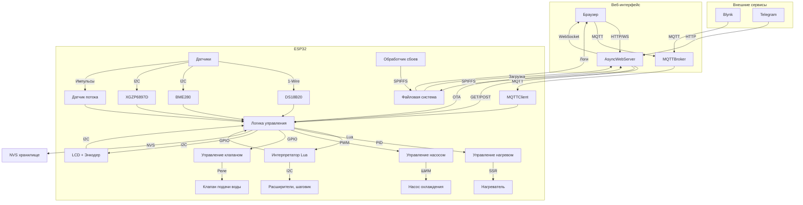

# Архитектура

```mermaid
graph TD
    subgraph "Веб-интерфейс"
        WebUI[Браузер] -->|HTTP/WS| WebServer
        WebUI -->|MQTT| MQTTBroker
    end

    subgraph "ESP32"
        WebServer[AsyncWebServer] -->|GET/POST| Logic
        WebServer -->|SPIFFS| FS[Файловая система]
        WebServer -->|WebSocket| WebUI

        MQTTBroker -->|MQTT| MQTTClient
        MQTTClient --> Logic

        Logic[Логика управления] -->|Lua| LuaEngine[Интерпретатор Lua]
        Logic -->|PID| HeaterControl[Управление нагревом]
        Logic -->|PWM| PumpControl[Управление насосом]
        Logic -->|GPIO| ValveControl[Управление клапаном]

        HeaterControl -->|SSR| Heater[Нагреватель]
        PumpControl -->|ШИМ| WaterPump[Насос охлаждения]
        ValveControl -->|Реле| Valve[Клапан подачи воды]

        Sensors[Датчики] -->|1-Wire| DS18B20[DS18B20]
        Sensors -->|I2C| BME280[BME280]
        Sensors -->|I2C| XGZP[XGZP6897D]
        Sensors -->|Импульсы| WF[Датчик потока]

        DS18B20 --> Logic
        BME280 --> Logic
        XGZP --> Logic
        WF --> Logic

        LCD[LCD + Энкодер] -->|I2C| Logic
        Logic -->|I2C| LCD

        LuaEngine -->|GPIO| Logic
        LuaEngine -->|I2C| I2CDevices[Расширители, шаговик]

        CrashHandler[Обработчик сбоев] -->|SPIFFS| FS
        FS -->|Загрузка| WebServer
        FS -->|Логи| WebUI
    end

    subgraph "Внешние сервисы"
        BlynkApp[Blynk] -->|MQTT| MQTTBroker
        TelegramBot[Telegram] -->|HTTP| WebServer
    end

    Logic -->|NVS| EEPROM[NVS хранилище]
    Logic -->|OTA| WebServer
```
