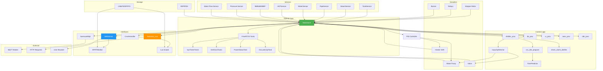

# Архитектура

```mermaid
graph TD
    subgraph "ESP32 Core"
        A[Samovar.h] --> B[FreeRTOS Tasks]
        B --> C[SysTickerTask1]
        B --> D[GetClockTask1]
        B --> E[PowerStatusTask]
        B --> F[DoLuaScriptTask]
    end

    subgraph "Sensors"
        G[TankSensor] --> A
        H[SteamSensor] --> A
        I[PipeSensor] --> A
        J[WaterSensor] --> A
        K[ACPSensor] --> A
        L[BME680/BMP] --> A
        M[Pressure Sensor] --> A
        N[Water Flow Sensor] --> A
    end

    subgraph "Actuators"
        O[Heater SSR] --> A
        P[Water Pump] --> A
        Q[Valve] --> A
        R[Stepper Motor] --> A
        S[Relays] --> A
        T[Buzzer] --> A
    end

    subgraph "Control Logic"
        A --> U[distiller_proc]
        A --> V[bk_proc]
        A --> W[cr_proc]
        A --> X[beer_proc]
        A --> Y[nbk_proc]
        U --> Z[run_dist_program]
        Z --> AA[TimePredictor]
        U --> AB[impurityDetector]
        U --> AC[check_alarm_distiller]
    end

    subgraph "Interfaces"
        A --> AD[WebServer]
        AD --> AE[SPIFFSEditor]
        A --> AF[SamovarMqtt]
        A --> AG[Samovar_Lua]
        AG --> AH[Lua Scripts]
        A --> AI[CrashHandler]
    end

    subgraph "Storage"
        AJ[LittleFS/SPIFFS] --> AE
        AJ --> AH
        AK[EEPROM] --> A
    end

    subgraph "External"
        AF --> AL[MQTT Broker]
        AG --> AM[HTTP Requests]
        AD --> AN[User Browser]
    end

    A --> AO[PID Controller]
    AO --> O
    AO --> P

    AB --> P
    AB --> Q

    style A fill:#4CAF50,stroke:#388E3C,color:white
    style AD fill:#2196F3,stroke:#1976D2,color:white
    style AG fill:#FF9800,stroke:#F57C00,color:white
```
