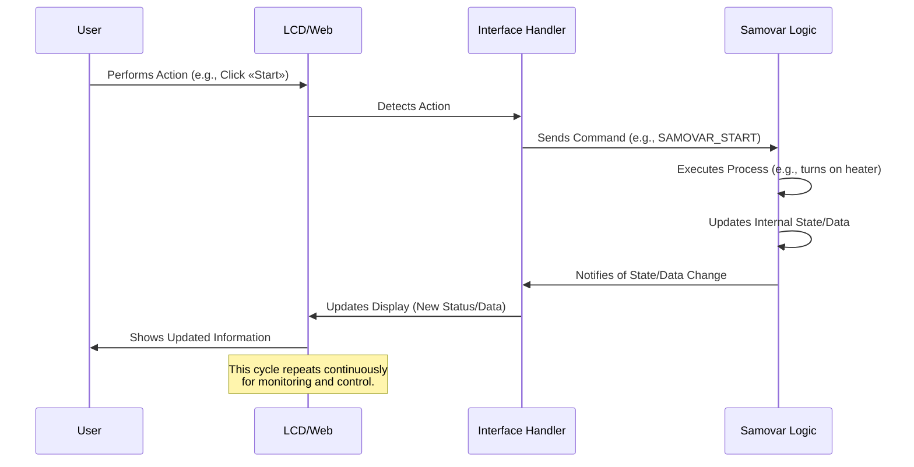

# Глава 1: Взаимодействие с пользователем (веб-интерфейс и ЖК-дисплей)

Добро пожаловать в учебник по Samovar! В первой главе речь пойдет о том, как вы, пользователь, можете взаимодействовать с системой Samovar для варки и дистилляции. Представьте себе Samovar как сложную машину, а интерфейсы взаимодействия с пользователем — как ее приборную панель и панель управления. Они позволяют вам видеть, что делает Samovar, проверять его состояние и давать ему команды на выполнение тех или иных задач.

Независимо от того, просто ли вы контролируете температуру или настраиваете сложную программу варки, вам нужен способ общения с Samovar. Именно здесь и приходят на помощь пользовательские интерфейсы. Samovar предоставляет два основных способа для этого:

1.  **Физический интерфейс:** встроенный ЖК-экран с кнопками и поворотным энкодером (такая вращающаяся ручка, которую вы, возможно, видели).
2.  **Веб-интерфейс:** панель управления, к которой вы можете получить доступ из веб-браузера на своем компьютере или смартфоне, подключенном к той же сети.

Представим себе простую задачу: вы хотите увидеть текущую температуру внутри варочного бака, а затем запустить заранее запрограммированный процесс варки. И ЖК-дисплей, и веб-интерфейс позволяют вам это сделать.

## Физический интерфейс: ЖК-дисплей и кнопки

ЖК-дисплей отображает важную информацию непосредственно на устройстве Samovar. Рядом с экраном находятся кнопки или поворотный энкодер. Эти физические элементы управления позволяют перемещаться по меню, просматривать различные экраны и выполнять простые выбора или настройки.

### Просмотр информации на ЖК-дисплее

Samovar использует ЖК-экран для отображения данных в режиме реального времени. Сюда входят показания датчиков, такие как температура, текущий статус процесса, таймеры и опции меню.

Вот небольшой взгляд на то, как система определяет, что отображается на ЖК-дисплее (используя библиотеки `LiquidCrystal_I2C` и `LiquidMenu`):

```c++
// Из Menu.ino
LiquidLine lql_steam_temp(0, 0, str_Steam_T, SteamSensor.avgTemp);
LiquidLine lql_pipe_temp(0, 1, str_Pipe_T, PipeSensor.avgTemp);
LiquidLine lql_water_temp(0, 2, str_Water_T, WaterSensor.avgTemp);
LiquidScreen main_screen(lql_steam_temp, lql_pipe_temp, lql_water_temp, lql_time);
```

Этот фрагмент кода показывает, как определяются «строки» текста (`LiquidLine`), связывая описательный текст (например, «Steam T:») с данными с датчиков (например, `SteamSensor.avgTemp`). Затем эти строки группируются в «экраны» (`LiquidScreen`). Здесь `main_screen` настроен для отображения температуры пара, трубы и воды, а также текущего времени. Библиотека LCD (`LiquidCrystal_I2C`) отвечает за фактическое отображение этого текста на экране.

Система должна регулярно обновлять то, что отображается на ЖК-дисплее:

```c++
// Из Menu.ino
void menu_update() {
  if ( xSemaphoreTake( xI2CSemaphore, ( TickType_t ) (LCD_UPDATE_TIMEOUT / portTICK_RATE_MS)) == pdTRUE) {
    main_menu1.update(); // Это указывает системе меню обновить отображение
    xSemaphoreGive(xI2CSemaphore);
  }
}
```

Эта функция вызывается повторно, чтобы информация на ЖК-дисплее оставалась актуальной. Строки `xSemaphoreTake` и `xSemaphoreGive` управляют выводом на дисплей — они гарантируют, что разные части программы не будут пытаться использовать ЖК-дисплей одновременно, что может вызвать проблемы.

### Управление с помощью кнопок/энкодера

Физические кнопки или, что более распространено, поворотный энкодер с нажимаемой кнопкой используются для взаимодействия с меню на ЖК-дисплее.

Поворотный энкодер позволяет:
* Поворачивать его влево или вправо для перемещения по пунктам меню или изменения значений.
* Нажимать кнопку (щелкать), чтобы выбрать пункт или подтвердить изменение.

Код постоянно проверяет наличие следующих действий:

```c++
// Из Menu.ino
void encoder_getvalue() {
  encoder.tick(); // Проверить состояние энкодера

  if (encoder.isRight()) {
    // Пользователь повернул вправо — возможно, перейти к следующему экрану или увеличить значение
    if (!main_menu1.is_callable(1)) { // Если текущий элемент не является кликабельным...
      menu_next_screen(); // ...перейти на следующий экран
    } else {
      main_menu1.call_function(1); // ...в противном случае выполнить связанную функцию (например, увеличить значение)
    }
  } else if (encoder.isLeft()) {
    // Пользователь повернул влево — возможно, перейти на предыдущий экран или уменьшить значение
    if (!main_menu1.is_callable(2)) { // Если текущий элемент не является кликабельным...
      menu_previous_screen(); // ...перейти к предыдущему экрану
    } else {
      main_menu1.call_function(2); // ...в противном случае выполнить связанную функцию (например, уменьшить значение)
    }
  } else if (encoder.isClick()) {
    // Пользователь нажал кнопку — выбрать текущий вариант или изменить фокус
    menu_switch_focus();
  }
  // ... здесь также происходят периодические обновления экрана ...
}
```
Функция `encoder_getvalue` считывает состояние энкодера. В зависимости от того, был ли он повернут влево/вправо или нажат, она либо переходит по экранам (`menu_next_screen`, `menu_previous_screen`), либо вызывает определенную функцию, связанную с текущим выбранным элементом (`main_menu1.call_function`). Например, поворот вправо на настройке температуры может вызвать функцию для увеличения целевой температуры. Нажатие может переключить фокус, чтобы разрешить редактирование значения.

Чтобы запустить наш воображаемый процесс заваривания с помощью ЖК-дисплея, мы будем перемещаться по экранам с помощью энкодера, пока не найдем опцию «Start» (Запустить) или не выберем программу, а затем нажмем кнопку. Это запустит функцию, такую как `menu_samovar_start()`.

## Веб-интерфейс

Веб-интерфейс предоставляет более богатый и наглядный способ взаимодействия с Samovar. Вы можете получить к нему доступ через веб-браузер (например, Chrome, Firefox, Safari), введя IP-адрес Samovar. Этот интерфейс часто отображает информацию с ЖК-дисплея, но может включать дополнительные функции, такие как графики, подробные настройки и простое редактирование программ.

### Просмотр информации в Интернете

Веб-интерфейс отображает данные датчиков, сообщения о состоянии, ход выполнения программы и различные системные параметры. Это похоже на полноценную панель управления на вашем компьютере или телефоне.

Данные, отображаемые в Интернете, поступают от Samovar, который отправляет информацию, обычно в структурированном формате, таком как JSON, на веб-страницу, запущенную в вашем браузере. Затем веб-страница обновляет свое отображение, используя эти данные.

```c++
// Из WebServer.ino
server.on(«/ajax», HTTP_GET, [](AsyncWebServerRequest *request) {
  //TempStr = temp; // Пример комментария — неважный код
  getjson(); // Сбор текущих данных в строку JSON
  request->send(200, «text/html», jsonstr); // Отправка строки JSON в браузер
});
```

Этот фрагмент кода показывает часть кода веб-сервера. Когда браузер запрашивает страницу `/ajax` (это происходит периодически в фоновом режиме на веб-странице), Samovar запускает функцию `getjson()`, чтобы собрать все последние данные (температуры, статус и т. д.) в текстовую строку (`jsonstr`) в формате JSON. Затем он отправляет эту строку обратно в браузер, который обновляет элементы веб-страницы новыми значениями.

Сами веб-страницы (такие как `index.htm` и `chart.htm`) хранятся во внутренней файловой системе Samovar (SPIFFS) и обслуживаются веб-сервером.

```c++
// Из WebServer.ino
server.serveStatic(«/index.htm», SPIFFS, «/index.htm»).setTemplateProcessor(indexKeyProcessor).setCacheControl(«max-age=800»);
server.serveStatic(«/chart.htm», SPIFFS, «/chart.htm»).setTemplateProcessor(indexKeyProcessor).setCacheControl(«max-age=800»);
// ... другие файлы, такие как style.css, изображения ...
```

Это сообщает веб-серверу, что когда браузер запрашивает `/index.htm` или `/chart.htm`, он должен отправить соответствующий файл из своего хранилища. Интересна часть `.setTemplateProcessor(indexKeyProcessor)` — она означает, что сервер может заменить заполнители в HTML-файле (такие как `%SteamColor%` или `%WProgram%`) динамическими значениями из текущего состояния Samovar *перед* отправкой файла в браузер. Это позволяет веб-странице загружаться с правильными настройками и внешним видом на основе конфигурации Samovar.

### Управление через веб

Веб-интерфейс имеет кнопки, поля ввода и раскрывающиеся списки, которые позволяют отправлять команды и обновлять настройки.

Когда вы нажимаете кнопку или изменяете значение на веб-странице, ваш браузер отправляет запрос обратно на веб-сервер Samovar.

```c++
// Из WebServer.ino
server.on(«/command», HTTP_GET, [](AsyncWebServerRequest *request) {
  web_command(request); // Обработать команду из веб-запроса
});
server.on(«/save», HTTP_POST, [](AsyncWebServerRequest *request) {
  handleSave(request); // Обработка сохранения настроек конфигурации
});
server.on(«/program», HTTP_POST, [](AsyncWebServerRequest *request) {
  web_program(request); // Обработка обновлений программы
});
// ... другие обработчики команд ...
```

Эти строки сообщают веб-серверу, что делать при получении запросов на `/command`, `/save` или `/program`. Например, нажатие кнопки «Пуск» на веб-странице может отправить запрос на `/command?start=1`. Затем функция `web_command` проверяет запрос на наличие таких параметров, как `start=1`, и преобразует его в действие, которое должен выполнить Samovar.

В нашем случае нажатие кнопки «Пуск» на веб-странице запускает функцию `web_command`, которая, вероятно, устанавливает внутренний флаг (`sam_command_sync = SAMOVAR_START;`), сообщающий основной логике Samovar о начале процесса.

## Как это работает

Давайте проследим путь действия пользователя, например запуска процесса, через систему Samovar.

Эта функция `encoder_getvalue` считывает состояние кодировщика. В зависимости от того, был ли он повернут влево / вправо или нажат, он либо перемещается по экранам (`menu_next_screen`, `menu_previous_screen`), либо вызывает определенную функцию, связанную с выбранным в данный момент элементом (`main_menu1.call_function`). Например, при повороте вправо для настройки температуры может быть вызвана функция, повышающая заданную температуру. Щелчок может переключить фокус, чтобы разрешить редактирование значения.

Чтобы запустить наш воображаемый процесс приготовления с помощью ЖК-дисплея, мы будем перемещаться по экранам с помощью кодировщика, пока не найдем опцию "Пуск" или не выберем программу, а затем нажмем кнопку. Это запустит функцию, подобную `menu_samovar_start()`.

## Веб-интерфейс

Веб-интерфейс предоставляет более богатый и наглядный способ взаимодействия с Samovar. Вы получаете доступ к нему через веб-браузер (например, Chrome, Firefox, Safari), введя IP-адрес Samovar. Этот интерфейс часто отражает информацию на ЖК-дисплее, но может включать дополнительные функции, такие как графики, подробные настройки и простое редактирование программы.

### Просмотр информации в Интернете

Веб-интерфейс отображает данные датчиков, сообщения о состоянии, ход выполнения программы и различные системные параметры. Это как полноценная панель мониторинга на вашем компьютере или телефоне.

Данные, отображаемые в Интернете, поступают из Samovar, который отправляет информацию, обычно в структурированном формате, таком как JSON, на веб-страницу, запущенную в вашем браузере. Затем веб-страница обновляет свое отображение, используя эти данные.

```c++
// С веб-сервера.ino
server.on("/ajax", HTTP_GET, [](AsyncWebServerRequest *запрос) {
  //TempStr = temp; // Пример комментария - не важный код
getjson(); // Собираем текущие данные в строку JSON
  запрос->отправить(200, "text/html", jsonstr); // Отправить строку JSON в браузер
});
```

Этот фрагмент показывает часть кода веб-сервера. Когда браузер запрашивает страницу "/ajax" (это периодически происходит в фоновом режиме на веб-странице), Samovar запускает функцию "getjson()" для сбора всех последних данных (температуры, статуса и т.д.) в текстовую строку ("jsonstr"), отформатированную как JSON. Затем он отправляет эту строку обратно в браузер, который обновляет элементы веб-страницы новыми значениями.

Сами веб-страницы (например, "index.htm" и "chart.htm") хранятся во внутренней файловой системе Samovar (SPIFFS) и обслуживаются веб-сервером.

```c++
// С веб-сервера.ino
server.serveStatic("/index.htm", SPIFFS, "/index.htm").setTemplateProcessor(indexKeyProcessor).setCacheControl("максимальный возраст=800").;
сервер.serveStatic("/chart.htm", SPIFFS, "/chart.htm ").setTemplateProcessor(indexKeyProcessor).setCacheControl("max-age=800");
// ... другие файлы, такие как style.css, изображения ...
```

Это сообщает веб-серверу, что когда браузер запрашивает `/index.htm `или`/chart.htm `, он должен отправить соответствующий файл из своего хранилища. Интересна часть ".setTemplateProcessor(indexKeyProcessor)" – это означает, что сервер действительно может заменить заполнители в HTML-файле (например, "%SteamColor%" или "%WProgram%") динамическими значениями из текущего состояния Samovar перед отправкой файла в браузер. Это позволяет загружать веб-страницу с правильными настройками и внешним видом в зависимости от конфигурации самовара.

### Управление через Интернет

В веб-интерфейсе есть кнопки, поля ввода и выпадающие списки, которые позволяют отправлять команды и обновлять настройки.

Когда вы нажимаете на кнопку или изменяете значение на веб-странице, ваш браузер отправляет запрос обратно на веб-сервер «Самовара».

```c++
// Из файла WebServer.ino
server.on(«/command», HTTP_GET, [](AsyncWebServerRequest *request) {
  web_command(request); // Обработка команды из веб-запроса
});
server.on(«/save», HTTP_POST, [](AsyncWebServerRequest *request) {
  handleSave(request); // Обработка сохранения настроек конфигурации
});
server.on(«/program», HTTP_POST, [](AsyncWebServerRequest *request) {
  web_program(request); // Обработка обновлений программы
});
// ... другие обработчики команд ...
```

Эти строки указывают веб-серверу, что делать, когда он получает запросы `/команда`, `/сохранить` или `/программа`. Например, нажатие кнопки «Старт» на веб-странице может отправить запрос `/command?start=1`. Функция `web_command` проверяет запрос на наличие параметров типа `start=1` и преобразует их в действие, которое должен выполнить самовар.

В нашем случае нажатие кнопки «Старт» на веб-странице вызовет функцию `web_command`, которая затем, вероятно, установит внутренний флаг (`sam_command_sync = SAMOVAR_START;`), указывающий основной логике самовара начать процесс.

## Как это работает под капотом

Давайте проследим, как действие пользователя, например запуск процесса, проходит через систему Самовара.

Когда вы взаимодействуете с любым из интерфейсов, основная идея одинакова:
1.  **Обнаружение входа:** Интерфейс (код ЖК-дисплея или код веб-сервера) обнаруживает действие пользователя (щелчок энкодера, нажатие кнопки, веб-запрос).
2.  **Перевести в команду:** Код интерфейса переводит это физическое действие или веб-запрос в конкретную команду или изменение параметров, понятное основной логике управления самоваром.
3.  **Исполнение команды:** Основная логика самовара получает команду и выполняет соответствующее действие (например, включает нагреватель, запускает насос, изменяет настройку).
4.  **Обновить состояние:** Внутреннее состояние и данные самовара обновляются на основе действия.
5.  **5. Обновление интерфейсов:** Самовар информирует о новом состоянии и данных как ЖК-дисплей, так и веб-интерфейс, чтобы они могли показать пользователю, что происходит.

Вот упрощенная последовательность действий:


Блок `Interface Handler` представляет собой код, отвечающий за управление LCD-меню (`Menu.ino`) и веб-сервером (`WebServer.ino`). Эти обработчики взаимодействуют с `Samovar Logic`, которая содержит основную машину состояний и алгоритмы управления процессом пивоварения/дистилляции (рассматриваются в таких главах, как [Process Program Execution](02_process_program_execution_.md) и [System State & Mode Management](03_system_state___mode_management_.md)).

## Основные моменты кода для работы с интерфейсами

Файл `Menu.ino` предназначен для работы с ЖК-дисплеем и энкодером. В нем задаются экраны и строки, а также определяются функции, которые вызываются при взаимодействии с энкодером, когда выбрана определенная строка.

Например, эта функция связана со строкой «Start» на одном из главных экранов:

```c++
// Из файла Menu.ino
void menu_samovar_start() {
  // Проверяем условия, может ли процесс начаться или продолжиться
  if (Samovar_Mode != SAMOVAR_RECTIFICATION_MODE || !PowerOn) return;

  // Логика для определения следующего шага программы
  if (startval == 2) startval = 3;
  else if (ProgramNum >= ProgramLen - 1 && startval != 0)
    startval = 2;

  // Основываясь на текущем состоянии (startval), решите, что делать
  if (startval == 0) {
    // Начальный старт
    startval = 1;
    run_program(0); // Выполняем первый шаг программы
    ProgramNum = 0;
    create_data(); // Начало регистрации данных
  } else if (startval == 1) {
    // Переходим к следующему шагу программы
    ProgramNum++;
    run_program(ProgramNum);
  } else if (startval == 2) {
    // Завершение программы
    run_program(CAPACITY_NUM * 2); // Специальный шаг программы для завершения
  } else {
    // Остановить процесс
    run_program(CAPACITY_NUM * 2); // Специальный шаг программы для остановки
    reset_sensor_counter();
  }
  // Обновление текста, отображаемого на ЖК-дисплее
  Str.toCharArray(startval_text_val, 20);
  // Обновление ЖК-дисплея
  reset_focus();
  menu_update();
}
```

Эта функция вызывается, когда пользователь переходит к опции «Start» на ЖК-дисплее с помощью энкодера и нажимает на кнопку. Она проверяет текущее состояние (`startval`, `ProgramNum`) и решает, запустить, продолжить или остановить программу, вызывая `run_program()` (функция, подробно описанная в [Process Program Execution](02_process_program_execution_.md)). Наконец, она обновляет текст, отображаемый на ЖК-дисплее, и обновляет экран.

Файл `WebServer.ino` обрабатывает все веб-взаимодействия. Он устанавливает конечные точки (URL), с которыми браузер может взаимодействовать.

```c++
// Из файла WebServer.ino
void web_command(AsyncWebServerRequest *request) {
  // Простая проверка для предотвращения случайных двойных щелчков
  static uint32_t last_command_time = 0;
  if (millis() - last_command_time < 1500) {
    request->send(200, «text/plain», «OK»);
    return;
  }
  last_command_time = millis();

  // Проверьте параметры, отправленные в URL-адресе веб-запроса
  if (request->params() == 1) { // Предполагаем простую команду с одним параметром
    if (request->hasArg(«start») && PowerOn) {
      // Если в запросе есть «start=1» и питание включено, установите команду самовара на запуск
      sam_command_sync = SAMOVAR_START;
    } else if (request->hasArg(«power»)) { // Если в запросе есть «start=1» и питание включено, установите команду «Самовар» на запуск.
      // Если запрос имеет значение «power=1», задаем команду самовара на переключение питания в зависимости от режима
      if (Samovar_Mode == SAMOVAR_BEER_MODE) {
        if (!PowerOn) sam_command_sync = SAMOVAR_BEER;
        else sam_command_sync = SAMOVAR_POWER; // Использовать общее переключение мощности
      }
      // ... аналогичная логика для других режимов ...
      else sam_command_sync = SAMOVAR_POWER; // Переключение питания по умолчанию
    }
    // ... обработчики для других команд, таких как сброс, калибровка, пауза и т. д. ...
  }
  request->send(200, «text/plain», «OK»); // Отправляем простой ответ браузеру
}
```

Эта функция `web_command` получает веб-запрос. Она проверяет аргументы в URL запроса (например, `?start=1`). На основе найденного аргумента она устанавливает определенное значение команды (`sam_command_sync). Эта переменная `sam_command_sync` выступает в качестве сигнального флага, который постоянно проверяет основной цикл логики Samovar. Когда главный цикл видит установленный флаг команды, он выполняет соответствующее действие. Это распространенная схема взаимодействия между различными задачами или частями кода во встраиваемых системах.

Веб-интерфейс также позволяет сохранять настройки конфигурации, за что отвечает функция `handleSave` (здесь она показана не полностью, но считывает параметры из POST-запроса и обновляет структуру `SamSetup`) и редактировать программу, за что отвечает `web_program`.

## Заключение

В этой главе мы рассмотрели два способа взаимодействия с самоваром: физический ЖК-экран и элементы управления, а также гибкий веб-интерфейс. Оба интерфейса позволяют отслеживать состояние системы и данные датчиков, а также, что особенно важно, отправлять команды для управления процессом пивоварения или дистилляции, например, запускать программу. Мы рассмотрели упрощенные примеры кода, показывающие, как отображаются данные датчиков, как распознается пользовательский ввод (от нажатий на энкодер или веб-запросов) и преобразуется в команды для основной логики Samovar.

Понимание этих интерфейсов - первый шаг к управлению самоваром. В следующей главе мы более подробно рассмотрим, как самовар выполняет выбранные или определенные вами программы.
