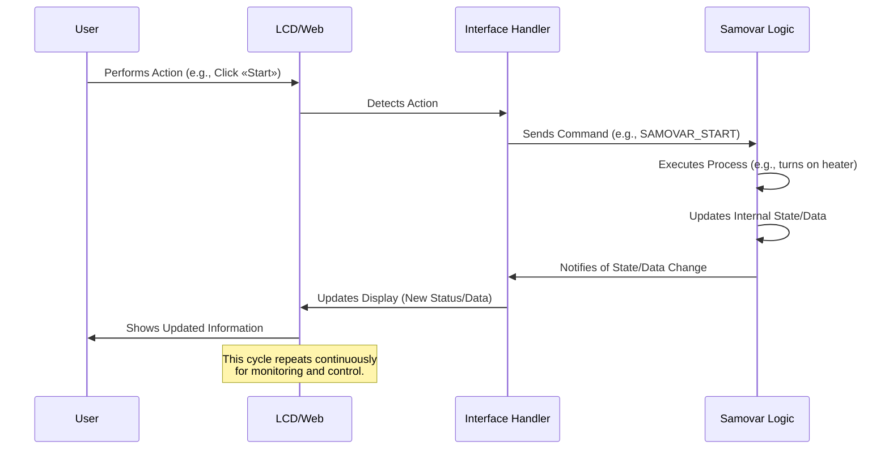

# Глава 1: Взаимодействие с пользователем (веб-интерфейс и ЖК-дисплей)

Добро пожаловать в учебник по Samovar! В первой главе речь пойдет о том, как вы, пользователь, можете взаимодействовать с системой Samovar для варки и дистилляции. Представьте себе Samovar как сложную машину, а интерфейсы взаимодействия с пользователем — как ее приборную панель и панель управления. Они позволяют вам видеть, что делает Samovar, проверять его состояние и давать ему команды на выполнение тех или иных задач.

Независимо от того, просто ли вы контролируете температуру или настраиваете сложную программу варки, вам нужен способ общения с Samovar. Именно здесь и приходят на помощь пользовательские интерфейсы. Samovar предоставляет два основных способа для этого:

1.  **Физический интерфейс:** встроенный ЖК-экран с кнопками и поворотным энкодером (такая вращающаяся ручка, которую вы, возможно, видели).
2.  **Веб-интерфейс:** панель управления, к которой вы можете получить доступ из веб-браузера на своем компьютере или смартфоне, подключенном к той же сети.

Представим себе простую задачу: вы хотите увидеть текущую температуру внутри варочного бака, а затем запустить заранее запрограммированный процесс варки. И ЖК-дисплей, и веб-интерфейс позволяют вам это сделать.

## Физический интерфейс: ЖК-дисплей и кнопки

ЖК-дисплей отображает важную информацию непосредственно на устройстве Samovar. Рядом с экраном находятся кнопки или поворотный энкодер. Эти физические элементы управления позволяют перемещаться по меню, просматривать различные экраны и выполнять простые выбора или настройки.

### Просмотр информации на ЖК-дисплее

Samovar использует ЖК-экран для отображения данных в режиме реального времени. Сюда входят показания датчиков, такие как температура, текущий статус процесса, таймеры и опции меню.

Вот небольшой взгляд на то, как система определяет, что отображается на ЖК-дисплее (используя библиотеки `LiquidCrystal_I2C` и `LiquidMenu`):

```c++
// Из Menu.ino
LiquidLine lql_steam_temp(0, 0, str_Steam_T, SteamSensor.avgTemp);
LiquidLine lql_pipe_temp(0, 1, str_Pipe_T, PipeSensor.avgTemp);
LiquidLine lql_water_temp(0, 2, str_Water_T, WaterSensor.avgTemp);
LiquidScreen main_screen(lql_steam_temp, lql_pipe_temp, lql_water_temp, lql_time);
```

Этот фрагмент кода показывает, как определяются «строки» текста (`LiquidLine`), связывая описательный текст (например, «Steam T:») с данными с датчиков (например, `SteamSensor.avgTemp`). Затем эти строки группируются в «экраны» (`LiquidScreen`). Здесь `main_screen` настроен для отображения температуры пара, царги и воды, а также текущего времени. Библиотека LCD (`LiquidCrystal_I2C`) отвечает за фактическое отображение этого текста на экране.

Система должна регулярно обновлять то, что отображается на ЖК-дисплее:

```c++
// Из Menu.ino
void menu_update() {
  LcdLockGuard lcdLock;                // Захват xI2CSemaphore на LCD_UPDATE_TIMEOUT мс
  if (lcdLock) main_menu1.update();    // Это указывает системе меню обновить отображение
}                                      // Семафор освобождается автоматически при выходе
```

Эта функция вызывается повторно, чтобы информация на ЖК-дисплее оставалась актуальной. Объект `LcdLockGuard` управляет доступом к дисплею: в конструкторе он берёт семафор `xI2CSemaphore` (`xSemaphoreTake`), а при выходе из функции сам отдаёт его (`xSemaphoreGive`). Так разные части программы не пытаются использовать ЖК-дисплей и шину I2C одновременно, что может вызвать проблемы. Если семафор занят дольше `LCD_UPDATE_TIMEOUT` (200 мс), обновление экрана просто пропускается.

### Управление с помощью кнопок/энкодера

Физические кнопки или, что более распространено, поворотный энкодер с нажимаемой кнопкой используются для взаимодействия с меню на ЖК-дисплее.

Поворотный энкодер позволяет:
* Поворачивать его влево или вправо для перемещения по пунктам меню или изменения значений.
* Нажимать кнопку (щелкать), чтобы выбрать пункт или подтвердить изменение.

Код постоянно проверяет наличие следующих действий:

```c++
// Из Menu.ino (упрощено; перед вызовом loop() опрашивает энкодер через encoder.tick())
void encoder_getvalue() {
  if (encoder.isRight()) {
    // Пользователь повернул вправо — возможно, перейти к следующему экрану или увеличить значение
    if (!main_menu1.is_callable(1)) { // Если текущий элемент не является кликабельным...
      menu_next_screen(); // ...перейти на следующий экран
    } else {
      main_menu1.call_function(1); // ...в противном случае выполнить связанную функцию (например, увеличить значение)
    }
  } else if (encoder.isLeft()) {
    // Пользователь повернул влево — возможно, перейти на предыдущий экран или уменьшить значение
    if (!main_menu1.is_callable(2)) { // Если текущий элемент не является кликабельным...
      menu_previous_screen(); // ...перейти к предыдущему экрану
    } else {
      main_menu1.call_function(2); // ...в противном случае выполнить связанную функцию (например, уменьшить значение)
    }
  } else if (encoder.isRightH() || encoder.isLeftH()) {
    // Поворот с нажатой кнопкой — то же изменение значения, но с шагом в 10 раз больше
    multiplier = 10;
    main_menu1.call_function(encoder.isRightH() ? 1 : 2);
  } else if (encoder.isClick()) {
    // Пользователь нажал кнопку — выбрать текущий вариант или изменить фокус
    menu_switch_focus();
  }
  // ... здесь также происходят периодические обновления экрана ...
}
```
Функция `encoder_getvalue` считывает состояние энкодера. В зависимости от того, был ли он повернут влево/вправо или нажат, она либо переходит по экранам (`menu_next_screen`, `menu_previous_screen`), либо вызывает определенную функцию, связанную с текущим выбранным элементом (`main_menu1.call_function`). Например, поворот вправо на настройке температуры может вызвать функцию для увеличения целевой температуры. Нажатие может переключить фокус, чтобы разрешить редактирование значения. Во время калибровки насоса отбора поворот энкодера меняет скорость шагового двигателя, а нажатие завершает калибровку.

Чтобы запустить наш воображаемый процесс с помощью ЖК-дисплея, мы будем перемещаться по экранам с помощью энкодера, пока не найдем строку «>Start:», а затем нажмем кнопку. Это запустит функцию `menu_samovar_start()`. Она работает только в режиме ректификации и только при включённом питании (нагреве).

## Веб-интерфейс

Веб-интерфейс предоставляет более богатый и наглядный способ взаимодействия с Samovar. Вы можете получить к нему доступ через веб-браузер (например, Chrome, Firefox, Safari), введя IP-адрес Samovar. Этот интерфейс часто отображает информацию с ЖК-дисплея, но может включать дополнительные функции, такие как графики, подробные настройки и простое редактирование программ.

### Просмотр информации в Интернете

Веб-интерфейс отображает данные датчиков, сообщения о состоянии, ход выполнения программы и различные системные параметры. Это похоже на полноценную панель управления на вашем компьютере или телефоне.

Данные, отображаемые в Интернете, поступают от Samovar, который отправляет информацию, обычно в структурированном формате, таком как JSON, на веб-страницу, запущенную в вашем браузере. Затем веб-страница обновляет свое отображение, используя эти данные.

```c++
// Из WebServer.ino
server.on("/ajax", HTTP_GET, [](AsyncWebServerRequest *request) {
  send_ajax_json(request); // Собрать текущие данные и отправить их браузеру в формате JSON
});
```

Этот фрагмент кода показывает часть кода веб-сервера. Когда браузер запрашивает адрес `/ajax` (это происходит периодически в фоновом режиме на веб-странице, запрос вида `/ajax?messageCursor=…`), Samovar вызывает функцию `send_ajax_json()` (она находится в `Samovar.ino`). Функция делает снимок последних данных (температуры, статус и т. д.) и отправляет его браузеру в формате JSON (ответ с типом `application/json`), а заодно — новые сообщения, появившиеся после номера `messageCursor`. Браузер обновляет элементы веб-страницы новыми значениями. Начальные данные (режим, настройки, программа) страница получает при открытии одним запросом `/ui-bootstrap`.

Сами веб-страницы (такие как `index.htm` и `chart.htm`) хранятся во внутренней файловой системе Samovar (LittleFS; в коде к ней обращаются через имя `SPIFFS`) и обслуживаются веб-сервером.

```c++
// Из WebServer.ino
server.on("/index.htm", HTTP_GET, [](AsyncWebServerRequest *request) {
  send_index_page(request); // Отдать страницу текущего режима
}).addMiddleware(&headerFilter);
server.serveStatic("/chart.htm", SPIFFS, "/chart.htm").setCacheControl("max-age=1").addMiddleware(&headerFilter);
server.serveStatic("/setup.htm", SPIFFS, "/setup.htm").setTemplateProcessor(setupKeyProcessor).setCacheControl("max-age=1").addMiddleware(&headerFilter);
// ... другие файлы, такие как style.css, изображения ...
```

Это сообщает веб-серверу, что когда браузер запрашивает `/chart.htm` или `/setup.htm`, он должен отправить соответствующий файл из своего хранилища. На запрос `/index.htm` функция `send_index_page()` отдаёт страницу текущего режима: `index.htm` для ректификации, сувида и Lua, `distiller.htm`, `beer.htm`, `bk.htm`, `nbk.htm` или `cheese.htm` для других режимов. Интересна часть `.setTemplateProcessor(setupKeyProcessor)` у страницы настроек — она означает, что сервер заменяет заполнители в HTML-файле (такие как `%SteamColor%` или `%WProgram%`) значениями из текущих настроек Samovar *перед* отправкой файла в браузер. Это позволяет странице настроек загружаться с правильными значениями. Остальные страницы шаблонов не используют: свои данные они получают запросами `/ui-bootstrap` и `/ajax`.

### Управление через веб

Веб-интерфейс имеет кнопки, поля ввода и раскрывающиеся списки, которые позволяют отправлять команды и обновлять настройки.

Когда вы нажимаете кнопку или изменяете значение на веб-странице, ваш браузер отправляет запрос обратно на веб-сервер Samovar.

```c++
// Из WebServer.ino
server.on("/command", HTTP_POST, [](AsyncWebServerRequest *request) {
  web_command(request); // Обработать команду из веб-запроса
});
server.on("/program", HTTP_POST, [](AsyncWebServerRequest *request) {
  web_program(request); // Обработка обновлений программы
});
server.on("/save", HTTP_POST, [](AsyncWebServerRequest *request) {
  handleSave(request); // Обработка сохранения настроек конфигурации
});
// ... другие обработчики команд ...
```

Эти строки сообщают веб-серверу, что делать при получении POST-запросов на `/command`, `/save` или `/program`. Например, нажатие кнопки «Старт» на веб-странице отправляет POST-запрос на `/command` с телом `start=1` (это делает функция `sendCommandRequest` в `app.js`). Затем функция `web_command` проверяет запрос на наличие таких параметров, как `start=1`, и преобразует его в действие, которое должен выполнить Samovar.

В нашем случае нажатие кнопки «Старт» на веб-странице запускает функцию `web_command`, которая ставит команду запуска текущего режима в очередь (`queue_samovar_command(mode_start_command(Samovar_Mode))`; для ректификации это `SAMOVAR_START`), сообщающую основной логике Samovar о начале процесса.

## Как это работает под капотом

Давайте проследим, как действие пользователя, например запуск процесса, проходит через систему Самовара.

Когда вы взаимодействуете с любым из интерфейсов, основная идея одинакова:
1.  **Обнаружение входа:** Интерфейс (код ЖК-дисплея или код веб-сервера) обнаруживает действие пользователя (щелчок энкодера, нажатие кнопки, веб-запрос).
2.  **Перевести в команду:** Код интерфейса переводит это физическое действие или веб-запрос в конкретную команду или изменение параметров, понятное основной логике управления самоваром.
3.  **Исполнение команды:** Основная логика самовара получает команду и выполняет соответствующее действие (например, включает нагреватель, запускает насос, изменяет настройку).
4.  **Обновить состояние:** Внутреннее состояние и данные самовара обновляются на основе действия.
5.  **Обновление интерфейсов:** Самовар информирует о новом состоянии и данных как ЖК-дисплей, так и веб-интерфейс, чтобы они могли показать пользователю, что происходит.

Вот упрощенная последовательность действий:


```mermaid
sequenceDiagram
    User->>LCD/Web: Performs Action (e.g., Click «Start»)
    LCD/Web->>Interface Handler: Detects Action
    Interface Handler->>Samovar Logic: Sends Command (e.g., SAMOVAR_START)
    Samovar Logic->>Samovar Logic: Executes Process (e.g., turns on heater)
    Samovar Logic->>Samovar Logic: Updates Internal State/Data
    Samovar Logic->>Interface Handler: Notifies of State/Data Change
    Interface Handler->>LCD/Web: Updates Display (New Status/Data)
    LCD/Web->>User: Shows Updated Information
    Note over LCD/Web: This cycle repeats continuously<br/>for monitoring and control.
```
Блок `Interface Handler` представляет собой код, отвечающий за управление LCD-меню (`Menu.ino`) и веб-сервером (`WebServer.ino`). Эти обработчики взаимодействуют с `Samovar Logic`, которая содержит основную машину состояний и алгоритмы управления процессом пивоварения/дистилляции (рассматриваются в таких главах, как [Process Program Execution](02_process_program_execution_.md) и [System State & Mode Management](03_system_state___mode_management_.md)).

## Основные моменты кода для работы с интерфейсами

Файл `Menu.ino` предназначен для работы с ЖК-дисплеем и энкодером. В нем задаются экраны и строки, а также определяются функции, которые вызываются при взаимодействии с энкодером, когда выбрана определенная строка.

Например, эта функция связана со строкой «Start» на одном из главных экранов:

```c++
// Из файла Menu.ino (упрощено)
void menu_samovar_start() {
  // Функция работает только в режиме ректификации и при включённом питании
  if (Samovar_Mode != SAMOVAR_RECTIFICATION_MODE || !PowerOn) return;
  String Str;

  // Логика для определения следующего шага программы
  if (startval == SAMOVAR_STARTVAL_RECT_DONE) startval = SAMOVAR_STARTVAL_RECT_STOPPING;
  else if (ProgramNum >= ProgramLen - 1 && startval != SAMOVAR_STARTVAL_IDLE)
    startval = SAMOVAR_STARTVAL_RECT_DONE;

  // Основываясь на текущем состоянии (startval), решите, что делать
  if (startval == SAMOVAR_STARTVAL_IDLE) {
    // Начальный старт: проверить программу, создать файл лога, открыть сессию
    Str = "Prg No 1";
    // ... при ошибке validate_rect_program_startable() или create_data() старт отменяется ...
    session_begin(sessionDescription);
    run_program(0); // Выполняем первую строку программы
    ProgramNum = 0;
    startval = SAMOVAR_STARTVAL_RECT_RUNNING;
  } else if (startval == SAMOVAR_STARTVAL_RECT_RUNNING) {
    // Переходим к следующей строке программы
    ProgramNum++;
    Str = "Prg No " + (String)(ProgramNum + 1);
    run_program(ProgramNum);
  } else if (startval == SAMOVAR_STARTVAL_RECT_DONE) {
    // Программа выполнена
    Str = "Prg finish";
    // ... run_program(PROGRAM_END) или «работа на себя» до автоотключения ...
  } else {
    // Остановить процесс
    Str = "Stoped";
    run_program(PROGRAM_END); // Специальный номер «конец программы» для остановки
    reset_sensor_counter();
  }
  // Обновление текста, отображаемого на ЖК-дисплее
  copyStringSafe(startval_text_val, Str);
  // Обновление ЖК-дисплея
  reset_focus();
  menu_update();
}
```

Эта функция вызывается, когда пользователь переходит к опции «Start» на ЖК-дисплее с помощью энкодера и нажимает на кнопку (её же вызывает отдельная кнопка запуска, если она подключена). Она проверяет текущее состояние (`startval`, `ProgramNum`) и решает, запустить, продолжить или остановить программу, вызывая `run_program()` (функция, подробно описанная в [Process Program Execution](02_process_program_execution_.md)). Если программа выполнена, а `PROGRAM_DONE_AUTO_POWEROFF_MIN` больше нуля, отбор останавливается, но нагрев остаётся включённым («работа на себя») до автоотключения или следующего нажатия. Наконец, она обновляет текст, отображаемый на ЖК-дисплее, и обновляет экран.

Файл `WebServer.ino` обрабатывает все веб-взаимодействия. Он устанавливает конечные точки (URL), с которыми браузер может взаимодействовать.

```c++
// Из файла WebServer.ino (упрощено)
void web_command(AsyncWebServerRequest *request) {
  // В запросе должен быть ровно один POST-параметр с разрешённым именем команды
  if (!get_web_command_action(request, action, actionParam)) {
    send_web_command_response(request, 400, "BAD_REQUEST");
    return;
  }
  // ... проверка значения параметра (числа, 0/1) ...

  // Защита от случайных двойных щелчков: та же команда повторно в течение 1,5 с игнорируется
  if (commandKey == last_command_key && millis() - last_command_time < 1500) {
    send_web_command_response(request, 429, "IGNORED");
    return;
  }

  if (action == "start") {
    // Запуск возможен только при включённом питании
    if (!PowerOn) {
      send_web_command_response(request, 409, "POWER_OFF");
      return;
    }
    // Команда запуска зависит от режима (для ректификации — SAMOVAR_START)
    if (!queue_samovar_command(mode_start_command(Samovar_Mode))) {
      send_web_command_response(request, 503, "BUSY");
      return;
    }
  } else if (action == "power") {
    // power=1 — включить (команда включения своя для каждого режима), power=0 — выключить
    SamovarCommands command = SAMOVAR_NONE;
    if (boolValue) {
      if (!PowerOn) command = mode_power_on_command(Samovar_Mode);
    } else {
      command = SAMOVAR_POWER_OFF;
    }
    if (command != SAMOVAR_NONE && !queue_samovar_command(command)) {
      send_web_command_response(request, 503, "BUSY");
      return;
    }
  }
  // ... обработчики для других команд, таких как сброс, калибровка, пауза и т. д. ...
  send_web_command_response(request, 200, "OK"); // Отправляем простой ответ браузеру
}
```

Эта функция `web_command` получает веб-запрос. Она проверяет параметр в теле POST-запроса (например, `start=1`). На основе найденного параметра она ставит команду (сообщение `SamovarCommandMsg`) в очередь `samovar_command_queue` через `queue_samovar_command(...)`. Основной цикл `loop()` в `Samovar.ino` извлекает команды из очереди функцией `receive_samovar_command()` и выполняет соответствующее действие. Браузеру сервер отвечает коротким словом-кодом (`OK`, `BUSY`, `IGNORED`, `POWER_OFF` и т. п.), а понятный пользователю текст по этому коду подбирает сама страница. Это распространенная схема взаимодействия между различными задачами или частями кода во встраиваемых системах.

Веб-интерфейс также позволяет сохранять настройки конфигурации, за что отвечает функция `handleSave` (здесь она показана не полностью, но считывает параметры из POST-запроса, проверяет их и обновляет структуру `SamSetup`) и редактировать программу, за что отвечает `web_program`.

## Заключение

В этой главе мы рассмотрели два способа взаимодействия с самоваром: физический ЖК-экран и элементы управления, а также гибкий веб-интерфейс. Оба интерфейса позволяют отслеживать состояние системы и данные датчиков, а также, что особенно важно, отправлять команды для управления процессом пивоварения или дистилляции, например, запускать программу. Мы рассмотрели упрощенные примеры кода, показывающие, как отображаются данные датчиков, как распознается пользовательский ввод (от нажатий на энкодер или веб-запросов) и преобразуется в команды для основной логики Samovar.

Понимание этих интерфейсов - первый шаг к управлению самоваром. В следующей главе мы более подробно рассмотрим, как самовар выполняет выбранные или определенные вами программы.
