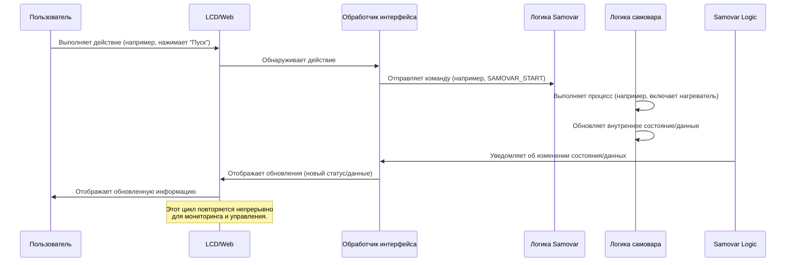

# Глава 1: Взаимодействие с пользователем (веб-интерфейс и ЖК-дисплей)

Добро пожаловать в учебник по Samovar! В первой главе речь пойдет о том, как вы, пользователь, можете взаимодействовать с системой Samovar для варки и дистилляции. Представьте себе Samovar как сложную машину, а интерфейсы взаимодействия с пользователем — как ее приборную панель и панель управления. Они позволяют вам видеть, что делает Samovar, проверять его состояние и давать ему команды на выполнение тех или иных задач.

Независимо от того, просто ли вы контролируете температуру или настраиваете сложную программу варки, вам нужен способ общения с Samovar. Именно здесь и приходят на помощь пользовательские интерфейсы. Samovar предоставляет два основных способа для этого:

1.  **Физический интерфейс:** встроенный ЖК-экран с кнопками и поворотным энкодером (такая вращающаяся ручка, которую вы, возможно, видели).
2.  **Веб-интерфейс:** панель управления, к которой вы можете получить доступ из веб-браузера на своем компьютере или смартфоне, подключенном к той же сети.

Представим себе простую задачу: вы хотите увидеть текущую температуру внутри варочного бака, а затем запустить заранее запрограммированный процесс варки. И ЖК-дисплей, и веб-интерфейс позволяют вам это сделать.

## Физический интерфейс: ЖК-дисплей и кнопки

ЖК-дисплей отображает важную информацию непосредственно на устройстве Samovar. Рядом с экраном находятся кнопки или поворотный энкодер. Эти физические элементы управления позволяют перемещаться по меню, просматривать различные экраны и выполнять простые выбора или настройки.

### Просмотр информации на ЖК-дисплее

Samovar использует ЖК-экран для отображения данных в режиме реального времени. Сюда входят показания датчиков, такие как температура, текущий статус процесса, таймеры и опции меню.

Вот небольшой взгляд на то, как система определяет, что отображается на ЖК-дисплее, используя так называемые `LiquidCrystal_I2C` и `LiquidMenu`:

```c++
// Из Menu.ino
LiquidLine lql_steam_temp(0, 0, str_Steam_T, SteamSensor.avgTemp);
LiquidLine lql_pipe_temp(0, 1, str_Pipe_T, PipeSensor.avgTemp);
LiquidLine lql_water_temp(0, 2, str_Water_T, WaterSensor.avgTemp);
LiquidScreen main_screen(lql_steam_temp, lql_pipe_temp, lql_water_temp, lql_time);
```

Этот фрагмент кода показывает, как определяются «строки» текста (`LiquidLine`), связывая описательный текст (например, «Steam T:») с данными с датчиков (например, `SteamSensor.avgTemp`). Затем эти строки группируются в «экраны» (`LiquidScreen`). Здесь `main_screen` настроен для отображения температуры пара, трубы и воды, а также текущего времени. Библиотека LCD (`LiquidCrystal_I2C`) отвечает за фактическое отображение этого текста на экране.

Система должна регулярно обновлять то, что отображается на ЖК-дисплее:

```c++
// Из Menu.ino
void menu_update() {
  if ( xSemaphoreTake( xI2CSemaphore, ( TickType_t ) (LCD_UPDATE_TIMEOUT / portTICK_RATE_MS)) == pdTRUE) {
    main_menu1.update(); // Это указывает системе меню обновить отображение
    xSemaphoreGive(xI2CSemaphore);
  }
}
```

Эта функция вызывается повторно, чтобы информация на ЖК-дисплее оставалась актуальной. Строки `xSemaphoreTake` и `xSemaphoreGive` похожи на чередование — они гарантируют, что разные части программы не будут пытаться использовать ЖК-дисплей одновременно, что может вызвать проблемы.

### Управление с помощью кнопок/энкодера

Физические кнопки или, что более распространено, поворотный энкодер с нажимаемой кнопкой используются для взаимодействия с меню на ЖК-дисплее.

Поворотный энкодер позволяет:
* Поворачивать его влево или вправо для перемещения по пунктам меню или изменения значений.
* Нажимать кнопку (щелкать), чтобы выбрать пункт или подтвердить изменение.

Код постоянно проверяет наличие следующих действий:

```c++
// Из Menu.ino
void encoder_getvalue() {
  encoder.tick(); // Проверить состояние энкодера

  if (encoder.isRight()) {
    // Пользователь повернул вправо — возможно, перейти к следующему экрану или увеличить значение
    if (!main_menu1.is_callable(1)) { // Если текущий элемент не является кликабельным...
      menu_next_screen(); // ...перейти на следующий экран
    } else {
      main_menu1.call_function(1); // ...в противном случае выполнить связанную функцию (например, увеличить значение)
    }
  } else if (encoder.isLeft()) {
    // Пользователь повернул влево — возможно, перейти на предыдущий экран или уменьшить значение
    if (!main_menu1.is_callable(2)) { // Если текущий элемент не является кликабельным...
      menu_previous_screen(); // ...перейти к предыдущему экрану
    } else {
      main_menu1.call_function(2); // ...в противном случае выполнить связанную функцию (например, уменьшить значение)
    }
  } else if (encoder.isClick()) {
    // Пользователь нажал кнопку — выбрать текущий вариант или изменить фокус
    menu_switch_focus();
  }
  // ... здесь также происходят периодические обновления экрана ...
}
```
Функция `encoder_getvalue` считывает состояние энкодера. В зависимости от того, был ли он повернут влево/вправо или нажат, она либо переходит по экранам (`menu_next_screen`, `menu_previous_screen`), либо вызывает определенную функцию, связанную с текущим выбранным элементом (`main_menu1.call_function`). Например, поворот вправо на настройке температуры может вызвать функцию для увеличения целевой температуры. Нажатие может переключить фокус, чтобы разрешить редактирование значения.

Чтобы запустить наш воображаемый процесс заваривания с помощью ЖК-дисплея, мы будем перемещаться по экранам с помощью энкодера, пока не найдем опцию «Start» (Запустить) или не выберем программу, а затем нажмем кнопку. Это запустит функцию, такую как `menu_samovar_start()`.

## Веб-интерфейс

Веб-интерфейс предоставляет более богатый и наглядный способ взаимодействия с Samovar. Вы можете получить к нему доступ через веб-браузер (например, Chrome, Firefox, Safari), введя IP-адрес Samovar. Этот интерфейс часто отображает информацию с ЖК-дисплея, но может включать дополнительные функции, такие как графики, подробные настройки и простое редактирование программ.

### Просмотр информации в Интернете

Веб-интерфейс отображает данные датчиков, сообщения о состоянии, ход выполнения программы и различные системные параметры. Это похоже на полноценную панель управления на вашем компьютере или телефоне.

Данные, отображаемые в Интернете, поступают от Samovar, который отправляет информацию, обычно в структурированном формате, таком как JSON, на веб-страницу, запущенную в вашем браузере. Затем веб-страница обновляет свое отображение, используя эти данные.

```c++
// Из WebServer.ino
server.on(«/ajax», HTTP_GET, [](AsyncWebServerRequest *request) {
  //TempStr = temp; // Пример комментария — неважный код
  getjson(); // Сбор текущих данных в строку JSON
  request->send(200, «text/html», jsonstr); // Отправка строки JSON в браузер
});
```

Этот фрагмент кода показывает часть кода веб-сервера. Когда браузер запрашивает страницу `/ajax` (это происходит периодически в фоновом режиме на веб-странице), Samovar запускает функцию `getjson()`, чтобы собрать все последние данные (температуры, статус и т. д.) в текстовую строку (`jsonstr`) в формате JSON. Затем он отправляет эту строку обратно в браузер, который обновляет элементы веб-страницы новыми значениями.

Сами веб-страницы (такие как `index.htm` и `chart.htm`) хранятся во внутренней файловой системе Samovar (SPIFFS) и обслуживаются веб-сервером.

```c++
// Из WebServer.ino
server.serveStatic(«/index.htm», SPIFFS, «/index.htm»).setTemplateProcessor(indexKeyProcessor).setCacheControl(«max-age=800»);
server.serveStatic(«/chart.htm», SPIFFS, «/chart.htm»).setTemplateProcessor(indexKeyProcessor).setCacheControl(«max-age=800»);
// ... другие файлы, такие как style.css, изображения ...
```

Это сообщает веб-серверу, что когда браузер запрашивает `/index.htm` или `/chart.htm`, он должен отправить соответствующий файл из своего хранилища. Интересна часть `.setTemplateProcessor(indexKeyProcessor)` — она означает, что сервер может заменить заполнители в HTML-файле (такие как `%SteamColor%` или `%WProgram%`) динамическими значениями из текущего состояния Samovar *перед* отправкой файла в браузер. Это позволяет веб-странице загружаться с правильными настройками и внешним видом на основе конфигурации Samovar.

### Управление через веб

Веб-интерфейс имеет кнопки, поля ввода и раскрывающиеся списки, которые позволяют отправлять команды и обновлять настройки.

Когда вы нажимаете кнопку или изменяете значение на веб-странице, ваш браузер отправляет запрос обратно на веб-сервер Samovar.

```c++
// Из WebServer.ino
server.on(«/command», HTTP_GET, [](AsyncWebServerRequest *request) {
  web_command(request); // Обработать команду из веб-запроса
});
server.on(«/save», HTTP_POST, [](AsyncWebServerRequest *request) {
  handleSave(request); // Обработка сохранения настроек конфигурации
});
server.on(«/program», HTTP_POST, [](AsyncWebServerRequest *request) {
  web_program(request); // Обработка обновлений программы
});
// ... другие обработчики команд ...
```

Эти строки сообщают веб-серверу, что делать при получении запросов на `/command`, `/save` или `/program`. Например, нажатие кнопки «Пуск» на веб-странице может отправить запрос на `/command?start=1`. Затем функция `web_command` проверяет запрос на наличие таких параметров, как `start=1`, и преобразует его в действие, которое должен выполнить Samovar.

В нашем случае нажатие кнопки «Пуск» на веб-странице запускает функцию `web_command`, которая, вероятно, устанавливает внутренний флаг (`sam_command_sync = SAMOVAR_START;`), сообщающий основной логике Samovar о начале процесса.

## Как это работает

Давайте проследим путь действия пользователя, например запуска процесса, через систему Samovar.

Эта функция `encoder_getvalue` считывает состояние кодировщика. В зависимости от того, был ли он повернут влево / вправо или нажат, он либо перемещается по экранам (`menu_next_screen`, `menu_previous_screen`), либо вызывает определенную функцию, связанную с выбранным в данный момент элементом (`main_menu1.call_function`). Например, при повороте вправо для настройки температуры может быть вызвана функция, повышающая заданную температуру. Щелчок может переключить фокус, чтобы разрешить редактирование значения.

Чтобы запустить наш воображаемый процесс приготовления с помощью ЖК-дисплея, мы будем перемещаться по экранам с помощью кодировщика, пока не найдем опцию "Пуск" или не выберем программу, а затем нажмем кнопку. Это запустит функцию, подобную `menu_samovar_start()`.

## Веб-интерфейс

Веб-интерфейс предоставляет более богатый и наглядный способ взаимодействия с Samovar. Вы получаете доступ к нему через веб-браузер (например, Chrome, Firefox, Safari), введя IP-адрес Samovar. Этот интерфейс часто отражает информацию на ЖК-дисплее, но может включать дополнительные функции, такие как графики, подробные настройки и простое редактирование программы.

### Просмотр информации в Интернете

Веб-интерфейс отображает данные датчиков, сообщения о состоянии, ход выполнения программы и различные системные параметры. Это как полноценная панель мониторинга на вашем компьютере или телефоне.

Данные, отображаемые в Интернете, поступают из Samovar, который отправляет информацию, обычно в структурированном формате, таком как JSON, на веб-страницу, запущенную в вашем браузере. Затем веб-страница обновляет свое отображение, используя эти данные.

```c++
// С веб-сервера.ino
server.on("/ajax", HTTP_GET, [](AsyncWebServerRequest *запрос) {
  //TempStr = temp; // Пример комментария - не важный код
getjson(); // Собираем текущие данные в строку JSON
  запрос->отправить(200, "text/html", jsonstr); // Отправить строку JSON в браузер
});
```

Этот фрагмент показывает часть кода веб-сервера. Когда браузер запрашивает страницу "/ajax" (это периодически происходит в фоновом режиме на веб-странице), Samovar запускает функцию "getjson()" для сбора всех последних данных (температуры, статуса и т.д.) в текстовую строку ("jsonstr"), отформатированную как JSON. Затем он отправляет эту строку обратно в браузер, который обновляет элементы веб-страницы новыми значениями.

Сами веб-страницы (например, "index.htm" и "chart.htm") хранятся во внутренней файловой системе Samovar (SPIFFS) и обслуживаются веб-сервером.

```c++
// С веб-сервера.ino
server.serveStatic("/index.htm", SPIFFS, "/index.htm").setTemplateProcessor(indexKeyProcessor).setCacheControl("максимальный возраст=800").;
сервер.serveStatic("/chart.htm", SPIFFS, "/chart.htm ").setTemplateProcessor(indexKeyProcessor).setCacheControl("max-age=800");
// ... другие файлы, такие как style.css, изображения ...
```

Это сообщает веб-серверу, что когда браузер запрашивает `/index.htm `или`/chart.htm `, он должен отправить соответствующий файл из своего хранилища. Интересна часть ".setTemplateProcessor(indexKeyProcessor)" – это означает, что сервер действительно может заменить заполнители в HTML-файле (например, "%SteamColor%" или "%WProgram%") динамическими значениями из текущего состояния Samovar перед отправкой файла в браузер. Это позволяет загружать веб-страницу с правильными настройками и внешним видом в зависимости от конфигурации самовара.

### Управление через Интернет

В веб-интерфейсе есть кнопки, поля ввода и выпадающие списки, которые позволяют отправлять команды и обновлять настройки.

Когда вы нажимаете кнопку или меняете значение на веб-странице, ваш браузер отправляет запрос обратно на веб-сервер Samovar.

```c++
// С веб-сервера.ino
server.on("/команда", HTTP_GET, [](AsyncWebServerRequest *запрос) {
  web_command(запрос); // Обработать команду из веб-запроса
});
server.on("/сохранить", HTTP_POST, [](запрос AsyncWebServerRequest *) {
  handleSave(запрос); // Ручка сохранения настроек конфигурации
});
server.on("/program", HTTP_POST, [](AsyncWebServerRequest *запрос) {
  web_program(запрос); // Обрабатывать обновления программы
});
// ... другие обработчики команд ...
```

Эти строки сообщают веб-серверу, что делать, когда он получает запросы на "/command", "/save" или "/program". Например, нажатие кнопки "Пуск" на веб-странице может отправить запрос на `/command?start=1`. Затем функция `web_command` проверяет запрос на наличие таких параметров, как `start=1`, и преобразует их в действие, которое должен выполнить самовар.

В нашем случае нажатие кнопки "Пуск" на веб-странице запустило бы функцию "web_command", которая затем, вероятно, установила бы внутренний флаг ("sam_command_sync = SAMOVAR_START;"), который указывает основной логике Samovar начать процесс.

## Как это работает на практике

Давайте проследим путь действия пользователя, например, запуска процесса, в системе Samovar.

Когда вы взаимодействуете с любым из интерфейсов, основная идея остается неизменной:
1. **Обнаружение входных данных:** Интерфейс (код на ЖК-дисплее или код веб-сервера) обнаруживает действие пользователя (щелчок кодировщика, нажатие кнопки, веб-запрос).
2. **Преобразовать в команду:** Код интерфейса преобразует это физическое действие или веб-запрос в конкретную команду или изменение параметра, понятное основной логике управления Samovar.
3. **Выполнить команду:** Основная логика самовара получает команду и выполняет соответствующие действия (например, включает нагреватель, запускает насос, изменяет настройки).
4. **Состояние обновления:** Внутреннее состояние и данные самовара обновляются в зависимости от действия.
5. ** Обновите интерфейсы: ** Самовар информирует *как ЖК-дисплей, так и веб-интерфейс о новом состоянии и данных, чтобы они могли показать пользователю, что происходит.

Вот упрощенная последовательность действий:



Поле "Обработчик интерфейса" представляет собой код, отвечающий за управление ЖК-меню ("Menu.ino") и веб-сервером ("WebServer.ino`). Эти обработчики взаимодействуют с "Логикой самовара", которая содержит основной конечный автомат и алгоритмы управления процессом пивоварения/дистилляции (рассматриваются в таких главах, как [Выполнение программы процесса](02_process_program_execution_.md) и [Управление состоянием и режимом системы](03_system_state__mode_management_.md)).

## Основные моменты кода для обработки интерфейса

Файл "Menu.ino" предназначен для работы с ЖК-дисплеем и энкодером. Он настраивает экраны и линии и определяет функции, которые вызываются при взаимодействии с энкодером при выборе определенной линии.

Например, эта функция связана со строкой "Пуск" на одном из главных экранов:

```c++
// Из меню.ino
void menu_samovar_start() {
  // Проверьте условия, может ли процесс запуститься или продолжиться
, если (Samovar_Mode != SAMOVAR_RECTIFICATION_MODE || !PowerOn) возвращает;

  // Логика для определения следующего шага программы
, если (startval == 2) startval = 3;
  иначе, если (ProgramNum >= ProgramLen - 1 && startval != 0)
    начальное значение = 2;

  // Основываясь на текущем состоянии (startval), решите, что делать
, если (startval == 0) {
    // Начальный запуск
startval = 1;
    run_program(0); // Запускаем первый шаг программы
    Номер программы = 0;
    create_data(); // Начать запись данных в журнал
  } иначе, если (startval == 1) {
    // Переходите к следующему шагу программы
    Номер программы++;
    run_program(номер программы);
  } иначе, если (startval == 2) {
    // Завершить программу
    run_program(НОМЕР ЕМКОСТИ * 2); // Специальный шаг программы для завершения
  } еще {
    // Остановить процесс
    run_program(НОМЕР ЕМКОСТИ * 2); // Специальный шаг программы для остановки
    reset_sensor_counter();
  }
  // Обновите текст, отображаемый на ЖК-дисплее
  Str.toCharArray(startval_text_val, 20);
  // Обновить ЖК-дисплей
reset_focus();
  меню обновления();
}
```


Эта функция вызывается, когда пользователь переходит к опции "Пуск" на ЖК-дисплее с помощью энкодера и нажимает кнопку. Он проверяет текущее состояние (`startval`, `ProgramNum`) и принимает решение о запуске, продолжении или остановке программы, вызывая `run_program()` (функция, подробно описанная в [Обработать выполнение программы](02_process_program_execution_.md)). Наконец, он обновляет текст, отображаемый на ЖК-дисплее, и обновляет экран.

Файл `WebServer.ino` обрабатывает все веб-взаимодействия. Он устанавливает конечные точки (URL), с которыми может взаимодействовать браузер.

```c++
// С веб-сервера.ino
недействительная веб-команда(AsyncWebServerRequest *запрос) {
  // Простая проверка для предотвращения случайных двойных щелчков
static uint32_t last_command_time = 0;
  если (миллис() - last_command_time < 1500) _BOS_
    запрос->отправить(200, "текстовый/обычный", "ОК");
    вернуть;
  }
  last_command_time = миллис();

  // Проверьте параметры, отправленные в URL веб-запроса
, если (запрос->параметры() == 1) _BOS_ // Предполагается, что это простая команда с одним параметром
    если (запрос->hasArg("начать") && PowerOn) {
      // Если запрос "старт=1" и питания, устанавливает командный самовар, чтобы начать
      sam_command_sync = SAMOVAR_START;
    } else if (запрос->hasArg("мощность")) _BOS_
      // Если в запросе указано "мощность=1", установите команду Samovar для переключения мощности в зависимости от режима
      если (самовар_режим == САМОВАР_БИР_РЕЖИМ) {
        если (!PowerOn) sam_command_sync = САМОВАР_БИР;
        else sam_command_sync = САМОВАР_ПОМОЩЬ; // Используйте универсальный переключатель питания
      }
      // ... аналогичная логика для других режимов ...
      else sam_command_sync = SAMOVAR_POWER; // Переключение питания по умолчанию
    }
    // ... обработчики для других команд, таких как сброс, калибровка, пауза и т.д. ...
  }
  запрос->отправить(200, "текстовый/обычный", "ОК"); // Отправить простой ответ обратно в браузер
}
```
