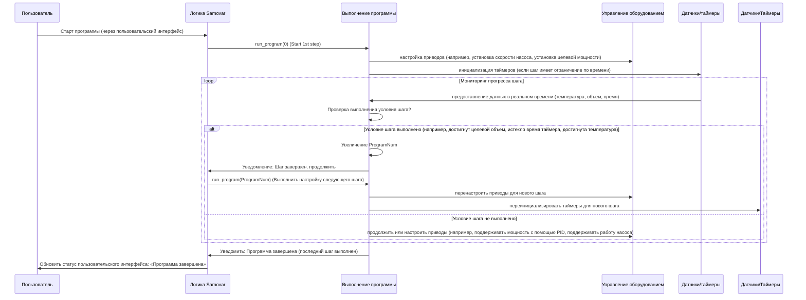

# Глава 2: Выполнение программы процесса

Добро пожаловать в учебник по самовару! В [Глава 1: Взаимодействие с пользователем (Web и LCD)](01_user_interaction__web___lcd__.md) мы узнали, как вы можете указать самовару, что делать, используя его физический или веб-интерфейс. Теперь давайте рассмотрим, что происходит *после* нажатия кнопки «Старт» или выбора программы: как самовар автоматически выполняет последовательность шагов для осуществления вашего процесса пивоварения или дистилляции.

Представьте, что вы следуете рецепту. Рецепт - это не просто одна инструкция, это список шагов: «Нагреть воду до X градусов», „Добавить ингредиент Y и перемешивать в течение Z минут“, „Выдержать температуру A градусов в течение B часов“ и так далее. Каждый шаг имеет определенные требования (температура, время, действие).

В проекте «Самовар» рассматриваются такие сложные процессы, как перегонка спирта (ректификация, дистилляция, НБК) или варка пива (этапы приготовления сусла, кипячение). Эти процессы также требуют соблюдения точной последовательности шагов с определенными параметрами. Контролировать все вручную по ходу процесса было бы невероятно утомительно и требовало бы постоянного внимания.

Именно здесь на помощь приходит **Process Program Execution**. Это похоже на то, как если бы автоматизированный шеф-повар точно следовал вашему рецепту.

## Что такое программа процесса?

В Samovar «программа» - это просто сохраненный список или последовательность шагов. Каждый шаг в программе указывает самовару на выполнение определенного действия с определенными параметрами до тех пор, пока не будет выполнено заданное условие.

Рассматривайте программу как электронную таблицу или список инструкций для самовара. Например, шаг в программе «Ректификация» может выглядеть следующим образом:

* **Тип:** Сбор голов
* ** Объем:** 100 мл
* **Скорость:** 0,1 л/ч
* **Целевая температура:** (необязательно, часто основывается на предыдущем шаге)
* **Сосуд для сбора:** Контейнер 1
**Мощность нагревателя:** 120 В (или эквивалентный процент/мощность)

Шаг в программе «Пиво» может выглядеть следующим образом:

* **Тип:** Температурная пауза (шаг затирания)
* **Целевая температура:** 65°C
* **Длительность:** 60 минут
**Миксер/насос:** Работает периодически
**Мощность нагревателя:** Контролируется ПИД для поддержания температуры

Как видите, параметры могут отличаться в зависимости от общего *режима* (ректификация, пиво, NBK), но основная идея та же: шаг определяет, *что* делать, *как много/как быстро/при какой температуре* делать, и *когда остановиться* и перейти к следующему шагу.

Самовару необходимо:
1.  Хранить эти программы.
2.  Знать, какой этап программы активен в данный момент.
3.  Выполнять действия, требуемые текущим шагом.
4.  Контролировать условия, чтобы определить, когда текущий шаг будет завершен.
5.  Автоматически переходить к следующему шагу.

## Программы и режимы

Самовар поддерживает различные режимы (Ректификация, Дистилляция, Пиво, НБК). Хотя все они используют концепцию программы, состоящей из шагов, значение параметров внутри шага может немного отличаться в зависимости от режима. Например, «Объем» в программе «Ректификация» означает сбор жидкости, а в программе «Пиво» - продолжительность работы миксера/насоса.

Встроенное программное обеспечение самовара использует общую структуру для хранения данных для каждого шага, а код, специфичный для каждого режима, интерпретирует эту структуру.

Структура, используемая для определения одного шага программы, называется `WProgram` в коде:

```c++
// Из Samovar.h
struct WProgram {
  String WType; // Тип шага (например, «Головы», «Тело», «Пауза», «Пюре», «Кипячение»)
  uint16_t Volume; // Объем (мл) или продолжительность (сек. для паузы/мешалки)
  float Скорость; // Скорость (л/ч) или значение (% алкоголя, температура)
  uint8_t capacity_num; // Номер сосуда или конфигурация режима миксера/насоса
  float Temp; // Целевая температура или дельта температуры
  uint16_t Power; // Настройка напряжения/мощности нагревателя
  uint8_t TempSensor; // Датчик температуры для мониторинга (используется в некоторых режимах, например, Пиво)
  float Time; // Рассчитанная продолжительность на основе объема/скорости или явное время
};

WProgram program[30]; // Массив для хранения шагов программы
```
Массив `program` содержит до 30 шагов для текущей программы. Различные обработчики режимов (`rectification_proc`, `beer_proc`, `nbk_proc` и т. д. — описаны в [Глава 3: Управление состоянием системы и режимами](03_system_state___mode_management_.md)) будут проверять `program[ProgramNum]` (где `ProgramNum` — индекс текущего активного шага) и использовать поля (`WType`, `Volume`, `Speed` и т. д.) в соответствии с логикой данного режима.

Например, в режиме «Ректификация» `program[ProgramNum]. Volume` контролирует целевой объем для шагового двигателя, а `program[ProgramNum].Speed` контролирует скорость шагового двигателя. В этапе затирания пива (`WType == «P»`), `program[ProgramNum].Volume` может быть продолжительностью цикла смесителя, а `program[ProgramNum].Temp` — целевой температурой для ПИД-регулятора нагревателя.

## Как работает выполнение программы изнутри

Давайте проследим, что происходит при запуске программы, например, при запуске процесса ректификации, с помощью приведенной ниже диаграммы последовательности. Эта диаграмма фокусируется на ключевых компонентах, участвующих в чтении «рецепта» и выполнении действий в соответствии с ним.



Как видите, процесс циклический:
1.  Пользователь запускает программу (глава 1).
2.  Основная логика Samovar вызывает обработчик выполнения программы, указывая ему, с какого шага начать (обычно шаг 0).
3.  Код выполнения программы считывает параметры для этого конкретного шага из массива `program`.
4.  На основе этих параметров он дает команду **управлению оборудованием** (глава 5) установить такие параметры, как скорость насоса, мощность нагревателя или состояние клапана. Если для шага установлено ограничение по времени, может запускаться таймер.
5.  Затем система входит в цикл мониторинга. Она непрерывно получает данные от **датчиков** (глава 4) и проверяет, выполнены ли условия для завершения *текущего* шага (например, «Достигнут ли целевой объем?», «Истек ли таймер?», «Достаточно ли долго температура оставалась стабильной?»).
6.  Если условие *не* выполнено, мониторинг продолжается и, возможно, производится регулировка аппаратного управления на основе данных датчиков в реальном времени (например, ПИД-регулятор регулирует мощность нагревателя для поддержания температуры).
7.  Если условие *выполнено*, код выполнения программы увеличивает счетчик `ProgramNum` и дает команду основной логике запустить настройку для *следующего* шага, начиная цикл заново с новыми параметрами и условиями.
8.  Это продолжается до тех пор, пока не будет достигнут специальный шаг «завершение» или не будет выполнен последний определенный шаг.

## Погружение в код

Давайте посмотрим на несколько упрощенных фрагментов кода, чтобы понять, как это работает.

Во-первых, как запускается или переходит к шагу программы. Это часто происходит в функции типа `run_program` (используемой в режиме Rectification) или аналогичных функциях для других режимов. Эта функция считывает параметры для заданного номера шага (`num`) и настраивает аппаратное обеспечение и переменные состояния соответствующим образом.

```c++
// Упрощенный фрагмент кода на основе run_program из logic.h
void run_program(uint8_t num) {
  // Сброс всех таймеров или состояний ожидания из предыдущего шага
  t_min = 0;
  program_Pause = false; // Флаг для шага паузы программы
  program_Wait = false;  // Флаг для ожидания условия температуры/давления

  // Проверка, находимся ли мы на специальном этапе «завершение»
  if (num == CAPACITY_NUM * 2) { // CAPACITY_NUM * 2 используется в качестве маркера «завершение»
    // Выполнение действий по очистке: остановка двигателей, отключение питания, закрытие файлов и т. д.
    // ... упрощенный код очистки ...
    set_power(false); // Отключить основное питание
    SendMsg((«Программа завершена.»), NOTIFY_MSG); // Уведомить пользователя
    return; // Выйти из функции
  }

  // Мы начинаем обычный шаг программы (num)
  ProgramNum = num; // Обновить глобальный индекс текущего шага программы

  // Записать в журнал или уведомить пользователя об изменении шага
  SendMsg(«Starting program step #» + String(num + 1), NOTIFY_MSG);

  // Прочитать параметры для текущего шага из массива «program»
  String stepType = program[num].WType;
  uint16_t targetVolume = program[num].Volume;
  float targetSpeed = program[num].Speed;
  uint8_t vesselNum = program[num].capacity_num;
  float targetTemp = program[num].Temp;
  uint16_t targetPower = program[num].Power;

  // --- Пример: обработка различных типов шагов ---
  if (stepType == «H» || stepType == «B» || stepType == „T“ || stepType == «C») {
    // Это этап сбора жидкости (головка, тело, хвост, предварительное кипячение)
    
    // Установите положение сосуда для сбора (с помощью сервопривода или другого механизма)
    set_capacity(vesselNum);

    // Установить целевой объем и скорость для шагового двигателя/насоса
    stepper.setMaxSpeed(get_speed_from_rate(targetSpeed));
    stepper.setCurrent(0); // Начать отсчет объема с нуля для этого этапа
    stepper.setTarget(targetVolume * SamSetup.StepperStepMl); // Цель — объем, преобразованный в шаги шагового двигателя

    // Запустить работу двигателя/насоса (глава 5)
    startService();

    ActualVolumePerHour = targetSpeed; // Обновить отображение/регистрацию текущей скорости

    // Если указано условие температуры, сохранить его
    if (targetTemp > 0) {
        SteamSensor.BodyTemp = targetTemp; // Пример: сохранить целевую температуру пара
        // Другие датчики также могут сохранять свои целевые значения
    }

  } else if (stepType == «P») {
    // Это шаг «Пауза»
    
    // Установить таймер на время паузы (в данном случае поле «Объем» содержит время)
    SendMsg(«Пауза на » + String(targetVolume) + « секунд.», NOTIFY_MSG);
    t_min = millis() + targetVolume * 1000;
    program_Pause = true;

    // Остановить любой текущий сбор жидкости
    stopService();
    stepper.brake();
    stepper.disable();
    stepper.setCurrent(0); // При желании сбросить счетчик объема для шагов паузы
    stepper.setTarget(0);
  }
  // ... другие типы шагов, такие как Beer Mash, Boil, NBK phases, будут иметь свою логику здесь ...

  // Потенциально установить начальную мощность для шага (если указано)
#ifdef SAMOVAR_USE_POWER
  if (targetPower > 0) {
     set_current_power(targetPower); // Использовать управление мощностью (глава 5)
  }
#endif

  // Обновите дисплей, если используете ЖК-дисплей (глава 1)
  // menu_update();
}
```
Эта функция `run_program` вызывается один раз при начале шага. Ее задача — настроить систему (приводы, таймеры, целевые значения) на основе параметров конкретного шага программы. Она не *контролирует* шаг; это происходит в другом месте.

Мониторинг происходит в других частях основного цикла Samovar, часто в функциях, которые вызываются повторно, таких как `withdrawal()` (для мониторинга сбора жидкости для ректификации) или в самих циклах `distiller_proc()`, `beer_proc()`, `nbk_proc()`. Эти циклы постоянно проверяют показания датчиков, таймеры и прогресс по отношению к целевым значениям, установленным `run_program`.

Вот упрощенный пример того, как может проверяться завершение шага (вдохновленный функцией `withdrawal`):


```c++
// Упрощенный фрагмент кода для проверки условий завершения шага
void check_program_progress() {
  // Если программа не находится в состоянии выполнения, ничего не делать
  if (SamovarStatusInt != 10 && SamovarStatusInt != 15) { // 10: выполняется, 15: ожидает
    return;
  }

  uint8_t currentStepIndex = ProgramNum; // Получить индекс текущего шага
  String stepType = program[currentStepIndex].WType;

  // --- Проверить условия завершения в зависимости от типа шага ---

  if (stepType == «H» || stepType == «B» || stepType == „T“ || stepType == «C») {
    // Для шагов сбора жидкости: проверка достижения целевого объема
    CurrrentStepps = stepper.getCurrent(); // Получить текущий собранный объем (в шагах)
    TargetStepps = program[currentStepIndex].Volume * SamSetup.StepperStepMl; // Цель в шагах

    if (CurrrentStepps >= TargetStepps) {
      // Целевой объем достигнут! Перейти к следующему шагу программы.
      SendMsg(«Достигнут целевой объем для шага №» + String(currentStepIndex + 1), NOTIFY_MSG);
      // Вызвать функцию для запуска следующего шага
      menu_samovar_start(); // Эта функция обрабатывает переход к следующему шагу (или завершение)
      return; // Выйти из этой проверки, так как шаг завершен
    }

    // Также проверьте условие завершения на основе температуры, если оно указано для шагов «Тело»/«Предварительное кипячение»
    if ((stepType == «B» || stepType == «C») && program[currentStepIndex].Temp != 0) {
        float targetTemp = program[currentStepIndex].Temp;
        float currentSteamTemp = SteamSensor.avgTemp; // Получить температуру пара в реальном времени

        // Проверить, превышает ли температура пара целевое значение (возможно, с поправкой на давление)
        float effectiveTargetTemp = get_temp_by_pressure(SteamSensor.Start_Pressure, targetTemp, bme_pressure); // Использовать поправку на давление, если она настроена

        if (currentSteamTemp >= effectiveTargetTemp + SteamSensor.SetTemp) { // Проверка по отношению к заданному значению плюс настроенное отклонение
            // Условие температуры выполнено! Это может указывать на изменение состава.
            // В некоторых режимах/шагах это вызывает паузу или переход к следующему шагу.
            if (!program_Wait) { // Если еще не находится в состоянии ожидания по температуре
               // Перейти в состояние ожидания или перейти к следующему шагу в зависимости от конкретной логики
               // Пример: если настроено, перейти в период ожидания по температуре (program_Wait = true)
               // или немедленно вызвать menu_samovar_start(), чтобы перейти к следующему шагу.
               SendMsg(«Условие температуры выполнено для шага №» + String(currentStepIndex + 1), WARNING_MSG);
               // Логика здесь будет определять, является ли это паузой (установка t_min) или переходом к следующему шагу.
               // Для простоты давайте предположим, что здесь запускается переход:
               menu_samovar_start(); // Перейти к следующему шагу (например, Tails или другой шаг тела)
               return;
            }
            // Если уже ожидание, проверьте, истекло ли время ожидания (обрабатывается проверкой таймера ниже)
        }
    }

  } else if (stepType == «P») {
    // Для шагов Pause: проверьте, истекло ли время таймера
    if (program_Pause && millis() >= t_min) {
      // Продолжительность паузы закончилась! Перейдите к следующему шагу программы.
      SendMsg(«Pause finished for step #» + String(currentStepIndex + 1), NOTIFY_MSG);
      program_Pause = false; // Очистить флаг паузы
      // Вызвать функцию для запуска следующего шага
      menu_samovar_start(); // Эта функция обрабатывает переход к следующему шагу
      return; // Выйти из этой проверки
    }
  }

  // --- Проверка общих условий ожидания (например, стабилизация температуры после паузы) ---
  if (program_Wait && millis() >= t_min) {
      // Период ожидания температуры/давления (инициированный в другом месте, например, в check_alarm) закончился.
      // Проверка, устранено ли условие, вызвавшее ожидание.
      float currentSteamTemp = SteamSensor.avgTemp;
      float bodyTempTarget = get_temp_by_pressure(SteamSensor.Start_Pressure, SteamSensor.BodyTemp, bme_pressure);

      // Пример проверки: вернулась ли температура пара ниже порогового значения после паузы температуры?
      if (currentSteamTemp < bodyTempTarget + SteamSensor.SetTemp) {
          SendMsg(«Условие ожидания разрешено. Возобновление процесса.», NOTIFY_MSG);
          program_Wait = false; // Очистить флаг ожидания
          t_min = 0; // Очистить таймер
          pause_withdrawal(false); // Возобновление сбора жидкости, если он был приостановлен
      } else {
          // Условие не выполнено, сбросить таймер и продолжить ожидание
          t_min = millis() + SteamSensor.Delay * 1000; // Ожидать еще некоторое время
          SendMsg(«Условие не выполнено, продолжить ожидание.», NOTIFY_MSG);
      }
  }

  // Если ни одно из условий завершения не выполнено, текущий шаг продолжается...
}

```
Эта функция `check_program_progress` (или аналогичная логика, распределенная по функциям `check_alarm`, специфичным для каждого режима) вызывается повторно в главном цикле. Это двигатель, который продвигает программу вперед, отслеживая состояние и запуская переход к *следующему* шагу с помощью `menu_samovar_start()` или `run_program()`, когда цель текущего шага достигнута.

Функция `menu_samovar_start()` (упомянутая в главе 1 и вызываемая `check_program_progress` при завершении шага) имеет несколько вводящее в заблуждение название, поскольку она не *только* запускает самый первый шаг. Это скорее общая функция «Продвижение состояния программы» для режима «Ректификация»:

```c++
// Упрощенная логика из menu_samovar_start в Menu.ino (используется в режиме Rectification)
void menu_samovar_start() {
  // Проверьте, готова ли система или уже запущена программа, которая может продвигаться
  // ... (проверяет PowerOn, текущий SamovarMode и т. д.) ...

  // Определить состояние «следующего действия» на основе текущего состояния (startval)
  if (startval == 0) {
    // startval 0 означает простоя/готовность, запустить самое первое выполнение программы
    startval = 1; // Изменить состояние на «выполняется»
    run_program(0); // Запустить программу с шага 0
    // create_data(); // Начать регистрацию данных (глава 7)
  } else if (startval == 1) {
    // startval 1 означает выполнение обычного шага, перейти к СЛЕДУЮЩЕМУ шагу
    ProgramNum++; // Увеличить счетчик шагов
    // Проверить, есть ли следующий шаг, определенный в массиве программы
    if (program[ProgramNum].WType.length() > 0) {
      run_program(ProgramNum); // Выполнить следующий шаг
    } else {
      // Больше шагов не определено, программа завершена
      startval = 2; // Изменить состояние на «завершено»
      run_program(CAPACITY_NUM * 2); // Вызвать run_program с маркером «завершение»
    }
  } else if (startval == 2 || startval == 3) {
    // startval 2 означает завершение, startval 3 может означать остановку
    // В этих состояниях нажатие кнопки «Пуск» фактически останавливает/сбрасывает процесс
    startval = 0; // Изменить состояние обратно на «idle»
    run_program(CAPACITY_NUM * 2); // Вызвать run_program с маркером «finish» для очистки
    // reset_sensor_counter(); // Сбросить счетчики (глава 4)
  }
  // Обновить ЖК-дисплей (глава 1)
  // menu_update();
}
```
Эта функция действует как драйвер состояния для программ Rectification. При вызове она проверяет текущее значение `startval` (состояние программы) и `ProgramNum` (индекс текущего шага), чтобы решить, следует ли действительно запускать, переходить к следующему шагу или инициировать процесс завершения.

## Заключение

В этой главе мы узнали, что **выполнение программы процесса** — это способ, с помощью которого Samovar автоматически выполняет последовательность заранее определенных шагов, подобно рецепту. Мы увидели, как программы хранятся в виде массива структур `WProgram`, причем каждый режим по-разному интерпретирует параметры шага. Мы изучили внутренний поток, в котором шаг программы инициируется функцией, такой как `run_program`, которая настраивает систему в соответствии с параметрами шага. Мы также увидели, как логика мониторинга (такая как `check_program_progress` или аналогичный код в обработчиках режимов) постоянно проверяет условия завершения шага с помощью данных датчиков и таймеров, автоматически переходя к следующему шагу с помощью функций, таких как `menu_samovar_start()`, когда шаг завершен. Эта автоматизация является ключом к выполнению сложных процессов заваривания и дистилляции без участия человека.

В следующей главе мы углубимся в [Управление состоянием системы и режимами](03_system_state___mode_management_.md), чтобы понять, как Samovar узнает, *какую* программу запустить (ректификация, пиво и т. д.), и как он управляет своим общим рабочим состоянием.

[Глава 3: Управление состоянием системы и режимами](03_system_state___mode_management_.md)
