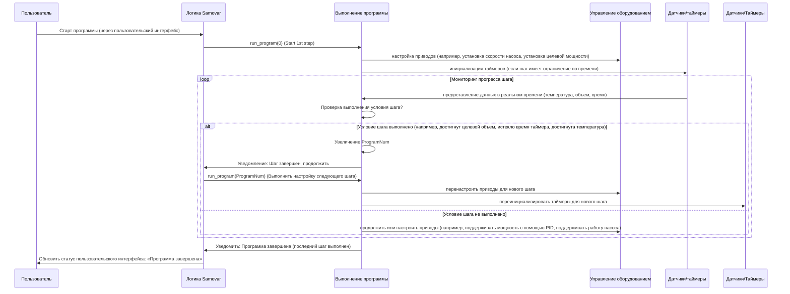

# Глава 2: Выполнение программы процесса

Добро пожаловать в учебник по самовару! В [Глава 1: Взаимодействие с пользователем (Web и LCD)](01_user_interaction__web___lcd__.md) мы узнали, как вы можете указать самовару, что делать, используя его физический или веб-интерфейс. Теперь давайте рассмотрим, что происходит *после* нажатия кнопки «Старт» или выбора программы: как самовар автоматически выполняет последовательность шагов для осуществления вашего процесса пивоварения или дистилляции.

Представьте, что вы следуете рецепту. Рецепт - это не просто одна инструкция, это список шагов: «Нагреть воду до X градусов», „Добавить ингредиент Y и перемешивать в течение Z минут“, „Выдержать температуру A градусов в течение B часов“ и так далее. Каждый шаг имеет определенные требования (температура, время, действие).

В проекте «Самовар» рассматриваются такие сложные процессы, как перегонка спирта (ректификация, дистилляция, НБК) или варка пива (этапы приготовления сусла, кипячение). Эти процессы также требуют соблюдения точной последовательности шагов с определенными параметрами. Контролировать все вручную по ходу процесса было бы невероятно утомительно и требовало бы постоянного внимания.

Именно здесь на помощь приходит **Process Program Execution**. Это похоже на то, как если бы автоматизированный шеф-повар точно следовал вашему рецепту.

## Что такое программа процесса?

В Samovar «программа» - это просто сохраненный список или последовательность шагов. Каждый шаг в программе указывает самовару на выполнение определенного действия с определенными параметрами до тех пор, пока не будет выполнено заданное условие.

Рассматривайте программу как электронную таблицу или список инструкций для самовара. Например, шаг в программе «Ректификация» может выглядеть следующим образом:

* **Тип:** Сбор голов
* **Объем:** 100 мл
* **Скорость:** 0,1 л/ч
* **Целевая температура:** (необязательно, часто основывается на предыдущем шаге)
* **Сосуд для сбора:** Контейнер 1
* **Мощность нагревателя:** 120 В (или эквивалентный процент/мощность)

Шаг в программе «Пиво» может выглядеть следующим образом:

* **Тип:** Температурная пауза (шаг затирания)
* **Целевая температура:** 65°C
* **Длительность:** 60 минут
* **Миксер/насос:** Работает периодически
* **Мощность нагревателя:** Контролируется ПИД для поддержания температуры

Как видите, параметры могут отличаться в зависимости от общего *режима* (ректификация, пиво, NBK), но основная идея та же: шаг определяет, *что* делать, *как много/как быстро/при какой температуре* делать, и *когда остановиться* и перейти к следующему шагу.

Самовару необходимо:
1.  Хранить эти программы.
2.  Знать, какой этап программы активен в данный момент.
3.  Выполнять действия, требуемые текущим шагом.
4.  Контролировать условия, чтобы определить, когда текущий шаг будет завершен.
5.  Автоматически переходить к следующему шагу.

## Программы и режимы

Самовар поддерживает различные режимы с программами (Ректификация, Дистилляция, БК, НБК, Пиво, Сыр). Хотя все они используют концепцию программы, состоящей из шагов, значение параметров внутри шага может немного отличаться в зависимости от режима. Например, «Объем» в программе «Ректификация» означает объём отбираемой жидкости, а в программе «Пиво» - время включения мешалки/насоса в цикле «работа/пауза».

Каждый режим хранит программу в текстовом виде: одна строка - один шаг, поля разделены `;`. Набор полей и допустимые типы шагов задаёт `program_io.h`:

| Режим | Поля строки | Типы шагов |
|---|---|---|
| Ректификация | тип;объём;скорость;ёмкость;температура;мощность | `H B C T P L` |
| Дистилляция | тип;значение;ёмкость;мощность | `T A S P R L` |
| БК | тип;значение;ёмкость;мощность;температура | `T A S P R L` |
| НБК | тип;скорость;мощность (ровно 4 строки) | `H S O W` |
| Пиво | тип;температура;время;устройство;датчик | `M P B C F W L A` |
| Сыр | тип;температура;время;параметр;устройство;датчик | `H P C M D N W S F L` |

Встроенное программное обеспечение самовара использует общую структуру для хранения данных для каждого шага, а код, специфичный для каждого режима, интерпретирует эту структуру.

Структура, используемая для определения одного шага программы, называется `WProgram` в коде:

```c++
// Из Samovar.h (упрощено)
using ProgramType = char;      // из program_types.h: тип шага - одна буква ('H', 'B', 'P', 'M' ...)

struct WProgram {
  float Speed;          // Скорость отбора (л/ч); в Пиве и Сыре - обороты мешалки, в Дистилляции/БК - значение условия перехода
  float Temp;           // Целевая температура (0 - не используется)
  float Power;          // Напряжение/мощность нагревателя для шага (0 - не менять)
  float Time;           // Время шага: рассчитанное по объёму/скорости или заданное явно (минуты в Пиве и Сыре)
  union {
    float Param;                   // Доп. параметр шага (в Пиве - производительность насоса, мл/ч)
    uint32_t FlocMultiplierMilli;  // Сыр, шаг F: множитель флокуляции * 1000
  };
  uint16_t Volume;      // Объём отбора (мл); для паузы P - длительность в секундах; в Пиве - время работы мешалки в цикле
  uint16_t LuaTextOffset; // Смещение текста Lua-шага L в общем буфере программы
  ProgramType WType;    // Тип шага
  uint8_t capacity_num; // Номер ёмкости для отбора; в Пиве и Сыре - тип устройства (мешалка/насос)
  uint8_t TempSensor;   // Датчик температуры для контроля нагрева (Пиво, Сыр)
};

WProgram program[PROGRAM_MAX]; // PROGRAM_MAX = 30 - массив строк программы
```
Массив `program` содержит до 30 шагов для текущей программы (`ProgramLen` - сколько из них заполнено). Различные обработчики режимов (`withdrawal` для ректификации, `distiller_proc`, `bk_proc`, `beer_proc`/`beer_stage_tick`, `nbk_proc`, `cheese_proc`/`cheese_stage_tick` — описаны в [Глава 3: Управление состоянием системы и режимами](03_system_state___mode_management_.md)) будут проверять `program[ProgramNum]` (где `ProgramNum` — индекс текущего активного шага) и использовать поля (`WType`, `Volume`, `Speed` и т. д.) в соответствии с логикой данного режима. Переход к шагу в каждом режиме выполняет своя функция: `run_program` (ректификация), `run_dist_program`, `run_bk_program`, `run_nbk_program`, `run_beer_program`, `run_cheese_program`.

Например, в режиме «Ректификация» `program[ProgramNum].Volume` контролирует целевой объем для шагового двигателя, а `program[ProgramNum].Speed` контролирует скорость шагового двигателя. В температурной паузе пива (`WType == 'P'`) `program[ProgramNum].Temp` — целевая температура для ПИД-регулятора нагревателя, `program[ProgramNum].Time` — длительность паузы в минутах, а `Volume` и `Power` — время работы и простоя мешалки в цикле.

## Как работает выполнение программы изнутри

Давайте проследим, что происходит при запуске программы, например, при запуске процесса ректификации, с помощью приведенной ниже диаграммы последовательности. Эта диаграмма фокусируется на ключевых компонентах, участвующих в чтении «рецепта» и выполнении действий в соответствии с ним.


```mermaid
sequenceDiagram
    Пользователь->>Логика Samovar: Старт программы (через пользовательский интерфейс)
    Логика Samovar->>Выполнение программы: run_program(0) (Start 1st step)
    Выполнение программы->>Управление оборудованием: настройка приводов (например, установка скорости насоса, установка целевой мощности)
    Выполнение программы->>Датчики/таймеры: инициализация таймеров (если шаг имеет ограничение по времени)

    loop Мониторинг прогресса шага
        Датчики/таймеры->>Выполнение программы: предоставление данных в реальном времени (температура, объем, время)
        Выполнение программы->>Выполнение программы: Проверка выполнения условия шага?
        alt Условие шага выполнено (например, достигнут целевой объем, истекло время таймера, достигнута температура)
            Выполнение программы->>Выполнение программы: Увеличение ProgramNum
            Выполнение программы->>Логика Samovar: Уведомление: Шаг завершен, продолжить
            Логика Samovar->>Выполнение программы: run_program(ProgramNum) (Выполнить настройку следующего шага)
            Выполнение программы->>Управление оборудованием: перенастроить приводы для нового шага
Выполнение программы->>Датчики/Таймеры: переинициализировать таймеры для нового шага
else Условие шага не выполнено
Выполнение программы->>Управление оборудованием: продолжить или настроить приводы (например, поддерживать мощность с помощью PID, поддерживать работу насоса)
end
end

    Выполнение программы->>Логика Samovar: Уведомить: Программа завершена (последний шаг выполнен)
    Логика Samovar->>Пользователь: Обновить статус пользовательского интерфейса: «Программа завершена»
```

Как видите, процесс циклический:
1.  Пользователь запускает программу (глава 1).
2.  Основная логика Samovar вызывает обработчик выполнения программы, указывая ему, с какого шага начать (обычно шаг 0).
3.  Код выполнения программы считывает параметры для этого конкретного шага из массива `program`.
4.  На основе этих параметров он дает команду **управлению оборудованием** (глава 5) установить такие параметры, как скорость насоса, мощность нагревателя или состояние клапана. Если для шага установлено ограничение по времени, может запускаться таймер.
5.  Затем система входит в цикл мониторинга. Она непрерывно получает данные от **датчиков** (глава 4) и проверяет, выполнены ли условия для завершения *текущего* шага (например, «Достигнут ли целевой объем?», «Истек ли таймер?», «Достаточно ли долго температура оставалась стабильной?»).
6.  Если условие *не* выполнено, мониторинг продолжается и, возможно, производится регулировка аппаратного управления на основе данных датчиков в реальном времени (например, ПИД-регулятор регулирует мощность нагревателя для поддержания температуры).
7.  Если условие *выполнено*, код выполнения программы увеличивает счетчик `ProgramNum` и дает команду основной логике запустить настройку для *следующего* шага, начиная цикл заново с новыми параметрами и условиями.
8.  Это продолжается до тех пор, пока не будет достигнут специальный шаг «завершение» или не будет выполнен последний определенный шаг.

## Погружение в код

Давайте посмотрим на несколько упрощенных фрагментов кода, чтобы понять, как это работает.

Во-первых, как запускается или переходит к шагу программы. Это происходит в функции `run_program` (используемой в режиме Rectification) или аналогичных функциях для других режимов (`run_dist_program`, `run_beer_program` и т. д.). Эта функция считывает параметры для заданного номера шага (`num`) и настраивает аппаратное обеспечение и переменные состояния соответствующим образом.

```c++
// Упрощенный фрагмент кода на основе run_program из logic.h
void run_program(uint8_t num) {
  // Проверка, находимся ли мы на специальном этапе «завершение»
  if (num >= PROGRAM_MAX) { // PROGRAM_END (= PROGRAM_MAX) используется в качестве маркера «завершение»
    // Выполнение действий по очистке: остановка насоса, сброс ёмкости, закрытие лога
    reset_rect_program_pause_state(); // Сброс флагов паузы/ожидания и таймера t_min
    ProgramNum = 0;
    startval = SAMOVAR_STARTVAL_IDLE;
    stopService();
    stepper_safe_stop_reset();
    set_capacity(0);
    request_data_log_close();
    stop_process("Выполнение программы завершено."); // Отключить нагрев и уведомить пользователя
    return; // Выйти из функции
  }

  // Мы начинаем обычный шаг программы (num)
  ProgramNum = num; // Обновить глобальный индекс текущего шага программы
  reset_rect_program_pause_state(); // Сброс состояний паузы/ожидания предыдущего шага

  // Шаг L выполняет Lua-скрипт и дальше ведётся отдельно (только в сборке с USE_LUA)
  if (program[num].WType == 'L') { /* ... lua_sequence_stage_begin(num, millis()) ... */ return; }

  // Запомнить температуры на начало шага (от них считается дельта в поле Temp)
  SteamSensor.StartProgTemp = SteamSensor.avgTemp;

#ifdef SAMOVAR_USE_POWER
  apply_program_power_row(program[num].Power); // Мощность шага (0 - не менять), глава 5
#endif

  // --- Пример: обработка различных типов шагов ---
  if (program_type_one_of(program[num].WType, "HBTC")) {
    // Это этап отбора жидкости (головы, тело, хвосты, предзахлёб)

    // Установить положение сосуда для сбора (с помощью сервопривода)
    set_capacity(program[num].capacity_num);

    // Установить целевой объем и скорость для шагового двигателя/насоса
    CurrrentStepperSpeed = get_speed_from_rate(program[num].Speed);
    TargetStepps = program[num].Volume * SamSetup.StepperStepMl; // Цель — объем, преобразованный в шаги шагового двигателя
    stepper_safe_set_max_speed(CurrrentStepperSpeed);
    stepper_safe_set_current(0); // Начать отсчет объема с нуля для этого этапа
    stepper_safe_set_target(TargetStepps);

    // Запустить работу двигателя/насоса (глава 5)
    startService();

    ActualVolumePerHour = program[num].Speed; // Обновить отображение/регистрацию текущей скорости

    // Для шагов тела (B/C) температура тела захватывается из текущих показаний датчиков,
    // а не из поля Temp: от неё считается пауза по превышению температуры
    if (program_type_one_of(program[num].WType, "BC") && SteamSensor.BodyTemp == 0) {
      set_body_temp();
    }

  } else if (program[num].WType == 'P') {
    // Это шаг «Пауза»

    // Установить таймер на время паузы (в данном случае поле «Объем» содержит время в секундах)
    t_min = millis() + program[num].Volume * 1000;
    program_Pause = true;

    // Остановить текущий отбор жидкости
    stopService();
    stepper_safe_stop_reset();
  }

  // Уведомить пользователя о смене шага
  SendMsg("Программа: старт строки №" + String(num + 1), NOTIFY_MSG);
}
```
Эта функция `run_program` вызывается один раз при начале шага. Ее задача — настроить систему (приводы, таймеры, целевые значения) на основе параметров конкретного шага программы. Она не *контролирует* шаг; это происходит в другом месте.

Мониторинг происходит в других частях основного цикла Samovar, в функциях, которые вызываются повторно, таких как `withdrawal()` (для мониторинга сбора жидкости для ректификации) или в самих циклах `distiller_proc()`, `bk_proc()`, `beer_stage_tick()`, `nbk_proc()`, `cheese_stage_tick()`. Эти циклы постоянно проверяют показания датчиков, таймеры и прогресс по отношению к целевым значениям, установленным `run_program`.

Вот упрощенный пример того, как проверяется завершение шага (на примере функции `withdrawal` из logic.h):


```c++
// Упрощенный фрагмент withdrawal() - проверка условий завершения шага
void withdrawal() {
  // Если программа не находится в состоянии выполнения, ничего не делать
  if (SamovarStatusInt != SAMOVAR_STATUS_RECT_WITHDRAWAL &&  // 10: идёт отбор
      SamovarStatusInt != SAMOVAR_STATUS_RECT_AUTOPAUSE &&   // 15: автопауза
      SamovarStatusInt != SAMOVAR_STATUS_PAUSED) {           // 40: ручная пауза
    return;
  }

  WProgram row = program[ProgramNum]; // Текущий шаг

  // Детектор примесей может сам поставить отбор на паузу или снизить скорость
  process_impurity_detector();

  // Для шага «Пауза»: проверить, истекло ли время таймера
  if (program_Pause) {
    if ((int32_t)(millis() - t_min) >= 0) {
      t_min = 0;
      menu_samovar_start(); // Продолжительность паузы закончилась - перейти к следующему шагу
    }
    return;
  }

  // Для шагов отбора: целевой объем достигнут или температура пара превысила порог из поля Temp
  CurrrentStepps = stepper_safe_get_current(); // Текущий собранный объем (в шагах)
  bool volumeDone = TargetStepps != 0 && TargetStepps <= CurrrentStepps;
  bool tempDone = false;
  if (row.Temp != 0) {
    // Temp < 20 - дельта к температуре пара на начало шага, Temp >= 20 - абсолютный порог
    float threshold = row.Temp < 20 ? SteamSensor.StartProgTemp + row.Temp : row.Temp;
    tempDone = SteamSensor.avgTemp > threshold;
  }
  if (!program_Wait && !PauseOn && (volumeDone || tempDone)) {
    menu_samovar_start(); // Эта функция обрабатывает переход к следующему шагу (или завершение)
    return;
  }

  // --- Пауза по превышению температуры тела (для шагов B/C; так же - по датчику царги) ---
  float bodyTemp = SteamSensor.BodyTemp; // Температура тела, захваченная set_body_temp()
  if (program_type_one_of(row.WType, "BC") && SteamSensor.SetTemp > 0 && bodyTemp > 0 &&
      SteamSensor.avgTemp >= bodyTemp + SteamSensor.SetTemp) {
    if (!PauseOn && !program_Wait) {
      program_Wait = true;           // Поставить отбор на автоматическую паузу
      pause_withdrawal(true);
      t_min = millis() + SteamSensor.Delay * 1000; // Ожидать заданное время
      SendMsg("Пауза по Т пара", WARNING_MSG);
    }
  } else if (program_Wait && t_min > 0 && (int32_t)(millis() - t_min) >= 0 &&
             SteamSensor.avgTemp < bodyTemp + SteamSensor.SetTemp - PAUSE_RESUME_HYSTERESIS_DELTA) {
    // Время ожидания истекло, и температура вернулась ниже порога
    SendMsg("Продолжаем отбор после автоматической паузы", NOTIFY_MSG);
    t_min = 0;
    program_Wait = false;    // Очистить флаг ожидания
    pause_withdrawal(false); // Возобновление сбора жидкости
  }

  // Если ни одно из условий завершения не выполнено, текущий шаг продолжается...
}

```
Функция `withdrawal()` вызывается повторно в главном цикле как обработчик режима «Ректификация» (в других режимах эту роль играют их собственные циклы). Это двигатель, который продвигает программу вперед, отслеживая состояние и запуская переход к *следующему* шагу с помощью `menu_samovar_start()`, когда цель текущего шага достигнута.

Функция `menu_samovar_start()` (упомянутая в главе 1 и вызываемая `withdrawal()` при завершении шага) имеет несколько вводящее в заблуждение название, поскольку она не *только* запускает самый первый шаг. Это скорее общая функция «Продвижение состояния программы» для режима «Ректификация»:

```c++
// Упрощенная логика из menu_samovar_start в Menu.ino (используется в режиме Rectification)
void menu_samovar_start() {
  // Работает только в режиме «Ректификация» и при включённом нагреве
  if (Samovar_Mode != SAMOVAR_RECTIFICATION_MODE || !PowerOn) return;

  // Определить состояние «следующего действия» на основе текущего состояния (startval)
  if (startval == SAMOVAR_STARTVAL_RECT_DONE) startval = SAMOVAR_STARTVAL_RECT_STOPPING;
  else if (ProgramNum >= ProgramLen - 1 && startval != SAMOVAR_STARTVAL_IDLE)
    startval = SAMOVAR_STARTVAL_RECT_DONE; // Последний шаг выполнен

  if (startval == SAMOVAR_STARTVAL_IDLE) {
    // Простой/готовность: проверить программу, создать лог (глава 7), запустить шаг 0
    if (!validate_rect_program_startable(programError)) return;
    if (!create_data()) return;
    session_begin(sessionDescription);
    run_program(0); // Запустить программу с шага 0
    SamovarStatusInt = SAMOVAR_STATUS_RECT_WITHDRAWAL;
    startval = SAMOVAR_STARTVAL_RECT_RUNNING; // Изменить состояние на «выполняется»
  } else if (startval == SAMOVAR_STARTVAL_RECT_RUNNING) {
    // Выполняется обычный шаг, перейти к СЛЕДУЮЩЕМУ шагу
    ProgramNum++; // Увеличить счетчик шагов
    run_program(ProgramNum); // Выполнить следующий шаг
  } else if (startval == SAMOVAR_STARTVAL_RECT_DONE) {
    // Программа завершена
    if (PROGRAM_DONE_AUTO_POWEROFF_MIN <= 0) {
      run_program(PROGRAM_END); // Вызвать run_program с маркером «завершение»
    } else {
      // «Работа на себя»: насос остановлен, нагрев остаётся включённым;
      // полное завершение - по таймауту в withdrawal() или повторным нажатием «Старт»
      stopService();
      set_capacity(0);
      program_done_hold_since = millis();
    }
  } else {
    // SAMOVAR_STARTVAL_RECT_STOPPING: повторное нажатие «Старт» после завершения - остановка
    run_program(PROGRAM_END); // Вызвать run_program с маркером «завершение» для очистки
    reset_sensor_counter(); // Сбросить счетчики (глава 4)
  }
  // Обновить ЖК-дисплей (глава 1)
  menu_update();
}
```
Эта функция действует как драйвер состояния для программ Rectification. При вызове она проверяет текущее значение `startval` (состояние программы) и `ProgramNum` (индекс текущего шага), чтобы решить, следует ли действительно запускать, переходить к следующему шагу или инициировать процесс завершения.

## Заключение

В этой главе мы узнали, что **выполнение программы процесса** — это способ, с помощью которого Samovar автоматически выполняет последовательность заранее определенных шагов, подобно рецепту. Мы увидели, как программы хранятся в виде массива структур `WProgram`, причем каждый режим по-разному интерпретирует параметры шага. Мы изучили внутренний поток, в котором шаг программы инициируется функцией, такой как `run_program`, которая настраивает систему в соответствии с параметрами шага. Мы также увидели, как логика мониторинга (такая как `withdrawal()` или аналогичный код в обработчиках режимов) постоянно проверяет условия завершения шага с помощью данных датчиков и таймеров, автоматически переходя к следующему шагу с помощью функций, таких как `menu_samovar_start()`, когда шаг завершен. Эта автоматизация является ключом к выполнению сложных процессов заваривания и дистилляции без участия человека.

В следующей главе мы углубимся в [Управление состоянием системы и режимами](03_system_state___mode_management_.md), чтобы понять, как Samovar узнает, *какую* программу запустить (ректификация, пиво и т. д.), и как он управляет своим общим рабочим состоянием.

[Глава 3: Управление состоянием системы и режимами](03_system_state___mode_management_.md)
