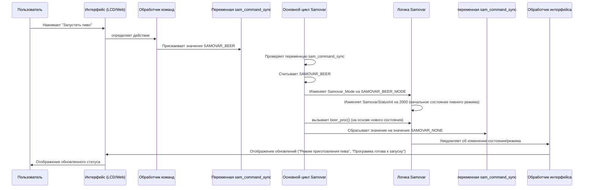

# Глава 3: Управление состоянием и режимом системы

Добро пожаловать обратно! В [Главе 1: Взаимодействие с пользователем (веб и ЖК-дисплей)](01_user_interaction__web___lcd__.md) мы узнали, как давать команды Samovar. В [Главе 2: Выполнение программы процесса](02_process_program_execution_.md) мы увидели, как Samovar шаг за шагом следует «рецепту» (программе). Но как Samovar узнает, *какому* рецепту следует следовать? Он варит пиво, дистиллирует спиртные напитки или просто простаивает? И даже когда он выполняет рецепт, он в данный момент нагревается, выполняет определенный шаг или находится в режиме паузы?

Здесь на помощь приходит **управление состоянием и режимом системы**. Представьте себе эту часть программного обеспечения Samovar как его «мозг» или главного дирижера оркестра. Он отвечает за:

1.  Знание общего **режима** системы (например, ректификация, варка пива, простаивание). Это похоже на то, как дирижер выбирает, какое крупное музыкальное произведение исполнять.
2.  Знание текущего **состояния** системы в рамках этого режима или в целом (например, нагрев, выполнение этапа программы, пауза, ошибка). Это похоже на то, как дирижер руководит оркестром в части «Аллегро», делает «Паузу» или сигнализирует о «Перерыве».
3.  Управление **переходами** между этими режимами и состояниями на основе команд пользователя (глава 1), хода программы (глава 2) или непредвиденных событий (глава 6).

Без этого центрального управления самовар не знал бы, что делать с командами пользователя, как интерпретировать данные датчиков (глава 4) и управлять оборудованием (глава 5).

Возьмем типичный сценарий: вы только что закончили варить пиво (режим «Пиво») и теперь хотите очистить систему (возможно, с помощью программы ректификации/очистки) или начать дистилляцию спирта (режим «Ректификация»). Самовару нужен способ четко переключиться из режима «Система для пива» в режим «Система для дистилляции», а затем перейти из состояния «Простой» в состояние «Нагрев», а затем в состояние «Работа», следуя новой программе.

## Режимы: разные «шляпы» для Samovar

Samovar может работать несколькими различными способами, каждый из которых соответствует отдельному процессу или цели. Это его **режимы**. Код Samovar определяет их с помощью списка имен (`enum`):

```c++
// Из Samovar.h
enum SAMOVAR_MODE {SAMOVAR_RECTIFICATION_MODE, SAMOVAR_DISTILLATION_MODE, SAMOVAR_BEER_MODE, SAMOVAR_BK_MODE, SAMOVAR_NBK_MODE, SAMOVAR_SUVID_MODE, SAMOVAR_LUA_MODE};
volatile SAMOVAR_MODE Samovar_Mode; // Эта переменная хранит текущий режим.
```

*   `SAMOVAR_RECTIFICATION_MODE`: Для производства спиртных напитков высокой чистоты (ректификация).
* `SAMOVAR_DISTILLATION_MODE`: для более простой дистилляции спиртных напитков.
* `SAMOVAR_BEER_MODE`: для автоматизации этапов варки пива (затирание, кипячение).
* `SAMOVAR_BK_MODE`: для работы с определенным типом колонны (колонна Брага).
* `SAMOVAR_NBK_MODE`: для непрерывной дистилляции (колонна Начало Брага).
* `SAMOVAR_SUVID_MODE`: (вероятно, для Sous Vide, контроль температуры).
* `SAMOVAR_LUA_MODE`: для запуска пользовательских процессов, определенных в скриптах Lua.

Одновременно может быть активен только один режим. Переменная `Samovar_Mode` сообщает системе, какую «шапку» она сейчас носит. Ключевое слово `volatile` является немного техническим, но по сути оно сообщает компилятору, что эта переменная может быть изменена различными частями программы, которые работают независимо (например, главный цикл и, возможно, обработчики прерываний), поэтому система должна всегда считывать ее значение заново.

## Состояния: что происходит прямо сейчас?

В каждом режиме, или даже когда не запущен ни один конкретный процесс, Samovar находится в определенном **состоянии**. Эти состояния описывают его текущий уровень активности или состояние. Код использует целочисленную переменную `SamovarStatusInt` для отслеживания этого подробного состояния:

```c++
// Из Samovar.h
volatile int16_t SamovarStatusInt; // Хранит текущее рабочее состояние (в виде числа)
String SamovarStatus; // Хранит удобочитаемое описание состояния
```

В то время как `SamovarStatus` является текстовым описанием, которое вы можете прочитать на дисплее, `SamovarStatusInt` — это числовое значение, которое программа использует внутренне. Различные диапазоны чисел часто соответствуют разным режимам или фазам:

* `0`: Простой / Выключено
* `10`, `15`: Выполнение шага программы (режим выпрямления)
* `20`: Программа завершена
* `50`, `51`, `52`: Нагрев / Стабилизация (режим ректификации)
* `1000`: Режим дистилляции
* `2000`: Режим пива
* `3000`: Режим BK
* `4000`: Режим NBK
- Так же используются статусы для ошибок, калибровки, самотестирования и т. д.

Функция `get_Samovar_Status()` (см. `logic.h`) отвечает за просмотр `SamovarStatusInt` и других системных флагов (`PowerOn`, `PauseOn`, `program_Wait`, `ProgramNum` и т. д.) и генерацию описательного текста, отображаемого на ЖК-дисплее и в веб-интерфейсе.

```c++
// Упрощенный фрагмент из logic.h (фактическая функция довольно длинная)
String get_Samovar_Status() {
  if (!PowerOn) {
    SamovarStatusInt = 0; // Система выключена -> Состояние 0
    return F(«Выключено»);
  } else if (PowerOn && startval == 1 && !PauseOn && !program_Wait) {
    SamovarStatusInt = 10; // Включено, программа запущена, не приостановлена/не находится в режиме ожидания -> Состояние 10
    return «Прг №» + String(ProgramNum + 1); // Показать текущий шаг программы
  }
  // ... много других условий, проверяющих переменные состояния и ProgramNum ...
  else if (SamovarStatusInt == 2000) {
    // Если в режиме Beer (состояние 2000), опишите конкретный шаг программы Beer
    // ... проверьте program[ProgramNum].WType и время ...
    return «Прг №» + String(ProgramNum + 1) + «; » + «Beer specific status»;
  }
  // ... и так далее для других режимов (Distillation 1000, NBK 4000 и т. д.) ...
  return «Неизвестный статус»; // Запасной вариант по умолчанию
}
```

Эта функция запускается периодически для обновления информации, отображаемой на интерфейсах (глава 1). Однако основная логика полагается на числовые переменные `SamovarStatusInt` и `Samovar_Mode` для определения того, что *делает* система.

## Переходы между состояниями и режимами: смена передач

Наиболее важной задачей управления состоянием и режимом является обработка *переходов*. Так система переходит из состояния «Idle» в «Heating», из «Heating» в «Running Program Step 1», из «Running Step 1» в «Running Step 2» (в соответствии с логикой главы 2) или из «Rectification Mode» в «Beer Mode».

Эти переходы обычно запускаются:

1.  **Вводом пользователя:** нажатием кнопки на ЖК-дисплее или в веб-интерфейсе ([Глава 1: Взаимодействие с пользователем (веб и ЖК-дисплей)](01_user_interaction__web___lcd__.md)).
2.  **Завершением программы:** Завершение шага программы (например, достижение целевого объема, истечение таймера) ([Глава 2: Выполнение программы процесса](02_process_program_execution_.md)).
3.  **События, связанные с безопасностью:** Срабатывание сигнализации ([Глава 6: Мониторинг безопасности и сигнализация](06_safety_monitoring___alarms_.md)).

Как этот сигнал передается, например, от нажатия кнопки на веб-странице к изменению системных параметров `Samovar_Mode` или `SamovarStatusInt`?

Как показано в главе 1, веб-команды устанавливают специальную переменную: `sam_command_sync`. Эта переменная `volatile` действует как простое окно сообщений между веб-сервером/задачей LCD и основным циклом программы, который управляет состоянием и режимом.

```c++
// Из Samovar.h
enum SamovarCommands {SAMOVAR_NONE, SAMOVAR_START, SAMOVAR_POWER, SAMOVAR_RESET, CALIBRATE_START, CALIBRATE_STOP, SAMOVAR_PAUSE, SAMOVAR_CONTINUE, SAMOVAR_SETBODYTEMP, SAMOVAR_DISTILLATION, SAMOVAR_BEER, SAMOVAR_BEER_NEXT, SAMOVAR_BK, SAMOVAR_NBK, SAMOVAR_SELF_TEST, SAMOVAR_DIST_NEXT, SAMOVAR_NBK_NEXT};
volatile SamovarCommands sam_command_sync; // Переменная для передачи команд между задачами
```

Основная функция `loop()` в `Samovar.ino` постоянно проверяет `sam_command_sync`. Если она находит команду, отличную от `SAMOVAR_NONE`, она обрабатывает команду (часто изменяя `Samovar_Mode` или `SamovarStatusInt`) и затем сбрасывает `sam_command_sync` обратно в `SAMOVAR_NONE`.

Вот упрощенное представление этого процесса:

На этой диаграмме показано, как действие пользователя каскадно проходит через систему, чтобы изменить основные параметры "Samovar_Mode" и "SamovarStatusInt".

## Внутри `loop()`: Дирижерская палочка

Основная функция "loop()" в "Samovar.ino" - это функция, с помощью которой дирижер ("loop()") читает партитуру ("sam_command_sync", "Samovar_Mode", "SamovarStatusInt") и управляет различными частями оркестра (функции обработки, зависящие от режима, такие как "beer_proc"), `distiller_proc` и т.д.).

Давайте рассмотрим упрощенную версию соответствующих частей функции `loop()`:

```c++
// Simplified snippet from Samovar.ino loop()
void loop() {
  // ... other necessary tasks (like checking for button presses, network) ...

  // Check if a command has been signaled (e.g., from web or LCD)
  if (sam_command_sync != SAMOVAR_NONE) {
    switch (sam_command_sync) {
      case SAMOVAR_START: // User clicked Start (defaults to Rectification)
        Samovar_Mode = SAMOVAR_RECTIFICATION_MODE;
        // menu_samovar_start(); // Function to start/advance Rectification program (Chapter 2)
        SamovarStatusInt = 50; // Example: Transition to Heating state
        break;
      case SAMOVAR_POWER: // User clicked general Power toggle
        // Check current status to decide what Power means (Finish current mode or just toggle power)
        if (SamovarStatusInt == 1000) distiller_finish(); // If in Distillation, Power button finishes it
        else if (SamovarStatusInt == 2000) beer_finish();     // If in Beer, Power button finishes it
        // ... checks for other modes ...
        else set_power(!PowerOn); // Otherwise, just toggle the main Power (sets PowerOn flag)
        break;
      case SAMOVAR_BEER: // User specifically requested Beer Mode
        Samovar_Mode = SAMOVAR_BEER_MODE; // Set the mode
        SamovarStatusInt = 2000;          // Set the initial state for Beer Mode
        startval = 2000;                  // Another state variable used internally by beer_proc
        break;
      case SAMOVAR_DISTILLATION: // User specifically requested Distillation Mode
        Samovar_Mode = SAMOVAR_DISTILLATION_MODE; // Set the mode
        SamovarStatusInt = 1000;                  // Set the initial state for Distillation Mode
        startval = 1000;                          // Another state variable
        break;
      // ... cases for SAMOVAR_NBK, SAMOVAR_BK, SAMOVAR_RESET, SAMOVAR_PAUSE, etc. ...
      case SAMOVAR_RESET:
        samovar_reset(); // Call a function to reset all states and modes
        sam_command_sync = SAMOVAR_NONE; // Reset handled within samovar_reset
        break;
      case SAMOVAR_NONE:
         break; // Should not happen due to the outer if check, but good practice
    }
    // Reset the command flag AFTER processing it (unless it was SAMOVAR_RESET)
    if (sam_command_sync != SAMOVAR_NONE) {
      sam_command_sync = SAMOVAR_NONE;
    }
  }

  // Now, based on the current SamovarStatusInt, call the appropriate mode/state handler
  if (SamovarStatusInt > 0 && SamovarStatusInt < 1000) {
    // States 1-999 typically relate to Rectification/General operation states (Heating, Running Program)
    // withdrawal(); // Function handling Rectification program execution & state checks (Chapter 2)
  } else if (SamovarStatusInt == 1000) {
    // Distillation Mode is active
    distiller_proc(); // Function handling Distillation logic
  } else if (SamovarStatusInt == 2000) { // Note: Beer mode uses SamovarStatusInt = 2000 for its main loop check
    // Beer Mode is active
    beer_proc(); // Function handling Beer logic
  } else if (SamovarStatusInt == 3000) {
    // BK Mode is active
    // bk_proc(); // Function handling BK logic
  } else if (SamovarStatusInt == 4000) {
    // NBK Mode is active
    nbk_proc(); // Function handling NBK logic
  }
  // ... other state/mode checks ...

  // ... other loop tasks ...
}
```
Этот упрощенный код показывает суть управления состоянием и режимами:
1. Он ожидает сигнала в переменной sam_command_sync.
2. Когда поступает сигнал, команда `switch` действует подобно дирижеру, читающему партитуру, – она идентифицирует команду (`SAMOVAR_BEER`, `SAMOVAR_START` и т.д.).
3. На основе команды он устанавливает основные системные переменные (`Samovar_Mode` и `SamovarStatusInt`), которые отражают желаемое новое состояние или режим. Например, SAMOVAR_BEER` устанавливает режим на `SAMOVAR_BEER_MODE`, а начальное состояние - на `2000`.
4. Важно отметить, что после потенциального изменения состояния/режима структура кода *позже* в `loop()` использует эти новые значения (особенно `SamovarStatusInt`), чтобы решить, какую функцию, зависящую от режима (`beer_proc()`, `distiller_proc()` и т.д.), вызывать в этой итерации цикла. Это подобно тому, как дирижер поднимает палочку, и соответствующая часть оркестра начинает играть.

Этот механизм гарантирует, что только код, соответствующий текущему рабочему состоянию и активному режиму, выполняет свой основной логический цикл, сохраняя систему организованной и эффективной.

## Заключение

В этой главе мы рассмотрели `мозг` Самовара: **Управление состоянием системы и режимами**. Мы узнали, что самовар работает в различных режимах (например, для ректификации или приготовления пива) и имеет подробные рабочие режимы (например, нагрев или запуск шага X). Мы видели, как эти режимы и состояния отслеживаются с помощью специальных переменных (`Samovar_Mode` и `SamovarStatusInt`). Важно отметить, что мы поняли, как команды пользователя или внутренние события запускают переходы между этими состояниями и режимами, часто используя сигнальную переменную команды (`sam_command_sync`), которую считывает основной программный цикл для обновления состояния системы и вызова правильных функций обработки. Такой многоуровневый подход позволяет Samovar управлять сложными процессами, плавно переключаясь между различными задачами по мере необходимости.

Разобравшись в том, как Samovar понимает, что он делает, давайте разберемся, как он собирает информацию, необходимую для принятия решений: **Сбор данных с датчиков**.

[Глава 4: Сбор данных с датчиков](04_sensor_data_acquisition_.md)
