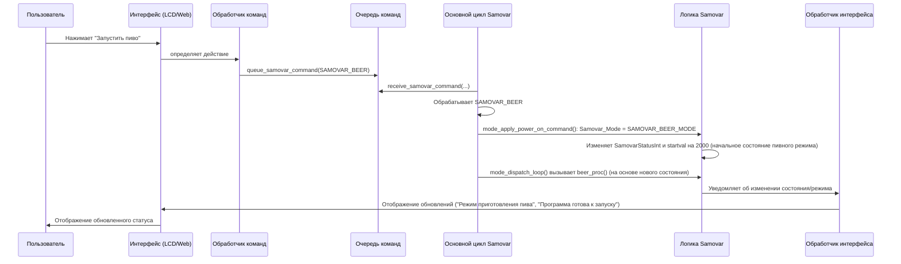

# Глава 3: Управление состоянием и режимом системы

Добро пожаловать обратно! В [Главе 1: Взаимодействие с пользователем (веб и ЖК-дисплей)](01_user_interaction__web___lcd__.md) мы узнали, как давать команды Samovar. В [Главе 2: Выполнение программы процесса](02_process_program_execution_.md) мы увидели, как Samovar шаг за шагом следует «рецепту» (программе). Но как Samovar узнает, *какому* рецепту следует следовать? Он варит пиво, дистиллирует спиртные напитки или просто простаивает? И даже когда он выполняет рецепт, он в данный момент нагревается, выполняет определенный шаг или находится в режиме паузы?

Здесь на помощь приходит **управление состоянием и режимом системы**. Представьте себе эту часть программного обеспечения Samovar как его «мозг» или главного дирижера оркестра. Он отвечает за:

1.  Знание общего **режима** системы (например, ректификация, варка пива, простаивание). Это похоже на то, как дирижер выбирает, какое крупное музыкальное произведение исполнять.
2.  Знание текущего **состояния** системы в рамках этого режима или в целом (например, нагрев, выполнение этапа программы, пауза, ошибка). Это похоже на то, как дирижер руководит оркестром в части «Аллегро», делает «Паузу» или сигнализирует о «Перерыве».
3.  Управление **переходами** между этими режимами и состояниями на основе команд пользователя (глава 1), хода программы (глава 2) или непредвиденных событий (глава 6).

Без этого центрального управления самовар не знал бы, что делать с командами пользователя, как интерпретировать данные датчиков (глава 4) и управлять оборудованием (глава 5).

Возьмем типичный сценарий: вы только что закончили варить пиво (режим «Пиво») и теперь хотите очистить систему (возможно, с помощью программы ректификации/очистки) или начать дистилляцию спирта (режим «Ректификация»). Самовару нужен способ четко переключиться из режима «Система для пива» в режим «Система для дистилляции», а затем перейти из состояния «Простой» в состояние «Нагрев», а затем в состояние «Работа», следуя новой программе.

## Режимы: разные «шляпы» для Samovar

Samovar может работать несколькими различными способами, каждый из которых соответствует отдельному процессу или цели. Это его **режимы**. Код Samovar определяет их с помощью списка имен (`enum`):

```c++
// Из Samovar.h
enum SAMOVAR_MODE {SAMOVAR_RECTIFICATION_MODE, SAMOVAR_DISTILLATION_MODE, SAMOVAR_BEER_MODE, SAMOVAR_BK_MODE, SAMOVAR_NBK_MODE, SAMOVAR_SUVID_MODE, SAMOVAR_LUA_MODE, SAMOVAR_CHEESE_MODE};
volatile SAMOVAR_MODE Samovar_Mode; // Эта переменная хранит текущий режим.
```

*   `SAMOVAR_RECTIFICATION_MODE`: Для производства спиртных напитков высокой чистоты (ректификация).
* `SAMOVAR_DISTILLATION_MODE`: для более простой дистилляции спиртных напитков.
* `SAMOVAR_BEER_MODE`: для автоматизации этапов варки пива (затирание, кипячение).
* `SAMOVAR_BK_MODE`: для работы бражной колонны (БК).
* `SAMOVAR_NBK_MODE`: для непрерывной перегонки браги (непрерывная бражная колонна, НБК).
* `SAMOVAR_SUVID_MODE`: сувид — термостат, поддерживающий заданную температуру в кубе.
* `SAMOVAR_LUA_MODE`: для запуска пользовательских процессов, определенных в скриптах Lua.
* `SAMOVAR_CHEESE_MODE`: для сыроварения по программе.

Одновременно может быть активен только один режим. Переменная `Samovar_Mode` сообщает системе, какую «шапку» она сейчас носит. Ключевое слово `volatile` является немного техническим, но по сути оно сообщает компилятору, что эта переменная может быть изменена различными частями программы, которые работают независимо (например, главный цикл и, возможно, обработчики прерываний), поэтому система должна всегда считывать ее значение заново.

## Состояния: что происходит прямо сейчас?

В каждом режиме, или даже когда не запущен ни один конкретный процесс, Samovar находится в определенном **состоянии**. Эти состояния описывают его текущий уровень активности или состояние. Код использует целочисленную переменную `SamovarStatusInt` для отслеживания этого подробного состояния:

```c++
// Из Samovar.h
volatile int16_t SamovarStatusInt; // Хранит текущее рабочее состояние (в виде числа)
String SamovarStatus; // Хранит удобочитаемое описание состояния
```

В то время как `SamovarStatus` является текстовым описанием, которое вы можете прочитать на дисплее, `SamovarStatusInt` — это числовое значение, которое программа использует внутренне. Различные диапазоны чисел часто соответствуют разным режимам или фазам:

* `0`: Простой / Выключено (в режимах «Сувид» и Lua статус остаётся `0` всю работу)
* `10`: Идёт отбор по строке программы (режим ректификации)
* `15`: Автопауза между строками программы (режим ректификации)
* `20`: Программа завершена (режим ректификации)
* `30`: Калибровка насоса отбора
* `40`: Ручная пауза (в любом режиме)
* `50`, `51`, `52`: Разгон колонны / Стабилизация / Стабилизация завершена (режим ректификации)
* `1000`: Режим дистилляции
* `2000`: Режим пива
* `3000`: Режим БК
* `4000`: Режим НБК
* `5000`: Режим «Сыр»

Эти числа объявлены в `Samovar.h` константами `SAMOVAR_STATUS_*` (например, `SAMOVAR_STATUS_RECT_WITHDRAWAL = 10`, `SAMOVAR_STATUS_BEER = 2000`). Рядом объявлены значения второй переменной состояния — `startval` (константы `SAMOVAR_STARTVAL_*`): она показывает, идёт ли отбор или сессия режима и на какой она стадии (например, `1` — отбор идёт, `2` — программа ректификации дошла до конца, `2001` — разогрев пива до температуры засыпи солода).

Функция `tick_status_fsm()` (см. `logic.h`) отвечает за просмотр `SamovarStatusInt` и других системных флагов (`PowerOn`, `PauseOn`, `program_Wait`, `startval`, `ProgramNum` и т. д.) и генерацию описательного текста, отображаемого на ЖК-дисплее и в веб-интерфейсе. Текст она строит через `format_status_fsm_text()`, а переходы между статусами ректификации (`10`, `15`, `20`, `30`, `40`, `50`) выполняет `decide_status_fsm()`.

```c++
// Упрощенный фрагмент из logic.h (фактические функции довольно длинные)
String format_status_fsm_text(bool stepperState, bool nbkTransitionActive) {
  String local;
  if (!PowerOn && SamovarStatusInt == SAMOVAR_STATUS_IDLE) {
    local = "Выключено";
  } else if (PowerOn && startval == SAMOVAR_STARTVAL_RECT_RUNNING && !PauseOn && !program_Wait) {
    local = "Прг №" + String(ProgramNum + 1); // Показать текущую строку программы
  }
  // ... много других условий: автопауза, программа завершена, калибровка, пауза, сувид, разгон колонны ...
  else {
    // Остальные режимы (дистилляция 1000, пиво 2000, БК 3000, НБК 4000, сыр 5000):
    // текст берётся из функции режима в реестре mode_registry.h (например, get_beer_status_text())
    mode_status_by_status(SamovarStatusInt, local);
  }
  return local;
}

void decide_status_fsm(bool stepperState, bool nbkTransitionActive) {
  // Те же условия, но вместо текста меняется число статуса
  if (PowerOn && startval == SAMOVAR_STARTVAL_RECT_RUNNING && !PauseOn && !program_Wait) {
    SamovarStatusInt = SAMOVAR_STATUS_RECT_WITHDRAWAL; // -> Состояние 10
  }
  // ... остальные переходы ...
}

String tick_status_fsm() {
  String local = format_status_fsm_text(stepperState, nbkTransitionActive); // текст по состоянию ДО перехода
  decide_status_fsm(stepperState, nbkTransitionActive);                      // затем переход
  // ... добавить оставшееся время и температуры тела ...
  SamovarStatus = local; // сохранить текст (под замком); веб и Blynk читают его отсюда
  return local;
}
```

`tick_status_fsm()` запускается раз в секунду из системной задачи `triggerSysTicker` для обновления информации, отображаемой на интерфейсах (глава 1). Однако основная логика полагается на числовые переменные `SamovarStatusInt` и `Samovar_Mode` для определения того, что *делает* система.

## Переходы между состояниями и режимами: смена передач

Наиболее важной задачей управления состоянием и режимом является обработка *переходов*. Так система переходит из состояния «Idle» в «Heating», из «Heating» в «Running Program Step 1», из «Running Step 1» в «Running Step 2» (в соответствии с логикой главы 2) или из «Rectification Mode» в «Beer Mode».

Эти переходы обычно запускаются:

1.  **Вводом пользователя:** нажатием кнопки на ЖК-дисплее или в веб-интерфейсе ([Глава 1: Взаимодействие с пользователем (веб и ЖК-дисплей)](01_user_interaction__web___lcd__.md)).
2.  **Завершением программы:** Завершение шага программы (например, достижение целевого объема, истечение таймера) ([Глава 2: Выполнение программы процесса](02_process_program_execution_.md)).
3.  **События, связанные с безопасностью:** Срабатывание сигнализации ([Глава 6: Мониторинг безопасности и сигнализация](06_safety_monitoring___alarms_.md)).

Как этот сигнал передается, например, от нажатия кнопки на веб-странице к изменению системных параметров `Samovar_Mode` или `SamovarStatusInt`?

Как показано в главе 1, веб-команды, команды Blynk/Lua, меню и аварийные обработчики ставят команду в статическую FreeRTOS-очередь из `samovar_command_queue.h`. Очередь передаёт маленькие POD-сообщения `SamovarCommandMsg` между веб-сервером/задачами управления и основным циклом программы, который управляет состоянием и режимом.

```c++
// Из Samovar.h и samovar_command_queue.h
enum SamovarCommands {SAMOVAR_NONE, SAMOVAR_START, SAMOVAR_POWER, SAMOVAR_RESET, CALIBRATE_START, CALIBRATE_STOP, SAMOVAR_PAUSE, SAMOVAR_CONTINUE, SAMOVAR_SETBODYTEMP, SAMOVAR_DISTILLATION, SAMOVAR_BEER, SAMOVAR_BEER_NEXT, SAMOVAR_BK, SAMOVAR_BK_NEXT, SAMOVAR_NBK, SAMOVAR_SELF_TEST, SAMOVAR_DIST_NEXT, SAMOVAR_NBK_NEXT, SAMOVAR_POWER_OFF, SAMOVAR_CHEESE, SAMOVAR_CHEESE_NEXT, SAMOVAR_POWER_ON};
struct SamovarCommandMsg {
  SamovarCommands command;
};
bool queue_samovar_command(SamovarCommands command, TickType_t timeout = 0);
bool queue_samovar_reset_command(TickType_t timeout = 0);
```

Основная функция `loop()` в `Samovar.ino` извлекает сообщения из очереди через `receive_samovar_command(...)`. Каждая команда обрабатывается в `switch` (часто изменяя `Samovar_Mode` или `SamovarStatusInt`), после чего `loop()` переходит к обычной обработке активного режима. Пока идёт смена режима (`mode_switch_in_progress()`), новые команды в очередь не принимаются и из неё не читаются. `SAMOVAR_RESET` ставится через отдельный helper: он очищает ожидающие команды и помещает reset в начало очереди.

Вот упрощенное представление этого процесса:

```mermaid
sequenceDiagram
    Пользователь->>Интерфейс (LCD/Web): Нажимает "Запустить пиво"
    Интерфейс (LCD/Web)->>Обработчик команд: определяет действие
    Обработчик команд->>Очередь команд: queue_samovar_command(SAMOVAR_BEER)
    Основной цикл Samovar->>Очередь команд: receive_samovar_command(...)
    Основной цикл Samovar->>Основной цикл Samovar: Обрабатывает SAMOVAR_BEER
    Основной цикл Samovar->>Логика Samovar: mode_apply_power_on_command(): Samovar_Mode = SAMOVAR_BEER_MODE
    Логика Samovar->>Логика Samovar: Изменяет SamovarStatusInt и startval на 2000 (начальное состояние пивного режима)
    Основной цикл Samovar->>Логика Samovar: mode_dispatch_loop() вызывает beer_proc() (на основе нового состояния)
    Логика Samovar->>Обработчик интерфейса: Уведомляет об изменении состояния/режима
    Обработчик интерфейса->>Интерфейс (LCD/Web): Отображение обновлений ("Режим приготовления пива", "Программа готова к запуску")
    Интерфейс (LCD/Web)->>Пользователь: Отображение обновленного статуса
```
На этой диаграмме показано, как действие пользователя каскадно проходит через систему, чтобы изменить основные параметры "Samovar_Mode" и "SamovarStatusInt".

## Внутри `loop()`: Дирижерская палочка

Основная функция "loop()" в "Samovar.ino" - это функция, с помощью которой дирижер ("loop()") читает партитуру (очередь `SamovarCommandMsg`, `Samovar_Mode`, `SamovarStatusInt`) и управляет различными частями оркестра (функции обработки, зависящие от режима, такие как `beer_proc`, `distiller_proc` и т.д.). Какая функция относится к какому режиму, записано в одной таблице — реестре режимов `mode_registry_table()` в `mode_registry.h`: для каждого режима там указаны его основной статус (`activeStatus`), команда запуска, функция завершения, функция текста статуса, аварийная проверка и функция такта (`tick`).

Давайте рассмотрим упрощенную версию соответствующих частей функции `loop()`:

```c++
// Упрощенный фрагмент из Samovar.ino loop() и mode_registry.h
void loop() {
  // ... другие задачи (кнопки, сеть) ...

  // Забираем команды, поставленные вебом, меню, Blynk, Lua или аварийными проверками.
  SamovarCommandMsg commandMsg;
  while (!mode_switch_in_progress() && receive_samovar_command(commandMsg, 0)) {
    switch (commandMsg.command) {
      case SAMOVAR_START:        // «Старт» ректификации
      case SAMOVAR_DISTILLATION: // запуск дистилляции
      case SAMOVAR_BEER:         // запуск пива
      case SAMOVAR_BK:
      case SAMOVAR_CHEESE:
        mode_apply_power_on_command(commandMsg.command); // режим и начальный статус берутся из реестра
        break;
      case SAMOVAR_POWER: // общая кнопка питания
        // Если активен режим с функцией завершения (дистилляция, пиво, БК, НБК, сыр) — завершаем его,
        // иначе просто переключаем нагрев
        if (!mode_finish_by_status(SamovarStatusInt)) set_power(!PowerOn);
        if (PowerOn && Samovar_Mode == SAMOVAR_RECTIFICATION_MODE) {
          SamovarStatusInt = SAMOVAR_STATUS_RECT_ACCEL; // ректификация: разгон колонны (50)
        }
        break;
      case SAMOVAR_BEER_NEXT:
        run_beer_program(ProgramNum + 1); // следующая строка программы пива
        break;
      // ... SAMOVAR_NBK, SAMOVAR_POWER_ON/OFF, SAMOVAR_PAUSE, SAMOVAR_CONTINUE, *_NEXT и т.д. ...
      case SAMOVAR_RESET:
        samovar_reset(); // сброс всех состояний
        break;
      case SAMOVAR_NONE:
        break;
    }
  }

  // ... отложенные операции, в том числе смена режима (process_profile_operation()) ...

  mode_dispatch_loop(); // вызвать функцию такта активного режима
  // ... другие задачи цикла ...
}

// mode_registry.h: запуск режима по команде
bool mode_apply_power_on_command(SamovarCommands command) {
  // SAMOVAR_START: Samovar_Mode = SAMOVAR_RECTIFICATION_MODE и menu_samovar_start() (глава 2)
  const ModeOps* ops = mode_ops_by_power_on_command(command); // строка реестра режима
  Samovar_Mode = ops->mode;               // например, SAMOVAR_BEER_MODE
  change_samovar_mode();
  SamovarStatusInt = ops->activeStatus;   // например, 2000
  startval = ops->activeStatus;           // начальная стадия сессии
  return true;
}

// mode_registry.h: такт активного режима
void mode_dispatch_loop() {
  const ModeOps* ops = mode_ops_current();            // строка реестра по Samovar_Mode
  if (mode_status_belongs(ops, SamovarStatusInt)) {    // статус принадлежит этому режиму?
    if (ops->tick != nullptr) ops->tick();             // withdrawal(), distiller_proc(), beer_proc()/beer_stage_tick(),
                                                       // bk_proc(), nbk_proc(), cheese_proc()/cheese_stage_tick()
    return;
  }
  // статус чужого режима -> один раз предупреждение, такт пропускается
}
```
Этот упрощенный код показывает суть управления состоянием и режимами:
1. Он извлекает ожидающие команды из очереди `SamovarCommandMsg`.
2. Когда поступает команда, `switch` действует подобно дирижеру, читающему партитуру, – он идентифицирует команду (`SAMOVAR_BEER`, `SAMOVAR_START` и т.д.).
3. На основе команды он устанавливает основные системные переменные (`Samovar_Mode`, `SamovarStatusInt` и `startval`), которые отражают желаемое новое состояние или режим. Например, `SAMOVAR_BEER` устанавливает режим на `SAMOVAR_BEER_MODE`, а начальное состояние - на `2000`. Запуск отклоняется, если идёт смена режима или уже работает сессия другого режима.
4. Важно отметить, что после потенциального изменения состояния/режима `mode_dispatch_loop()` *позже* в `loop()` выбирает по `Samovar_Mode` строку реестра и проверяет, что `SamovarStatusInt` принадлежит этому режиму (статусы `1`–`999` — ректификации, `1000` — дистилляции, `2000` — пива и т.д.). Только тогда вызывается функция такта режима (`beer_proc()`, `distiller_proc()` и т.д.). Это подобно тому, как дирижер поднимает палочку, и соответствующая часть оркестра начинает играть. У режимов «Сувид» и Lua функции такта в реестре нет: сувид обслуживает отдельная функция `suvid_tick()`, а Lua-скрипт выполняется в отдельной задаче `do_lua_script` (см. `lua.h`).

Этот механизм гарантирует, что только код, соответствующий текущему рабочему состоянию и активному режиму, выполняет свой основной логический цикл, сохраняя систему организованной и эффективной.

## Заключение

В этой главе мы рассмотрели `мозг` Самовара: **Управление состоянием системы и режимами**. Мы узнали, что самовар работает в различных режимах (например, для ректификации или приготовления пива) и имеет подробные рабочие режимы (например, нагрев или запуск шага X). Мы видели, как эти режимы и состояния отслеживаются с помощью специальных переменных (`Samovar_Mode` и `SamovarStatusInt`). Важно отметить, что мы поняли, как команды пользователя или внутренние события запускают переходы между этими состояниями и режимами через очередь `SamovarCommandMsg`, которую считывает основной программный цикл для обновления состояния системы и вызова правильных функций обработки. Такой многоуровневый подход позволяет Samovar управлять сложными процессами, плавно переключаясь между различными задачами по мере необходимости.

Разобравшись в том, как Samovar понимает, что он делает, давайте разберемся, как он собирает информацию, необходимую для принятия решений: **Сбор данных с датчиков**.

[Глава 4: Сбор данных с датчиков](04_sensor_data_acquisition_.md)
