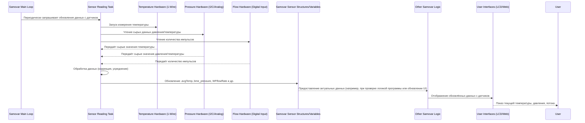

# Глава 4: Получение данных с датчиков

С возвращением! В предыдущих главах мы узнали, как вы взаимодействуете с Самоваром ([Глава 1: Взаимодействие с пользователем (Web & LCD)](01_user_interaction__web___lcd__.md)), как он выполняет пошаговые инструкции ([Глава 2: Исполнение программ процесса](02_process_program_execution_.md)) и как управляет своим общим состоянием и режимом ([Глава 3: Управление состоянием системы и режимами](03_system_state___mode_management_.md)).

Но как Самовар *узнаёт*, что происходит внутри труб, бака или колонны? Как он определяет, что вода уже достаточно горячая или что собран нужный объём жидкости?

Здесь на помощь приходит **Получение данных с датчиков**. Это способность Самовара собирать информацию о физическом мире с помощью своих датчиков. Представьте датчики как «глаза», «уши» и «осязание» Самовара, которые постоянно сообщают о состоянии процесса варки или дистилляции в реальном времени.

Без надёжных данных с датчиков Самовар работал бы вслепую. Он бы не знал, достигаются ли цели программы или возникла проблема, требующая внимания (например, перегрев).

## Почему датчики важны: пример использования

Представьте, что Самовар выполняет программу ректификации. Один из ключевых моментов — это достижение определённой температуры пара в верхней части колонны, что сигнализирует о начале сбора «голов» (первой, летучей фракции спирта).

Для этого Самовар должен:
1.  Иметь температурный датчик, установленный в паровом тракте.
2.  Постоянно считывать температуру с этого датчика.
3.  Сравнивать считанную температуру с целевой, заданной в шаге программы.
4.  Реагировать при достижении целевой температуры.

В этой главе мы сосредоточимся на шагах 1 и 2: как Самовар подключается к своим датчикам и получает с них данные.

## Органы чувств Самовара: типы датчиков

Самовар использует несколько видов датчиков для контроля разных аспектов процесса:

*   **Температурные датчики (DS18B20):** Это цифровые датчики, установленные в ключевых точках — выход пара, труба (колонна), вход/выход охлаждающей воды, бак (кег). Они передают данные о температуре в «мозг» Самовара.
*   **Датчики давления (BME280/BMP280/XGZP6897D/MPX5010D/1-Wire Pressure):** Измеряют давление внутри системы или атмосферное давление. Это важно для корректировки температуры (точка кипения меняется с давлением) и для обнаружения возможных проблем, например, засоров.
*   **Датчик потока воды:** Измеряет скорость потока охлаждающей воды через конденсор. Критичен для обеспечения достаточного охлаждения и конденсации пара в жидкость.
*   **Датчик уровня в головной части (поплавковый выключатель):** (Опционально) Обнаруживает, если жидкость поднимается в колонне — это может указывать на залив или проблемы с отбором.

Каждый тип датчика требует немного разных аппаратных подключений и программных методов для считывания данных.

## Как происходит получение данных с датчиков

Микроконтроллер Самовара (ESP32) — как занятый учёный, одновременно собирающий данные из нескольких экспериментов. Он использует разные методы для общения с датчиками:

*   **1-Wire:** Умная система, позволяющая нескольким температурным датчикам (DS18B20) работать на одном проводе данных. Самовар отправляет команды по этому проводу для запроса температуры, а каждый датчик отвечает индивидуально по своему адресу.
*   **I2C:** Ещё одна распространённая система, используемая для датчиков давления/температуры BME/BMP, а также для других устройств, например, дисплея (см. главу 1). Использует два провода (данные и тактирование), а устройства имеют адреса для индивидуального общения.
*   **Аналоговые или цифровые входы:** Датчик потока воды может подключаться к цифровому входу для подсчёта импульсов, а некоторые датчики давления (например, MPX5010D) или другие кастомные датчики могут отдавать аналоговое напряжение, пропорциональное измерению, которое ESP32 считывает через свой АЦП (ADC).

Чтение с датчиков происходит постоянно в фоновом режиме, пока Самовар работает. Специальные функции или задачи опрашивают датчики через определённые интервалы.

## Хранение и доступ к данным датчиков

Куда поступают считанные данные? Программное обеспечение Самовара хранит актуальные значения датчиков в переменных, к которым легко могут обращаться другие части программы.

Для температурных датчиков Dallas (DS18B20) используется структура `DSSensor`:

```c++
// Из Samovar.h (упрощённо)
struct DSSensor {
  DeviceAddress Sensor;    // Адрес конкретного датчика на шине 1-Wire
  float avgTemp;           // Последнее (усреднённое) значение температуры
  float SetTemp;           // Порог температуры (например, для тревог)
  uint16_t Delay;          // Таймаут, связанный с этим датчиком
  float PrevTemp;          // Предыдущее значение температуры (для отслеживания изменений)
  float Start_Pressure;    // Давление при запуске шага процесса (для коррекции температуры)
  int ErrCount;            // Счётчик ошибок связи с этим датчиком
  // ... другие поля ...
};

// Глобальные переменные для каждого температурного датчика
DSSensor SteamSensor;
DSSensor PipeSensor;
DSSensor WaterSensor;
DSSensor TankSensor;
DSSensor ACPSensor; // Температурно управляемый воздух (TCA)
```

В программе определяются отдельные переменные `DSSensor` для каждой физической точки измерения (Пар, Труба, Вода, Бак, ACP). Когда функция чтения датчиков срабатывает, она обновляет поле `.avgTemp` соответствующей переменной.

Данные других датчиков, например, давления с BME/BMP, могут храниться в более простых глобальных переменных:

```c++
// Из Samovar.h (упрощённо)
volatile float bme_temp;      // Температура с BME/BMP
volatile float bme_pressure;  // Давление с BME/BMP (в корректных единицах)
volatile float pressure_value; // Давление с других датчиков (XGZP/MPX/1-Wire)
```
Аналогично, данные с датчика потока воды хранятся в переменных, таких как `WFflowRate` и `WFtotalMilliLitres` (WF — вероятно, Water Flow).

Эти переменные объявлены как `volatile`, аналогично переменным состояния из главы 3. Это сообщает компилятору, что их значение может меняться в любой момент (т.к. обновляется отдельной задачей), и основной цикл всегда должен читать их актуальное значение.

## Процесс чтения данных с датчиков

Рассмотрим упрощённый алгоритм чтения и обновления данных с датчиков:



Диаграмма показывает, что специальная часть системы (часто отдельная задача в фоне, например, `triggerSysTicker` или `triggerGetClock` в коде) отвечает за общение с аппаратурой датчиков, получение сырых чисел, их обработку и запись итоговых значений в переменные системы. Остальные части — логика программы, веб-сервер — просто читают эти значения по мере необходимости.

## Разбор кода

Основная логика чтения температурных датчиков DS18B20 обычно реализована в функции типа `DS_getvalue()`, которая вызывается периодически системной задачей.

Вот упрощённый фрагмент `DS_getvalue()`:

```c++
// Из sensorinit.h (упрощённый DS_getvalue)
void DS_getvalue(void) {
  float raw_steam_temp, raw_pipe_temp, raw_water_temp, raw_tank_temp, raw_acp_temp;
  float correctT = 0; // Переменная для коррекции по атмосферному давлению

  // Рассчитать коррекцию температуры по атмосферному давлению (если используется и питание включено)
  if (bme_pressure > 0 && PowerOn) {
    correctT = (760 - bme_pressure) * 0.037;
  }

  // Запросить у всех датчиков на 1-Wire измерение температуры
  sensors.requestTemperatures();

  // *** Считать значения с каждого датчика и применить коррекцию ***
  // Примечание: getTempC вызывается ПОСЛЕ requestTemperatures, использует результаты измерений
  raw_steam_temp = sensors.getTempC(SteamSensor.Sensor);
  raw_pipe_temp = sensors.getTempC(PipeSensor.Sensor);
  raw_water_temp = sensors.getTempC(WaterSensor.Sensor);
  raw_tank_temp = sensors.getTempC(TankSensor.Sensor);
  raw_acp_temp = sensors.getTempC(ACPSensor.Sensor);

  // *** Обработка значений и обновление переменных датчиков ***
  // Значение ниже -10C часто означает ошибку (датчик не найден/отключён)
  if (raw_steam_temp > -10) {
    // Корректировка по давлению + пользовательская калибровка
    SteamSensor.avgTemp = raw_steam_temp + correctT + SamSetup.DeltaSteamTemp;
    SteamSensor.ErrCount = 0; // Сброс счётчика ошибок при успешном чтении
  } else {
    // При ошибочном чтении — увеличить счётчик ошибок (для тревог)
    SteamSensor.ErrCount++;
  }

  if (raw_pipe_temp > -10) {
    PipeSensor.avgTemp = raw_pipe_temp + correctT + SamSetup.DeltaPipeTemp;
    PipeSensor.ErrCount = 0;
  } else {
    PipeSensor.ErrCount++;
  }

  // Температура воды обычно НЕ корректируется по атмосферному давлению
  if (raw_water_temp > -10) {
    WaterSensor.avgTemp = raw_water_temp + SamSetup.DeltaWaterTemp;
    WaterSensor.ErrCount = 0;
  } else {
    WaterSensor.ErrCount++;
  }

  if (raw_tank_temp > -10) {
    TankSensor.avgTemp = raw_tank_temp + correctT + SamSetup.DeltaTankTemp;
    TankSensor.ErrCount = 0;
  } else {
    TankSensor.ErrCount++;
  }

  if (raw_acp_temp > -10) {
    ACPSensor.avgTemp = raw_acp_temp + correctT + SamSetup.DeltaACPTemp;
    ACPSensor.ErrCount = 0;
  } else {
    ACPSensor.ErrCount++;
  }
}
```

Этот упрощённый код показывает основные шаги:
1.  При необходимости рассчитывается коррекция температуры по давлению.
2.  Всем 1-Wire датчикам отдается команда измерить температуру (`sensors.requestTemperatures();`). Измерение занимает некоторое время.
3.  Затем значения считываются с каждого датчика по его адресу (`sensors.getTempC(SensorAddress)`).
4.  Для каждого успешного чтения применяется коррекция давления (`correctT`) и пользовательская калибровка (`SamSetup.DeltaSteamTemp`, `SamSetup.DeltaPipeTemp` и т.д.).
5.  Итоговая температура записывается в поле `.avgTemp` структуры `DSSensor`, делая её доступной всему ПО.
6.  Если датчик не ответил корректно (температура сильно отрицательная, например, -127C, здесь < -10), увеличивается счётчик ошибок. Если он превысит порог — будет сгенерирована тревога ([Глава 6: Мониторинг безопасности и тревоги](06_safety_monitoring___alarms_.md)).

Чтение давления и температуры с I2C-датчика, например, BME280, реализовано в аналогичной функции, например, `BME_getvalue()`:

```c++
// Из sensorinit.h (упрощённый BME_getvalue)
void BME_getvalue(bool fl) {
  if (!bmefound) { // Проверить, инициализирован ли датчик
    bme_temp = -1;
    bme_pressure = -1;
    return;
  }

  // Используем семафор для эксклюзивного доступа к I2C-шине (см. главу 1)
  if (xSemaphoreTake(xI2CSemaphore, (TickType_t)(50 / portTICK_RATE_MS)) == pdTRUE) {
    #ifdef USE_BME280 // Предполагаем BME280 для примера
      // Читаем температуру и давление с датчика
      bme_temp = bme.readTemperature();
      // Переводим давление из Па в мм рт. ст. (примерно 0.75 мм рт. ст. на 100 Па)
      bme_pressure = bme.readPressure() / 100 * 0.75;
    #endif

    xSemaphoreGive(xI2CSemaphore); // Освобождаем семафор I2C-шины
  } else {
    // Если семафор не удалось получить (например, шина занята)
    // Для простоты можем просто пропустить это чтение или зафиксировать ошибку
  }
}
```
Здесь показано, как данные читаются с I2C-устройства (неявно через библиотеку `Wire` с помощью `bme.readTemperature()` и `bme.readPressure()`) и сохраняются в глобальные переменные `bme_temp` и `bme_pressure`. Обратите внимание на использование семафора для управления доступом к I2C-оборудованию (см. главу 1).

Для датчика потока воды обычно используется обработчик прерывания (ISR), который считает импульсы:

```c++
// Из Samovar.ino (упрощённый ISR)
void IRAM_ATTR WFpulseCounter() {
  WFpulseCount++; // Увеличиваем счётчик при каждом обнаруженном импульсе
}

// В setup():
// attachInterrupt(WATERSENSOR_PIN, WFpulseCounter, FALLING); // Настройка пина и ISR
```
Отдельная функция в основном цикле периодически читает `WFpulseCount`, рассчитывает скорость потока (`WFflowRate`) и общий объём (`WFtotalMilliLitres`), и сбрасывает счётчик для следующего интервала.

Эти функции работают непрерывно, обеспечивая систему Самовара актуальной информацией о ходе процесса.

## Использование данных с датчиков

Где используются полученные данные? Везде!

*   **Отображение:** LCD и веб-интерфейсы ([Глава 1: Взаимодействие с пользователем (Web & LCD)](01_user_interaction__web___lcd__.md)) постоянно показывают значения `avgTemp`, `bme_pressure`, `WFflowRate` и др., чтобы вы могли наблюдать за процессом.
*   **Выполнение программы:** Логика определения завершения шага ([Глава 2: Исполнение программ процесса](02_process_program_execution_.md)) сильно зависит от данных датчиков. Например, проверка условия `SteamSensor.avgTemp >= target_temp` или `stepper.getCurrent() >= TargetStepps` (отслеживает объём по шагам шагового двигателя).
*   **Управление состоянием:** Общий статус (`get_Samovar_Status()` в главе 3) использует данные температуры и давления для индикации фаз типа «Разгон колонны» или «Стабилизация».
*   **Мониторинг безопасности:** Тревоги ([Глава 6: Мониторинг безопасности и тревоги](06_safety_monitoring___alarms_.md)) срабатывают при превышении безопасных лимитов (например, `WaterSensor.avgTemp >= MAX_WATER_TEMP`).
*   **Алгоритмы управления:** PID-регулятор нагревателя ([Глава 5: Аппаратное управление (исполнители)](05_hardware_control__actuators__.md)) использует значение температуры (например, `TankSensor.avgTemp`) как «вход» для расчёта мощности.
*   **Логирование:** Данные датчиков периодически сохраняются в файл ([Глава 7: Сохранение настроек и журналирование](07_configuration_persistence_.md)) для последующего анализа.

Постоянно обновляя значения датчиков, Самовар поддерживает актуальную картину процесса, что позволяет принимать обоснованные решения и оперативно реагировать на изменения.

## Заключение

В этой главе мы изучили, как Самовар получает информацию из физического мира посредством **получения данных с датчиков**. Мы рассмотрели различные типы используемых датчиков (температура, давление, поток, уровень) и методы их опроса (1-Wire, I2C, цифровые/аналоговые входы). Мы увидели, как полученные данные сохраняются в специальных структурах и переменных, делая их доступными для всех частей системы. Также были разобраны упрощённые примеры кода по считыванию, корректировке и обновлению температурных и давленческих показаний. Понимание принципов получения данных с датчиков фундаментально важно, ведь именно на этих данных строится выполнение программ, управление состоянием, системы безопасности и алгоритмы управления Самовара.

В следующей главе мы перейдём от сенсорики к **Аппаратному управлению (исполнители)**, чтобы узнать, как Самовар использует данные с датчиков и логику программы для выполнения действий — включения нагревателей, запуска насосов или открытия клапанов.

[Глава 5: Аппаратное управление (исполнители)](05_hardware_control__actuators__.md)
