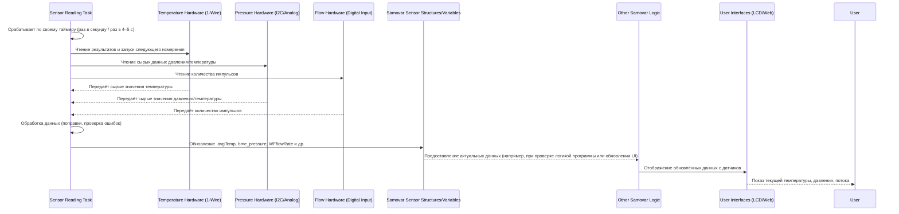

# Глава 4: Получение данных с датчиков

С возвращением! В предыдущих главах мы узнали, как вы взаимодействуете с Самоваром ([Глава 1: Взаимодействие с пользователем (Web & LCD)](01_user_interaction__web___lcd__.md)), как он выполняет пошаговые инструкции ([Глава 2: Исполнение программ процесса](02_process_program_execution_.md)) и как управляет своим общим состоянием и режимом ([Глава 3: Управление состоянием системы и режимами](03_system_state___mode_management_.md)).

Но как Самовар *узнаёт*, что происходит внутри труб, бака или колонны? Как он определяет, что вода уже достаточно горячая или что собран нужный объём жидкости?

Здесь на помощь приходит **Получение данных с датчиков**. Это способность Самовара собирать информацию о физическом мире с помощью своих датчиков. Представьте датчики как «глаза», «уши» и «осязание» Самовара, которые постоянно сообщают о состоянии процесса варки или дистилляции в реальном времени.

Без надёжных данных с датчиков Самовар работал бы вслепую. Он бы не знал, достигаются ли цели программы или возникла проблема, требующая внимания (например, перегрев).

## Почему датчики важны: пример использования

Представьте, что Самовар выполняет программу ректификации. Один из ключевых моментов — это достижение определённой температуры пара в верхней части колонны, что сигнализирует о начале сбора «голов» (первой, летучей фракции спирта).

Для этого Самовар должен:
1.  Иметь температурный датчик, установленный в паровом тракте.
2.  Постоянно считывать температуру с этого датчика.
3.  Сравнивать считанную температуру с целевой, заданной в шаге программы.
4.  Реагировать при достижении целевой температуры.

В этой главе мы сосредоточимся на шагах 1 и 2: как Самовар подключается к своим датчикам и получает с них данные.

## Органы чувств Самовара: типы датчиков

Самовар использует несколько видов датчиков для контроля разных аспектов процесса:

*   **Температурные датчики (DS18B20):** Это цифровые датчики, установленные в ключевых точках — пар вверху колонны, царга (примерно на 2/3 высоты), охлаждающая вода (или флегма), куб (бак, кег) и ТСА (трубка связи с атмосферой). Они передают данные о температуре в «мозг» Самовара.
*   **Датчики давления:** атмосферное давление измеряет датчик BMP180/BMP280/BME280/BME680 (выбирается при сборке прошивки, по умолчанию BME680), давление внутри системы — XGZP6897D, MPX5010D или датчик давления на шине 1-Wire. Это важно для корректировки температуры (точка кипения меняется с давлением) и для обнаружения проблем: захлёба колонны в режиме НБК и превышения предельного давления (тогда нагрев аварийно отключается).
*   **Датчик потока воды:** Измеряет скорость потока охлаждающей воды через конденсор. Критичен для обеспечения достаточного охлаждения и конденсации пара в жидкость.
*   **Датчик уровня флегмы в голове колонны (датчик P-N-P):** Включается в настройках («Использовать датчик уровня флегмы при ректификации»). Срабатывает, когда флегма поднимается до датчика, — это признак захлёба (залива) колонны; тогда Самовар снижает мощность нагрева.
*   **Датчик pH (для режима «Сыр»):** pH-зонд подключается к аналоговому входу ESP32 либо к внешнему АЦП ADS1115 по I2C (вход AIN0).

Каждый тип датчика требует немного разных аппаратных подключений и программных методов для считывания данных.

## Как происходит получение данных с датчиков

Микроконтроллер Самовара (ESP32) — как занятый учёный, одновременно собирающий данные из нескольких экспериментов. Он использует разные методы для общения с датчиками:

*   **1-Wire:** Умная система, позволяющая нескольким температурным датчикам (DS18B20) работать на одном проводе данных. Самовар отправляет команды по этому проводу для запроса температуры, а каждый датчик отвечает индивидуально по своему адресу. На этой же шине может стоять датчик давления 1-Wire: он читается так же, как температурный датчик, по своему адресу.
*   **I2C:** Ещё одна распространённая система, используемая для датчиков давления/температуры BME/BMP и XGZP6897D, АЦП ADS1115, а также для других устройств, например, дисплея (см. главу 1). Использует два провода (данные и тактирование), а устройства имеют адреса для индивидуального общения.
*   **Аналоговые или цифровые входы:** Датчик потока воды может подключаться к цифровому входу для подсчёта импульсов, а некоторые датчики давления (например, MPX5010D) или другие кастомные датчики могут отдавать аналоговое напряжение, пропорциональное измерению, которое ESP32 считывает через свой АЦП (ADC).

Чтение с датчиков происходит постоянно в фоновом режиме, пока Самовар работает. Две фоновые задачи (задача FreeRTOS — отдельный поток, который выполняется параллельно с остальной программой) опрашивают датчики через определённые интервалы: `triggerSysTicker` раз в секунду читает датчики DS18B20 и датчик потока, `triggerGetClock` примерно раз в 4–5 секунд читает датчик атмосферного давления BME/BMP и датчик давления XGZP6897D/MPX5010D.

## Хранение и доступ к данным датчиков

Куда поступают считанные данные? Программное обеспечение Самовара хранит актуальные значения датчиков в переменных, к которым легко могут обращаться другие части программы.

Для температурных датчиков Dallas (DS18B20) используется структура `DSSensor`:

```c++
// Из Samovar.h (упрощённо)
struct DSSensor {
  DeviceAddress Sensor;    // Адрес конкретного датчика на шине 1-Wire
  volatile float avgTemp;  // Последнее значение температуры (с поправками)
  float SetTemp;           // Уставка температуры, при достижении которой нужна реакция
  float BodyTemp;          // Температура, с которой начался отбор тела
  uint16_t Delay;          // Задержка включения насоса (с) при выходе температуры за уставку
  float PrevTemp;          // Предыдущее значение температуры (для отслеживания изменений)
  float Start_Pressure;    // Давление в начале отбора
  volatile int ErrCount;   // Счётчик неудачных чтений с этого датчика
  // ... другие поля ...
};

// Глобальные переменные для каждого температурного датчика
DSSensor SteamSensor;
DSSensor PipeSensor;
DSSensor WaterSensor;
DSSensor TankSensor;
DSSensor ACPSensor; // ТСА (трубка связи с атмосферой)
```

В программе определяются отдельные переменные `DSSensor` для каждой физической точки измерения (пар, царга, вода, куб, ТСА). Когда функция чтения датчиков срабатывает, она обновляет поле `.avgTemp` соответствующей переменной.

Данные других датчиков, например, давления с BME/BMP, могут храниться в более простых глобальных переменных:

```c++
// Из Samovar.h (упрощённо)
volatile float bme_temp;      // Температура с BME/BMP
volatile float bme_pressure;  // Давление с BME/BMP (в корректных единицах)
float pressure_value;         // Давление внутри системы с датчика XGZP/MPX/1-Wire (мм рт. ст.)
```
Аналогично, данные с датчика потока воды хранятся в переменных, таких как `WFflowRate` и `WFtotalMilliLitres` (WF — Water Flow, расход воды).

Большинство этих переменных (`avgTemp`, `ErrCount`, `bme_temp`, `bme_pressure`, `WFflowRate`, `WFtotalMilliLitres`) объявлены как `volatile`, аналогично переменным состояния из главы 3. Это сообщает компилятору, что их значение может меняться в любой момент (т.к. обновляется отдельной задачей), и остальные части программы всегда должны читать их актуальное значение.

## Процесс чтения данных с датчиков

Рассмотрим упрощённый алгоритм чтения и обновления данных с датчиков:


```mermaid
sequenceDiagram
    Sensor Reading Task->>Sensor Reading Task: Срабатывает по своему таймеру (раз в секунду / раз в 4–5 с)
    Sensor Reading Task->>Temperature Hardware (1-Wire): Чтение результатов и запуск следующего измерения
    Sensor Reading Task->>Pressure Hardware (I2C/Analog): Чтение сырых данных давления/температуры
    Sensor Reading Task->>Flow Hardware (Digital Input): Чтение количества импульсов

    Temperature Hardware (1-Wire)-->>Sensor Reading Task: Передаёт сырые значения температуры
    Pressure Hardware (I2C/Analog)-->>Sensor Reading Task: Передаёт сырые значения давления/температуры
    Flow Hardware (Digital Input)-->>Sensor Reading Task: Передаёт количество импульсов

    Sensor Reading Task->>Sensor Reading Task: Обработка данных (поправки, проверка ошибок)
    Sensor Reading Task->>Samovar Sensor Structures/Variables: Обновление .avgTemp, bme_pressure, WFflowRate и др.

    Samovar Sensor Structures/Variables-->>Other Samovar Logic: Предоставление актуальных данных (например, при проверке логикой программы или обновлении UI)

    Other Samovar Logic->>User Interfaces (LCD/Web): Отображение обновлённых данных с датчиков
    User Interfaces (LCD/Web)-->>User: Показ текущей температуры, давления, потока
```

Диаграмма показывает, что специальная часть системы (фоновые задачи `triggerSysTicker` и `triggerGetClock` в `Samovar.ino`) отвечает за общение с аппаратурой датчиков, получение сырых чисел, их обработку и запись итоговых значений в переменные системы. Остальные части — логика программы, веб-сервер — просто читают эти значения по мере необходимости.

## Разбор кода

Основная логика чтения температурных датчиков DS18B20 реализована в функции `DS_getvalue()` (`sensorinit.h`), которую задача `triggerSysTicker` вызывает раз в секунду.

Вот упрощённый фрагмент `DS_getvalue()`:

```c++
// Из sensorinit.h (упрощённый DS_getvalue)
void DS_getvalue(void) {
  float correctT = 0; // Поправка на атмосферное давление

  // Поправка считается, только если в настройках включено
  // «Использовать корректировку давления» и нагрев включён
  if (SamSetup.UsePreccureCorrect && bme_pressure > 0 && PowerOn) {
    correctT = (760 - bme_pressure) * 0.037;
  }

  // *** Забираем результаты измерения, запущенного в прошлом цикле ***
  float ssRaw = sensors.getTempC(SteamSensor.Sensor);
  float psRaw = sensors.getTempC(PipeSensor.Sensor);
  float wsRaw = sensors.getTempC(WaterSensor.Sensor);
  float tsRaw = sensors.getTempC(TankSensor.Sensor);
  float acpRaw = sensors.getTempC(ACPSensor.Sensor);

  // Поправка на давление - только для пара, царги и куба;
  // вода и ТСА её не получают
  float ss = correctT + ssRaw;
  float ps = correctT + psRaw;
  float ws = wsRaw;
  float ts = correctT + tsRaw;
  float acp = acpRaw;

  // (здесь же при USE_PRESSURE_1WIRE читается датчик давления 1-Wire в pressure_value)

  // Запускаем новое измерение у всех датчиков на шине 1-Wire;
  // его результаты будут прочитаны в следующем цикле, через секунду
  sensors.requestTemperatures();

  // *** Обработка значений (в коде - один цикл по пяти датчикам) ***
  // Значение ниже -10C означает ошибку (датчик не найден/отключён, -127C)
  if (ss > -10) {
    // Пользовательская калибровка (дельта) - своя у каждого датчика
    float corrected = ss + SamSetup.DeltaSteamTemp;
    // 85.0C сразу после сбоя питания датчика - заводское значение DS18B20;
    // резкий скачок к нему (>10C) не принимается, а считается ошибкой
    if (ssRaw == 85.0 && SteamSensor.avgTemp >= 2 && fabs(corrected - SteamSensor.avgTemp) > 10) {
      SteamSensor.ErrCount++;
    } else {
      SteamSensor.avgTemp = corrected;
      SteamSensor.PrevTemp = SteamSensor.avgTemp;
      SteamSensor.ErrCount = 0; // Сброс счётчика ошибок при успешном чтении
    }
  } else {
    // При ошибочном чтении — увеличить счётчик ошибок (для тревог)
    SteamSensor.ErrCount++;
  }
  // ... так же для PipeSensor (DeltaPipeTemp), WaterSensor (DeltaWaterTemp),
  //     TankSensor (DeltaTankTemp) и ACPSensor (DeltaACPTemp) ...
}
```

Этот упрощённый код показывает основные шаги:
1.  Если в настройках включена корректировка давления, рассчитывается поправка температуры по атмосферному давлению.
2.  Значения считываются с каждого датчика по его адресу (`sensors.getTempC(SensorAddress)`). Это результаты измерения, запущенного в предыдущем цикле.
3.  Всем 1-Wire датчикам отдаётся команда начать новое измерение (`sensors.requestTemperatures();`). Измерение занимает некоторое время, поэтому его результаты забираются через секунду, при следующем вызове.
4.  Для каждого успешного чтения применяется поправка на давление (`correctT`, только для пара, царги и куба) и пользовательская калибровка (`SamSetup.DeltaSteamTemp`, `SamSetup.DeltaPipeTemp` и т.д.).
5.  Итоговая температура записывается в поле `.avgTemp` структуры `DSSensor`, делая её доступной всему ПО.
6.  Если датчик не ответил корректно (температура сильно отрицательная, например, -127C, здесь < -10) или прислал скачком заводские 85C, увеличивается счётчик ошибок. Если он превысит порог — будет сгенерирована тревога ([Глава 6: Мониторинг безопасности и тревоги](06_safety_monitoring___alarms_.md)).

Чтение давления и температуры с I2C-датчика BME/BMP реализовано в функции `BME_getvalue()` (её вызывает задача `triggerGetClock`):

```c++
// Из sensorinit.h (упрощённый BME_getvalue)
void BME_getvalue(bool fl) {
  if (!bmefound) { // Проверить, инициализирован ли датчик
    bme_temp = -1;
    bme_pressure = -1;
    return;
  }

  // Используем семафор для эксклюзивного доступа к I2C-шине (см. главу 1)
  if (xSemaphoreTake(xI2CSemaphore, (TickType_t)(50 / portTICK_RATE_MS)) == pdTRUE) {
    #ifdef USE_BME280 // Для примера - ветка BME280; для BMP180/BMP280/BME680 есть свои
      // Читаем температуру и давление с датчика
      bme_temp = bme.readTemperature();
      // Переводим давление из Па в мм рт. ст. (примерно 0.75 мм рт. ст. на 100 Па)
      bme_pressure = bme.readPressure() / 100 * 0.75;
    #endif

    xSemaphoreGive(xI2CSemaphore); // Освобождаем семафор I2C-шины
  }
  // Если семафор не удалось получить (шина занята), чтение пропускается
  // до следующего цикла, а в переменных остаются прежние значения
}
```
Здесь показано, как данные читаются с I2C-устройства (неявно через библиотеку `Wire` с помощью `bme.readTemperature()` и `bme.readPressure()`) и сохраняются в глобальные переменные `bme_temp` и `bme_pressure`. Обратите внимание на использование семафора для управления доступом к I2C-оборудованию (см. главу 1). Показания BMP180 дополнительно сглаживаются фильтром (`bmp180_pressure_filter.h`), который отбрасывает одиночные выбросы давления. Датчики давления XGZP6897D и MPX5010D читает функция `pressure_sensor_get()` (там же, в `sensorinit.h`): она пишет результат в `pressure_value` в мм рт. ст. и усредняет его с прошлым значением.

Для датчика потока воды используется обработчик прерывания (ISR — функция, которую процессор вызывает сразу при появлении сигнала на входе), который считает импульсы:

```c++
// Из Samovar.ino (упрощённый ISR)
void IRAM_ATTR WFpulseCounter() {
  portENTER_CRITICAL_ISR(&waterPulseMux);
  WFpulseCount++; // Увеличиваем счётчик при каждом обнаруженном импульсе
  portEXIT_CRITICAL_ISR(&waterPulseMux);
}

// При запуске (setup_attach_water_flow_interrupt(), если включён USE_WATERSENSOR):
attachInterrupt(WATERSENSOR_PIN, WFpulseCounter, FALLING); // Настройка пина и ISR
```
Раз в секунду задача `triggerSysTicker` забирает накопленное число импульсов и обнуляет счётчик (`water_pulse_count_take()`), а функция `tick_update_water_flow()` рассчитывает скорость потока (`WFflowRate`, л/мин, с коэффициентом датчика `WF_CALIBRATION`) и общий объём (`WFtotalMilliLitres`). Если импульсов за секунду меньше `WATER_FLOW_MIN_PULSES`, поток считается нулевым.

Эти функции работают непрерывно, обеспечивая систему Самовара актуальной информацией о ходе процесса.

## Использование данных с датчиков

Где используются полученные данные? Везде!

*   **Отображение:** LCD и веб-интерфейсы ([Глава 1: Взаимодействие с пользователем (Web & LCD)](01_user_interaction__web___lcd__.md)) постоянно показывают значения `avgTemp`, `bme_pressure`, `WFflowRate` и др., чтобы вы могли наблюдать за процессом.
*   **Выполнение программы:** Логика определения завершения шага ([Глава 2: Исполнение программ процесса](02_process_program_execution_.md)) сильно зависит от данных датчиков. Например, сравнение `SteamSensor.avgTemp` с целевой температурой или числа сделанных шагов насоса отбора (`CurrrentStepps`) с `TargetStepps` (так отслеживается отобранный объём).
*   **Управление состоянием:** Строку общего статуса раз в секунду обновляет `tick_status_fsm()` (`logic.h`, см. главу 3); она опирается на показания датчиков для индикации фаз типа «Разгон колонны» или «Стабилизация».
*   **Мониторинг безопасности:** Тревоги ([Глава 6: Мониторинг безопасности и тревоги](06_safety_monitoring___alarms_.md)) срабатывают при превышении безопасных лимитов (например, `WaterSensor.avgTemp >= MAX_WATER_TEMP`).
*   **Алгоритмы управления:** PID-регулятор нагревателя ([Глава 5: Аппаратное управление (исполнители)](05_hardware_control__actuators__.md)) использует значение температуры выбранного в программе датчика (например, `TankSensor.avgTemp`) как «вход» для расчёта мощности.
*   **Логирование:** Данные датчиков во время процесса каждые 4 секунды отправляются строкой лога на сервер и каждые 16 секунд сохраняются в файл ([Глава 7: Сохранение настроек и журналирование](07_configuration_persistence_.md)) для последующего анализа.

Постоянно обновляя значения датчиков, Самовар поддерживает актуальную картину процесса, что позволяет принимать обоснованные решения и оперативно реагировать на изменения.

## Заключение

В этой главе мы изучили, как Самовар получает информацию из физического мира посредством **получения данных с датчиков**. Мы рассмотрели различные типы используемых датчиков (температура, давление, поток, уровень, pH) и методы их опроса (1-Wire, I2C, цифровые/аналоговые входы). Мы увидели, как полученные данные сохраняются в специальных структурах и переменных, делая их доступными для всех частей системы. Также были разобраны упрощённые примеры кода по считыванию, корректировке и обновлению температурных и давленческих показаний. Понимание принципов получения данных с датчиков фундаментально важно, ведь именно на этих данных строится выполнение программ, управление состоянием, системы безопасности и алгоритмы управления Самовара.

В следующей главе мы перейдём от сенсорики к **Аппаратному управлению (исполнители)**, чтобы узнать, как Самовар использует данные с датчиков и логику программы для выполнения действий — включения нагревателей, запуска насосов или открытия клапанов.

[Глава 5: Аппаратное управление (исполнители)](05_hardware_control__actuators__.md)
