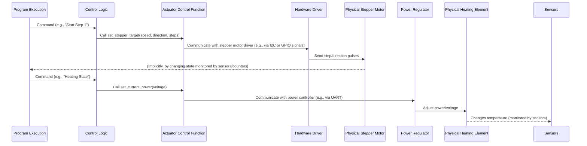

# Глава 5: Аппаратное управление (Исполнительные механизмы)

Добро пожаловать обратно в руководство по Самовару! В предыдущей главе, [Глава 4: Получение данных с датчиков](04_sensor_data_acquisition_.md), мы рассмотрели, как Самовар использует свои датчики, чтобы "видеть" и собирать данные из физического мира – такие параметры, как температура, давление и скорость потока. Эти данные в реальном времени предоставляют Самовару важную информацию о том, что происходит в процессе приготовления или дистилляции.

Но просто *знать* температуру или объем недостаточно. Самовар – это не только устройство для мониторинга; это система управления. Ему необходимо *действовать*, физически взаимодействовать с оборудованием для дистилляции или варки. Ему нужны "руки" и "голос", чтобы что-то включать или выключать, регулировать мощность, перемещать жидкости или издавать звуки.

Именно здесь вступает в игру **Аппаратное управление (Исполнительные механизмы)**. Исполнительные механизмы — это компоненты, которые позволяют Самовару физически управлять установкой. Это активные части системы, которые принимают решения, выработанные управляющей логикой (на основе шагов программы, состояния системы и данных с датчиков), и преобразуют их в физические действия.

## Почему исполнительные механизмы важны: пример использования

Давайте вернемся к нашему примеру ректификации. Представим, что Самовар с помощью температурного датчика (как обсуждалось в Главе 4) обнаружил, что температура пара на верху колонны достигла целевого значения для сбора "Тела" (основной части дистиллята).

Просто знать эту температуру бесполезно, если Самовар не может *действовать* на основании этой информации. Ему необходимо:

1.  Открыть клапан или включить насос для начала сбора жидкого продукта.
2.  При необходимости отрегулировать мощность, подаваемую на нагревательный элемент, чтобы поддерживать стабильные условия.
3.  Направить собранную жидкость в нужную емкость с помощью распределительного механизма.
4.  Возможно, даже включить зуммер, чтобы оповестить вас о переходе к следующему шагу программы.

Все эти действия выполняются **исполнительными механизмами**.

## Руки и голос Самовара: типы исполнительных механизмов

Аппаратная часть Самовара включает различные исполнительные механизмы для выполнения разных задач:

*   **Нагревательный элемент (управляется регулятором мощности/напряжения или реле):** Это основной источник нагрева для емкости. Его можно просто включать/выключать с помощью реле или, в более продвинутых установках, точно регулировать мощность или напряжение для поддержания температуры или контроля скорости пара.
*   **Клапан/насос охлаждающей воды (управляется реле или ШИМ):** Управляет подачей охлаждающей воды в конденсатор. Это может быть простой клапан (вкл./выкл. через реле) или насос, скорость которого регулируется с помощью ШИМ (широтно-импульсной модуляции) на основе обратной связи с температурного датчика.
*   **Перистальтический насос/шаговый двигатель (управляется драйвером шагового двигателя):** Используется для точного контроля скорости потока и общего объема собранной жидкости во время дистилляции. Шаговый двигатель обеспечивает точные, повторяемые движения — идеально для дозирования определенных объемов.
*   **Мотор/насос мешалки (управляется реле или I2C):** В режимах варки (например, затирание) перемешивает содержимое емкости или рециркулирует жидкость. Обычно это простая функция вкл./выкл. через реле, либо управление через устройство на шине I2C.
*   **Механизм распределения жидкости (управляется сервоприводом или реле):** Направляет собранную жидкость (головы, тело, хвосты) в разные приемные емкости. Это может быть сервопривод, позиционирующий носик, или набор клапанов/реле для выбора пути.
*   **Зуммер (управляется цифровым выходом):** Простой звуковой сигнализатор для оповещения пользователя о важных событиях (смена шага программы, ошибки и др.).

Каждый из этих исполнительных механизмов подключен к микроконтроллеру Самовара (ESP32) через специальные управляющие пины или коммуникационные шины (например, I2C или UART для регуляторов мощности). Программное обеспечение отправляет команды на эти интерфейсы, чтобы исполнительные механизмы выполняли свои функции.

## Как работает управление исполнительными механизмами

Управление исполнительным механизмом заключается в указании ему, *что* делать (например, включить, задать скорость, переместить в позицию) и зачастую *насколько* или *как быстро*. Этот процесс принятия решений определяется основной логикой Самовара, объединяющей информацию из шагов программы ([Глава 2](02_process_program_execution_.md)), текущего состояния системы ([Глава 3](03_system_state___mode_management_.md)) и данных датчиков в реальном времени ([Глава 4](04_sensor_data_acquisition_.md)).

Например:
*   **Шаг программы:** Шаг может требовать "Собрать 500 мл голов со скоростью 0,2 л/ч". Логика выполнения программы считывает это, дает команду контроллеру шагового двигателя двигаться медленно рассчитанное количество шагов для 500 мл и устанавливает исполнительный механизм выбора емкости в позицию 1.
*   **Состояние системы:** Если состояние системы меняется на "Нагрев", логика управления включает основной нагревательный элемент. Если состояние переходит в "Авария", нагрев выключается и включается зуммер.
*   **Данные датчиков:** Если датчик температуры охлаждающей воды сообщает, что вода стала слишком горячей, исполнительному механизму клапана/насоса может быть дана команда открыть сильнее или увеличить скорость.

Программное обеспечение Самовара предоставляет набор функций, которые абстрагируют низкоуровневые детали общения с конкретным исполнительным механизмом. Эти функции — "командный интерфейс" для исполнительных механизмов.

## Использование управления исполнительными механизмами: пример шагового двигателя и нагревателя

Рассмотрим управление двумя наиболее важными исполнительными механизмами во время обычной программы дистилляции: основным нагревателем и насосом сбора жидкости (шаговым двигателем).

В соответствии с шагами программы, определенными в [Глава 2](02_process_program_execution_.md), Самовар должен:

1.  Включить основной нагреватель (обычно сначала на полную мощность для разогрева).
2.  Когда условия станут подходящими (например, начнется кипение, стабилизируется колонна, определяется датчиками и логикой состояния), при необходимости уменьшить мощность нагревателя для стабильной работы.
3.  Включить шаговый двигатель/насос на определенной скорости и в нужном направлении.
4.  Отслеживать объем собранной жидкости по количеству шагов шагового двигателя.
5.  Остановить шаговый двигатель при достижении целевого объема для текущего шага программы.

Эти действия инициируются логикой выполнения программы, вызывающей специальные функции для управления этими исполнительными механизмами.

## Внутренняя реализация: поток управления

Когда Самовар решает выполнить действие с исполнительным механизмом, команда проходит через систему следующим образом:



В этом упрощенном потоке:
1.  Логика **Выполнения программы** (или общая логика Самовара в зависимости от режима/состояния) определяет, что требуется действие исполнительного механизма.
2.  Она вызывает функцию в слое **Логики управления** (например, `run_program` или `check_alarm_beer`).
3.  Эта функция логики управления вызывает конкретную **Функцию управления исполнительным механизмом** (например, `set_stepper_target` или `set_current_power`).
4.  Функция управления исполнительным механизмом содержит код, который напрямую взаимодействует с **Драйвером оборудования** (это может быть библиотека или собственный код для I2C, Serial или GPIO).
5.  Драйвер оборудования отправляет необходимые сигналы или команды на **Физический исполнительный механизм**, заставляя его выполнять нужное действие.

Такой многоуровневый подход делает основную логику программы чистой; ей не нужно знать низкоуровневые детали *как* обращаться к каждому устройству, достаточно знать *какую* функцию вызвать.

## Погружение в код

Рассмотрим упрощенные фрагменты кода, показывающие, как Самовар управляет своими исполнительными механизмами.

### Управление шаговым двигателем (перистальтический насос)

Шаговый двигатель играет ключевую роль для точного сбора жидкости. Самовар использует функцию вроде `set_stepper_target` для управления им. Эта функция может напрямую управлять драйвером шагового двигателя через GPIO или, как показано в файле `I2CStepper.h`, общаться с отдельным микроконтроллером (например, Arduino Nano), который управляет двигателем по I2C.

```c++
// Упрощённый фрагмент из I2CStepper.h (или logic.h, если не используется I2C stepper)
bool set_stepper_target(uint16_t spd, uint8_t direction, uint32_t target) {
  // ... (проверка: используется ли I2C-устройство или прямое управление GPIO) ...

  if (!use_I2C_dev) {
    // Прямое управление через GPIO с помощью библиотеки GyverStepper2
    stepper.setMaxSpeed(spd);
    //stepper.setSpeed(spd); // Примечание: setSpeed устарела в новых версиях GyverStepper2
    stepper.setCurrent(0); // Начать отсчёт шагов с 0 для этой задачи
    stepper.setTarget(target); // Задать количество шагов

    // Запустить сервис, генерирующий импульсы шагов (обычно через таймер)
    startService(); // Функция для включения таймера/сервиса движения
    return true;
  } else {
    // Управление по I2C на отдельную плату драйвера шагового двигателя
    if (xSemaphoreTake(xI2CSemaphore, (TickType_t)(1000 / portTICK_RATE_MS)) == pdTRUE) {
      // Отправка команды и параметров (скорость, направление, цель) по I2C
      I2C2.writeByte(use_I2C_dev, 0, spd >> 8); // Старший байт скорости
      I2C2.writeByte(use_I2C_dev, 1, spd);     // Младший байт скорости
      I2C2.writeByte(use_I2C_dev, 2, direction); // Направление (0 или 1)
      I2C2.writeByte(use_I2C_dev, 3, target >> 24); // Целевые шаги (4 байта)
      I2C2.writeByte(use_I2C_dev, 4, target >> 16);
      I2C2.writeByte(use_I2C_dev, 5, target >> 8);
      I2C2.writeByte(use_I2C_dev, 6, target);
      // Отправить командный байт для обработки команды I2C-устройством
      I2C2.writeByte(use_I2C_dev, 8, 1); // Пример: старт двигателя
      I2C2.writeByte(use_I2C_dev, 8, 0); // Пример: сброс/готов

      xSemaphoreGive(xI2CSemaphore); // Освободить шину I2C
      return true;
    } else {
      // Обработка ошибки связи по I2C
      return false;
    }
  }
}
```

Эта функция получает желаемую скорость (`spd`), направление и общее количество шагов (`target`) для текущего шага программы. Далее используется либо библиотека `GyverStepper2` для прямого управления, либо отправляются параметры по I2C на внешний драйвер шагового двигателя. Функция `startService()` (или команда I2C) инициирует фактическое движение мотора. Система отслеживает `stepper.getCurrent()` (при использовании `GyverStepper2`) или читает текущий счетчик шагов по I2C для контроля прогресса по достижению `target`.

### Управление основным нагревателем (мощность/напряжение)

Управление мощностью нагревательного элемента часто сложнее, чем просто вкл./выкл. Самовар использует регулятор мощности/напряжения, вероятно, управляемый через последовательное соединение (UART). Для этого используются такие функции, как `set_current_power` и `set_power_mode`.

```c++
// Упрощенный фрагмент из logic.h/mod_rmvk.h (предполагается управление по Serial)
void set_current_power(float Volt) {
  if (!PowerOn) return; // Управлять мощностью только если система включена

  target_power_volt = Volt; // Сохраняем целевое напряжение

  // Отправляем команду по Serial на плату регулятора мощности
  // Формат команды зависит от модели регулятора (например, KVIC, RMVK)
#ifdef SAMOVAR_USE_RMVK // Если используется регулятор RMVK через Serial
  // Команда вида "AT+VS=Volt\r"
  if (xSemaphoreTake(xSemaphoreAVR, (TickType_t)((RMVK_DEFAULT_READ_TIMEOUT * 3) / portTICK_RATE_MS)) == pdTRUE) {
    String Cmd = "";
    int V = Volt; // RMVK обычно ждёт целое напряжение
    if (V < 100) Cmd = "0"; // Добавить лидирующий ноль при необходимости
    Cmd += String(V);
    Serial2.print("AT+VS=" + Cmd + "\r"); // Отправить команду через Serial2
    vTaskDelay(RMVK_READ_DELAY / portTICK_PERIOD_MS); // Подождать выполнения
    xSemaphoreGive(xSemaphoreAVR); // Освободить семафор Serial2
  }
#else // Если другой регулятор через Serial
  // Команда вида "S[hex_voltage]\r"
  String hexString = String((int)(Volt * 10), HEX); // Преобразовать напряжение*10 в hex-строку
  Serial2.print("S" + hexString + "\r"); // Отправка команды через Serial2
  vTaskDelay(300 / portTICK_PERIOD_MS); // Подождать выполнения
#endif
}

void set_power_mode(String Mode) {
  // Перевести регулятор в разные режимы (например, ожидание, регуляция)
  // Конкретные строки и команды зависят от регулятора
  Serial2.print("M" + Mode + "\r"); // Отправить команду режима через Serial2
  vTaskDelay(300 / portTICK_PERIOD_MS); // Подождать выполнения
}

void set_power(bool On) {
  if (alarm_event && On) {
    return; // Не включать питание при активной аварии
  }
  PowerOn = On; // Обновить внутренний флаг состояния питания
  if (On) {
    digitalWrite(RELE_CHANNEL1, SamSetup.rele1); // Включить главное реле системы
    // ... возможно, другие действия, например, установка начального режима регулятора ...
    set_power_mode(POWER_SPEED_MODE); // Установить режим быстрого разогрева
  } else {
    // ... возможно, отключение вспомогательных реле ...
    set_power_mode(POWER_SLEEP_MODE); // Перевести регулятор в режим ожидания/выключения
    digitalWrite(RELE_CHANNEL1, !SamSetup.rele1); // Отключить главное реле системы
    sam_command_sync = SAMOVAR_RESET; // Сигнал сброса/очистки системы (Глава 3)
  }
}
```

Эти функции показывают, как команды высокого уровня, такие как установка целевого напряжения (`set_current_power`) или смена режима работы (`set_power_mode`), преобразуются в конкретные команды через Serial для внешнего регулятора мощности. Функция `set_power(bool On)` обеспечивает главное вкл./выкл. всего нагревательного контура, включая мастер-реле (`RELE_CHANNEL1`). Обратите внимание на использование семафоров для управления доступом к общему интерфейсу Serial.

### Управление другими исполнительными механизмами (реле, ШИМ, сервопривод, зуммер)

Остальные исполнительные механизмы управляются аналогично — через вызовы специализированных функций, управляющих соответствующими пинами или интерфейсами.

*   **Реле (клапан воды, мешалка, вспомогательные нагреватели):** Простая запись на цифровой пин.

    ```c++
    // Упрощённый фрагмент из logic.h/beer.h
    void open_valve(bool Val, bool msg = true) {
      valve_status = Val; // Обновить флаг состояния
      if (Val) {
        digitalWrite(RELE_CHANNEL3, SamSetup.rele3); // Включить реле клапана
        // ... отправить сообщение пользователю, если msg == true ...
      } else {
        digitalWrite(RELE_CHANNEL3, !SamSetup.rele3); // Выключить реле клапана
        // ... отправить сообщение пользователю, если msg == true ...
      }
    }

    void setHeaterPosition(bool state) {
      heater_state = state; // Обновить внутренний статус
      if (state) {
        // Функция может управлять разным оборудованием в зависимости от SAMOVAR_USE_POWER
    #ifndef SAMOVAR_USE_POWER
        // Если нет регулятора мощности — просто включить главное реле нагревателя
        digitalWrite(RELE_CHANNEL1, SamSetup.rele1);
        // Или включить специфические вспомогательные нагреватели
        digitalWrite(RELE_CHANNEL4, !SamSetup.rele4); // Пример: реле вспомогательного нагревателя
    #endif
      } else {
    #ifndef SAMOVAR_USE_POWER
        digitalWrite(RELE_CHANNEL1, !SamSetup.rele1);
        digitalWrite(RELE_CHANNEL4, !SamSetup.rele4); // Пример: реле вспомогательного нагревателя
    #endif
      }
    }
    ```
*   **ШИМ (скорость насоса воды):** Использование пина с поддержкой ШИМ и установка скважности.

    ```c++
    // Упрощённый фрагмент из pumppwm.h
    void set_pump_pwm(float duty) {
      // ... проверки безопасности (например, если alarm_event == true) ...
      duty = constrain(duty, 0, 1023); // Ограничить диапазон скважности
      pump_pwm.write(duty); // Установить скважность на соответствующий пин
      water_pump_speed = duty; // Сохранить текущее значение скорости
      // ... логика старта насоса (например, стартовый буст) ...
    }
    ```
    Эта функция принимает заданное значение ШИМ (`duty`) и подает его на насос с помощью библиотеки `ESP32PWM`, регулируя его скорость.
*   **Сервопривод (распределение жидкости):** Запись значения позиции в объект сервопривода.

    ```c++
    // Упрощённый фрагмент из logic.h
    void set_capacity(uint8_t cap) {
      capacity_num = cap; // Сохранить номер текущей емкости
    #ifdef SERVO_PIN // Если используется сервомотор
      // Рассчитать целевую позицию на основе номера емкости и калибровки
      int p = ((int)cap * SERVO_ANGLE) / (int)CAPACITY_NUM + servoDelta[cap];
      servo.write(p); // Переместить сервомотор в позицию 'p'
    #elif USER_SERVO // Если используется пользовательская функция серво
      user_set_capacity(cap); // Вызвать пользовательскую функцию
    #endif
    }
    ```
    Эта функция принимает желаемый номер приемной емкости (`cap`) и перемещает подключенный сервомотор в соответствующую физическую позицию.
*   **Зуммер:** Переключение цифрового выхода, часто управляется отдельной задачей для генерации звуковых паттернов.

    ```c++
    // Упрощённый фрагмент из logic.h (вызывается из основного кода)
    void set_buzzer(bool fl) {
      if (fl && SamSetup.UseBuzzer) { // Включаем только если запрос и разрешено в настройках
        // Сигнализировать задаче зуммера начать пищать
        BuzzerTaskFl = true;
        // ... убедиться, что задача зуммера запущена (создать при необходимости) ...
      } else {
        // Сигнализировать задаче зуммера остановиться или остановить ее напрямую
        // ... логика остановки задачи зуммера при ненадобности ...
        digitalWrite(BZZ_PIN, LOW); // Убедиться, что пин LOW при выключении
      }
    }

    // Упрощённый фрагмент из triggerBuzzerTask (работает в отдельной задаче)
    void triggerBuzzerTask(void *parameter) {
      while (true) {
        if (BuzzerTaskFl) {
          digitalWrite(BZZ_PIN, HIGH); // Включить зуммер
          vTaskDelay(beep_duration / portTICK_PERIOD_MS); // Ждать
          digitalWrite(BZZ_PIN, LOW); // Выключить зуммер
          vTaskDelay(silent_duration / portTICK_PERIOD_MS); // Ждать
          // ... логика подсчета сигналов и сброса BuzzerTaskFl ...
        } else {
          vTaskDelay(sleep_duration / portTICK_PERIOD_MS); // Спать, если не пищит
        }
      }
    }
    ```
    Функция `set_buzzer` подает сигнал задаче `triggerBuzzerTask` (фоновая задача FreeRTOS) начать подачу звукового сигнала, обеспечивая звуковую обратную связь пользователю.

Эти примеры показывают, что независимо от конкретного оборудования, схема одна: основная логика вызывает функцию с параметрами высокого уровня, а эта функция реализует низкоуровневое взаимодействие (digitalWrite, ШИМ, serial-команды, I2C-сообщения), необходимое для выполнения действия исполнительным механизмом.

## Заключение

В этой главе мы познакомились с **Аппаратным управлением (Исполнительными механизмами)** — способностью Самовара физически взаимодействовать с оборудованием для варки и дистилляции. Мы рассмотрели разнообразные исполнительные механизмы, которые он использует — от нагревателей и насосов до клапанов и зуммеров — и поняли, что это "руки" и "голос" системы. Мы увидели, как логика управления, используя шаги программы ([Глава 2](02_process_program_execution_.md)), состояние системы ([Глава 3](03_system_state___mode_management_.md)) и данные датчиков ([Глава 4](04_sensor_data_acquisition_.md)), вызывает специализированные функции для управления этими механизмами. Мы рассмотрели упрощенные примеры кода для управления шаговым двигателем, нагревателем, реле, ШИМ-насосом, сервоприводом и зуммером, показав, как ПО абстрагирует сложность оборудования. Понимание управления исполнительными механизмами принципиально важно, ведь именно так Самовар переводит внутренние решения в реальные действия, автоматизируя ваш процесс.

В следующей главе мы обсудим [Мониторинг безопасности и аварии](06_safety_monitoring___alarms_.md) и узнаем, как Самовар с помощью датчиков и исполнительных механизмов предотвращает опасные ситуации и оповещает вас, если что-то идет не так.

[Глава 6: Мониторинг безопасности и аварии](06_safety_monitoring___alarms_.md)
