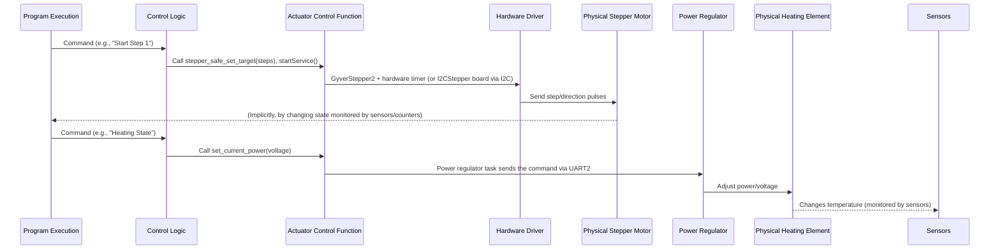

# Глава 5: Аппаратное управление (Исполнительные механизмы)

Добро пожаловать обратно в руководство по Самовару! В предыдущей главе, [Глава 4: Получение данных с датчиков](04_sensor_data_acquisition_.md), мы рассмотрели, как Самовар использует свои датчики, чтобы "видеть" и собирать данные из физического мира – такие параметры, как температура, давление и скорость потока. Эти данные в реальном времени предоставляют Самовару важную информацию о том, что происходит в процессе приготовления или дистилляции.

Но просто *знать* температуру или объем недостаточно. Самовар – это не только устройство для мониторинга; это система управления. Ему необходимо *действовать*, физически взаимодействовать с оборудованием для дистилляции или варки. Ему нужны "руки" и "голос", чтобы что-то включать или выключать, регулировать мощность, перемещать жидкости или издавать звуки.

Именно здесь вступает в игру **Аппаратное управление (Исполнительные механизмы)**. Исполнительные механизмы — это компоненты, которые позволяют Самовару физически управлять установкой. Это активные части системы, которые принимают решения, выработанные управляющей логикой (на основе шагов программы, состояния системы и данных с датчиков), и преобразуют их в физические действия.

## Почему исполнительные механизмы важны: пример использования

Давайте вернемся к нашему примеру ректификации. Представим, что Самовар с помощью температурного датчика (как обсуждалось в Главе 4) обнаружил, что температура пара на верху колонны достигла целевого значения для сбора "Тела" (основной части дистиллята).

Просто знать эту температуру бесполезно, если Самовар не может *действовать* на основании этой информации. Ему необходимо:

1.  Открыть клапан или включить насос для начала сбора жидкого продукта.
2.  При необходимости отрегулировать мощность, подаваемую на нагревательный элемент, чтобы поддерживать стабильные условия.
3.  Направить собранную жидкость в нужную емкость с помощью распределительного механизма.
4.  Возможно, даже включить зуммер, чтобы оповестить вас о переходе к следующему шагу программы.

Все эти действия выполняются **исполнительными механизмами**.

## Руки и голос Самовара: типы исполнительных механизмов

Аппаратная часть Самовара включает различные исполнительные механизмы для выполнения разных задач:

*   **Нагревательный элемент (управляется регулятором мощности/напряжения или реле):** Это основной источник нагрева для емкости. Его можно просто включать/выключать с помощью реле или, в более продвинутых установках, точно регулировать мощность или напряжение для поддержания температуры или контроля скорости пара.
*   **Клапан/насос охлаждающей воды (управляется реле или ШИМ):** Управляет подачей охлаждающей воды в конденсатор. Это может быть простой клапан (вкл./выкл. через реле) или насос, скорость которого регулируется с помощью ШИМ (широтно-импульсной модуляции) на основе обратной связи с температурного датчика.
*   **Перистальтический насос/шаговый двигатель (управляется драйвером шагового двигателя):** Используется для точного контроля скорости потока и общего объема собранной жидкости во время дистилляции. Шаговый двигатель обеспечивает точные, повторяемые движения — идеально для дозирования определенных объемов.
*   **Мотор/насос мешалки (управляется реле или I2C):** В режимах варки (например, затирание) перемешивает содержимое емкости или рециркулирует жидкость. Обычно это простая функция вкл./выкл. через реле, либо управление через устройство на шине I2C.
*   **Механизм распределения жидкости (управляется сервоприводом или реле):** Направляет собранную жидкость (головы, тело, хвосты) в разные приемные емкости. Это может быть сервопривод, позиционирующий носик, или набор клапанов/реле для выбора пути.
*   **Зуммер (управляется цифровым выходом):** Простой звуковой сигнализатор для оповещения пользователя о важных событиях (смена шага программы, ошибки и др.).

Каждый из этих исполнительных механизмов подключен к микроконтроллеру Самовара (ESP32) через специальные управляющие пины или коммуникационные шины (например, I2C или UART для регуляторов мощности). Программное обеспечение отправляет команды на эти интерфейсы, чтобы исполнительные механизмы выполняли свои функции.

## Как работает управление исполнительными механизмами

Управление исполнительным механизмом заключается в указании ему, *что* делать (например, включить, задать скорость, переместить в позицию) и зачастую *насколько* или *как быстро*. Этот процесс принятия решений определяется основной логикой Самовара, объединяющей информацию из шагов программы ([Глава 2](02_process_program_execution_.md)), текущего состояния системы ([Глава 3](03_system_state___mode_management_.md)) и данных датчиков в реальном времени ([Глава 4](04_sensor_data_acquisition_.md)).

Например:
*   **Шаг программы:** Шаг может требовать "Собрать 500 мл голов со скоростью 0,2 л/ч". Логика выполнения программы считывает это, дает команду контроллеру шагового двигателя двигаться медленно рассчитанное количество шагов для 500 мл и устанавливает исполнительный механизм выбора емкости в позицию 1.
*   **Состояние системы:** Если состояние системы меняется на "Нагрев", логика управления включает основной нагревательный элемент. Если состояние переходит в "Авария", нагрев выключается и включается зуммер.
*   **Данные датчиков:** Если датчик температуры охлаждающей воды сообщает, что вода стала слишком горячей, исполнительному механизму клапана/насоса может быть дана команда открыть сильнее или увеличить скорость.

Программное обеспечение Самовара предоставляет набор функций, которые абстрагируют низкоуровневые детали общения с конкретным исполнительным механизмом. Эти функции — "командный интерфейс" для исполнительных механизмов.

## Использование управления исполнительными механизмами: пример шагового двигателя и нагревателя

Рассмотрим управление двумя наиболее важными исполнительными механизмами во время обычной программы дистилляции: основным нагревателем и насосом сбора жидкости (шаговым двигателем).

В соответствии с шагами программы, определенными в [Глава 2](02_process_program_execution_.md), Самовар должен:

1.  Включить основной нагреватель (обычно сначала на полную мощность для разогрева).
2.  Когда условия станут подходящими (например, начнется кипение, стабилизируется колонна, определяется датчиками и логикой состояния), при необходимости уменьшить мощность нагревателя для стабильной работы.
3.  Включить шаговый двигатель/насос на определенной скорости и в нужном направлении.
4.  Отслеживать объем собранной жидкости по количеству шагов шагового двигателя.
5.  Остановить шаговый двигатель при достижении целевого объема для текущего шага программы.

Эти действия инициируются логикой выполнения программы, вызывающей специальные функции для управления этими исполнительными механизмами.

## Внутренняя реализация: поток управления

Когда Самовар решает выполнить действие с исполнительным механизмом, команда проходит через систему следующим образом:


```mermaid
sequenceDiagram
    Program Execution->>Control Logic: Command (e.g., "Start Step 1")
    Control Logic->>Actuator Control Function: Call stepper_safe_set_target(steps), startService()
    Actuator Control Function->>Hardware Driver: GyverStepper2 + hardware timer (or I2CStepper board via I2C)
    Hardware Driver->>Physical Stepper Motor: Send step/direction pulses
    Physical Stepper Motor-->>Program Execution: (Implicitly, by changing state monitored by sensors/counters)

    Program Execution->>Control Logic: Command (e.g., "Heating State")
    Control Logic->>Actuator Control Function: Call set_current_power(voltage)
    Actuator Control Function->>Power Regulator: Power regulator task sends the command via UART2
    Power Regulator->>Physical Heating Element: Adjust power/voltage
    Physical Heating Element-->>Sensors: Changes temperature (monitored by sensors)
```

В этом упрощенном потоке:
1.  Логика **Выполнения программы** (или общая логика Самовара в зависимости от режима/состояния) определяет, что требуется действие исполнительного механизма.
2.  Она вызывает функцию в слое **Логики управления** (например, `run_program` или `beer_stage_tick`).
3.  Эта функция логики управления вызывает конкретную **Функцию управления исполнительным механизмом** (например, `stepper_safe_set_target` и `startService` или `set_current_power`).
4.  Функция управления исполнительным механизмом содержит код, который напрямую взаимодействует с **Драйвером оборудования** (это может быть библиотека или собственный код для I2C, Serial или GPIO).
5.  Драйвер оборудования отправляет необходимые сигналы или команды на **Физический исполнительный механизм**, заставляя его выполнять нужное действие.

Такой многоуровневый подход делает основную логику программы чистой; ей не нужно знать низкоуровневые детали *как* обращаться к каждому устройству, достаточно знать *какую* функцию вызвать.

## Погружение в код

Рассмотрим упрощенные фрагменты кода, показывающие, как Самовар управляет своими исполнительными механизмами.

### Управление шаговым двигателем (перистальтический насос)

Шаговый двигатель играет ключевую роль для точного сбора жидкости. Основной насос отбора подключён к ESP32 напрямую (пины `STEPPER_STEP`, `STEPPER_DIR`, `STEPPER_EN` из `Samovar_pin.h`) и управляется объектом `stepper` библиотеки `GyverStepper2` (`GStepper2<STEPPER2WIRE>`, объявлен в `Samovar.h`). Импульсы шагов генерирует аппаратный таймер: `startService()` запускает его, `stopService()` останавливает, а в его прерывании `StepperTicker()` вызывается `stepper.tickManual()`. Задачи обращаются к `stepper` только через обёртки `stepper_safe_*` из `runtime_helpers.h`, которые защищают объект от одновременного доступа из прерывания.

```c++
// Упрощённый фрагмент из logic.h (run_program): запуск отбора строки программы
CurrrentStepperSpeed = get_speed_from_rate(program[num].Speed);      // л/ч -> шагов в секунду
TargetStepps = (uint32_t)program[num].Volume * SamSetup.StepperStepMl; // мл -> шаги (калибровка насоса)
stepper_safe_set_max_speed(CurrrentStepperSpeed);
stepper_safe_set_current(0);           // Начать отсчёт шагов с 0 для этой строки
stepper_safe_set_target(TargetStepps); // Задать количество шагов
startService();                        // Запустить таймер, генерирующий импульсы шагов

// Упрощённый фрагмент из Samovar.ino
void startService(void) {
  // Период таймера берётся из библиотеки (Arduino core 3.x; для core 2.x - timerAlarmWrite/timerAlarmEnable)
  timerAlarm(timer, stepper.getPeriod(), true, 0);
}

void IRAM_ATTR StepperTicker(void) { // Прерывание таймера
  portENTER_CRITICAL_ISR(&timerMux);
  StepperMoving = stepper.tickManual(); // Сделать шаг, если пора
  portEXIT_CRITICAL_ISR(&timerMux);
}
```

Скорость (`CurrrentStepperSpeed`) и общее количество шагов (`TargetStepps`) рассчитываются из строки программы. Прогресс отбора система отслеживает через `stepper_safe_get_current()`, а `set_pump_speed()` (`logic.h`) меняет скорость на ходу.

Второй насос и мешалка могут работать на плате I2CStepper — отдельном микроконтроллере (Arduino Nano), который управляет двигателем и получает команды по I2C. Для неё в `I2CStepper.h` есть функции `set_stepper_target()` (насос: заданное число шагов), `set_stepper_by_time()` (мешалка: обороты в минуту на заданное время) и `set_mixer_pump_target()` (реле 1 платы).

```c++
// Фрагмент из I2CStepper.h
inline bool set_stepper_target(uint32_t speedStepsPerSecond, uint8_t direction,
                               uint32_t targetSteps, bool requireI2c) {
  I2CStepperDevice* device = i2c_stepper_selected_pump(); // Плата, выбранная насосом
  if (!device || !device->present) return false;
  if (speedStepsPerSecond == 0 || targetSteps == 0) return i2c_stepper_stop(*device); // Нули - остановка
  // ... проверка пределов скорости и числа шагов ...
  device->config.mode = I2CSTEPPER_V3_MODE_FILLING;
  device->motion.mode = I2CSTEPPER_V3_MODE_FILLING;
  device->motion.direction = direction;
  device->motion.speedStepsPerSec = speedStepsPerSecond;
  device->motion.targetSteps = targetSteps;
  return i2c_stepper_start_finite(*device); // Настройки, параметры движения и команда START_FINITE
}
```

Обмен с платой идёт по протоколу из библиотеки `I2CStepperV3`: ESP32 записывает блоки настроек и параметров движения, затем отправляет кадр команды с порядковым номером и ждёт, пока плата подтвердит результат. Доступ к шине I2C защищён семафором `xI2CSemaphore`. Состояние платы (в том числе остаток шагов, его возвращает `get_stepper_status()`) обновляется опросом каждые 250 мс.

### Управление основным нагревателем (мощность/напряжение)

Управление мощностью нагревательного элемента часто сложнее, чем просто вкл./выкл. Регулятор подключается к UART2 (`Serial2`, пины `RXD2`/`TXD2`) и выбирается в `Samovar_ini.h`:

*   `SAMOVAR_USE_POWER` — регулятор KVIC (скорость обмена 38400, с `KVIC_USE_9600` — 9600), код в `power_regulator_kvic.h`;
*   `SAMOVAR_USE_POWER` + `SAMOVAR_USE_RMVK` — регулятор напряжения РМВ-К (`power_regulator_rmvk.h`, `mod_rmvk.h`, `mod_rmv.ino`);
*   `SAMOVAR_USE_POWER` + `SAMOVAR_USE_SEM_AVR` — регулятор мощности SEM_AVR, уставка в ваттах (`power_regulator_sem.h`; `SAMOVAR_USE_RMVK` при этом определяется автоматически);
*   без `SAMOVAR_USE_POWER` нагрев управляется реле: реле 1 (`RELE_CHANNEL1`) — основной нагреватель, реле 4 (`RELE_CHANNEL4`) — разгонный ТЭН.

Для управления используются функции `set_current_power`, `set_power_mode` и `set_power` из `power_regulator.h`. Они не пишут в порт сами: они ставят запрос, а команду в UART отправляет отдельная задача регулятора (`triggerPowerStatus`).

```c++
// Упрощенный фрагмент из power_regulator.h
ActuatorCommandResult set_current_power(float Volt, uint64_t* generation) {
  // ... уставка ограничивается 230 В (у SEM_AVR - мощностью, эквивалентной 230 В) ...
  if (!PowerOn || heaterSafetyState.emergencyLatched) return ACTUATOR_COMMAND_FAILED; // Нагрев выключен или авария
  // Ниже порога (40 В, у SEM_AVR 100 Вт) - режим сна, иначе рабочий режим с уставкой
  const uint64_t requestGeneration = request_regulator_state_locked(
    Volt < POWER_WORK_MODE_THRESHOLD ? SAFETY_REGULATOR_MODE_SLEEP : SAFETY_REGULATOR_MODE_WORK,
    Volt >= POWER_WORK_MODE_THRESHOLD, Volt, false);
  notify_power_worker(); // Разбудить задачу регулятора
  return current_power_command_status(requestGeneration); // APPLIED, PENDING или FAILED
}

// Задача регулятора отправляет команду; формат зависит от модели.
// power_regulator_kvic.h (KVIC): "S<напряжение*10 в hex>\r"
inline bool apply_regulator_voltage_blocking(float Volt, uint64_t powerGeneration) {
  String hexString = String((int)(Volt * 10), HEX);
  const String command = "S" + hexString + "\r";
  if (!heater_uart_enqueue(UART_NUM_2, command.c_str(), command.length(), powerGeneration, true)) return false;
  target_power_volt = Volt;
  return true;
}
// РМВ-К: RMVK_set_out_voltge() -> "AT+VS=087" (три цифры, вольты)
// SEM_AVR: "АТ+VS=<уставка>\r" (префикс "АТ" из кириллических букв)

// Режим регулятора: POWER_WORK_MODE ("0"), POWER_SPEED_MODE ("1", разгон), POWER_SLEEP_MODE ("2", сон).
// KVIC: "M<режим>\r"; РМВ-К: RMVK_set_on(1/0); SEM_AVR: "АТ+ON=1\r" / "АТ+ON=0\r"
inline void set_power_mode(String Mode);

ActuatorCommandResult set_power(bool On, bool enqueueResetCommand = true) {
  if (On) {
    // Отказ с сообщением, если задача регулятора не запущена, сработала аварийная защита,
    // идёт выключение, самотест/калибровка или смена режима
    heater_outputs_enable_locked(SAFETY_HEATER_OUTPUT_MAIN, true); // PowerOn = true, реле 1 включено
    // С регулятором: через SAMOVAR_USE_POWER_START_TIME (2 с; у SEM_AVR 3 + 2 с) регулятор переводится в разгон.
    // Без регулятора: сразу включается и реле 4 (разгонный ТЭН).
  } else {
    // Реле 4 снимается сразу, через 700 мс регулятор получает команду сна,
    // ещё через 200 мс снимается реле 1 и ставится команда сброса (Глава 3)
  }
  return ACTUATOR_COMMAND_APPLIED;
}
```

Эти функции показывают, как команды высокого уровня, такие как установка целевого напряжения (`set_current_power`) или смена режима работы (`set_power_mode`), преобразуются в конкретные команды через Serial для внешнего регулятора мощности. Функция `set_power(bool On)` обеспечивает главное вкл./выкл. всего нагревательного контура, включая мастер-реле (`RELE_CHANNEL1`). Обратите внимание: команды регулятору выполняет отдельная задача, а вызывающий код получает результат (`ACTUATOR_COMMAND_APPLIED`, `ACTUATOR_COMMAND_PENDING` или `ACTUATOR_COMMAND_FAILED`); если регулятор не ответил вовремя, нагрев отключается.

### Управление другими исполнительными механизмами (реле, ШИМ, сервопривод, зуммер)

Остальные исполнительные механизмы управляются аналогично — через вызовы специализированных функций, управляющих соответствующими пинами или интерфейсами.

*   **Реле (клапан воды, мешалка, нагреватель):** Простая запись на цифровой пин. Реле 1 — нагреватель (пускатель), реле 2 — мешалка в режиме «Пиво», реле 3 — клапан воды охлаждения, реле 4 — разгонный ТЭН, если регулятор не используется.

    ```c++
    // Упрощённый фрагмент из valve_buzzer.h
    ActuatorCommandResult open_valve(bool Val, bool msg = true) {
      if (Val) {
        if (mode_switch_barrier_active) return ACTUATOR_COMMAND_FAILED; // Идёт смена режима
        digitalWrite(RELE_CHANNEL3, SamSetup.rele3); // Включить реле клапана
        valve_status = true; // Обновить флаг состояния
        // ... отправить сообщение пользователю ...
      } else {
        digitalWrite(RELE_CHANNEL3, !SamSetup.rele3); // Выключить реле клапана
        valve_status = false;
        // ... отправить сообщение пользователю ...
      }
      return ACTUATOR_COMMAND_APPLIED;
    }

    // Упрощённый фрагмент из beer.h
    void setHeaterPosition(bool state) {
      set_heater_state_flag(state); // Обновить внутренний статус
      if (state) {
    #ifdef SAMOVAR_USE_POWER
        set_current_power(SamSetup.StbVoltage); // С регулятором - задать напряжение
    #else
        heater_boost_output_off();                        // Реле 4 (разгон) выключить
        heater_enable_outputs(SAFETY_HEATER_OUTPUT_MAIN); // Реле 1 (нагреватель) включить
    #endif
      } else {
    #ifdef SAMOVAR_USE_POWER
        set_power_mode(POWER_SLEEP_MODE); // Перевести регулятор в сон
    #else
        digitalWrite(RELE_CHANNEL1, !SamSetup.rele1);
        heater_boost_output_off();
    #endif
      }
    }
    ```
*   **ШИМ (скорость насоса воды):** Использование пина с поддержкой ШИМ и установка скважности.

    ```c++
    // Упрощённый фрагмент из pumppwm.h
    ActuatorCommandResult set_pump_pwm(float duty) {
      duty = constrain(duty, 0, 1023); // Ограничить диапазон скважности (ШИМ 10 бит)
      if (duty > 0 && mode_switch_barrier_active) return ACTUATOR_COMMAND_FAILED; // Идёт смена режима
      // ... мягкий пуск: первые вызовы после включения пишут PWM_START_VALUE * 10 ...
      if (duty == 0) pump_started = false;
      pump_pwm.write(duty); // Установить скважность на пин насоса
      water_pump_speed = duty; // Сохранить текущее значение скорости
      return ACTUATOR_COMMAND_APPLIED;
    }
    ```
    Эта функция принимает заданное значение ШИМ (`duty`) и подает его на насос через объект `ESP32PWM` (библиотека `ESP32Servo`, частота `PUMP_PWM_FREQ`), регулируя его скорость. Значение подбирает ПИД-регулятор `set_pump_speed_pid()` по температуре воды.
*   **Сервопривод (распределение жидкости):** Запись значения позиции в объект сервопривода.

    ```c++
    // Фрагмент из logic.h
    void set_capacity(uint8_t cap) {
      if (cap > CAPACITY_NUM) return; // Номер емкости вне диапазона
      capacity_num = cap; // Сохранить номер текущей емкости
    #ifdef SERVO_PIN // Если используется сервомотор
      // Рассчитать целевую позицию на основе номера емкости и калибровки
      int p = ((int)cap * SERVO_ANGLE) / (int)CAPACITY_NUM + servoDelta[cap];
      servo.write(p); // Переместить сервомотор в позицию 'p'
    #elif USER_SERVO // Если используется пользовательская функция серво
      user_set_capacity(cap); // Вызвать пользовательскую функцию
    #endif
    }
    ```
    Эта функция принимает желаемый номер приемной емкости (`cap`) и перемещает подключенный сервомотор (объект `Servo` библиотеки `ESP32Servo`) в соответствующую физическую позицию.
*   **Зуммер:** Переключение цифрового выхода `BZZ_PIN`; серию сигналов отсчитывает функция, которую вызывает основной цикл `loop()`.

    ```c++
    // Упрощённый фрагмент из valve_buzzer.h
    void set_buzzer(bool fl) {
      if (fl && SamSetup.UseBuzzer) { // Включаем только если запрос и разрешено в настройках
        buzzer_active = true;         // Начать серию сигналов
        buzzer_beep_count = 0;
        buzzer_state = false;
        buzzer_next_time = millis();  // Начинаем сразу
      } else {
        buzzer_active = false;
        buzzer_beep_count = 0;
        buzzer_state = false;
        digitalWrite(BZZ_PIN, LOW);   // Убедиться, что пин LOW при выключении
      }
    }

    // Вызывается из loop() на каждом проходе
    void process_buzzer() {
      if (!buzzer_active) return;
      if ((int32_t)(millis() - buzzer_next_time) >= 0) {
        if (buzzer_state) {
          digitalWrite(BZZ_PIN, LOW);       // Выключить зуммер
          buzzer_state = false;
          if (++buzzer_beep_count >= 5) buzzer_active = false; // Серия из 5 сигналов закончена
          else buzzer_next_time = millis() + 600;              // Пауза 600 мс
        } else {
          digitalWrite(BZZ_PIN, HIGH);      // Включить зуммер
          buzzer_state = true;
          buzzer_next_time = millis() + 400; // Сигнал 400 мс
        }
      }
    }
    ```
    Функция `set_buzzer` запускает серию сигналов, а `process_buzzer` (её вызывает основной цикл `loop()`) включает и выключает зуммер по времени: пять сигналов по 400 мс с паузами 600 мс, обеспечивая звуковую обратную связь пользователю.

Эти примеры показывают, что независимо от конкретного оборудования, схема одна: основная логика вызывает функцию с параметрами высокого уровня, а эта функция реализует низкоуровневое взаимодействие (digitalWrite, ШИМ, serial-команды, I2C-сообщения), необходимое для выполнения действия исполнительным механизмом.

## Заключение

В этой главе мы познакомились с **Аппаратным управлением (Исполнительными механизмами)** — способностью Самовара физически взаимодействовать с оборудованием для варки и дистилляции. Мы рассмотрели разнообразные исполнительные механизмы, которые он использует — от нагревателей и насосов до клапанов и зуммеров — и поняли, что это "руки" и "голос" системы. Мы увидели, как логика управления, используя шаги программы ([Глава 2](02_process_program_execution_.md)), состояние системы ([Глава 3](03_system_state___mode_management_.md)) и данные датчиков ([Глава 4](04_sensor_data_acquisition_.md)), вызывает специализированные функции для управления этими механизмами. Мы рассмотрели упрощенные примеры кода для управления шаговым двигателем, нагревателем, реле, ШИМ-насосом, сервоприводом и зуммером, показав, как ПО абстрагирует сложность оборудования. Понимание управления исполнительными механизмами принципиально важно, ведь именно так Самовар переводит внутренние решения в реальные действия, автоматизируя ваш процесс.

В следующей главе мы обсудим [Мониторинг безопасности и аварии](06_safety_monitoring___alarms_.md) и узнаем, как Самовар с помощью датчиков и исполнительных механизмов предотвращает опасные ситуации и оповещает вас, если что-то идет не так.

[Глава 6: Мониторинг безопасности и аварии](06_safety_monitoring___alarms_.md)
