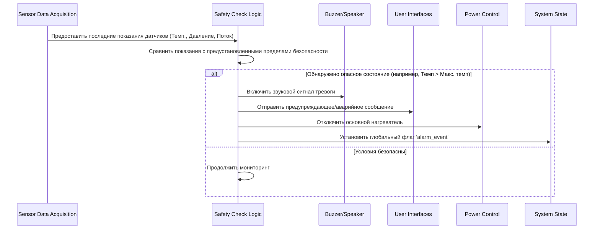

# Глава 6: Мониторинг безопасности и аварийные сигналы

Добро пожаловать обратно! В предыдущей главе, [Глава 5: Аппаратное управление (исполнительные механизмы)](05_hardware_control__actuators__.md), мы увидели, как Самовар использует свои «руки» и «голос» — исполнительные механизмы — чтобы управлять процессом варки и дистилляции: включает нагреватели, запускает насосы и направляет жидкость. Но что произойдет, если одно из этих действий или какое-либо состояние системы станет опасным? Что, если нагреватель будет работать слишком долго или перестанет поступать охлаждающая вода, что приведет к опасным температурам или давлениям?

В этом случае вступает в действие **Мониторинг безопасности и аварийные сигналы**. Представьте себе эту часть системы Самовара как встроенного защитника или сторожевого пса. Ее основная задача — постоянно следить за процессом, обнаруживать, если что-то идет не так или становится опасным, и немедленно принимать меры для предотвращения повреждения оборудования или возникновения опасной ситуации.

Без системы безопасности Самовар бы слепо следовал своей программе, даже если условия становились бы критическими. Надежная система безопасности абсолютно необходима для безопасной эксплуатации оборудования для варки и дистилляции, особенно если речь идет о нагреве легковоспламеняющихся жидкостей или работе под давлением.

## Почему мониторинг безопасности так важен: пример из практики

Рассмотрим критическую ситуацию: отказ подачи охлаждающей воды. Охлаждающая вода необходима для конденсации пара обратно в жидкость в конденсаторе. Если она перестанет поступать, пар продолжит подниматься, но не будет конденсироваться. Это может быстро привести к опасно высоким температурам в колонне и потенциально к высокому давлению, если система не оснащена правильным клапаном сброса.

Надежная система безопасности должна:

1.  Постоянно контролировать температуру охлаждающей воды (с помощью датчика, как описано в [Глава 4: Сбор данных с датчиков](04_sensor_data_acquisition__.md)).
2.  При необходимости контролировать поток воды (с помощью датчика потока).
3.  Проверять, не превышают ли показания безопасные пределы.
4.  Если опасный предел достигнут, немедленно:
    *   Подать громкий сигнал тревоги (используя зуммер из [Глава 5: Аппаратное управление (исполнительные механизмы)](05_hardware_control__actuators__.md)).
    *   Отобразить четкое предупреждающее сообщение ([Глава 1: Взаимодействие с пользователем (Web и LCD)](01_user_interaction__web___lcd__.md)).
    *   Принять защитные меры, например, немедленно отключить основной нагревательный элемент ([Глава 5: Аппаратное управление (исполнительные механизмы)](05_hardware_control__actuators__.md)).

В этой главе объясняется, как Самовар реализует эту важную функцию безопасности.

## Работа «стража»: ключевые понятия

Система безопасности объединяет несколько элементов, которые мы уже обсуждали:

1.  **Мониторинг:** Это непрерывное считывание данных с датчиков ([Глава 4: Сбор данных с датчиков](04_sensor_data_acquisition__.md)). Система не просто отображает данные — она специально сверяет их с предустановленными пределами безопасности.
2.  **Критические условия:** Это конкретные ситуации, которые вызывают срабатывание системы безопасности. Они определяются порогами, заданными в конфигурации Самовара (часто в заголовочном файле вроде `Samovar_ini.h` или в настройках). Примеры:
    *   Температурные датчики превышают максимально допустимое значение (`MAX_WATER_TEMP`, `MAX_STEAM_TEMP`).
    *   Отсутствие потока охлаждающей воды в течение определенного времени (проверяется по датчику потока или температуре на выходе воды).
    *   Давление превышает безопасный предел (`MaxPressureValue`).
    *   Высокий уровень жидкости в голове колонны (указание на захлеб, контролируется датчиком уровня в голове).
3.  **Аварийные сигналы:** Когда обнаружено критическое состояние, система подает аварийный сигнал. Это может быть:
    *   Звуковой: зуммер или другой сигнал.
    *   Визуальный/текстовый: сообщения на LCD или веб-интерфейсе.
    *   Дистанционный: уведомления по сети ([Глава 8: Сеть и внешняя связь](08_network___external_communication__.md)), например, Telegram или MQTT.
4.  **Защитные действия:** Это автоматические шаги для снижения опасности. Самое распространенное и важное — отключение основного нагревательного элемента. Другие действия могут включать остановку насосов, закрытие клапанов или изменение состояния системы ([Глава 3: Управление состояниями и режимами системы](03_system_state___mode_management__.md)) на «Ошибка» или «Авария».

Система безопасности всегда активна, независимо от того, какая программа процесса ([Глава 2: Исполнение процессной программы](02_process_program_execution__.md)) запущена и каково основное состояние системы ([Глава 3: Управление состояниями и режимами системы](03_system_state___mode_management__.md)). Это независимый слой, сосредоточенный только на безопасности.

## Как работает мониторинг безопасности: простой алгоритм

Основной процесс мониторинга безопасности прост:



Это происходит многократно — много раз в секунду или минуту, в зависимости от скорости обновления датчиков и частоты вызова функции проверки безопасности в основном цикле программы. Ключевое здесь — бдительность и быстрая реакция.

## Погружение в код: функции `check_alarm`

Логика мониторинга безопасности реализована в первую очередь в функциях с названиями вроде `check_alarm()`, `check_alarm_beer()` и `check_alarm_nbk()`, в зависимости от режима работы. Эти функции часто вызываются из основного `loop()` или в рамках функций обработки соответствующих режимов ([Глава 3: Управление состояниями и режимами системы](03_system_state___mode_management__.md)).

Рассмотрим упрощенные фрагменты из `logic.h` (общие проверки безопасности, применяемые в режиме ректификации) и, возможно, из `distiller.h` или `nbk.h`.

Сначала посмотрим, где часто определяются пределы аварий (в `Samovar_ini.h`):

```c++
// Из Samovar_ini.h (упрощено)
// Настройки предельных значений для контроля автоматики

//Температура воды, при достижении которой будет оповещен оператор
#define ALARM_WATER_TEMP 70 
//Максимальное значение температуры воды, при котором выключится питание
#define MAX_WATER_TEMP 75
//Максимальное значение температуры пара, при котором выключится питание
#define MAX_STEAM_TEMP 98.8
//Максимальное значение температуры в ТСА, при котором выключится питание
#define MAX_ACP_TEMP 75 

// ... другие настройки безопасности, такие как WF_ALARM_COUNT (порог по датчику потока), MaxPressureValue и др.
```

Эти строки `#define` задают важнейшие пороги безопасности. Код проверки безопасности будет сравнивать реальные показания датчиков с этими значениями.

Теперь посмотрим упрощенный вариант функции `check_alarm()` из `logic.h`, сфокусированный на критических температурных авариях:

```c++
// Упрощенный фрагмент из logic.h (функция check_alarm)

void check_alarm() {
  // --- Проверка критических температурных аварий ---
  // Если ЛЮБАЯ из этих температур превышает абсолютный максимум И питание включено...
  if ((SteamSensor.avgTemp >= MAX_STEAM_TEMP || 
       WaterSensor.avgTemp >= MAX_WATER_TEMP || 
       ACPSensor.avgTemp >= MAX_ACP_TEMP) && PowerOn) {
    
    // ... тогда срабатывает экстренное отключение!
    delay(1000); // Короткая пауза для выполнения других команд
    set_buzzer(true); // Подать аварийный сигнал!
    set_power(false); // Немедленно отключить питание!

    // Формируем сообщение о превышении предела по температуре
    String s = "";
    if (SteamSensor.avgTemp >= MAX_STEAM_TEMP) s += " Пара";
    if (WaterSensor.avgTemp >= MAX_WATER_TEMP) { if (s.length() > 0) s+= " и"; s += " Воды"; }
    if (ACPSensor.avgTemp >= MAX_ACP_TEMP) { if (s.length() > 0) s+= " и"; s += " ТСА"; }
    
    SendMsg("Аварийное отключение! Превышена максимальная температура" + s, ALARM_MSG); // Критическое сообщение
    
    // Глобальный флаг, что произошла авария (предотвращает перезапуск системы и пр.)
    alarm_event = true; 
    
    // Примечание: состояние системы также может обновляться здесь или обработчиком отключения питания (см. Глава 3)
    
    return; // Прекратить дальнейшие проверки в этом цикле, произошла критическая авария.
  }

  // --- Проверка предупреждений / менее критичных аварий ---

  // Проверка предупреждения о высокой температуре охлаждающей воды (порог ниже, чем MAX_WATER_TEMP)
  // Используем таймер задержки (alarm_t_min), чтобы избежать частых срабатываний
  if ((WaterSensor.avgTemp >= ALARM_WATER_TEMP - 5) && PowerOn && alarm_t_min == 0) {
    set_buzzer(true); // Подать сигнал предупреждения (может отличаться от критичного)
    SendMsg(("Критическая температура воды!"), WARNING_MSG); // Предупреждение
    
    // При желании принять менее радикальные меры, например, снизить мощность (если есть регулятор)
    #ifdef SAMOVAR_USE_POWER
    if (WaterSensor.avgTemp >= ALARM_WATER_TEMP) {
        SendMsg("Критическая температура воды! Понижаем " + (String)PWR_MSG, ALARM_MSG);
        // Пример: снизить мощность на фиксированную величину/процент
        set_current_power(target_power_volt * 0.9); // Снизить мощность на 10%
    }
    #endif
    
    // Установить таймер, чтобы не срабатывать немедленно снова
    alarm_t_min = millis() + 1000 * 30; // Ждать 30 секунд до следующего срабатывания
  }

  // --- Проверка аварии по датчику потока воды ---
  #ifdef USE_WATERSENSOR
  // Проверяем, превышен ли счетчик потока воды (WFAlarmCount, инкрементируется при отсутствии потока)
  // лимит (WF_ALARM_COUNT) и питание включено
  if (WFAlarmCount > WF_ALARM_COUNT && PowerOn) {
      set_buzzer(true); // Подать аварийный сигнал
      // Сигнализировать системе выполнить отключение и очистку (см. синхронизирующую команду Глава 3)
      sam_command_sync = SAMOVAR_POWER; 
      SendMsg(("Аварийное отключение! Прекращена подача воды."), ALARM_MSG); // Критическое сообщение
      alarm_event = true; // Глобальный флаг аварии
      return; // Прекратить дальнейшие проверки
  }
  #endif

  // --- Проверка аварии по датчику уровня в голове (захлеб) ---
  #ifdef USE_HEAD_LEVEL_SENSOR
  // Проверяем, удерживается ли кнопка датчика уровня (whls) («залипание» — высокий уровень жидкости)
  // и не обрабатывается ли уже предыдущее срабатывание (таймер alarm_h_min) и питание включено
  if (SamSetup.UseHLS && PowerOn) {
      whls.tick(); // Обновить состояние кнопки
      if (whls.isHolded() && alarm_h_min == 0) {
          whls.resetStates(); // Сбросить состояние после обнаружения
          set_buzzer(true); // Подать сигнал аварии
          SendMsg(("Сработал датчик захлёба!"), ALARM_MSG); // Критическое сообщение
          
          // Эта авария часто вызывает *снижение* мощности, а не полное отключение
          // Это позволяет колонне очиститься от накопившейся жидкости.
          #ifdef SAMOVAR_USE_POWER
          // Сохраняем текущую мощность перед снижением
          prev_target_power_volt = target_power_volt; 
          // Значительно снижаем мощность (например, на 20%)
          set_current_power(target_power_volt * 0.8); 
          SendMsg((String)PWR_MSG + " снижаем с " + (String)target_power_volt, NOTIFY_MSG);
          #endif
          
          // Установить таймер на восстановление перед повторной проверкой аварии
          alarm_h_min = millis() + 1000 * 40; // Ждать 40 секунд
      }
       // Проверить, истек ли таймер для повторной активации проверки
      if (alarm_h_min > 0 && millis() >= alarm_h_min) {
        whls.resetStates(); // Сбросить состояние кнопки еще раз
        alarm_h_min = 0; // Сбросить таймер
        // Если причина аварии по-прежнему не устранена (например, whls.isHolded() снова true)
        // авария сработает снова в следующем цикле.
      }
  }
  #endif

  // --- Проверка аварии по датчику давления ---
  // Проверяем, превышено ли значение давления (pressure_value, с датчика давления)
  // максимально допустимое (SamSetup.MaxPressureValue) и питание включено
  #ifdef USE_PRESSURE_MPX // Пример для датчика давления MPX
  if (use_pressure_sensor && pressure_value >= SamSetup.MaxPressureValue && PowerOn) {
      set_buzzer(true); // Подать аварийный сигнал
      set_power(false); // Отключить питание
      SendMsg(("Аварийное отключение! Превышено максимальное давление."), ALARM_MSG); // Критическое сообщение
      alarm_event = true; // Глобальный флаг аварии
      return; // Прекратить дальнейшие проверки
  }
  #endif
  
  // ... здесь могут быть и другие проверки (например, превышение количества ошибок чтения датчиков)

  // Если критическая авария *уже* была обнаружена в прошлом цикле (alarm_event == true),
  // система остается в аварийном состоянии до сброса (обрабатывается в другом месте).
  // Проверки выше ищут *новые* критические состояния.
}
```

Эта функция (и ее вариации для других режимов) — сердце системы безопасности. Она показывает:

*   Чтение последних значений датчиков (например, `SteamSensor.avgTemp`, `WaterSensor.avgTemp`, `ACPSensor.avgTemp`, `WFAlarmCount`, `pressure_value`).
*   Сравнение этих значений с лимитами из `Samovar_ini.h` (`MAX_STEAM_TEMP`, `MAX_WATER_TEMP`, `ALARM_WATER_TEMP`, `WF_ALARM_COUNT`, `MaxPressureValue`) или из `SamSetup`.
*   Действия при превышении предела:
    *   Вызов `set_buzzer(true)` для подачи аварийного сигнала.
    *   Вызов `SendMsg()` для оповещения пользователя через интерфейсы.
    *   Вызов `set_power(false)` для отключения главного нагревателя (критичное действие).
    *   Вызов `set_current_power()` для снижения мощности (менее критичное действие, например, при захлебе).
    *   Установка флага `alarm_event = true;`. Это важная глобальная переменная, указывающая, что произошла аварийная остановка. Другие части кода ([Глава 3: Управление состояниями и режимами системы](03_system_state___mode_management__.md), [Глава 1: Взаимодействие с пользователем (Web и LCD)](01_user_interaction__web___lcd__.md)) проверяют этот флаг, чтобы не допустить случайного повторного запуска до признания и сброса состояния аварии пользователем.
*   Использование таймеров (`alarm_t_min`, `alarm_h_min`) или счетчиков (`WFAlarmCount`) для избежания ложных срабатываний из-за кратковременных колебаний или для предоставления времени на восстановление после незначительного события (например, кратковременного срабатывания датчика захлеба).

Функции `check_alarm_beer()` и `check_alarm_nbk()` содержат аналогичную логику, но адаптированы к специфике безопасности этих режимов (например, другие температурные лимиты или логика контроля давления, актуальная для пивоварения или NBK).

## Аварии и состояние системы

Когда возникает критическая авария, система безопасности не только отключает оборудование, но и влияет на общее состояние системы ([Глава 3: Управление состояниями и режимами системы](03_system_state___mode_management__.md)). Флаг `alarm_event` — основной способ передачи информации о критическом событии остальной логике Самовара.

Основная функция `loop()` или обработчики режимов проверяют `alarm_event`. Если он установлен, выполнение шагов программы или реакции на команды пользователя (например, «Старт») обычно останавливается. Для возобновления работы после аварии пользователь должен явно сбросить систему (обычно через кнопку или команду, которая сбрасывает флаг `alarm_event` и состояние, например, команду `SAMOVAR_RESET`, описанную в Главе 3).

## Заключение

В этой главе мы познакомились с важной ролью Самовара как стража с помощью **Мониторинга безопасности и аварийных сигналов**. Мы увидели, как система постоянно следит за данными датчиков, сравнивая их с заданными критическими пределами. При обнаружении опасного состояния, например, перегрева воды или отсутствия потока, система подает аварийные сигналы (звуковые и визуальные) и немедленно принимает защитные меры, в первую очередь отключая нагревательный элемент. Мы рассмотрели упрощенные примеры кода, показывающие, как осуществляется проверка датчиков (функции `check_alarm`), как определяются лимиты (`Samovar_ini.h`) и как используются исполнительные механизмы для устранения опасности (`set_power`, `set_buzzer`). Также коснулись флага `alarm_event`, который сигнализирует о критическом состоянии безопасности остальному коду Самовара. Понимание системы безопасности дает уверенность, что Самовар спроектирован не только для автоматизации, но и для безопасной работы.

Пределы и настройки безопасности крайне важны и могут потребовать корректировки под ваше конкретное оборудование или условия. В следующей главе, [Глава 7: Сохранение конфигурации](07_configuration_persistence__.md), мы узнаем, как эти важные настройки, а также определения программ и калибровочные значения сохраняются постоянно и не теряются при отключении питания Самовара.

[Глава 7: Сохранение конфигурации](07_configuration_persistence__.md)
