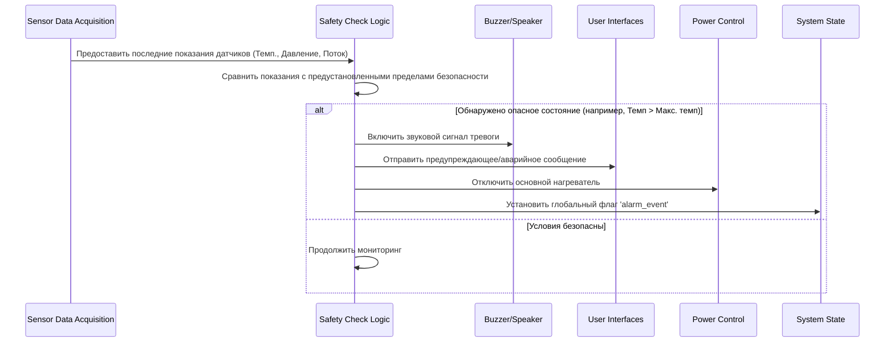

# Глава 6: Мониторинг безопасности и аварийные сигналы

Добро пожаловать обратно! В предыдущей главе, [Глава 5: Аппаратное управление (исполнительные механизмы)](05_hardware_control__actuators__.md), мы увидели, как Самовар использует свои «руки» и «голос» — исполнительные механизмы — чтобы управлять процессом варки и дистилляции: включает нагреватели, запускает насосы и направляет жидкость. Но что произойдет, если одно из этих действий или какое-либо состояние системы станет опасным? Что, если нагреватель будет работать слишком долго или перестанет поступать охлаждающая вода, что приведет к опасным температурам или давлениям?

В этом случае вступает в действие **Мониторинг безопасности и аварийные сигналы**. Представьте себе эту часть системы Самовара как встроенного защитника или сторожевого пса. Ее основная задача — постоянно следить за процессом, обнаруживать, если что-то идет не так или становится опасным, и немедленно принимать меры для предотвращения повреждения оборудования или возникновения опасной ситуации.

Без системы безопасности Самовар бы слепо следовал своей программе, даже если условия становились бы критическими. Надежная система безопасности абсолютно необходима для безопасной эксплуатации оборудования для варки и дистилляции, особенно если речь идет о нагреве легковоспламеняющихся жидкостей или работе под давлением.

## Почему мониторинг безопасности так важен: пример из практики

Рассмотрим критическую ситуацию: отказ подачи охлаждающей воды. Охлаждающая вода необходима для конденсации пара обратно в жидкость в конденсаторе. Если она перестанет поступать, пар продолжит подниматься, но не будет конденсироваться. Это может быстро привести к опасно высоким температурам в колонне и потенциально к высокому давлению, если система не оснащена правильным клапаном сброса.

Надежная система безопасности должна:

1.  Постоянно контролировать температуру охлаждающей воды (с помощью датчика, как описано в [Глава 4: Сбор данных с датчиков](04_sensor_data_acquisition_.md)).
2.  При необходимости контролировать поток воды (с помощью датчика потока).
3.  Проверять, не превышают ли показания безопасные пределы.
4.  Если опасный предел достигнут, немедленно:
    *   Подать громкий сигнал тревоги (используя зуммер из [Глава 5: Аппаратное управление (исполнительные механизмы)](05_hardware_control__actuators__.md)).
    *   Отобразить четкое предупреждающее сообщение ([Глава 1: Взаимодействие с пользователем (Web и LCD)](01_user_interaction__web___lcd__.md)).
    *   Принять защитные меры, например, немедленно отключить основной нагревательный элемент ([Глава 5: Аппаратное управление (исполнительные механизмы)](05_hardware_control__actuators__.md)).

В этой главе объясняется, как Самовар реализует эту важную функцию безопасности.

## Работа «стража»: ключевые понятия

Система безопасности объединяет несколько элементов, которые мы уже обсуждали:

1.  **Мониторинг:** Это непрерывное считывание данных с датчиков ([Глава 4: Сбор данных с датчиков](04_sensor_data_acquisition_.md)). Система не просто отображает данные — она специально сверяет их с предустановленными пределами безопасности.
2.  **Критические условия:** Это конкретные ситуации, которые вызывают срабатывание системы безопасности. Они определяются порогами, заданными при сборке прошивки (в `Samovar_ini.h` и `Samovar_pin.h`) или в настройках (`SamSetup`). Примеры:
    *   Температурные датчики превышают максимально допустимое значение (`MAX_WATER_TEMP`, `MAX_STEAM_TEMP`, `MAX_ACP_TEMP`).
    *   Отсутствие потока охлаждающей воды дольше `WF_ALARM_COUNT` секунд (проверяется по датчику потока).
    *   Давление превышает безопасный предел (`SamSetup.MaxPressureValue`).
    *   Высокий уровень жидкости в голове колонны (указание на захлеб, контролируется датчиком уровня в голове).
    *   Отказ датчика (нет данных датчика пара, воды, куба или ТСА во время работы) или нажатие аварийной кнопки.
3.  **Аварийные сигналы:** Когда обнаружено критическое состояние, система подает аварийный сигнал. Это может быть:
    *   Звуковой: зуммер (если он включен в настройках).
    *   Визуальный/текстовый: сообщения в веб-интерфейсе.
    *   Дистанционный: через Blynk ([Глава 8: Сеть и внешняя связь](08_network___external_communication_.md)) — сообщение на виртуальный пин V26 и push-уведомление в мобильное приложение. Тревоги приходят с заголовком «Тревога!», предупреждения — с заголовком «Предупреждение!».
4.  **Защитные действия:** Это автоматические шаги для снижения опасности. Самое распространенное и важное — отключение основного нагревательного элемента. Другие действия включают остановку насосов и мешалки, закрытие клапана воды (в ректификации, дистилляции, БК и НБК охлаждение работает еще 3 минуты, если вода поступает) и сброс состояния процесса ([Глава 3: Управление состояниями и режимами системы](03_system_state___mode_management_.md)).

Проверки безопасности выполняются независимо от того, какая программа процесса ([Глава 2: Исполнение процессной программы](02_process_program_execution_.md)) запущена: их вызывает фоновая задача, а не шаги программы. Набор проверок выбирается по текущему режиму работы ([Глава 3: Управление состояниями и режимами системы](03_system_state___mode_management_.md)).

## Как работает мониторинг безопасности: простой алгоритм

Основной процесс мониторинга безопасности прост:


```mermaid
sequenceDiagram
    Sensor Data Acquisition->>Safety Check Logic: Предоставить последние показания датчиков (Темп., Давление, Поток)
    Safety Check Logic->>Safety Check Logic: Сравнить показания с предустановленными пределами безопасности
    alt Обнаружено опасное состояние (например, Темп > Макс. темп)
        Safety Check Logic->>Buzzer/Speaker: Включить звуковой сигнал тревоги
        Safety Check Logic->>User Interfaces: Отправить предупреждающее/аварийное сообщение
        Safety Check Logic->>Power Control: Отключить основной нагреватель
        Safety Check Logic->>System State: Установить глобальный флаг 'alarm_event'
    else Условия безопасны
        Safety Check Logic->>Safety Check Logic: Продолжить мониторинг
    end
```

Это происходит раз в секунду: фоновая задача `SysTicker` (файл `Samovar.ino`) читает датчики и сразу после этого вызывает `mode_dispatch_alarm()`, которая запускает проверку текущего режима. Ключевое здесь — бдительность и быстрая реакция.

## Погружение в код: функции `check_alarm`

Логика мониторинга безопасности разложена по функциям для каждого режима. Какую из них вызывать, решает таблица режимов в `mode_registry.h`:

*   ректификация — `check_alarm()` (`alarm.h`);
*   дистилляция — `check_alarm_distiller()` (`distiller.h`);
*   БК — `check_alarm_bk()` (`BK.h`);
*   НБК — `check_nbk_critical_alarms()` и `check_alarm_nbk()` (`nbk.h`);
*   пиво — `mode_alarm_beer()`, сыр — `mode_alarm_cheese()` (`mode_registry.h`);
*   сувид — `check_alarm_suvid()` (`suvid.h`), Lua — `check_alarm_lua()` (`lua.h`).

Общие для нескольких режимов проверки (перегрев воды и ТСА, отсутствие потока воды, предупреждение о горячей воде) вынесены в `mode_common.h`.

Сначала посмотрим, где определены пределы аварий (в `Samovar_ini.h`):

```c++
// Из Samovar_ini.h (упрощено)
// Настройки предельных значений для контроля автоматики

//Температура воды, при достижении которой будет оповещен оператор
#define ALARM_WATER_TEMP 70
//Максимальное значение температуры воды, при котором выключится питание
#define MAX_WATER_TEMP 75
//Максимальное значение температуры пара, при котором выключится питание
#define MAX_STEAM_TEMP 98.8
//Максимальное значение температуры в ТСА, при котором выключится питание
#define MAX_ACP_TEMP 75

// WF_ALARM_COUNT (секунд без потока воды до аварии, по умолчанию 20) задан в Samovar_pin.h,
// предел давления MaxPressureValue — в настройках (SamSetup)
```

Эти строки `#define` задают важнейшие пороги безопасности. Код проверки безопасности сравнивает реальные показания датчиков с этими значениями.

Все аварийные остановки идут через одну функцию — `request_emergency_stop(причина)` из `alarm.h`. Она сразу снимает реле нагрева и запоминает аварию (защелку), выставляет `alarm_event = true` и включает зуммер. Остальное делает `perform_emergency_stop()`, которую вызывает основной `loop()`: отправляет сообщение с причиной (`ALARM_MSG`), выключает питание (`set_power(false)`), закрывает воду или оставляет охлаждение еще на 3 минуты, останавливает насосы и мешалку и сбрасывает состояние процесса.

Теперь посмотрим упрощенный вариант функции `check_alarm()` из `alarm.h` (режим ректификации):

```c++
// Упрощенный фрагмент из alarm.h (функция check_alarm)

void check_alarm() {
  // Сбросить паузу предупреждения о воде, если 30 секунд прошли
  mode_clear_alarm_pause_if_expired();

  // --- Отказ датчиков во время работы ---
  if (PowerOn) {
    // Датчики пара, воды и куба не назначены — выключаем нагрев штатной командой
    // (rectification_ds_sensors_assigned(), SAMOVAR_POWER_OFF)
    // Нет данных датчика пара, воды, ТСА или куба — аварийная остановка:
    if (optional_sensor_failed(SteamSensor) && process_sensor_failed("Ректификация", "пара")) return;
    if (!mode_check_powered_cooling_sensors("Ректификация")) return;
    if (optional_sensor_failed(TankSensor) && process_sensor_failed("Ректификация", "куба")) return;
  }

  // --- Датчик уровня в голове (захлеб) ---
#ifdef USE_HEAD_LEVEL_SENSOR
  if (SamSetup.UseHLS && PowerOn) {
    // head_level_sensor_holded() опрашивает кнопку датчика whls (удержание = высокий уровень)
    if (head_level_sensor_holded() && alarm_h_min == 0) {
      if (current_program_type() != 'C') {
        set_buzzer(true); // Подать сигнал аварии
        SendMsg("Сработал датчик захлёба!", ALARM_MSG);
      }
      // На строке 'C' (предзахлеб) сигнала нет: срабатывание датчика — штатная часть программы.
#ifdef SAMOVAR_USE_POWER
      // Эта авария вызывает *снижение* мощности, а не отключение,
      // чтобы колонна очистилась от накопившейся жидкости.
      SendMsg((String)PWR_MSG + " снижаем с " + (String)target_power_volt, NOTIFY_MSG);
      // Снижаем на 1 В (для регулятора SEM_AVR — на 3%), но не ниже рабочего порога
      set_current_power(max(target_power_volt - 1 * PWR_FACTOR, power_work_mode_threshold()));
#endif
      // Процесс инерционный — следующую реакцию ждем 40 секунд
      alarm_h_min = millis() + 1000 * 40;
    }
    // Таймер истек — проверка снова активна. Если причина аварии по-прежнему
    // не устранена, авария сработает снова на следующем проходе.
    if (alarm_h_min > 0 && (int32_t)(millis() - alarm_h_min) >= 0) alarm_h_min = 0;
    // ... для строки 'C' мощность через TIME_C минут возвращается и затем понемногу повышается
  }
#endif

  // ... управление клапаном воды и насосом охлаждения

  // --- Критические температуры ---
  if ((SteamSensor.avgTemp >= MAX_STEAM_TEMP || WaterSensor.avgTemp >= MAX_WATER_TEMP ||
       TankSensor.avgTemp >= SamSetup.DistTemp || sensor_temp_at_least(ACPSensor, MAX_ACP_TEMP)) && PowerOn) {
    String s = "";
    if (SteamSensor.avgTemp >= MAX_STEAM_TEMP) s = s + " Пара";
    else if (WaterSensor.avgTemp >= MAX_WATER_TEMP) s = s + " Воды";
    else if (sensor_temp_at_least(ACPSensor, MAX_ACP_TEMP)) s = s + " ТСА";

    if (TankSensor.avgTemp >= SamSetup.DistTemp) {
      // Температура куба достигла заданной — это штатное завершение, а не авария
      SendMsg("Лимит максимальной температуры куба. Программа завершена.", NOTIFY_MSG);
      queue_samovar_command(SAMOVAR_POWER); // если очередь не приняла команду — аварийная остановка
    } else
      request_emergency_stop("Аварийное отключение! Превышена максимальная температура" + s);
  }

  // --- Поток воды (датчик потока, USE_WATERSENSOR) ---
  // WFAlarmCount — сколько секунд подряд нет потока, когда вода должна идти.
  // Больше WF_ALARM_COUNT — сирена и "Аварийное отключение! Прекращена подача воды."
  mode_request_water_flow_emergency_if_needed();

  // --- Предупреждение о горячей воде (порог ALARM_WATER_TEMP - 5, то есть 65 °C) ---
  if (mode_water_pre_alarm_due()) { // WaterSensor.avgTemp >= ALARM_WATER_TEMP - 5 && PowerOn && alarm_t_min == 0
    mode_warn_water_hot(); // зуммер и WARNING_MSG "Высокая температура воды: ... Проверьте охлаждение."
#ifdef SAMOVAR_USE_POWER
    // При ALARM_WATER_TEMP (70 °C) и выше — ALARM_MSG "Критическая температура воды! Ошибка подачи воды. ..."
    // и снижение мощности на 5 В (для SEM_AVR — на 8%), но не ниже рабочего порога
    mode_reduce_power_for_water_alarm_by_volts("Критическая температура воды! ...", 5);
#endif
    mode_set_alarm_pause_ms(30000); // alarm_t_min: следующая реакция не раньше чем через 30 секунд
  }

  // ... переход от разгона к стабилизации, фиксация кипения
}
```

Предел давления проверяется не в `check_alarm()`, а прямо в `SysTicker` (`Samovar.ino`), раз в секунду и во всех режимах. Проверка есть, если прошивка собрана с датчиком давления (`USE_PRESSURE_XGZ`, `USE_PRESSURE_MPX` или `USE_PRESSURE_1WIRE`) и в настройках задан предел больше нуля:

```c++
// Упрощенный фрагмент из Samovar.ino (задача SysTicker)
if (SamSetup.MaxPressureValue > 0 && pressure_value >= SamSetup.MaxPressureValue) {
  if (!pressure_alarm_sent) {
    request_emergency_stop("Превышено предельное давление!");
    pressure_alarm_sent = true;
  }
}
// pressure_alarm_sent сбрасывается, когда давление упадет ниже предела на 5% (не меньше 5 единиц)
```

Эти фрагменты — сердце системы безопасности. Они показывают:

*   Чтение последних значений датчиков (например, `SteamSensor.avgTemp`, `WaterSensor.avgTemp`, `ACPSensor.avgTemp`, `TankSensor.avgTemp`, `WFAlarmCount`, `pressure_value`).
*   Сравнение этих значений с лимитами из `Samovar_ini.h` и `Samovar_pin.h` (`MAX_STEAM_TEMP`, `MAX_WATER_TEMP`, `MAX_ACP_TEMP`, `ALARM_WATER_TEMP`, `WF_ALARM_COUNT`) или из `SamSetup` (`MaxPressureValue`, `DistTemp`).
*   Действия при превышении предела:
    *   Вызов `set_buzzer(true)` для подачи аварийного сигнала.
    *   Вызов `SendMsg()` для оповещения пользователя через веб-интерфейс и Blynk.
    *   Вызов `request_emergency_stop()` для аварийной остановки: отключение нагрева и все защитные действия, описанные выше (критичное действие).
    *   Вызов `set_current_power()` для снижения мощности (менее критичное действие, например, при захлебе или горячей воде).
    *   Установка флага `alarm_event = true;` (внутри аварийной остановки). Это важная глобальная переменная, указывающая, что произошла аварийная остановка.
*   Использование таймеров (`alarm_t_min`, `alarm_h_min`) или счетчиков (`WFAlarmCount`) для избежания ложных срабатываний из-за кратковременных колебаний или для предоставления времени на восстановление после незначительного события (например, кратковременного срабатывания датчика захлеба).

Проверки других режимов устроены так же, но учитывают их особенности:

*   дистилляция и БК — перегрев воды и ТСА, отказ датчиков, поток воды и предупреждение о горячей воде;
*   НБК — отказ датчиков, ошибки программы, недостаточное охлаждение (ТСА выше 60 °C или вода выше `MAX_WATER_TEMP` 60 секунд подряд), отказ датчика давления (нет показаний больше 60 секунд); окончание браги и захлеб обычно завершают программу штатно, а если это не удалось — аварийной остановкой;
*   пиво — перегрев воды и ТСА на строке брожения `F`, перегрев сусла в кубе (выше `BOILING_TEMP + 5`) на любой строке, поток воды;
*   сыр — те же проверки, что и в режиме пива.

## Аварии и состояние системы

Когда возникает критическая авария, система безопасности не только отключает оборудование, но и влияет на общее состояние системы ([Глава 3: Управление состояниями и режимами системы](03_system_state___mode_management_.md)). Аварийная остановка сбрасывает состояние процесса, а защелка аварии (`heater_safety_latched()`) и флаг `alarm_event` сообщают остальной логике Самовара о критическом событии.

Пока защелка взведена, нагрев не включается: попытки запустить процесс (например, кнопкой «Старт») отклоняются, а причина аварии сохраняется, чтобы оператор видел, почему нагрев заблокирован. Команда `SAMOVAR_RESET` защелку не снимает. Чтобы снова работать после аварии, нужно устранить причину и перезагрузить контроллер.

## Заключение

В этой главе мы познакомились с важной ролью Самовара как стража с помощью **Мониторинга безопасности и аварийных сигналов**. Мы увидели, как система постоянно следит за данными датчиков, сравнивая их с заданными критическими пределами. При обнаружении опасного состояния, например, перегрева воды или отсутствия потока, система подает аварийные сигналы (звуковые и визуальные) и немедленно принимает защитные меры, в первую очередь отключая нагревательный элемент. Мы рассмотрели упрощенные примеры кода, показывающие, как осуществляется проверка датчиков (функции `check_alarm`), как определяются лимиты (`Samovar_ini.h`) и как выполняется аварийная остановка (`request_emergency_stop`, `set_power`, `set_buzzer`). Также коснулись флага `alarm_event` и защелки аварии, которые сигнализируют о критическом состоянии безопасности остальному коду Самовара. Понимание системы безопасности дает уверенность, что Самовар спроектирован не только для автоматизации, но и для безопасной работы.

Пределы и настройки безопасности крайне важны и могут потребовать корректировки под ваше конкретное оборудование или условия. В следующей главе, [Глава 7: Сохранение конфигурации](07_configuration_persistence_.md), мы узнаем, как эти важные настройки, а также определения программ и калибровочные значения сохраняются постоянно и не теряются при отключении питания Самовара.

[Глава 7: Сохранение конфигурации](07_configuration_persistence_.md)
