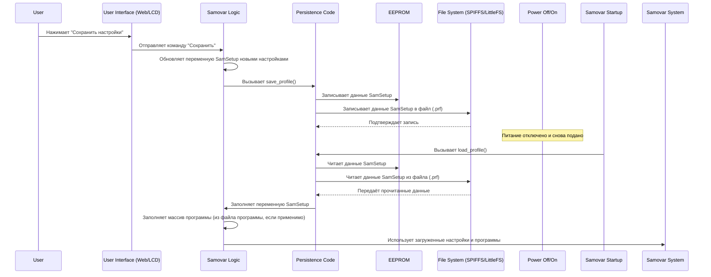

# Глава 7: Сохранение конфигурации

Добро пожаловать обратно в учебник по Самовару! В нашем путешествии до сих пор мы изучили, как вы взаимодействуете с Самоваром ([Глава 1: Взаимодействие с пользователем (Web & LCD)](01_user_interaction__web___lcd__.md)), как он выполняет процессные программы ([Глава 2: Исполнение процессных программ](02_process_program_execution_.md)), управляет своим общим состоянием ([Глава 3: Управление состоянием системы и режимами](03_system_state___mode_management_.md)), собирает данные с датчиков ([Глава 4: Сбор данных с датчиков](04_sensor_data_acquisition_.md)), управляет оборудованием ([Глава 5: Управление аппаратурой (Исполнительные механизмы)](05_hardware_control__actuators__.md)), и обеспечивает безопасность с помощью тревог ([Глава 6: Мониторинг безопасности и тревоги](06_safety_monitoring___alarms_.md)).

Но представьте, что вы потратили время на тщательную калибровку датчиков температуры, тонкую настройку скорости насоса и разработку идеальной пошаговой программы для вашего любимого дистиллята. Вы выключаете Самовар, снова включаете... и все эти пользовательские настройки и программы исчезли! Это было бы невероятно раздражающе.

Здесь на помощь приходит **сохранение конфигурации**. Это способность Самовара запоминать свои настройки, значения калибровки и ваши тщательно созданные процессные программы даже после отключения питания. Это как сохранение прогресса и настроек в видеоигре, чтобы позже вернуться к игре с того же места.

Без механизма сохранения вам пришлось бы настраивать все вручную каждый раз, когда вы хотите использовать Самовар. Сохранение делает устройство удобным и практичным для реального использования.

## Почему сохранение важно: пример использования

Допустим, вы только что откалибровали свой перистальтический насос (тот, который точно регулирует сбор жидкости, см. [Глава 5: Управление аппаратурой (Исполнительные механизмы)](05_hardware_control__actuators__.md)). Эта калибровка сообщает Самовару, сколько шагов шагового двигателя требуется, чтобы выдать один миллилитр жидкости. Вы ввели это значение (`StepperStepMl`) через страницу настроек веб-интерфейса.

Если вы хотите, чтобы это значение было корректным и *в следующий* раз после включения Самовара, его нужно сохранить где-то, где данные не теряются при отключении питания.

Система также должна запоминать:
*   Ваши учетные данные Wi-Fi (SSID и пароль).
*   Калибровочные смещения для температурных датчиков.
*   Пороговые значения безопасности по температуре или давлению.
*   Параметры настройки ПИД-регулятора для режима Пива.
*   Весь список шагов выбранной процессной программы (Головная фракция, Тело, Хвосты, Затирание и т.д.).

Вся эта информация должна сохраняться и загружаться автоматически.

## Где Самовар хранит информацию?

В отличие от основной памяти (RAM), которая теряет все данные при отключении питания, микроконтроллер Самовара (ESP32) имеет специальные виды памяти, способные сохранять данные:

1.  **EEPROM (Электрически стираемое программируемое постоянное запоминающее устройство):** Небольшая область памяти, подходящая для хранения небольших объемов конфигурационных данных, таких как числа, флаги и короткие строки. Рассчитана на множество циклов чтения/записи, но имеет ограниченный размер.
2.  **SPIFFS / LittleFS:** Файловые системы, разработанные для flash-памяти (подобно той, что используется в USB-накопителях или SD-картах, но встроенной в ESP32). Хорошо подходят для хранения больших объемов данных, например, текстовых файлов (веб-страницы, лог-файлы, определения программ) и больших структур данных. Самовар может использовать как SPIFFS, так и LittleFS в зависимости от конкретного "железа" или конфигурации. В коде часто используется термин `SPIFFS` даже если под капотом работает LittleFS.

Самовар использует комбинацию этих методов хранения, чтобы все необходимые конфигурации и программные данные были сохранены.

## Что нужно сохранять?

У Самовара есть основная структура данных (контейнер), хранящая большинство важных настроек. В коде она определена как структура `SetupEEPROM`.

```c++
// Из Samovar.h (упрощенно)
struct SetupEEPROM {
  uint8_t flag;                 // Внутренний флаг (например, для версионирования)
  float DeltaSteamTemp;         // Калибровочное смещение датчика пара
  float DeltaPipeTemp;          // Калибровочное смещение датчика трубы
  // ... другие калибровочные значения ...
  uint16_t StepperStepMl;       // Шаги шагового двигателя на 1 мл (калибровка насоса!)
  bool UsePreccureCorrect;      // Коррекция давления
  uint8_t TimeZone;             // Настройка часового пояса
  float HeaterResistant;        // Сопротивление нагревателя (для расчета мощности)
  uint8_t LogPeriod;            // Частота логирования данных
  char SteamColor[20];          // Цвета веб-интерфейса
  // ... другие параметры интерфейса (цвета, флаги зуммера) ...
  uint8_t SteamAdress[8];       // Сохранённый адрес датчика пара
  // ... сохранённые адреса других датчиков ...
  bool useautospeed;            // Настройка авто-скорости насоса
  uint8_t autospeed;            // Процент авто-скорости насоса
  char blynkauth[33];           // Токен аутентификации Blynk
  char videourl[120];           // URL видео
  float DistTemp;               // Температура окончания дистилляции
  int Mode;                     // Последний использованный режим
  // ... ПИД-настройки (Kp, Ki, Kd), настройки других режимов (Пиво, НБК) ...
  bool UseBuzzer;               // Флаг включения зуммера
  float MaxPressureValue;       // Максимальный предел давления
  char tg_token[50];            // Токен Telegram-бота
  char tg_chat_id[14];          // Chat ID Telegram
  // ... другие настройки безопасности и общие параметры ...
};

SetupEEPROM SamSetup; // Эта переменная хранит ВСЕ текущие настройки
```

Переменная `SamSetup` (типа `SetupEEPROM`) — это место, где Самовар хранит *все* эти настройки во время работы. Когда нужно сохранить — содержимое `SamSetup` записывается в энергонезависимую память. При запуске оно читается из памяти и заполняет `SamSetup` сохранёнными значениями.

Процессные программы (массив `WProgram`, см. [Глава 2: Исполнение процессных программ](02_process_program_execution_.md)) часто сохраняются и загружаются отдельно, обычно в файлы на SPIFFS/LittleFS, особенно если редактируются через веб-интерфейс. Это даёт гибкость при редактировании и хранении нескольких программ.

## Как работает сохранение и загрузка

Процесс сохранения конфигурации включает два основных действия:

1.  **Сохранение:** Запись текущей структуры `SamSetup` и, возможно, текущего массива программы в энергонезависимую память. Обычно это происходит, когда пользователь явно нажимает кнопку "Сохранить" в веб-интерфейсе или после определённых критических событий.
2.  **Загрузка:** Чтение сохранённой структуры `SamSetup` и программных данных из энергонезависимой памяти в переменную `SamSetup` и массивы программ при запуске Самовара. Это происходит автоматически после каждого включения или сброса питания.

Визуализируем процесс сохранения/загрузки:



Диаграмма показывает, что сохранение — это копирование содержимого переменной `SamSetup` в память, а загрузка — это копирование данных *из* памяти *в* переменную `SamSetup` (и массивы программ). Основные обработчики в коде — функции `save_profile()` и `load_profile()`.

## Погружение в код

Посмотрим, как это реализовано в коде Самовара.

### Структура `SamSetup` (упрощённо)

Как показано выше, структура `SetupEEPROM` — это шаблон для хранения настроек. Глобальная переменная `SamSetup` содержит живую конфигурацию.

```c++
// Из Samovar.h
struct SetupEEPROM {
  uint8_t flag; // Внутренний флаг
  float DeltaSteamTemp; // Смещение датчика
  // ... много других настроек ...
  uint16_t StepperStepMl; // Калибровка насоса!
  int Mode; // Последний использованный режим
  // ... ещё настройки ...
};

SetupEEPROM SamSetup; // В текущей RAM
```

Во время работы Самовара любые изменения через веб-интерфейс (например, изменение `StepperStepMl` или `DeltaSteamTemp`) обновляют соответствующие поля в переменной `SamSetup` *в оперативной памяти*. Эти изменения временные, пока не произойдет операция сохранения.

### Сохранение настроек: `save_profile()`

Функция `save_profile()` вызывается для того, чтобы сделать текущие настройки в `SamSetup` постоянными.

```c++
// Из FS.ino
void save_profile() {
  // Получить имя файла на основе текущего режима Самовара (Samovar_CR_Mode)
  String filename = get_prf_name(); 
  
  // Открыть файл на SPIFFS/LittleFS для записи. FILE_WRITE — создаёт или перезаписывает.
  File file = SPIFFS.open(filename, FILE_WRITE);
  if (!file) {
    Serial.println(F("Не удалось открыть файл конфигурации для записи"));
    // Обработка ошибки, возможно, отправка сообщения пользователю
    SendMsg("Не удалось сохранить файл конфигурации!", ALARM_MSG);
    return;
  }
  
  // Записать всё содержимое структуры SamSetup в файл
  // sizeof(SamSetup) — общий размер структуры в байтах
  file.write((uint8_t *)&SamSetup, sizeof(SamSetup));
  file.close(); // Закрыть файл для гарантии записи

  // Также записать настройки в EEPROM как резервную копию или альтернативу
  // EEPROM.put(address, data) — запись данных по адресу
  EEPROM.put(0, SamSetup); // Запись SamSetup с адреса 0
  EEPROM.commit(); // Гарантировать сохранение изменений во flash EEPROM

  Serial.println(F("Конфигурация сохранена."));
  SendMsg("Настройки сохранены!", NOTIFY_MSG); // Уведомить пользователя
}
```

Эта функция берет переменную `SamSetup` и записывает её "сырые" байты в файл профиля `.prf` на файловой системе. Также эти же данные пишутся в EEPROM. Запись в два места обеспечивает отказоустойчивость. Вызов `EEPROM.commit()` необходим для завершения записи во flash EEPROM.

Обычно эта функция вызывается обработчиком веб-сервера при отправке формы `/save` (см. Глава 1).

```c++
// Из WebServer.ino (см. Главу 1)
server.on("/save", HTTP_POST, [](AsyncWebServerRequest *request) {
  handleSave(request); // Эта функция читает параметры из POST-запроса и обновляет SamSetup
  save_profile(); // <-- После обновления вызвать сохранение
  request->send(200, "text/plain", "OK");
});
```

Функция `handleSave` (не полностью показана, но она перебирает данные формы) обновляет переменную `SamSetup` в оперативной памяти. *Затем* вызывается `save_profile()` для записи обновленных значений в память.

### Загрузка настроек: `load_profile()` и `read_config()`

Загрузка происходит автоматически в функции `setup()` Самовара (код, выполняющийся один раз при запуске устройства). Вызывается функция `read_config()`, которая в свою очередь вызывает `load_profile()`.

```c++
// Из Samovar.ino (упрощённый setup())
void setup() {
  // ... инициализация системы ...
  EEPROM.begin(sizeof(SamSetup)); // Инициализация EEPROM под нужный размер
  read_config(); // Вызов функции загрузки настроек
  // ... остальной setup ...
}

// Из FS.ino
void read_config() {
  // Сначала чтение из EEPROM (может быть устаревшим или по умолчанию)
  EEPROM.get(0, SamSetup);

  // Определить имя файла на основе режима, сохранённого в SamSetup (из EEPROM)
  // ВНИМАНИЕ: Samovar_CR_Mode используется внутри, обычно соответствует последнему сохранённому режиму
  Samovar_CR_Mode = (SAMOVAR_MODE)SamSetup.Mode; 
  String filename = get_prf_name(); 

  // Проверить, существует ли файл профиля на файловой системе
  if (SPIFFS.exists(filename)) {
    // Если файл есть, открыть для чтения
    File file = SPIFFS.open(filename, FILE_READ);
    if (!file) {
       Serial.println(F("Не удалось открыть файл конфигурации для чтения"));
       // Обработка ошибки
       return;
    }
    
    // Считать всё содержимое файла напрямую в структуру SamSetup
    file.read((uint8_t *)&SamSetup, sizeof(SamSetup));
    file.close(); // Закрыть файл
    
    // Обновить текущий рабочий режим на основе загруженной настройки
    Samovar_Mode = (SAMOVAR_MODE)SamSetup.Mode; 
    
    Serial.println(F("Конфигурация загружена из файла."));
  } else {
    // Если файла профиля нет (первый запуск или файл удалён),
    // попытаться сохранить текущий SamSetup (по умолчанию или из EEPROM)
    // Это гарантирует создание файла для будущих сохранений.
    Serial.println(F("Файл конфигурации не найден, создаётся по умолчанию."));
    save_profile(); 
  }

  // ... Дополнительная логика инициализации других настроек или датчиков на основе SamSetup ...
  SteamSensor.SetTemp = SamSetup.SetSteamTemp; // Скопировать загруженное значение в текущую переменную датчика
  // ... копирование других загруженных настроек в рабочие переменные ...

  // Валидация загруженных данных (проверка на NaN, нули и т.п.), установка по умолчанию
  if (isnan(SamSetup.Kp)) { SamSetup.Kp = 150; }
  // ... валидация других настроек ...
}
```

Функция `read_config()` сначала читает структуру `SamSetup` из EEPROM. Затем проверяет, существует ли соответствующий файл профиля (`.prf`) на файловой системе. Если файл есть, структура `SamSetup` читается *из файла*, перезаписывая прочитанное из EEPROM. Это даёт приоритет настройкам, сохранённым в файле, которые проще управлять через веб-интерфейс. Если файла нет, вызывается `save_profile()` для создания файла с настройками по умолчанию (или теми, что были в EEPROM). В конце значения из `SamSetup` копируются в другие переменные, используемые по коду, и проводится валидация.

### Сохранение программ

Процессные программы (массив `program`) обычно сохраняются отдельно от основной структуры `SamSetup`. Они часто редактируются через специальную страницу веб-интерфейса и сохраняются как файлы (например, `/rectificat.prg`, `/beer.prg`) на файловой системе.

Функция `create_data()`, которая вызывается в начале запуска программы (см. Главу 2), включает логику сохранения *текущей* конфигурации программы в файл с именем `prg.csv` или похожим, в зависимости от режима. Это служит записью конкретной выполненной программы.

```c++
// Из FS.ino (упрощённая create_data)
void create_data() {
  // ... закрыть предыдущий лог-файл, если открыт ...

  // Сохранить текущую программу в файл на основе активного режима
  if (Samovar_Mode == SAMOVAR_RECTIFICATION_MODE) {
      File filePrg = SPIFFS.open("/prg.csv", FILE_WRITE);
      // get_program(CAPACITY_NUM * 2) форматирует массив программы в строку
      filePrg.println(get_program(CAPACITY_NUM * 2)); 
      filePrg.close();
  } 
  // ... похожая логика для режимов ПИВО, ДИСТИЛЛЯЦИЯ, НБК с сохранением своих программ ...

  // ... логика управления лог-файлами (data.csv) ...
}
```

Загрузка массива программы (`program[30]`) обычно происходит, когда пользователь *выбирает* программу через веб-интерфейс или LCD, а не автоматически при загрузке. Веб-интерфейс предоставляет механизм выбора файла программы из файловой системы и загрузки его содержимого в активный массив `program` для выполнения. Эндпоинт `/program` в `WebServer.ino` отвечает за сохранение и загрузку файлов программ по web-запросам.

```c++
// Из WebServer.ino (см. Главу 1)
server.on("/program", HTTP_POST, [](AsyncWebServerRequest *request) {
  web_program(request); // Эта функция загружает/сохраняет файлы программ
});
```

Функция `web_program` (не показана) содержит логику чтения/записи данных программ в/из файлов SPIFFS/LittleFS, заполняя или сохраняя глобальный массив `program`.

## Заключение

В этой главе мы рассмотрели **сохранение конфигурации** — важнейший механизм, позволяющий Самовару запоминать настройки и процессные программы между включениями. Мы узнали, что Самовар использует энергонезависимую память, такую как **EEPROM** и **файловую систему SPIFFS/LittleFS**, для постоянного хранения данных. Мы увидели, как основная конфигурация управляется структурой `SamSetup`, а функции `save_profile()` записывают её в память, тогда как `load_profile()` (вызывается из `read_config()`) загружает её при запуске. Также мы рассмотрели, как процессные программы обычно сохраняются и загружаются как отдельные файлы на файловой системе, управляемые через веб-интерфейс и соответствующий код. Понимание механизма сохранения позволяет Самовару сохранять ваши важные индивидуальные настройки, делая эксплуатацию более эффективной и надёжной.

В последней главе мы рассмотрим [Сеть и внешние коммуникации](08_network___external_communication_.md), исследуем, как Самовар подключается к вашей сети, предоставляет обсуждавшийся веб-интерфейс и, возможно, взаимодействует с другими сервисами, такими как Blynk или Telegram.

[Глава 8: Сеть и внешние коммуникации](08_network___external_communication_.md)
