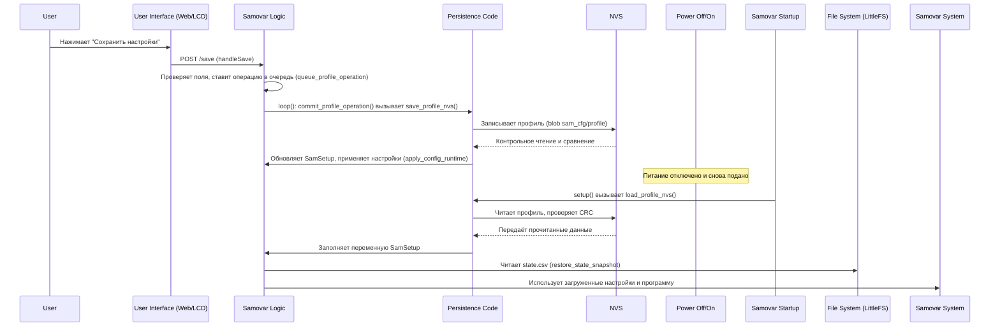

# Глава 7: Сохранение конфигурации

Добро пожаловать обратно в учебник по Самовару! В нашем путешествии до сих пор мы изучили, как вы взаимодействуете с Самоваром ([Глава 1: Взаимодействие с пользователем (Web & LCD)](01_user_interaction__web___lcd__.md)), как он выполняет процессные программы ([Глава 2: Исполнение процессных программ](02_process_program_execution_.md)), управляет своим общим состоянием ([Глава 3: Управление состоянием системы и режимами](03_system_state___mode_management_.md)), собирает данные с датчиков ([Глава 4: Сбор данных с датчиков](04_sensor_data_acquisition_.md)), управляет оборудованием ([Глава 5: Управление аппаратурой (Исполнительные механизмы)](05_hardware_control__actuators__.md)), и обеспечивает безопасность с помощью тревог ([Глава 6: Мониторинг безопасности и тревоги](06_safety_monitoring___alarms_.md)).

Но представьте, что вы потратили время на тщательную калибровку датчиков температуры, тонкую настройку скорости насоса и разработку идеальной пошаговой программы для вашего любимого дистиллята. Вы выключаете Самовар, снова включаете... и все эти пользовательские настройки и программы исчезли! Это было бы невероятно раздражающе.

Здесь на помощь приходит **сохранение конфигурации**. Это способность Самовара запоминать свои настройки, значения калибровки и ваши тщательно созданные процессные программы даже после отключения питания. Это как сохранение прогресса и настроек в видеоигре, чтобы позже вернуться к игре с того же места.

Без механизма сохранения вам пришлось бы настраивать все вручную каждый раз, когда вы хотите использовать Самовар. Сохранение делает устройство удобным и практичным для реального использования.

## Почему сохранение важно: пример использования

Допустим, вы только что откалибровали свой перистальтический насос (тот, который точно регулирует сбор жидкости, см. [Глава 5: Управление аппаратурой (Исполнительные механизмы)](05_hardware_control__actuators__.md)). Эта калибровка сообщает Самовару, сколько шагов шагового двигателя требуется, чтобы выдать один миллилитр жидкости. Вы ввели это значение (`StepperStepMl`) через страницу настроек веб-интерфейса.

Если вы хотите, чтобы это значение было корректным и *в следующий* раз после включения Самовара, его нужно сохранить где-то, где данные не теряются при отключении питания.

Система также должна запоминать:
*   Ваши учетные данные Wi-Fi (SSID и пароль).
*   Калибровочные смещения для температурных датчиков.
*   Пороговые значения безопасности по температуре или давлению.
*   Параметры настройки ПИД-регулятора для режима Пива.
*   Весь список шагов выбранной процессной программы (Головная фракция, Тело, Хвосты, Затирание и т.д.).

Вся эта информация должна сохраняться и загружаться автоматически.

## Где Самовар хранит информацию?

В отличие от основной памяти (RAM), которая теряет все данные при отключении питания, микроконтроллер Самовара (ESP32) имеет специальные виды памяти, способные сохранять данные:

1.  **NVS (Non-Volatile Storage, энергонезависимое хранилище «ключ — значение»):** Небольшой раздел flash-памяти (`nvs` в `partitions.csv`), куда ESP32 записывает именованные значения. Самовар хранит здесь профиль настроек — всю структуру `SetupEEPROM` одним двоичным блоком (blob) под ключом `profile` в пространстве имён `sam_cfg`. Блок снабжён номером формата и контрольной суммой CRC32 (`profile_store.h`), поэтому испорченные данные распознаются при чтении.
2.  **LittleFS:** Файловая система во flash-памяти (раздел `spiffs` в `partitions.csv`). Хорошо подходит для файлов: веб-страницы, лог процесса (`data.csv`, `data_old.csv`), записанная программа (`prg.csv`), снимок состояния (`state.csv`), шаблоны программ (`program_fruit.txt` и др.), Lua-скрипты. В `Samovar.h` задано `#define USE_LittleFS`, а имя `SPIFFS` сделано синонимом `LittleFS` (`#define SPIFFS LittleFS`), поэтому в коде пишется `SPIFFS.open(...)`, хотя работает LittleFS.

Самовар использует комбинацию этих методов хранения, чтобы все необходимые конфигурации и программные данные были сохранены.

## Что нужно сохранять?

У Самовара есть основная структура данных (контейнер), хранящая большинство важных настроек. В коде она определена как структура `SetupEEPROM` (несмотря на имя, хранится она в NVS).

```c++
// Из Samovar.h (упрощенно)
struct SetupEEPROM {
  uint8_t flag;                 // Флаг для записи в память
  float DeltaSteamTemp;         // Калибровочное смещение датчика пара
  float DeltaPipeTemp;          // Калибровочное смещение датчика царги
  // ... другие калибровочные значения и уставки ...
  uint16_t StepperStepMl;       // Шаги шагового двигателя на 1 мл (калибровка насоса!)
  bool UsePreccureCorrect;      // Коррекция температуры отбора тела по давлению
  uint8_t TimeZone;             // Настройка часового пояса
  float HeaterResistant;        // Сопротивление ТЭНа (для расчета мощности)
  char SteamColor[20];          // Цвета температур в веб-интерфейсе
  // ... другие цвета, уровни реле rele1..rele4 ...
  uint8_t SteamAdress[8];       // Сохранённый адрес датчика пара
  // ... сохранённые адреса других датчиков ...
  bool useautospeed;            // Автокорректировка скорости отбора
  uint8_t autospeed;            // Процент изменения скорости
  char blynkauth[33];           // Токен Blynk
  char videourl[120];           // URL видео с камеры
  float DistTemp;               // Температура окончания дистилляции
  int Mode;                     // Последний использованный режим
  float Kp, Ki, Kd;             // Коэффициенты ПИД-регулятора нагрева
  bool UseBuzzer;               // Флаг включения зуммера
  float MaxPressureValue;       // Давление, при котором срабатывает авария
  // ... настройки НБК (включая программу НБК), Су-вида, пива, сыра (калибровка pH) и др. ...
};

SetupEEPROM SamSetup; // Эта переменная хранит ВСЕ текущие настройки
```

Переменная `SamSetup` (типа `SetupEEPROM`) — это место, где Самовар хранит *все* эти настройки во время работы. Когда нужно сохранить — новое содержимое настроек записывается в NVS. При запуске профиль читается из NVS и заполняет `SamSetup` сохранёнными значениями.

Процессные программы (массив `program` из структур `WProgram`, см. [Глава 2: Исполнение процессных программ](02_process_program_execution_.md)) хранятся отдельно от профиля — в файлах LittleFS (снимок `state.csv`). Исключение — программа НБК из четырёх строк: она хранится прямо в профиле (поля `NbkProgramLength`, `NbkProgramHSpeed` … `NbkProgramWPower`).

## Как работает сохранение и загрузка

Процесс сохранения конфигурации включает два основных действия:

1.  **Сохранение:** Запись новых настроек в NVS. Это происходит, когда пользователь нажимает кнопку "Сохранить" в веб-интерфейсе, сохраняет настройки с LCD-меню, переключает режим, а также после автонастройки ПИД или калибровки насоса.
2.  **Загрузка:** Чтение профиля из NVS в переменную `SamSetup` и восстановление программы из снимка `state.csv` при запуске Самовара. Это происходит автоматически после каждого включения или сброса питания.

Визуализируем процесс сохранения/загрузки:


```mermaid
sequenceDiagram
    User->>User Interface (Web/LCD): Нажимает "Сохранить настройки"
    User Interface (Web/LCD)->>Samovar Logic: POST /save (handleSave)
    Samovar Logic->>Samovar Logic: Проверяет поля, ставит операцию в очередь (queue_profile_operation)
    Samovar Logic->>Persistence Code: loop(): commit_profile_operation() вызывает save_profile_nvs()
    Persistence Code->>NVS: Записывает профиль (blob sam_cfg/profile)
    NVS-->>Persistence Code: Контрольное чтение и сравнение
    Persistence Code->>Samovar Logic: Обновляет SamSetup, применяет настройки (apply_config_runtime)

    Note over Power Off/On: Питание отключено и снова подано

    Samovar Startup->>Persistence Code: setup() вызывает load_profile_nvs()
    Persistence Code->>NVS: Читает профиль, проверяет CRC
    NVS-->>Persistence Code: Передаёт прочитанные данные
    Persistence Code->>Samovar Logic: Заполняет переменную SamSetup
    Samovar Logic->>File System (LittleFS): Читает state.csv (restore_state_snapshot)
    Samovar Logic->>Samovar System: Использует загруженные настройки и программу
```

Диаграмма показывает, что сохранение — это запись новых настроек в NVS, а загрузка — это копирование данных *из* NVS *в* переменную `SamSetup` (и программы из снимка в массив `program`). Основные функции в коде — `save_profile_nvs()` и `load_profile_nvs()` из `NVS_Manager.ino`.

## Погружение в код

Посмотрим, как это реализовано в коде Самовара.

### Структура `SamSetup` (упрощённо)

Как показано выше, структура `SetupEEPROM` — это шаблон для хранения настроек. Глобальная переменная `SamSetup` содержит живую конфигурацию.

```c++
// Из Samovar.h
struct SetupEEPROM {
  uint8_t flag; // Флаг для записи в память
  float DeltaSteamTemp; // Смещение датчика
  // ... много других настроек ...
  uint16_t StepperStepMl; // Калибровка насоса!
  int Mode; // Последний использованный режим
  // ... ещё настройки ...
};

SetupEEPROM SamSetup; // В текущей RAM
```

Веб-интерфейс не меняет `SamSetup` напрямую. Обработчик запроса собирает копию настроек с новыми значениями (например, `StepperStepMl` или `DeltaSteamTemp`) и ставит её в очередь. Основной цикл `loop()` сначала записывает эту копию в NVS и только после успешной записи копирует её в `SamSetup` *в оперативной памяти*.

### Сохранение настроек: `save_profile_nvs()`

Функция `save_profile_nvs()` (из `NVS_Manager.ino`) делает переданные ей настройки постоянными.

```c++
// Из NVS_Manager.ino (упрощённо)
PersistResult save_profile_nvs(const SetupEEPROM& candidate) {
  // Упаковать поля структуры в байтовый блок и добавить заголовок с CRC32
  uint8_t payload[ProfileCodec::PAYLOAD_SIZE] = {};
  if (!encode_setup_payload(candidate, payload)) return PERSIST_READBACK_PAYLOAD_ENCODING;
  ProfileCodec::Blob encoded{};
  ProfileCodec::encode(payload, encoded);

  // Записать блок в NVS: пространство имён "sam_cfg", ключ "profile"
  Preferences writer;
  if (!writer.begin(SAMOVAR_PROFILE_NAMESPACE, false)) return PERSIST_OPEN_FAILED;
  const size_t written = writer.putBytes(SAMOVAR_PROFILE_KEY, encoded.bytes, ProfileCodec::BLOB_SIZE);
  writer.end();
  if (written != ProfileCodec::BLOB_SIZE) return PERSIST_SHORT_WRITE;

  // Прочитать записанное обратно, проверить CRC и сравнить побайтно
  // ... nvs_open(), nvs_read_blob(), ProfileCodec::decode(), memcmp() ...
  return PERSIST_OK;
}
```

Эта функция упаковывает настройки в блок с номером формата и контрольной суммой и записывает его в NVS. Сразу после записи блок читается обратно и сравнивается с записанным, так что ошибка флеш-памяти не останется незамеченной. Результат возвращается кодом `PersistResult`; при ошибке пользователь получает сообщение («Настройки не сохранены: …»).

Обычно эта функция вызывается после отправки формы `/save` (см. Глава 1):

```c++
// Из WebServer.ino (см. Главу 1)
server.on("/save", HTTP_POST, [](AsyncWebServerRequest *request) {
  handleSave(request); // Проверяет поля, собирает копию настроек и ставит операцию в очередь
});

// Из Samovar.ino: loop() -> process_profile_operation() -> commit_profile_operation()
const PersistResult persistResult = save_profile_nvs(settingsToSave);
```

Функция `handleSave` проверяет каждое поле формы (неизвестное или неверное поле — ответ с ошибкой) и вызывает `queue_profile_operation()`. *Затем* в основном цикле `commit_profile_operation()` вызывает `save_profile_nvs()`, при успехе обновляет `SamSetup` и применяет настройки (`apply_config_runtime()`).

### Загрузка настроек: `load_profile_nvs()`

Загрузка происходит автоматически в функции `setup()` Самовара (код, выполняющийся один раз при запуске устройства).

```c++
// Из Samovar.ino (упрощённый setup())
void setup() {
  init_power_outputs_safe_off(); // Выходы нагрева — в безопасное состояние до чтения настроек
  // ...
  SetupEEPROM startupProfile{};
  PersistResult profilePersistResult = PERSIST_OK;
  ProfileLoadResult profileResult = load_profile_nvs(startupProfile, profilePersistResult);
  if (profileResult == PROFILE_LOAD_NOT_FOUND) {
    // Профиля ещё нет (первый запуск): значения по умолчанию, которые сразу записываются в NVS
    set_default_setup_profile(startupProfile);
    // ... save_profile_nvs(startupProfile) ...
  }
  if (profileResult != PROFILE_LOAD_OK) {
    // Профиль повреждён: сообщить и работать на безопасных значениях по умолчанию
    report_degraded_boot("load", profile_load_result_code(profileResult));
    set_default_setup_profile(startupProfile);
  }
  // Проверка диапазона сопротивления ТЭНа
  startupProfile.HeaterResistant = trusted_heater_resistance(startupProfile.HeaterResistant);
  SamSetup = startupProfile;
  // ... FS_init(), apply_config_runtime(), restore_state_snapshot() и остальной setup ...
}
```

Функция `load_profile_nvs()` читает блок из NVS и проверяет его размер и контрольную сумму. Если профиля нет, используются значения по умолчанию (`set_default_setup_profile()`), и они сразу записываются в NVS. Если профиль повреждён, Самовар сообщает об этом и запускается на безопасных значениях по умолчанию (реле нагрева выключены). Затем значения из `SamSetup` применяются к рабочим переменным (`apply_config_runtime()`), например, адреса и уставки датчиков.

### Сохранение программ

Процессные программы (массив `program`, до `PROGRAM_MAX` = 30 строк) хранятся отдельно от профиля `SamSetup`. Программа редактируется на странице программы веб-интерфейса как текст и отправляется на устройство запросом `/program`; её можно также загрузить из файла на компьютере или из шаблона (`program_fruit.txt`, `program_grain.txt`, `program_shugar.txt`, `program_bk.txt`).

Функция `create_data()`, которая вызывается в начале запуска программы (см. Главу 2), записывает программу текущего режима в файл `prg.csv`. Это служит записью конкретной выполненной программы.

```c++
// Из FS.ino (упрощённая create_data)
bool create_data() {
  // Записать в файл программу текущего режима (формат зависит от режима)
  String programText = serialize_program_for_mode(Samovar_Mode);
  if (programText.length() > 0) {
    File filePrg = SPIFFS.open("/prg.csv", FILE_WRITE);
    if (!filePrg) return false;
    filePrg.print(programText);
    filePrg.close();
  }

  // ... ротация лога: data.csv -> data_old.csv, создание нового data.csv ...
  return true;
}
```

Чтобы программа не терялась при перезагрузке, Самовар периодически (обычно раз в 30 секунд, а при выключении нагрева — сразу) записывает снимок состояния в файл `state.csv` (`process_state_snapshot()` → `write_state_snapshot()` в `FS.ino`). Первая строка снимка — поля `ключ=значение` (режим, номер строки программы, состояние нагрева, номер сессии и др.), дальше — текст программы. При запуске `restore_state_snapshot()` читает снимок и, если режим совпадает, восстанавливает программу в массив `program`.

```c++
// Из WebServer.ino (см. Главу 1)
server.on("/program", HTTP_POST, [](AsyncWebServerRequest *request) {
  web_program(request); // Принимает текст программы (поле WProgram)
});
```

Функция `web_program` (не показана) проверяет параметры запроса, разбирает текст программы по формату текущего режима и ставит её в ту же очередь операций, что и настройки. Применяет программу основной цикл (`commit_profile_operation()`); при идущем процессе можно менять только строки после текущей.

## Заключение

В этой главе мы рассмотрели **сохранение конфигурации** — важнейший механизм, позволяющий Самовару запоминать настройки и процессные программы между включениями. Мы узнали, что Самовар использует энергонезависимую память — **NVS** для профиля настроек и **файловую систему LittleFS** для файлов. Мы увидели, как основная конфигурация управляется структурой `SamSetup`, а функция `save_profile_nvs()` записывает её в NVS с контрольной суммой и проверкой чтением, тогда как `load_profile_nvs()` загружает её при запуске. Также мы рассмотрели, как процессные программы сохраняются в файлах на файловой системе (`state.csv`, `prg.csv`) и восстанавливаются после перезагрузки. Понимание механизма сохранения позволяет Самовару сохранять ваши важные индивидуальные настройки, делая эксплуатацию более эффективной и надёжной.

В последней главе мы рассмотрим [Сеть и внешние коммуникации](08_network___external_communication_.md), исследуем, как Самовар подключается к вашей сети, предоставляет обсуждавшийся веб-интерфейс и связывается с сервером samovar-tool.ru через Blynk.

[Глава 8: Сеть и внешние коммуникации](08_network___external_communication_.md)
