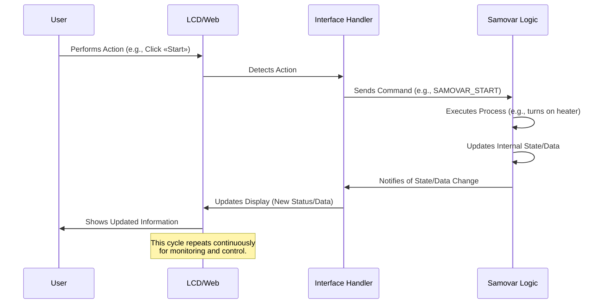

# Chapter 1: User Interaction (Web Interface and LCD)

Welcome to the Samovar tutorial! The first chapter is about how you, the user, can interact with the Samovar system for brewing and distillation. Think of Samovar as a complex machine, and of the user interaction interfaces as its dashboard and control panel. They let you see what Samovar is doing, check its state, and give it commands to perform various tasks.

Whether you are simply monitoring the temperature or setting up a complex brewing program, you need a way to communicate with Samovar. This is where the user interfaces come in. Samovar provides two main ways to do this:

1.  **Physical interface:** a built-in LCD with buttons and a rotary encoder (the kind of rotating knob you may have seen).
2.  **Web interface:** a control panel that you can access from a web browser on your computer or smartphone connected to the same network.

Let's imagine a simple task: you want to see the current temperature inside the brewing vessel, and then start a pre-programmed brewing process. Both the LCD and the web interface let you do this.

## Physical Interface: LCD and Buttons

The LCD shows important information directly on the Samovar device. Next to the screen there are buttons or a rotary encoder. These physical controls let you navigate the menus, browse the different screens, and make simple selections or settings.

### Viewing Information on the LCD

Samovar uses the LCD to display real-time data. This includes sensor readings such as temperature, the current process status, timers and menu options.

Here is a quick look at how the system defines what is shown on the LCD (using the `LiquidCrystal_I2C` and `LiquidMenu` libraries):

```c++
// From Menu.ino
LiquidLine lql_steam_temp(0, 0, str_Steam_T, SteamSensor.avgTemp);
LiquidLine lql_pipe_temp(0, 1, str_Pipe_T, PipeSensor.avgTemp);
LiquidLine lql_water_temp(0, 2, str_Water_T, WaterSensor.avgTemp);
LiquidScreen main_screen(lql_steam_temp, lql_pipe_temp, lql_water_temp, lql_time);
```

This snippet shows how "lines" of text (`LiquidLine`) are defined, linking descriptive text (for example, "Steam T:") with sensor data (for example, `SteamSensor.avgTemp`). These lines are then grouped into "screens" (`LiquidScreen`). Here `main_screen` is set up to show the steam, pipe and water temperatures, as well as the current time. The LCD library (`LiquidCrystal_I2C`) is responsible for actually drawing this text on the screen.

The system must regularly refresh what is shown on the LCD:

```c++
// From Menu.ino
void menu_update() {
  if ( xSemaphoreTake( xI2CSemaphore, ( TickType_t ) (LCD_UPDATE_TIMEOUT / portTICK_RATE_MS)) == pdTRUE) {
    main_menu1.update(); // This tells the menu system to refresh the display
    xSemaphoreGive(xI2CSemaphore);
  }
}
```

This function is called repeatedly to keep the information on the LCD up to date. The `xSemaphoreTake` and `xSemaphoreGive` lines manage access to the display -- they ensure that different parts of the program do not try to use the LCD at the same time, which could cause problems.

### Control with Buttons/Encoder

Physical buttons or, more commonly, a rotary encoder with a push button are used to interact with the menu on the LCD.

The rotary encoder lets you:
* Turn it left or right to move through menu items or change values.
* Press the button (click) to select an item or confirm a change.

The code constantly checks for the following actions:

```c++
// From Menu.ino
void encoder_getvalue() {
  encoder.tick(); // Check the encoder state

  if (encoder.isRight()) {
    // The user turned right -- possibly go to the next screen or increase a value
    if (!main_menu1.is_callable(1)) { // If the current item is not clickable...
      menu_next_screen(); // ...go to the next screen
    } else {
      main_menu1.call_function(1); // ...otherwise execute the associated function (for example, increase a value)
    }
  } else if (encoder.isLeft()) {
    // The user turned left -- possibly go to the previous screen or decrease a value
    if (!main_menu1.is_callable(2)) { // If the current item is not clickable...
      menu_previous_screen(); // ...go to the previous screen
    } else {
      main_menu1.call_function(2); // ...otherwise execute the associated function (for example, decrease a value)
    }
  } else if (encoder.isClick()) {
    // The user pressed the button -- select the current option or change focus
    menu_switch_focus();
  }
  // ... periodic screen updates also happen here ...
}
```
The `encoder_getvalue` function reads the encoder state. Depending on whether it was turned left/right or pressed, it either moves between screens (`menu_next_screen`, `menu_previous_screen`) or calls a specific function associated with the currently selected item (`main_menu1.call_function`). For example, turning right on a temperature setting can call a function that increases the target temperature. A click can switch the focus to allow editing the value.

To start our imaginary process using the LCD, we would navigate the screens with the encoder until we find the "Start" option (Start, «Старт») or select a program, and then press the button. This runs a function such as `menu_samovar_start()`.

## Web Interface

The web interface provides a richer and more visual way to interact with Samovar. You can access it through a web browser (for example, Chrome, Firefox, Safari) by entering the IP address of Samovar. This interface often shows the information from the LCD, but may include additional features such as charts, detailed settings and easy program editing.

### Viewing Information on the Web

The web interface displays sensor data, status messages, program progress and various system parameters. It is like a full control panel on your computer or phone.

The data displayed on the web comes from Samovar, which sends information, usually in a structured format such as JSON, to the web page running in your browser. The web page then updates its display using this data.

```c++
// From WebServer.ino
server.on(«/ajax», HTTP_GET, [](AsyncWebServerRequest *request) {
  //TempStr = temp; // Example comment -- unimportant code
  getjson(); // Collect the current data into a JSON string
  request->send(200, «text/html», jsonstr); // Send the JSON string to the browser
});
```

This snippet shows part of the web server code. When the browser requests the `/ajax` page (this happens periodically in the background on the web page), Samovar runs the `getjson()` function to collect all the latest data (temperatures, status, etc.) into a text string (`jsonstr`) formatted as JSON. It then sends this string back to the browser, which updates the web page elements with the new values.

The web pages themselves (such as `index.htm` and `chart.htm`) are stored in the internal Samovar file system (SPIFFS) and served by the web server.

```c++
// From WebServer.ino
server.serveStatic(«/index.htm», SPIFFS, «/index.htm»).setTemplateProcessor(indexKeyProcessor).setCacheControl(«max-age=800»);
server.serveStatic(«/chart.htm», SPIFFS, «/chart.htm»).setTemplateProcessor(indexKeyProcessor).setCacheControl(«max-age=800»);
// ... other files such as style.css, images ...
```

This tells the web server that when the browser requests `/index.htm` or `/chart.htm`, it should send the corresponding file from its storage. The `.setTemplateProcessor(indexKeyProcessor)` part is interesting -- it means that the server can replace placeholders in the HTML file (such as `%SteamColor%` or `%WProgram%`) with dynamic values from the current Samovar state *before* sending the file to the browser. This lets the web page load with the right settings and appearance based on the Samovar configuration.

### Control via the Web

The web interface has buttons, input fields and drop-down lists that let you send commands and update settings.

When you click a button or change a value on a web page, your browser sends a request back to the Samovar web server.

```c++
// From WebServer.ino
server.on(«/command», HTTP_GET, [](AsyncWebServerRequest *request) {
  web_command(request); // Handle the command from the web request
});
server.on(«/save», HTTP_POST, [](AsyncWebServerRequest *request) {
  handleSave(request); // Handle saving configuration settings
});
server.on(«/program», HTTP_POST, [](AsyncWebServerRequest *request) {
  web_program(request); // Handle program updates
});
// ... other command handlers ...
```

These lines tell the web server what to do when it receives requests to `/command`, `/save` or `/program`. For example, clicking the "Start" («Старт») button on a web page may send a request to `/command?start=1`. The `web_command` function then checks the request for parameters such as `start=1` and converts them into an action that Samovar must perform.

In our case, clicking the "Start" («Старт») button on the web page runs the `web_command` function, which puts a command into the queue (`queue_samovar_command(SAMOVAR_START)`), telling the main Samovar logic to begin the process.

## How It Works

Let's trace the path of a user action, such as starting a process, through the Samovar system.

This `encoder_getvalue` function reads the encoder state. Depending on whether it was turned left/right or pressed, it either moves between screens (`menu_next_screen`, `menu_previous_screen`) or calls a specific function associated with the currently selected item (`main_menu1.call_function`). For example, turning right on a temperature setting may call a function that raises the setpoint temperature. A click can switch the focus to allow editing the value.

To start our imaginary brewing process using the LCD, we would navigate the screens with the encoder until we find the "Start" («Пуск») option or select a program, and then press the button. This runs a function like `menu_samovar_start()`.

## Web Interface

The web interface provides a richer and more visual way to interact with Samovar. You access it through a web browser (for example, Chrome, Firefox, Safari) by entering the IP address of Samovar. This interface often mirrors the information on the LCD, but may include additional features such as charts, detailed settings and easy program editing.

### Viewing Information on the Web

The web interface displays sensor data, status messages, program progress and various system parameters. It is like a full monitoring dashboard on your computer or phone.

The data displayed on the web comes from Samovar, which sends information, usually in a structured format such as JSON, to the web page running in your browser. The web page then updates its display using this data.

```c++
// From the web server .ino
server.on("/ajax", HTTP_GET, [](AsyncWebServerRequest *запрос) {
  //TempStr = temp; // Example comment - not important code
getjson(); // Collect the current data into a JSON string
  запрос->отправить(200, "text/html", jsonstr); // Send the JSON string to the browser
});
```

This snippet shows part of the web server code. When the browser requests the "/ajax" page (this happens periodically in the background on the web page), Samovar runs the "getjson()" function to collect all the latest data (temperatures, status, etc.) into a text string ("jsonstr") formatted as JSON. It then sends this string back to the browser, which updates the web page elements with the new values.

The web pages themselves (for example, "index.htm" and "chart.htm") are stored in the internal Samovar file system (SPIFFS) and served by the web server.

```c++
// From the web server .ino
server.serveStatic("/index.htm", SPIFFS, "/index.htm").setTemplateProcessor(indexKeyProcessor).setCacheControl("максимальный возраст=800").;
сервер.serveStatic("/chart.htm", SPIFFS, "/chart.htm ").setTemplateProcessor(indexKeyProcessor).setCacheControl("max-age=800");
// ... other files such as style.css, images ...
```

This tells the web server that when the browser requests `/index.htm `or`/chart.htm `, it should send the corresponding file from its storage. The ".setTemplateProcessor(indexKeyProcessor)" part is interesting – it means that the server can actually replace placeholders in the HTML file (for example, "%SteamColor%" or "%WProgram%") with dynamic values from the current Samovar state before sending the file to the browser. This lets the web page load with the right settings and appearance depending on the Samovar configuration.

### Control via the Web

The web interface has buttons, input fields and drop-down lists that let you send commands and update settings.

When you click a button or change a value on a web page, your browser sends a request back to the Samovar web server.

```c++
// From the WebServer.ino file
server.on(«/command», HTTP_GET, [](AsyncWebServerRequest *request) {
  web_command(request); // Handle the command from the web request
});
server.on(«/save», HTTP_POST, [](AsyncWebServerRequest *request) {
  handleSave(request); // Handle saving configuration settings
});
server.on(«/program», HTTP_POST, [](AsyncWebServerRequest *request) {
  web_program(request); // Handle program updates
});
// ... other command handlers ...
```

These lines tell the web server what to do when it receives requests to `/команда`, `/сохранить` or `/программа` (in the code: `/command`, `/save` or `/program`). For example, clicking the "Start" («Старт») button on a web page may send a request `/command?start=1`. The `web_command` function checks the request for parameters like `start=1` and converts them into an action that Samovar must perform.

In our case, clicking the "Start" («Старт») button on the web page will call the `web_command` function, which will then put a command into the queue (`queue_samovar_command(SAMOVAR_START)`), telling the main Samovar logic to begin the process.

## How It Works Under the Hood

Let's trace how a user action, such as starting a process, passes through the Samovar system.

When you interact with either interface, the basic idea is the same:
1.  **Input detection:** The interface (the LCD code or the web server code) detects the user's action (an encoder click, a button press, a web request).
2.  **Translate into a command:** The interface code translates this physical action or web request into a specific command or parameter change understood by the main Samovar control logic.
3.  **Command execution:** The main Samovar logic receives the command and performs the corresponding action (for example, turns on the heater, starts a pump, changes a setting).
4.  **Update state:** The internal state and data of Samovar are updated based on the action.
5.  **5. Interface update:** Samovar informs both the LCD and the web interface about the new state and data, so that they can show the user what is happening.

Here is a simplified sequence of actions:


The `Interface Handler` block represents the code responsible for managing the LCD menu (`Menu.ino`) and the web server (`WebServer.ino`). These handlers interact with `Samovar Logic`, which contains the core state machine and the control algorithms of the brewing/distillation process (covered in chapters such as [Process Program Execution](02_process_program_execution_.md) and [System State & Mode Management](03_system_state___mode_management_.md)).

## Key Code Points for Working with the Interfaces

The `Menu.ino` file is intended for working with the LCD and the encoder. It defines the screens and lines, and also defines the functions that are called when the encoder is used while a particular line is selected.

For example, this function is associated with the "Start" line on one of the main screens:

```c++
// From the Menu.ino file
void menu_samovar_start() {
  // Check the conditions for whether the process can start or continue
  if (Samovar_Mode != SAMOVAR_RECTIFICATION_MODE || !PowerOn) return;

  // Logic for determining the next program step
  if (startval == 2) startval = 3;
  else if (ProgramNum >= ProgramLen - 1 && startval != 0)
    startval = 2;

  // Based on the current state (startval), decide what to do
  if (startval == 0) {
    // Initial start
    startval = 1;
    run_program(0); // Execute the first program step
    ProgramNum = 0;
    create_data(); // Start data logging
  } else if (startval == 1) {
    // Move to the next program step
    ProgramNum++;
    run_program(ProgramNum);
  } else if (startval == 2) {
    // Program completion
    run_program(CAPACITY_NUM * 2); // Special program step for finishing
  } else {
    // Stop the process
    run_program(CAPACITY_NUM * 2); // Special program step for stopping
    reset_sensor_counter();
  }
  // Update the text shown on the LCD
  Str.toCharArray(startval_text_val, 20);
  // Update the LCD
  reset_focus();
  menu_update();
}
```

This function is called when the user navigates to the "Start" option on the LCD with the encoder and presses the button. It checks the current state (`startval`, `ProgramNum`) and decides whether to start, continue or stop the program by calling `run_program()` (a function described in detail in [Process Program Execution](02_process_program_execution_.md)). Finally, it updates the text shown on the LCD and refreshes the screen.

The `WebServer.ino` file handles all web interactions. It sets up the endpoints (URLs) that the browser can interact with.

```c++
// From the WebServer.ino file
void web_command(AsyncWebServerRequest *request) {
  // A simple check to prevent accidental double clicks
  static uint32_t last_command_time = 0;
  if (millis() - last_command_time < 1500) {
    request->send(200, «text/plain», «OK»);
    return;
  }
  last_command_time = millis();

  // Check the parameters sent in the URL of the web request
  if (request->params() == 1) { // Assume a simple command with a single parameter
    if (request->hasArg(«start») && PowerOn) {
      // If the request has "start=1" and power is on, set the Samovar command to start
      queue_samovar_command(SAMOVAR_START);
    } else if (request->hasArg(«power»)) { // If the request has "start=1" and power is on, set the Samovar command to start.
      // If the request has "power=1", set the Samovar command to toggle power depending on the mode
      if (Samovar_Mode == SAMOVAR_BEER_MODE) {
        if (!PowerOn) queue_samovar_command(SAMOVAR_BEER);
        else queue_samovar_command(SAMOVAR_POWER); // Use the general power toggle
      }
      // ... similar logic for other modes ...
      else queue_samovar_command(SAMOVAR_POWER); // Default power toggle
    }
    // ... handlers for other commands such as reset, calibration, pause, etc. ...
  }
  request->send(200, «text/plain», «OK»); // Send a simple response to the browser
}
```

This `web_command` function receives a web request. It checks the arguments in the request URL (for example, `?start=1`). Based on the argument found, it puts a specific command value into the `SamovarCommandMsg` queue via `queue_samovar_command(...)`. The main Samovar logic loop takes commands from the queue and performs the corresponding action. This is a common pattern for interaction between different tasks or parts of code in embedded systems.

The web interface also allows saving configuration settings, which is handled by the `handleSave` function (it is not shown in full here, but it reads the parameters from the POST request and updates the `SamSetup` structure), and editing the program, which is handled by `web_program`.

## Conclusion

In this chapter we looked at two ways of interacting with Samovar: the physical LCD with its controls, and the flexible web interface. Both interfaces let you monitor the system state and sensor data and, most importantly, send commands to control the brewing or distillation process, for example, to start a program. We looked at simplified code examples showing how sensor data is displayed, how user input (from encoder presses or web requests) is recognized and converted into commands for the main Samovar logic.

Understanding these interfaces is the first step toward controlling Samovar. In the next chapter we will look in more detail at how Samovar executes the programs you select or define.
