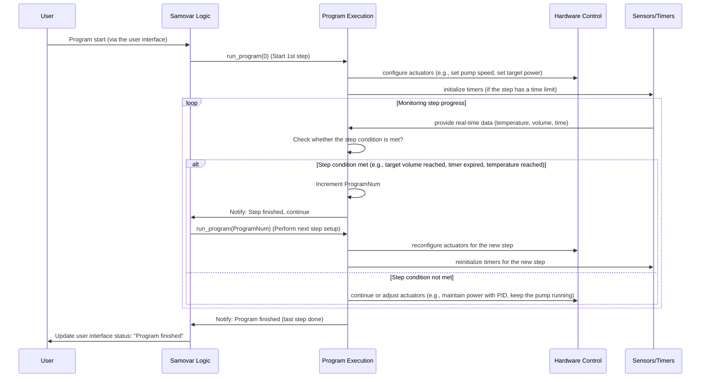

# Chapter 2: Process Program Execution

Welcome to the Samovar tutorial! In [Chapter 1: User Interaction (Web and LCD)](01_user_interaction__web___lcd__.md) we learned how you can tell Samovar what to do using its physical or web interface. Now let's look at what happens *after* you press the "Start" («Старт») button or select a program: how Samovar automatically executes a sequence of steps to carry out your brewing or distillation process.

Imagine you are following a recipe. A recipe is not just a single instruction, it is a list of steps: "Heat the water to X degrees", "Add ingredient Y and stir for Z minutes", "Hold the temperature at A degrees for B hours", and so on. Each step has certain requirements (temperature, time, action).

The Samovar project deals with complex processes such as spirit distillation (rectification, distillation, NBK) or beer brewing (wort preparation stages, boiling). These processes also require following an exact sequence of steps with specific parameters. Controlling everything manually as the process goes on would be incredibly tedious and would require constant attention.

This is where **Process Program Execution** comes in. It is like an automated chef who follows your recipe exactly.

## What Is a Process Program?

In Samovar, a "program" is simply a stored list or sequence of steps. Each step in the program tells Samovar to perform a specific action with specific parameters until a given condition is met.

Think of a program as a spreadsheet or a list of instructions for Samovar. For example, a step in a "Rectification" program might look like this:

* **Type:** Heads collection
* **Volume:** 100 ml
* **Speed:** 0.1 l/h
* **Target temperature:** (optional, often based on the previous step)
* **Collection vessel:** Container 1
**Heater power:** 120 V (or the equivalent percentage/power)

A step in a "Beer" program might look like this:

* **Type:** Temperature rest (mashing step)
* **Target temperature:** 65°C
* **Duration:** 60 minutes
**Mixer/pump:** Runs periodically
**Heater power:** Controlled by PID to maintain the temperature

As you can see, the parameters may differ depending on the overall *mode* (rectification, beer, NBK), but the main idea is the same: a step defines *what* to do, *how much / how fast / at what temperature* to do it, and *when to stop* and move on to the next step.

Samovar needs to:
1.  Store these programs.
2.  Know which program step is currently active.
3.  Perform the actions required by the current step.
4.  Monitor the conditions to determine when the current step is complete.
5.  Automatically move on to the next step.

## Programs and Modes

Samovar supports different modes (Rectification, Distillation, Beer, NBK). Although they all use the concept of a program made up of steps, the meaning of the parameters within a step can differ slightly depending on the mode. For example, "Volume" in a "Rectification" program means the volume of liquid collected, while in a "Beer" program it is the duration of mixer/pump operation.

The Samovar firmware uses a common structure to store the data for each step, and the mode-specific code interprets this structure.

The structure used to define a single program step is called `WProgram` in the code:

```c++
// From Samovar.h
struct WProgram {
  String WType; // Step type (for example, "Heads", "Body", "Pause", "Mash", "Boil")
  uint16_t Volume; // Volume (ml) or duration (sec. for pause/stirrer)
  float Скорость; // Speed (l/h) or value (% alcohol, temperature)
  uint8_t capacity_num; // Vessel number or mixer/pump mode configuration
  float Temp; // Target temperature or temperature delta
  uint16_t Power; // Heater voltage/power setting
  uint8_t TempSensor; // Temperature sensor to monitor (used in some modes, for example, Beer)
  float Time; // Calculated duration based on volume/speed or an explicit time
};

WProgram program[30]; // Array that stores the program steps
```
The `program` array holds up to 30 steps of the current program. The various mode handlers (`rectification_proc`, `beer_proc`, `nbk_proc`, and so on -- described in [Chapter 3: System State and Mode Management](03_system_state___mode_management_.md)) will check `program[ProgramNum]` (where `ProgramNum` is the index of the currently active step) and use the fields (`WType`, `Volume`, `Speed`, and so on) according to the logic of the given mode.

For example, in "Rectification" mode, `program[ProgramNum]. Volume` controls the target volume for the stepper motor, and `program[ProgramNum].Speed` controls the stepper motor speed. In a beer mashing step (`WType == «P»`), `program[ProgramNum].Volume` may be the mixer cycle duration, and `program[ProgramNum].Temp` the target temperature for the heater PID controller.

## How Program Execution Works Under the Hood

Let's trace what happens when a program starts, for example when a rectification process is launched, using the sequence diagram below. The diagram focuses on the key components involved in reading the "recipe" and performing actions according to it.



As you can see, the process is cyclical:
1.  The user starts the program (Chapter 1).
2.  The main Samovar logic calls the program execution handler, telling it which step to start from (usually step 0).
3.  The program execution code reads the parameters for that particular step from the `program` array.
4.  Based on these parameters, it instructs **hardware control** (Chapter 5) to set parameters such as pump speed, heater power or valve state. If the step has a time limit, a timer may be started.
5.  The system then enters a monitoring loop. It continuously receives data from the **sensors** (Chapter 4) and checks whether the conditions for completing the *current* step are met (for example, "Has the target volume been reached?", "Has the timer expired?", "Has the temperature remained stable long enough?").
6.  If the condition is *not* met, monitoring continues and hardware control may be adjusted based on real-time sensor data (for example, a PID controller adjusts the heater power to maintain the temperature).
7.  If the condition *is* met, the program execution code increments the `ProgramNum` counter and instructs the main logic to run the setup for the *next* step, starting the cycle over with new parameters and conditions.
8.  This continues until the special "finish" step is reached or the last defined step is completed.

## Diving into the Code

Let's look at a few simplified code snippets to understand how this works.

First, how a program step is started or switched to. This often happens in a function like `run_program` (used in Rectification mode) or similar functions for other modes. This function reads the parameters for the given step number (`num`) and configures the hardware and state variables accordingly.

```c++
// Simplified code snippet based on run_program from logic.h
void run_program(uint8_t num) {
  // Reset all timers or waiting states from the previous step
  t_min = 0;
  program_Pause = false; // Flag for the program pause step
  program_Wait = false;  // Flag for waiting on a temperature/pressure condition

  // Check whether we are at the special "finish" step
  if (num == CAPACITY_NUM * 2) { // CAPACITY_NUM * 2 is used as the "finish" marker
    // Perform cleanup actions: stop motors, switch off power, close files, etc.
    // ... simplified cleanup code ...
    set_power(false); // Switch off the main power
    SendMsg((«Программа завершена.»), NOTIFY_MSG); // Notify the user ("Program finished.")
    return; // Exit the function
  }

  // We are starting a regular program step (num)
  ProgramNum = num; // Update the global index of the current program step

  // Log or notify the user about the step change
  SendMsg(«Starting program step #» + String(num + 1), NOTIFY_MSG);

  // Read the parameters for the current step from the "program" array
  String stepType = program[num].WType;
  uint16_t targetVolume = program[num].Volume;
  float targetSpeed = program[num].Speed;
  uint8_t vesselNum = program[num].capacity_num;
  float targetTemp = program[num].Temp;
  uint16_t targetPower = program[num].Power;

  // --- Example: handling different step types ---
  if (stepType == «H» || stepType == «B» || stepType == „T“ || stepType == «C») {
    // This is a liquid collection step (heads, hearts, tails, pre-boil)

    // Set the collection vessel position (using a servo or other mechanism)
    set_capacity(vesselNum);

    // Set the target volume and speed for the stepper motor/pump
    stepper.setMaxSpeed(get_speed_from_rate(targetSpeed));
    stepper.setCurrent(0); // Start counting the volume from zero for this step
    stepper.setTarget(targetVolume * SamSetup.StepperStepMl); // The target is the volume converted to stepper motor steps

    // Start the motor/pump (Chapter 5)
    startService();

    ActualVolumePerHour = targetSpeed; // Update the display/logging of the current speed

    // If a temperature condition is specified, store it
    if (targetTemp > 0) {
        SteamSensor.BodyTemp = targetTemp; // Example: store the target steam temperature
        // Other sensors may also store their target values
    }

  } else if (stepType == «P») {
    // This is a "Pause" step

    // Set a timer for the pause duration (here the "Volume" field holds the time)
    SendMsg(«Пауза на » + String(targetVolume) + « секунд.», NOTIFY_MSG); // "Pause for N seconds."
    t_min = millis() + targetVolume * 1000;
    program_Pause = true;

    // Stop any current liquid collection
    stopService();
    stepper.brake();
    stepper.disable();
    stepper.setCurrent(0); // Optionally reset the volume counter for pause steps
    stepper.setTarget(0);
  }
  // ... other step types such as Beer Mash, Boil, NBK phases would have their logic here ...

  // Potentially set the initial power for the step (if specified)
#ifdef SAMOVAR_USE_POWER
  if (targetPower > 0) {
     set_current_power(targetPower); // Use power control (Chapter 5)
  }
#endif

  // Update the display if an LCD is used (Chapter 1)
  // menu_update();
}
```
This `run_program` function is called once when a step begins. Its job is to configure the system (actuators, timers, target values) based on the parameters of the specific program step. It does not *monitor* the step; that happens elsewhere.

Monitoring happens in other parts of the main Samovar loop, often in functions that are called repeatedly, such as `withdrawal()` (for monitoring liquid collection during rectification) or in the `distiller_proc()`, `beer_proc()`, `nbk_proc()` loops themselves. These loops constantly check sensor readings, timers and progress against the target values set by `run_program`.

Here is a simplified example of how step completion might be checked (using the `withdrawal` function as an example):


```c++
// Simplified code snippet for checking step completion conditions
void check_program_progress() {
  // If the program is not in a running state, do nothing
  if (SamovarStatusInt != 10 && SamovarStatusInt != 15) { // 10: running, 15: waiting
    return;
  }

  uint8_t currentStepIndex = ProgramNum; // Get the index of the current step
  String stepType = program[currentStepIndex].WType;

  // --- Check the completion conditions depending on the step type ---

  if (stepType == «H» || stepType == «B» || stepType == „T“ || stepType == «C») {
    // For liquid collection steps: check whether the target volume has been reached
    CurrrentStepps = stepper.getCurrent(); // Get the current collected volume (in steps)
    TargetStepps = program[currentStepIndex].Volume * SamSetup.StepperStepMl; // Target in steps

    if (CurrrentStepps >= TargetStepps) {
      // Target volume reached! Move on to the next program step.
      SendMsg(«Достигнут целевой объем для шага №» + String(currentStepIndex + 1), NOTIFY_MSG); // "Target volume reached for step #N"
      // Call the function that starts the next step
      menu_samovar_start(); // This function handles the transition to the next step (or finishing)
      return; // Exit this check, since the step is complete
    }

    // Also check the temperature-based completion condition, if specified for the "Body"/"Pre-boil" steps
    if ((stepType == «B» || stepType == «C») && program[currentStepIndex].Temp != 0) {
        float targetTemp = program[currentStepIndex].Temp;
        float currentSteamTemp = SteamSensor.avgTemp; // Get the real-time steam temperature

        // Check whether the steam temperature exceeds the target value (possibly corrected for pressure)
        float effectiveTargetTemp = get_temp_by_pressure(SteamSensor.Start_Pressure, targetTemp, bme_pressure); // Use the pressure correction if configured

        if (currentSteamTemp >= effectiveTargetTemp + SteamSensor.SetTemp) { // Check against the setpoint plus the configured deviation
            // Temperature condition met! This may indicate a change in composition.
            // In some modes/steps this triggers a pause or a transition to the next step.
            if (!program_Wait) { // If not yet in the temperature waiting state
               // Enter the waiting state or move to the next step depending on the specific logic
               // Example: if configured, enter the temperature waiting period (program_Wait = true)
               // or immediately call menu_samovar_start() to move to the next step.
               SendMsg(«Условие температуры выполнено для шага №» + String(currentStepIndex + 1), WARNING_MSG); // "Temperature condition met for step #N"
               // The logic here would determine whether this is a pause (setting t_min) or a transition to the next step.
               // For simplicity, let's assume a transition is triggered here:
               menu_samovar_start(); // Move to the next step (for example, Tails or another body step)
               return;
            }
            // If already waiting, check whether the waiting time has expired (handled by the timer check below)
        }
    }

  } else if (stepType == «P») {
    // For Pause steps: check whether the timer has expired
    if (program_Pause && millis() >= t_min) {
      // The pause duration is over! Move on to the next program step.
      SendMsg(«Pause finished for step #» + String(currentStepIndex + 1), NOTIFY_MSG);
      program_Pause = false; // Clear the pause flag
      // Call the function that starts the next step
      menu_samovar_start(); // This function handles the transition to the next step
      return; // Exit this check
    }
  }

  // --- Check the general waiting conditions (for example, temperature stabilization after a pause) ---
  if (program_Wait && millis() >= t_min) {
      // The temperature/pressure waiting period (initiated elsewhere, for example in check_alarm) has ended.
      // Check whether the condition that caused the wait has been resolved.
      float currentSteamTemp = SteamSensor.avgTemp;
      float bodyTempTarget = get_temp_by_pressure(SteamSensor.Start_Pressure, SteamSensor.BodyTemp, bme_pressure);

      // Example check: has the steam temperature dropped back below the threshold after the temperature pause?
      if (currentSteamTemp < bodyTempTarget + SteamSensor.SetTemp) {
          SendMsg(«Условие ожидания разрешено. Возобновление процесса.», NOTIFY_MSG); // "Wait condition resolved. Resuming the process."
          program_Wait = false; // Clear the waiting flag
          t_min = 0; // Clear the timer
          pause_withdrawal(false); // Resume liquid collection if it was paused
      } else {
          // Condition not met, reset the timer and keep waiting
          t_min = millis() + SteamSensor.Delay * 1000; // Wait some more time
          SendMsg(«Условие не выполнено, продолжить ожидание.», NOTIFY_MSG); // "Condition not met, continue waiting."
      }
  }

  // If none of the completion conditions are met, the current step continues...
}

```
This `check_program_progress` function (or similar logic distributed across the mode-specific `check_alarm` functions) is called repeatedly in the main loop. It is the engine that moves the program forward, tracking the state and triggering the transition to the *next* step via `menu_samovar_start()` or `run_program()` when the goal of the current step is reached.

The `menu_samovar_start()` function (mentioned in Chapter 1 and called by `check_program_progress` when a step is complete) has a somewhat misleading name, since it does not *only* start the very first step. It is more of a general "Advance program state" function for "Rectification" mode:

```c++
// Simplified logic from menu_samovar_start in Menu.ino (used in Rectification mode)
void menu_samovar_start() {
  // Check whether the system is ready or a program is already running that can be advanced
  // ... (checks PowerOn, the current SamovarMode, etc.) ...

  // Determine the "next action" state based on the current state (startval)
  if (startval == 0) {
    // startval 0 means idle/ready, start the very first program execution
    startval = 1; // Change the state to "running"
    run_program(0); // Start the program from step 0
    // create_data(); // Start data logging (Chapter 7)
  } else if (startval == 1) {
    // startval 1 means a regular step is running, move to the NEXT step
    ProgramNum++; // Increment the step counter
    // Check whether a next step is defined in the program array
    if (program[ProgramNum].WType.length() > 0) {
      run_program(ProgramNum); // Execute the next step
    } else {
      // No more steps defined, the program is finished
      startval = 2; // Change the state to "finished"
      run_program(CAPACITY_NUM * 2); // Call run_program with the "finish" marker
    }
  } else if (startval == 2 || startval == 3) {
    // startval 2 means finished, startval 3 may mean stopped
    // In these states pressing the "Start" button actually stops/resets the process
    startval = 0; // Change the state back to "idle"
    run_program(CAPACITY_NUM * 2); // Call run_program with the "finish" marker for cleanup
    // reset_sensor_counter(); // Reset the counters (Chapter 4)
  }
  // Update the LCD (Chapter 1)
  // menu_update();
}
```
This function acts as a state driver for Rectification programs. When called, it checks the current value of `startval` (the program state) and `ProgramNum` (the index of the current step) to decide whether to actually start, move on to the next step, or initiate the finishing process.

## Conclusion

In this chapter we learned that **Process Program Execution** is the way Samovar automatically carries out a sequence of predefined steps, much like a recipe. We saw how programs are stored as an array of `WProgram` structures, with each mode interpreting the step parameters differently. We studied the internal flow in which a program step is initiated by a function such as `run_program`, which configures the system according to the step parameters. We also saw how monitoring logic (such as `check_program_progress` or similar code in the mode handlers) constantly checks the step completion conditions using sensor data and timers, automatically moving to the next step with functions such as `menu_samovar_start()` when the step is finished. This automation is the key to running complex brewing and distillation processes without human involvement.

In the next chapter we will delve into [System State and Mode Management](03_system_state___mode_management_.md) to understand how Samovar learns *which* program to run (rectification, beer, etc.) and how it manages its overall operating state.

[Chapter 3: System State and Mode Management](03_system_state___mode_management_.md)
