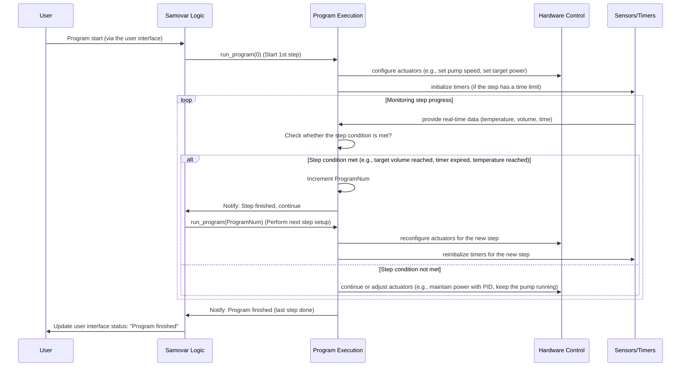

# Chapter 2: Process Program Execution

Welcome to the Samovar tutorial! In [Chapter 1: User Interaction (Web and LCD)](01_user_interaction__web___lcd__.md) we learned how you can tell Samovar what to do using its physical or web interface. Now let's look at what happens *after* you press the "Start" («Старт») button or select a program: how Samovar automatically executes a sequence of steps to carry out your brewing or distillation process.

Imagine you are following a recipe. A recipe is not just a single instruction, it is a list of steps: "Heat the water to X degrees", "Add ingredient Y and stir for Z minutes", "Hold the temperature at A degrees for B hours", and so on. Each step has certain requirements (temperature, time, action).

The Samovar project deals with complex processes such as spirit distillation (rectification, distillation, NBK) or beer brewing (wort preparation stages, boiling). These processes also require following an exact sequence of steps with specific parameters. Controlling everything manually as the process goes on would be incredibly tedious and would require constant attention.

This is where **Process Program Execution** comes in. It is like an automated chef who follows your recipe exactly.

## What Is a Process Program?

In Samovar, a "program" is simply a stored list or sequence of steps. Each step in the program tells Samovar to perform a specific action with specific parameters until a given condition is met.

Think of a program as a spreadsheet or a list of instructions for Samovar. For example, a step in a "Rectification" program might look like this:

* **Type:** Heads collection
* **Volume:** 100 ml
* **Speed:** 0.1 l/h
* **Target temperature:** (optional, often based on the previous step)
* **Collection vessel:** Container 1
* **Heater power:** 120 V (or the equivalent percentage/power)

A step in a "Beer" program might look like this:

* **Type:** Temperature rest (mashing step)
* **Target temperature:** 65°C
* **Duration:** 60 minutes
* **Mixer/pump:** Runs periodically
* **Heater power:** Controlled by PID to maintain the temperature

As you can see, the parameters may differ depending on the overall *mode* (rectification, beer, NBK), but the main idea is the same: a step defines *what* to do, *how much / how fast / at what temperature* to do it, and *when to stop* and move on to the next step.

Samovar needs to:
1.  Store these programs.
2.  Know which program step is currently active.
3.  Perform the actions required by the current step.
4.  Monitor the conditions to determine when the current step is complete.
5.  Automatically move on to the next step.

## Programs and Modes

Samovar supports different program-driven modes (Rectification, Distillation, BK, NBK, Beer, Cheese). Although they all use the concept of a program made up of steps, the meaning of the parameters within a step can differ slightly depending on the mode. For example, "Volume" in a "Rectification" program means the volume of liquid collected, while in a "Beer" program it is the stirrer/pump on-time in the "on/off" cycle.

Each mode stores its program as text: one line is one step, fields are separated by `;`. The set of fields and the allowed step types are defined in `program_io.h`:

| Mode | Line fields | Step types |
|---|---|---|
| Rectification | type;volume;speed;vessel;temperature;power | `H B C T P L` |
| Distillation | type;value;vessel;power | `T A S P R L` |
| BK | type;value;vessel;power;temperature | `T A S P R L` |
| NBK | type;speed;power (exactly 4 lines) | `H S O W` |
| Beer | type;temperature;time;device;sensor | `M P B C F W L A` |
| Cheese | type;temperature;time;parameter;device;sensor | `H P C M D N W S F L` |

The Samovar firmware uses a common structure to store the data for each step, and the mode-specific code interprets this structure.

The structure used to define a single program step is called `WProgram` in the code:

```c++
// From Samovar.h (simplified)
using ProgramType = char;      // from program_types.h: step type is a single letter ('H', 'B', 'P', 'M' ...)

struct WProgram {
  float Speed;          // Collection speed (l/h); in Beer and Cheese - stirrer RPM, in Distillation/BK - the transition condition value
  float Temp;           // Target temperature (0 - not used)
  float Power;          // Heater voltage/power for the step (0 - leave unchanged)
  float Time;           // Step time: calculated from volume/speed or set explicitly (minutes in Beer and Cheese)
  union {
    float Param;                   // Extra step parameter (in Beer - pump rate, ml/h)
    uint32_t FlocMultiplierMilli;  // Cheese, step F: flocculation multiplier * 1000
  };
  uint16_t Volume;      // Collection volume (ml); for pause P - duration in seconds; in Beer - stirrer on-time in the cycle
  uint16_t LuaTextOffset; // Offset of the Lua step L text in the shared program buffer
  ProgramType WType;    // Step type
  uint8_t capacity_num; // Collection vessel number; in Beer and Cheese - device type (stirrer/pump)
  uint8_t TempSensor;   // Temperature sensor used to control heating (Beer, Cheese)
};

WProgram program[PROGRAM_MAX]; // PROGRAM_MAX = 30 - array of program lines
```
The `program` array holds up to 30 steps of the current program (`ProgramLen` is how many of them are filled). The various mode handlers (`withdrawal` for rectification, `distiller_proc`, `bk_proc`, `beer_proc`/`beer_stage_tick`, `nbk_proc`, `cheese_proc`/`cheese_stage_tick` -- described in [Chapter 3: System State and Mode Management](03_system_state___mode_management_.md)) will check `program[ProgramNum]` (where `ProgramNum` is the index of the currently active step) and use the fields (`WType`, `Volume`, `Speed`, and so on) according to the logic of the given mode. Each mode has its own function that moves to a step: `run_program` (rectification), `run_dist_program`, `run_bk_program`, `run_nbk_program`, `run_beer_program`, `run_cheese_program`.

For example, in "Rectification" mode, `program[ProgramNum].Volume` controls the target volume for the stepper motor, and `program[ProgramNum].Speed` controls the stepper motor speed. In a beer temperature rest (`WType == 'P'`), `program[ProgramNum].Temp` is the target temperature for the heater PID controller, `program[ProgramNum].Time` is the rest duration in minutes, and `Volume` and `Power` are the stirrer on and off times in the cycle.

## How Program Execution Works Under the Hood

Let's trace what happens when a program starts, for example when a rectification process is launched, using the sequence diagram below. The diagram focuses on the key components involved in reading the "recipe" and performing actions according to it.



As you can see, the process is cyclical:
1.  The user starts the program (Chapter 1).
2.  The main Samovar logic calls the program execution handler, telling it which step to start from (usually step 0).
3.  The program execution code reads the parameters for that particular step from the `program` array.
4.  Based on these parameters, it instructs **hardware control** (Chapter 5) to set parameters such as pump speed, heater power or valve state. If the step has a time limit, a timer may be started.
5.  The system then enters a monitoring loop. It continuously receives data from the **sensors** (Chapter 4) and checks whether the conditions for completing the *current* step are met (for example, "Has the target volume been reached?", "Has the timer expired?", "Has the temperature remained stable long enough?").
6.  If the condition is *not* met, monitoring continues and hardware control may be adjusted based on real-time sensor data (for example, a PID controller adjusts the heater power to maintain the temperature).
7.  If the condition *is* met, the program execution code increments the `ProgramNum` counter and instructs the main logic to run the setup for the *next* step, starting the cycle over with new parameters and conditions.
8.  This continues until the special "finish" step is reached or the last defined step is completed.

## Diving into the Code

Let's look at a few simplified code snippets to understand how this works.

First, how a program step is started or switched to. This happens in the `run_program` function (used in Rectification mode) or similar functions for other modes (`run_dist_program`, `run_beer_program`, and so on). This function reads the parameters for the given step number (`num`) and configures the hardware and state variables accordingly.

```c++
// Simplified code snippet based on run_program from logic.h
void run_program(uint8_t num) {
  // Check whether we are at the special "finish" step
  if (num >= PROGRAM_MAX) { // PROGRAM_END (= PROGRAM_MAX) is used as the "finish" marker
    // Perform cleanup actions: stop the pump, reset the vessel, close the log
    reset_rect_program_pause_state(); // Reset the pause/wait flags and the t_min timer
    ProgramNum = 0;
    startval = SAMOVAR_STARTVAL_IDLE;
    stopService();
    stepper_safe_stop_reset();
    set_capacity(0);
    request_data_log_close();
    stop_process("Выполнение программы завершено."); // Switch off heating and notify the user ("Program execution finished.")
    return; // Exit the function
  }

  // We are starting a regular program step (num)
  ProgramNum = num; // Update the global index of the current program step
  reset_rect_program_pause_state(); // Reset the pause/wait states of the previous step

  // Step L runs a Lua script and is then handled separately (only in builds with USE_LUA)
  if (program[num].WType == 'L') { /* ... lua_sequence_stage_begin(num, millis()) ... */ return; }

  // Remember the temperatures at the start of the step (the delta in the Temp field is counted from them)
  SteamSensor.StartProgTemp = SteamSensor.avgTemp;

#ifdef SAMOVAR_USE_POWER
  apply_program_power_row(program[num].Power); // Step power (0 - leave unchanged), Chapter 5
#endif

  // --- Example: handling different step types ---
  if (program_type_one_of(program[num].WType, "HBTC")) {
    // This is a liquid collection step (heads, body, tails, pre-flooding)

    // Set the collection vessel position (using a servo)
    set_capacity(program[num].capacity_num);

    // Set the target volume and speed for the stepper motor/pump
    CurrrentStepperSpeed = get_speed_from_rate(program[num].Speed);
    TargetStepps = program[num].Volume * SamSetup.StepperStepMl; // The target is the volume converted to stepper motor steps
    stepper_safe_set_max_speed(CurrrentStepperSpeed);
    stepper_safe_set_current(0); // Start counting the volume from zero for this step
    stepper_safe_set_target(TargetStepps);

    // Start the motor/pump (Chapter 5)
    startService();

    ActualVolumePerHour = program[num].Speed; // Update the display/logging of the current speed

    // For body steps (B/C) the body temperature is captured from the current sensor readings,
    // not from the Temp field: the over-temperature pause is counted from it
    if (program_type_one_of(program[num].WType, "BC") && SteamSensor.BodyTemp == 0) {
      set_body_temp();
    }

  } else if (program[num].WType == 'P') {
    // This is a "Pause" step

    // Set a timer for the pause duration (here the "Volume" field holds the time in seconds)
    t_min = millis() + program[num].Volume * 1000;
    program_Pause = true;

    // Stop the current liquid collection
    stopService();
    stepper_safe_stop_reset();
  }

  // Notify the user about the step change
  SendMsg("Программа: старт строки №" + String(num + 1), NOTIFY_MSG); // "Program: start of line #N"
}
```
This `run_program` function is called once when a step begins. Its job is to configure the system (actuators, timers, target values) based on the parameters of the specific program step. It does not *monitor* the step; that happens elsewhere.

Monitoring happens in other parts of the main Samovar loop, in functions that are called repeatedly, such as `withdrawal()` (for monitoring liquid collection during rectification) or in the `distiller_proc()`, `bk_proc()`, `beer_stage_tick()`, `nbk_proc()`, `cheese_stage_tick()` loops themselves. These loops constantly check sensor readings, timers and progress against the target values set by `run_program`.

Here is a simplified example of how step completion is checked (using the `withdrawal` function from logic.h as an example):


```c++
// Simplified excerpt of withdrawal() - checking step completion conditions
void withdrawal() {
  // If the program is not in a running state, do nothing
  if (SamovarStatusInt != SAMOVAR_STATUS_RECT_WITHDRAWAL &&  // 10: collection in progress
      SamovarStatusInt != SAMOVAR_STATUS_RECT_AUTOPAUSE &&   // 15: automatic pause
      SamovarStatusInt != SAMOVAR_STATUS_PAUSED) {           // 40: manual pause
    return;
  }

  WProgram row = program[ProgramNum]; // Current step

  // The impurity detector may pause the collection or lower the speed by itself
  process_impurity_detector();

  // For a "Pause" step: check whether the timer has expired
  if (program_Pause) {
    if ((int32_t)(millis() - t_min) >= 0) {
      t_min = 0;
      menu_samovar_start(); // The pause duration is over - move on to the next step
    }
    return;
  }

  // For collection steps: the target volume is reached or the steam temperature exceeded the threshold from the Temp field
  CurrrentStepps = stepper_safe_get_current(); // Current collected volume (in steps)
  bool volumeDone = TargetStepps != 0 && TargetStepps <= CurrrentStepps;
  bool tempDone = false;
  if (row.Temp != 0) {
    // Temp < 20 - delta to the steam temperature at the start of the step, Temp >= 20 - absolute threshold
    float threshold = row.Temp < 20 ? SteamSensor.StartProgTemp + row.Temp : row.Temp;
    tempDone = SteamSensor.avgTemp > threshold;
  }
  if (!program_Wait && !PauseOn && (volumeDone || tempDone)) {
    menu_samovar_start(); // This function handles the transition to the next step (or finishing)
    return;
  }

  // --- Pause on body temperature overshoot (for B/C steps; the same is done for the column sensor) ---
  float bodyTemp = SteamSensor.BodyTemp; // Body temperature captured by set_body_temp()
  if (program_type_one_of(row.WType, "BC") && SteamSensor.SetTemp > 0 && bodyTemp > 0 &&
      SteamSensor.avgTemp >= bodyTemp + SteamSensor.SetTemp) {
    if (!PauseOn && !program_Wait) {
      program_Wait = true;           // Put the collection on automatic pause
      pause_withdrawal(true);
      t_min = millis() + SteamSensor.Delay * 1000; // Wait for the configured time
      SendMsg("Пауза по Т пара", WARNING_MSG); // "Pause on steam T"
    }
  } else if (program_Wait && t_min > 0 && (int32_t)(millis() - t_min) >= 0 &&
             SteamSensor.avgTemp < bodyTemp + SteamSensor.SetTemp - PAUSE_RESUME_HYSTERESIS_DELTA) {
    // The waiting time has expired and the temperature has dropped back below the threshold
    SendMsg("Продолжаем отбор после автоматической паузы", NOTIFY_MSG); // "Resuming collection after the automatic pause"
    t_min = 0;
    program_Wait = false;    // Clear the waiting flag
    pause_withdrawal(false); // Resume liquid collection
  }

  // If none of the completion conditions are met, the current step continues...
}

```
The `withdrawal()` function is called repeatedly in the main loop as the "Rectification" mode handler (in other modes their own loops play this role). It is the engine that moves the program forward, tracking the state and triggering the transition to the *next* step via `menu_samovar_start()` when the goal of the current step is reached.

The `menu_samovar_start()` function (mentioned in Chapter 1 and called by `withdrawal()` when a step is complete) has a somewhat misleading name, since it does not *only* start the very first step. It is more of a general "Advance program state" function for "Rectification" mode:

```c++
// Simplified logic from menu_samovar_start in Menu.ino (used in Rectification mode)
void menu_samovar_start() {
  // Works only in "Rectification" mode and with heating switched on
  if (Samovar_Mode != SAMOVAR_RECTIFICATION_MODE || !PowerOn) return;

  // Determine the "next action" state based on the current state (startval)
  if (startval == SAMOVAR_STARTVAL_RECT_DONE) startval = SAMOVAR_STARTVAL_RECT_STOPPING;
  else if (ProgramNum >= ProgramLen - 1 && startval != SAMOVAR_STARTVAL_IDLE)
    startval = SAMOVAR_STARTVAL_RECT_DONE; // The last step is done

  if (startval == SAMOVAR_STARTVAL_IDLE) {
    // Idle/ready: validate the program, create the log (Chapter 7), start step 0
    if (!validate_rect_program_startable(programError)) return;
    if (!create_data()) return;
    session_begin(sessionDescription);
    run_program(0); // Start the program from step 0
    SamovarStatusInt = SAMOVAR_STATUS_RECT_WITHDRAWAL;
    startval = SAMOVAR_STARTVAL_RECT_RUNNING; // Change the state to "running"
  } else if (startval == SAMOVAR_STARTVAL_RECT_RUNNING) {
    // A regular step is running, move to the NEXT step
    ProgramNum++; // Increment the step counter
    run_program(ProgramNum); // Execute the next step
  } else if (startval == SAMOVAR_STARTVAL_RECT_DONE) {
    // The program is finished
    if (PROGRAM_DONE_AUTO_POWEROFF_MIN <= 0) {
      run_program(PROGRAM_END); // Call run_program with the "finish" marker
    } else {
      // "Running on itself": the pump is stopped, heating stays on;
      // full finish - by timeout in withdrawal() or by pressing "Start" again
      stopService();
      set_capacity(0);
      program_done_hold_since = millis();
    }
  } else {
    // SAMOVAR_STARTVAL_RECT_STOPPING: pressing "Start" again after finishing - stop
    run_program(PROGRAM_END); // Call run_program with the "finish" marker for cleanup
    reset_sensor_counter(); // Reset the counters (Chapter 4)
  }
  // Update the LCD (Chapter 1)
  menu_update();
}
```
This function acts as a state driver for Rectification programs. When called, it checks the current value of `startval` (the program state) and `ProgramNum` (the index of the current step) to decide whether to actually start, move on to the next step, or initiate the finishing process.

## Conclusion

In this chapter we learned that **Process Program Execution** is the way Samovar automatically carries out a sequence of predefined steps, much like a recipe. We saw how programs are stored as an array of `WProgram` structures, with each mode interpreting the step parameters differently. We studied the internal flow in which a program step is initiated by a function such as `run_program`, which configures the system according to the step parameters. We also saw how monitoring logic (such as `withdrawal()` or similar code in the mode handlers) constantly checks the step completion conditions using sensor data and timers, automatically moving to the next step with functions such as `menu_samovar_start()` when the step is finished. This automation is the key to running complex brewing and distillation processes without human involvement.

In the next chapter we will delve into [System State and Mode Management](03_system_state___mode_management_.md) to understand how Samovar learns *which* program to run (rectification, beer, etc.) and how it manages its overall operating state.

[Chapter 3: System State and Mode Management](03_system_state___mode_management_.md)
