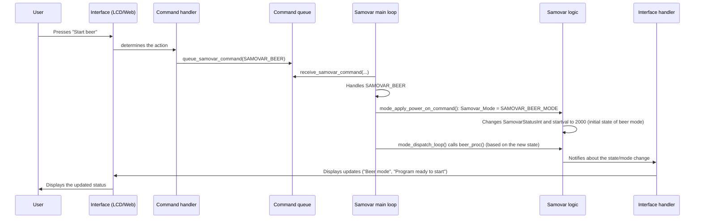

# Chapter 3: System State and Mode Management

Welcome back! In [Chapter 1: User Interaction (Web and LCD)](01_user_interaction__web___lcd__.md) we learned how to give commands to Samovar. In [Chapter 2: Process Program Execution](02_process_program_execution_.md) we saw how Samovar follows a "recipe" (a program) step by step. But how does Samovar know *which* recipe to follow? Is it brewing beer, distilling spirits, or simply idling? And even when it is executing a recipe, is it currently heating up, running a particular step, or paused?

This is where **System State and Mode Management** comes in. Think of this part of the Samovar software as its "brain" or the chief conductor of an orchestra. It is responsible for:

1.  Knowing the overall **mode** of the system (for example, rectification, beer brewing, idle). This is like the conductor choosing which major piece of music to perform.
2.  Knowing the current **state** of the system within that mode, or in general (for example, heating, running a program step, paused, error). This is like the conductor leading the orchestra through the "Allegro" section, taking a "Pause", or signaling an "Intermission".
3.  Managing the **transitions** between these modes and states based on user commands (Chapter 1), program progress (Chapter 2), or unexpected events (Chapter 6).

Without this central control, Samovar would not know what to do with user commands, how to interpret sensor data (Chapter 4) and how to control the hardware (Chapter 5).

Let's take a typical scenario: you have just finished brewing beer ("Beer" mode) and now want to clean the system (perhaps with a rectification/cleaning program) or start distilling spirits ("Rectification" mode). Samovar needs a way to cleanly switch from the "Beer system" mode to the "Distillation system" mode, and then move from the "Idle" state to the "Heating" state, and then to the "Running" state, following the new program.

## Modes: Different "Hats" for Samovar

Samovar can operate in several different ways, each corresponding to a separate process or goal. These are its **modes**. The Samovar code defines them with a list of names (an `enum`):

```c++
// From Samovar.h
enum SAMOVAR_MODE {SAMOVAR_RECTIFICATION_MODE, SAMOVAR_DISTILLATION_MODE, SAMOVAR_BEER_MODE, SAMOVAR_BK_MODE, SAMOVAR_NBK_MODE, SAMOVAR_SUVID_MODE, SAMOVAR_LUA_MODE, SAMOVAR_CHEESE_MODE};
volatile SAMOVAR_MODE Samovar_Mode; // This variable stores the current mode.
```

*   `SAMOVAR_RECTIFICATION_MODE`: For producing high-purity spirits (rectification).
* `SAMOVAR_DISTILLATION_MODE`: for simpler distillation of spirits.
* `SAMOVAR_BEER_MODE`: for automating the beer brewing stages (mashing, boiling).
* `SAMOVAR_BK_MODE`: for running a wash column (BK).
* `SAMOVAR_NBK_MODE`: for continuous wash distillation (the NBK continuous wash column).
* `SAMOVAR_SUVID_MODE`: sous vide, a thermostat that holds the set temperature in the boiler.
* `SAMOVAR_LUA_MODE`: for running custom processes defined in Lua scripts.
* `SAMOVAR_CHEESE_MODE`: for program-driven cheese making.

Only one mode can be active at a time. The `Samovar_Mode` variable tells the system which "hat" it is currently wearing. The `volatile` keyword is a bit technical, but essentially it tells the compiler that this variable may be changed by different parts of the program that run independently (for example, the main loop and possibly interrupt handlers), so the system must always re-read its value.

## States: What Is Happening Right Now?

Within each mode, or even when no specific process is running, Samovar is in a particular **state**. These states describe its current level of activity or condition. The code uses the integer variable `SamovarStatusInt` to track this detailed state:

```c++
// From Samovar.h
volatile int16_t SamovarStatusInt; // Stores the current operating state (as a number)
String SamovarStatus; // Stores a human-readable description of the state
```

While `SamovarStatus` is a text description that you can read on the display, `SamovarStatusInt` is a numeric value that the program uses internally. Different number ranges often correspond to different modes or phases:

* `0`: Idle / Off (in the Sous vide and Lua modes the status stays `0` the whole time)
* `10`: Withdrawal by a program row is running (rectification mode)
* `15`: Automatic pause between program rows (rectification mode)
* `20`: Program finished (rectification mode)
* `30`: Withdrawal pump calibration
* `40`: Manual pause (in any mode)
* `50`, `51`, `52`: Column heat-up / Stabilization / Stabilization finished (rectification mode)
* `1000`: Distillation mode
* `2000`: Beer mode
* `3000`: BK mode
* `4000`: NBK mode
* `5000`: Cheese mode

These numbers are declared in `Samovar.h` as `SAMOVAR_STATUS_*` constants (for example, `SAMOVAR_STATUS_RECT_WITHDRAWAL = 10`, `SAMOVAR_STATUS_BEER = 2000`). Next to them are the values of the second state variable, `startval` (`SAMOVAR_STARTVAL_*` constants): it shows whether a withdrawal or a mode session is running and at what stage (for example, `1` means withdrawal is running, `2` means the rectification program has reached its end, `2001` means the beer is heating up to the malt addition temperature).

The function `tick_status_fsm()` (see `logic.h`) is responsible for looking at `SamovarStatusInt` and other system flags (`PowerOn`, `PauseOn`, `program_Wait`, `startval`, `ProgramNum`, and so on) and generating the descriptive text shown on the LCD and in the web interface. It builds the text through `format_status_fsm_text()`, and the transitions between rectification statuses (`10`, `15`, `20`, `30`, `40`, `50`) are made by `decide_status_fsm()`.

```c++
// Simplified snippet from logic.h (the actual functions are quite long)
String format_status_fsm_text(bool stepperState, bool nbkTransitionActive) {
  String local;
  if (!PowerOn && SamovarStatusInt == SAMOVAR_STATUS_IDLE) {
    local = "Off";
  } else if (PowerOn && startval == SAMOVAR_STARTVAL_RECT_RUNNING && !PauseOn && !program_Wait) {
    local = "Prg #" + String(ProgramNum + 1); // Show the current program row
  }
  // ... many other conditions: auto pause, program finished, calibration, pause, sous vide, column heat-up ...
  else {
    // Other modes (distillation 1000, beer 2000, BK 3000, NBK 4000, cheese 5000):
    // the text comes from the mode's function in the mode_registry.h registry (for example, get_beer_status_text())
    mode_status_by_status(SamovarStatusInt, local);
  }
  return local;
}

void decide_status_fsm(bool stepperState, bool nbkTransitionActive) {
  // The same conditions, but the status number changes instead of the text
  if (PowerOn && startval == SAMOVAR_STARTVAL_RECT_RUNNING && !PauseOn && !program_Wait) {
    SamovarStatusInt = SAMOVAR_STATUS_RECT_WITHDRAWAL; // -> State 10
  }
  // ... other transitions ...
}

String tick_status_fsm() {
  String local = format_status_fsm_text(stepperState, nbkTransitionActive); // text for the state BEFORE the transition
  decide_status_fsm(stepperState, nbkTransitionActive);                      // then the transition
  // ... append the remaining time and body temperatures ...
  SamovarStatus = local; // store the text (under a lock); the web and Blynk read it from here
  return local;
}
```

`tick_status_fsm()` runs once a second from the `triggerSysTicker` system task to update the information shown on the interfaces (Chapter 1). However, the core logic relies on the numeric variables `SamovarStatusInt` and `Samovar_Mode` to determine what the system *is doing*.

## Transitions Between States and Modes: Shifting Gears

The most important task of state and mode management is handling *transitions*. This is how the system goes from "Idle" to "Heating", from "Heating" to "Running Program Step 1", from "Running Step 1" to "Running Step 2" (according to the Chapter 2 logic), or from "Rectification Mode" to "Beer Mode".

These transitions are usually triggered by:

1.  **User input:** pressing a button on the LCD or in the web interface ([Chapter 1: User Interaction (Web and LCD)](01_user_interaction__web___lcd__.md)).
2.  **Program completion:** finishing a program step (for example, reaching a target volume, a timer expiring) ([Chapter 2: Process Program Execution](02_process_program_execution_.md)).
3.  **Safety-related events:** an alarm being triggered ([Chapter 6: Safety Monitoring and Alarms](06_safety_monitoring___alarms_.md)).

How does this signal get passed, for example, from pressing a button on a web page to changing the system variables `Samovar_Mode` or `SamovarStatusInt`?

As shown in Chapter 1, web commands, Blynk/Lua commands, menus and alarm handlers put a command into the static FreeRTOS queue from `samovar_command_queue.h`. The queue passes small POD messages (plain data structures) `SamovarCommandMsg` between the web server/control tasks and the main program loop, which manages state and mode.

```c++
// From Samovar.h and samovar_command_queue.h
enum SamovarCommands {SAMOVAR_NONE, SAMOVAR_START, SAMOVAR_POWER, SAMOVAR_RESET, CALIBRATE_START, CALIBRATE_STOP, SAMOVAR_PAUSE, SAMOVAR_CONTINUE, SAMOVAR_SETBODYTEMP, SAMOVAR_DISTILLATION, SAMOVAR_BEER, SAMOVAR_BEER_NEXT, SAMOVAR_BK, SAMOVAR_BK_NEXT, SAMOVAR_NBK, SAMOVAR_SELF_TEST, SAMOVAR_DIST_NEXT, SAMOVAR_NBK_NEXT, SAMOVAR_POWER_OFF, SAMOVAR_CHEESE, SAMOVAR_CHEESE_NEXT, SAMOVAR_POWER_ON};
struct SamovarCommandMsg {
  SamovarCommands command;
};
bool queue_samovar_command(SamovarCommands command, TickType_t timeout = 0);
bool queue_samovar_reset_command(TickType_t timeout = 0);
```

The main `loop()` function in `Samovar.ino` takes messages from the queue via `receive_samovar_command(...)`. Each command is handled in a `switch` (often changing `Samovar_Mode` or `SamovarStatusInt`), after which `loop()` proceeds to the normal handling of the active mode. While a mode switch is in progress (`mode_switch_in_progress()`), new commands are neither accepted into the queue nor read from it. `SAMOVAR_RESET` is queued through a separate helper: it clears pending commands and places the reset at the front of the queue.

Here is a simplified view of this process:

This diagram shows how a user action cascades through the system to change the core variables `Samovar_Mode` and `SamovarStatusInt`.

## Inside `loop()`: The Conductor's Baton

The main `loop()` function in `Samovar.ino` is the one through which the conductor (`loop()`) reads the score (the `SamovarCommandMsg` queue, `Samovar_Mode`, `SamovarStatusInt`) and directs the various parts of the orchestra (the mode-dependent processing functions such as `beer_proc`, `distiller_proc`, and so on). Which function belongs to which mode is recorded in a single table, the mode registry `mode_registry_table()` in `mode_registry.h`: for each mode it lists the main status (`activeStatus`), the start command, the finish function, the status text function, the alarm check and the tick function (`tick`).

Let's look at a simplified version of the relevant parts of the `loop()` function:

```c++
// Simplified snippet from Samovar.ino loop() and mode_registry.h
void loop() {
  // ... other tasks (buttons, network) ...

  // Drain commands queued by the web, menu, Blynk, Lua or alarm checks.
  SamovarCommandMsg commandMsg;
  while (!mode_switch_in_progress() && receive_samovar_command(commandMsg, 0)) {
    switch (commandMsg.command) {
      case SAMOVAR_START:        // rectification "Start"
      case SAMOVAR_DISTILLATION: // start distillation
      case SAMOVAR_BEER:         // start beer
      case SAMOVAR_BK:
      case SAMOVAR_CHEESE:
        mode_apply_power_on_command(commandMsg.command); // mode and initial status come from the registry
        break;
      case SAMOVAR_POWER: // general power button
        // If a mode with a finish function is active (distillation, beer, BK, NBK, cheese), finish it,
        // otherwise just toggle the heating
        if (!mode_finish_by_status(SamovarStatusInt)) set_power(!PowerOn);
        if (PowerOn && Samovar_Mode == SAMOVAR_RECTIFICATION_MODE) {
          SamovarStatusInt = SAMOVAR_STATUS_RECT_ACCEL; // rectification: column heat-up (50)
        }
        break;
      case SAMOVAR_BEER_NEXT:
        run_beer_program(ProgramNum + 1); // next beer program row
        break;
      // ... SAMOVAR_NBK, SAMOVAR_POWER_ON/OFF, SAMOVAR_PAUSE, SAMOVAR_CONTINUE, *_NEXT, etc. ...
      case SAMOVAR_RESET:
        samovar_reset(); // reset all states
        break;
      case SAMOVAR_NONE:
        break;
    }
  }

  // ... deferred operations, including the mode switch (process_profile_operation()) ...

  mode_dispatch_loop(); // call the tick function of the active mode
  // ... other loop tasks ...
}

// mode_registry.h: starting a mode by command
bool mode_apply_power_on_command(SamovarCommands command) {
  // SAMOVAR_START: Samovar_Mode = SAMOVAR_RECTIFICATION_MODE and menu_samovar_start() (Chapter 2)
  const ModeOps* ops = mode_ops_by_power_on_command(command); // the mode's registry row
  Samovar_Mode = ops->mode;               // for example, SAMOVAR_BEER_MODE
  change_samovar_mode();
  SamovarStatusInt = ops->activeStatus;   // for example, 2000
  startval = ops->activeStatus;           // initial session stage
  return true;
}

// mode_registry.h: tick of the active mode
void mode_dispatch_loop() {
  const ModeOps* ops = mode_ops_current();            // registry row by Samovar_Mode
  if (mode_status_belongs(ops, SamovarStatusInt)) {    // does the status belong to this mode?
    if (ops->tick != nullptr) ops->tick();             // withdrawal(), distiller_proc(), beer_proc()/beer_stage_tick(),
                                                       // bk_proc(), nbk_proc(), cheese_proc()/cheese_stage_tick()
    return;
  }
  // status of another mode -> warn once, skip the tick
}
```
This simplified code shows the essence of state and mode management:
1. It takes pending commands from the `SamovarCommandMsg` queue.
2. When a command arrives, the `switch` acts like a conductor reading the score: it identifies the command (`SAMOVAR_BEER`, `SAMOVAR_START`, and so on).
3. Based on the command, it sets the core system variables (`Samovar_Mode`, `SamovarStatusInt` and `startval`) that reflect the desired new state or mode. For example, `SAMOVAR_BEER` sets the mode to `SAMOVAR_BEER_MODE` and the initial state to `2000`. The start is rejected if a mode switch is in progress or a session of another mode is already running.
4. Importantly, after a potential change of state/mode, `mode_dispatch_loop()` *later* in `loop()` picks the registry row by `Samovar_Mode` and checks that `SamovarStatusInt` belongs to that mode (statuses `1`–`999` belong to rectification, `1000` to distillation, `2000` to beer, and so on). Only then is the mode's tick function (`beer_proc()`, `distiller_proc()`, and so on) called. This is like the conductor raising the baton, and the corresponding section of the orchestra starts to play. The Sous vide and Lua modes have no tick function in the registry: sous vide is served by a separate `suvid_tick()` function, and the Lua script runs in a separate `do_lua_script` task (see `lua.h`).

This mechanism ensures that only the code corresponding to the current operating state and the active mode runs its main logic cycle, keeping the system organized and efficient.

## Conclusion

In this chapter we explored the "brain" of Samovar: **System State and Mode Management**. We learned that Samovar operates in various modes (for example, for rectification or beer brewing) and has detailed operating states (for example, heating or running step X). We saw how these modes and states are tracked with special variables (`Samovar_Mode` and `SamovarStatusInt`). Importantly, we understood how user commands or internal events trigger transitions between these states and modes via the `SamovarCommandMsg` queue, which the main program loop reads in order to update the system state and call the right processing functions. Such a layered approach lets Samovar manage complex processes, switching smoothly between different tasks as needed.

Now that we understand how Samovar knows what it is doing, let's look at how it collects the information it needs to make decisions: **Sensor Data Acquisition**.

[Chapter 4: Sensor Data Acquisition](04_sensor_data_acquisition_.md)
