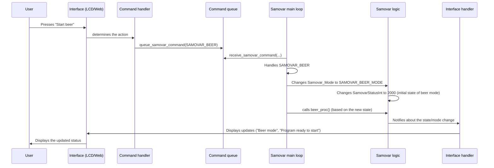

# Chapter 3: System State and Mode Management

Welcome back! In [Chapter 1: User Interaction (Web and LCD)](01_user_interaction__web___lcd__.md) we learned how to give commands to Samovar. In [Chapter 2: Process Program Execution](02_process_program_execution_.md) we saw how Samovar follows a "recipe" (a program) step by step. But how does Samovar know *which* recipe to follow? Is it brewing beer, distilling spirits, or simply idling? And even when it is executing a recipe, is it currently heating up, running a particular step, or paused?

This is where **System State and Mode Management** comes in. Think of this part of the Samovar software as its "brain" or the chief conductor of an orchestra. It is responsible for:

1.  Knowing the overall **mode** of the system (for example, rectification, beer brewing, idle). This is like the conductor choosing which major piece of music to perform.
2.  Knowing the current **state** of the system within that mode, or in general (for example, heating, running a program step, paused, error). This is like the conductor leading the orchestra through the "Allegro" section, taking a "Pause", or signaling an "Intermission".
3.  Managing the **transitions** between these modes and states based on user commands (Chapter 1), program progress (Chapter 2), or unexpected events (Chapter 6).

Without this central control, Samovar would not know what to do with user commands, how to interpret sensor data (Chapter 4) and how to control the hardware (Chapter 5).

Let's take a typical scenario: you have just finished brewing beer ("Beer" mode) and now want to clean the system (perhaps with a rectification/cleaning program) or start distilling spirits ("Rectification" mode). Samovar needs a way to cleanly switch from the "Beer system" mode to the "Distillation system" mode, and then move from the "Idle" state to the "Heating" state, and then to the "Running" state, following the new program.

## Modes: Different "Hats" for Samovar

Samovar can operate in several different ways, each corresponding to a separate process or goal. These are its **modes**. The Samovar code defines them with a list of names (an `enum`):

```c++
// From Samovar.h
enum SAMOVAR_MODE {SAMOVAR_RECTIFICATION_MODE, SAMOVAR_DISTILLATION_MODE, SAMOVAR_BEER_MODE, SAMOVAR_BK_MODE, SAMOVAR_NBK_MODE, SAMOVAR_SUVID_MODE, SAMOVAR_LUA_MODE};
volatile SAMOVAR_MODE Samovar_Mode; // This variable stores the current mode.
```

*   `SAMOVAR_RECTIFICATION_MODE`: For producing high-purity spirits (rectification).
* `SAMOVAR_DISTILLATION_MODE`: for simpler distillation of spirits.
* `SAMOVAR_BEER_MODE`: for automating the beer brewing stages (mashing, boiling).
* `SAMOVAR_BK_MODE`: for working with a specific type of column (the BK wash column).
* `SAMOVAR_NBK_MODE`: for continuous distillation (the NBK continuous wash column).
* `SAMOVAR_SUVID_MODE`: (probably for Sous Vide, temperature control).
* `SAMOVAR_LUA_MODE`: for running custom processes defined in Lua scripts.

Only one mode can be active at a time. The `Samovar_Mode` variable tells the system which "hat" it is currently wearing. The `volatile` keyword is a bit technical, but essentially it tells the compiler that this variable may be changed by different parts of the program that run independently (for example, the main loop and possibly interrupt handlers), so the system must always re-read its value.

## States: What Is Happening Right Now?

Within each mode, or even when no specific process is running, Samovar is in a particular **state**. These states describe its current level of activity or condition. The code uses the integer variable `SamovarStatusInt` to track this detailed state:

```c++
// From Samovar.h
volatile int16_t SamovarStatusInt; // Stores the current operating state (as a number)
String SamovarStatus; // Stores a human-readable description of the state
```

While `SamovarStatus` is a text description that you can read on the display, `SamovarStatusInt` is a numeric value that the program uses internally. Different number ranges often correspond to different modes or phases:

* `0`: Idle / Off
* `10`, `15`: Running a program step (rectification mode)
* `20`: Program finished
* `50`, `51`, `52`: Heating / Stabilization (rectification mode)
* `1000`: Distillation mode
* `2000`: Beer mode
* `3000`: BK mode
* `4000`: NBK mode
- Statuses are also used for errors, calibration, self-test, and so on.

The function `get_Samovar_Status()` (see `logic.h`) is responsible for looking at `SamovarStatusInt` and other system flags (`PowerOn`, `PauseOn`, `program_Wait`, `ProgramNum`, and so on) and generating the descriptive text shown on the LCD and in the web interface.

```c++
// Simplified snippet from logic.h (the actual function is quite long)
String get_Samovar_Status() {
  if (!PowerOn) {
    SamovarStatusInt = 0; // System is off -> State 0
    return F(«Выключено»); // "Off"
  } else if (PowerOn && startval == 1 && !PauseOn && !program_Wait) {
    SamovarStatusInt = 10; // Powered on, program started, not paused/not waiting -> State 10
    return «Прг №» + String(ProgramNum + 1); // "Prg #" - show the current program step
  }
  // ... many other conditions checking state variables and ProgramNum ...
  else if (SamovarStatusInt == 2000) {
    // If in Beer mode (state 2000), describe the specific Beer program step
    // ... check program[ProgramNum].WType and time ...
    return «Прг №» + String(ProgramNum + 1) + «; » + «Beer specific status»; // "Prg #"
  }
  // ... and so on for other modes (Distillation 1000, NBK 4000, etc.) ...
  return «Неизвестный статус»; // "Unknown status" - default fallback
}
```

This function runs periodically to update the information shown on the interfaces (Chapter 1). However, the core logic relies on the numeric variables `SamovarStatusInt` and `Samovar_Mode` to determine what the system *is doing*.

## Transitions Between States and Modes: Shifting Gears

The most important task of state and mode management is handling *transitions*. This is how the system goes from "Idle" to "Heating", from "Heating" to "Running Program Step 1", from "Running Step 1" to "Running Step 2" (according to the Chapter 2 logic), or from "Rectification Mode" to "Beer Mode".

These transitions are usually triggered by:

1.  **User input:** pressing a button on the LCD or in the web interface ([Chapter 1: User Interaction (Web and LCD)](01_user_interaction__web___lcd__.md)).
2.  **Program completion:** finishing a program step (for example, reaching a target volume, a timer expiring) ([Chapter 2: Process Program Execution](02_process_program_execution_.md)).
3.  **Safety-related events:** an alarm being triggered ([Chapter 6: Safety Monitoring and Alarms](06_safety_monitoring___alarms_.md)).

How does this signal get passed, for example, from pressing a button on a web page to changing the system variables `Samovar_Mode` or `SamovarStatusInt`?

As shown in Chapter 1, web commands, Blynk/Lua commands, menus and alarm handlers put a command into the static FreeRTOS queue from `samovar_command_queue.h`. The queue passes small POD messages (plain data structures) `SamovarCommandMsg` between the web server/control tasks and the main program loop, which manages state and mode.

```c++
// From Samovar.h and samovar_command_queue.h
enum SamovarCommands {SAMOVAR_NONE, SAMOVAR_START, SAMOVAR_POWER, SAMOVAR_RESET, CALIBRATE_START, CALIBRATE_STOP, SAMOVAR_PAUSE, SAMOVAR_CONTINUE, SAMOVAR_SETBODYTEMP, SAMOVAR_DISTILLATION, SAMOVAR_BEER, SAMOVAR_BEER_NEXT, SAMOVAR_BK, SAMOVAR_NBK, SAMOVAR_SELF_TEST, SAMOVAR_DIST_NEXT, SAMOVAR_NBK_NEXT};
struct SamovarCommandMsg {
  SamovarCommands command;
};
bool queue_samovar_command(SamovarCommands command, TickType_t timeout = 0);
bool queue_samovar_reset_command(TickType_t timeout = 0);
```

The main `loop()` function in `Samovar.ino` takes messages from the queue via `receive_samovar_command(...)`. Each command is handled in a `switch` (often changing `Samovar_Mode` or `SamovarStatusInt`), after which `loop()` proceeds to the normal handling of the active mode. `SAMOVAR_RESET` is queued through a separate helper: it clears pending commands and places the reset at the front of the queue.

Here is a simplified view of this process:

This diagram shows how a user action cascades through the system to change the core variables `Samovar_Mode` and `SamovarStatusInt`.

## Inside `loop()`: The Conductor's Baton

The main `loop()` function in `Samovar.ino` is the one through which the conductor (`loop()`) reads the score (the `SamovarCommandMsg` queue, `Samovar_Mode`, `SamovarStatusInt`) and directs the various parts of the orchestra (the mode-dependent processing functions such as `beer_proc`, `distiller_proc`, and so on).

Let's look at a simplified version of the relevant parts of the `loop()` function:

```c++
// Simplified snippet from Samovar.ino loop()
void loop() {
  // ... other necessary tasks (like checking for button presses, network) ...

  // Drain commands queued by web, LCD, Blynk, Lua, or alarm paths.
  SamovarCommandMsg commandMsg;
  while (receive_samovar_command(commandMsg, 0)) {
    switch (commandMsg.command) {
      case SAMOVAR_START: // User clicked Start (defaults to Rectification)
        Samovar_Mode = SAMOVAR_RECTIFICATION_MODE;
        // menu_samovar_start(); // Function to start/advance Rectification program (Chapter 2)
        SamovarStatusInt = 50; // Example: Transition to Heating state
        break;
      case SAMOVAR_POWER: // User clicked general Power toggle
        // Check current status to decide what Power means (Finish current mode or just toggle power)
        if (SamovarStatusInt == 1000) distiller_finish(); // If in Distillation, Power button finishes it
        else if (SamovarStatusInt == 2000) beer_finish();     // If in Beer, Power button finishes it
        // ... checks for other modes ...
        else set_power(!PowerOn); // Otherwise, just toggle the main Power (sets PowerOn flag)
        break;
      case SAMOVAR_BEER: // User specifically requested Beer Mode
        Samovar_Mode = SAMOVAR_BEER_MODE; // Set the mode
        SamovarStatusInt = 2000;          // Set the initial state for Beer Mode
        startval = 2000;                  // Another state variable used internally by beer_proc
        break;
      case SAMOVAR_DISTILLATION: // User specifically requested Distillation Mode
        Samovar_Mode = SAMOVAR_DISTILLATION_MODE; // Set the mode
        SamovarStatusInt = 1000;                  // Set the initial state for Distillation Mode
        startval = 1000;                          // Another state variable
        break;
      // ... cases for SAMOVAR_NBK, SAMOVAR_BK, SAMOVAR_RESET, SAMOVAR_PAUSE, etc. ...
      case SAMOVAR_RESET:
        samovar_reset(); // Call a function to reset all states and modes
        break;
      case SAMOVAR_NONE:
         break; // Should not happen due to the outer if check, but good practice
    }
  }

  // Now, based on the current SamovarStatusInt, call the appropriate mode/state handler
  if (SamovarStatusInt > 0 && SamovarStatusInt < 1000) {
    // States 1-999 typically relate to Rectification/General operation states (Heating, Running Program)
    // withdrawal(); // Function handling Rectification program execution & state checks (Chapter 2)
  } else if (SamovarStatusInt == 1000) {
    // Distillation Mode is active
    distiller_proc(); // Function handling Distillation logic
  } else if (SamovarStatusInt == 2000) { // Note: Beer mode uses SamovarStatusInt = 2000 for its main loop check
    // Beer Mode is active
    beer_proc(); // Function handling Beer logic
  } else if (SamovarStatusInt == 3000) {
    // BK Mode is active
    // bk_proc(); // Function handling BK logic
  } else if (SamovarStatusInt == 4000) {
    // NBK Mode is active
    nbk_proc(); // Function handling NBK logic
  }
  // ... other state/mode checks ...

  // ... other loop tasks ...
}
```
This simplified code shows the essence of state and mode management:
1. It takes pending commands from the `SamovarCommandMsg` queue.
2. When a command arrives, the `switch` acts like a conductor reading the score: it identifies the command (`SAMOVAR_BEER`, `SAMOVAR_START`, and so on).
3. Based on the command, it sets the core system variables (`Samovar_Mode` and `SamovarStatusInt`) that reflect the desired new state or mode. For example, `SAMOVAR_BEER` sets the mode to `SAMOVAR_BEER_MODE` and the initial state to `2000`.
4. Importantly, after a potential change of state/mode, the code *later* in `loop()` uses these new values (especially `SamovarStatusInt`) to decide which mode-dependent function (`beer_proc()`, `distiller_proc()`, and so on) to call in this iteration of the loop. This is like the conductor raising the baton, and the corresponding section of the orchestra starts to play.

This mechanism ensures that only the code corresponding to the current operating state and the active mode runs its main logic cycle, keeping the system organized and efficient.

## Conclusion

In this chapter we explored the "brain" of Samovar: **System State and Mode Management**. We learned that Samovar operates in various modes (for example, for rectification or beer brewing) and has detailed operating states (for example, heating or running step X). We saw how these modes and states are tracked with special variables (`Samovar_Mode` and `SamovarStatusInt`). Importantly, we understood how user commands or internal events trigger transitions between these states and modes via the `SamovarCommandMsg` queue, which the main program loop reads in order to update the system state and call the right processing functions. Such a layered approach lets Samovar manage complex processes, switching smoothly between different tasks as needed.

Now that we understand how Samovar knows what it is doing, let's look at how it collects the information it needs to make decisions: **Sensor Data Acquisition**.

[Chapter 4: Sensor Data Acquisition](04_sensor_data_acquisition_.md)
