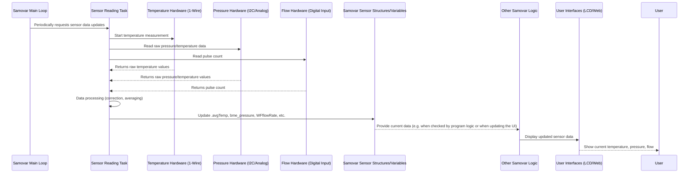

# Chapter 4: Sensor Data Acquisition

Welcome back! In the previous chapters we learned how you interact with Samovar ([Chapter 1: User Interaction (Web & LCD)](01_user_interaction__web___lcd__.md)), how it executes step-by-step instructions ([Chapter 2: Process Program Execution](02_process_program_execution_.md)) and how it manages its overall state and mode ([Chapter 3: System State and Mode Management](03_system_state___mode_management_.md)).

But how does Samovar *know* what is happening inside the pipes, the boiler or the column? How does it determine that the water is already hot enough or that the required volume of liquid has been collected?

This is where **Sensor Data Acquisition** comes in. It is Samovar's ability to collect information about the physical world using its sensors. Think of the sensors as Samovar's "eyes", "ears" and "sense of touch", constantly reporting the state of the brewing or distillation process in real time.

Without reliable sensor data, Samovar would work blind. It would not know whether the program's targets are being reached or whether a problem requiring attention has appeared (for example, overheating).

## Why Sensors Matter: A Use Case

Imagine that Samovar is running a rectification program. One of the key moments is reaching a certain vapor temperature at the top of the column, which signals the start of collecting the "heads" (the first, most volatile alcohol fraction).

To do this, Samovar must:
1.  Have a temperature sensor installed in the vapor path.
2.  Continuously read the temperature from this sensor.
3.  Compare the measured temperature with the target set in the program step.
4.  React when the target temperature is reached.

In this chapter we focus on steps 1 and 2: how Samovar connects to its sensors and receives data from them.

## Samovar's Senses: Sensor Types

Samovar uses several kinds of sensors to monitor different aspects of the process:

*   **Temperature sensors (DS18B20):** These are digital sensors installed at key points: the vapor outlet, the pipe (column), the cooling water inlet/outlet, and the boiler (keg). They send temperature data to Samovar's "brain".
*   **Pressure sensors (BME280/BMP280/XGZP6897D/MPX5010D/1-Wire Pressure):** They measure the pressure inside the system or the atmospheric pressure. This is important for correcting temperature (the boiling point changes with pressure) and for detecting possible problems such as blockages.
*   **Water flow sensor:** Measures the flow rate of the cooling water through the condenser. It is critical for ensuring sufficient cooling and condensation of vapor into liquid.
*   **Head-section level sensor (float switch):** (Optional) Detects whether liquid is rising in the column, which may indicate flooding or take-off problems.

Each type of sensor requires slightly different hardware connections and software methods for reading data.

## How Sensor Data Acquisition Works

Samovar's microcontroller (ESP32) is like a busy scientist collecting data from several experiments at once. It uses different methods to communicate with the sensors:

*   **1-Wire:** A clever system that allows several temperature sensors (DS18B20) to work on a single data wire. Samovar sends commands over this wire to request the temperature, and each sensor responds individually using its own address.
*   **I2C:** Another widespread system, used for BME/BMP pressure/temperature sensors as well as other devices such as the display (see Chapter 1). It uses two wires (data and clock), and the devices have addresses for individual communication.
*   **Analog or digital inputs:** The water flow sensor can be connected to a digital input to count pulses, and some pressure sensors (for example, MPX5010D) or other custom sensors can output an analog voltage proportional to the measurement, which the ESP32 reads through its ADC.

Sensor reading happens continuously in the background while Samovar is running. Special functions or tasks poll the sensors at certain intervals.

## Storing and Accessing Sensor Data

Where does the data go after it is read? Samovar's software stores the current sensor values in variables that other parts of the program can easily access.

For Dallas temperature sensors (DS18B20) the `DSSensor` structure is used:

```c++
// From Samovar.h (simplified)
struct DSSensor {
  DeviceAddress Sensor;    // Address of a specific sensor on the 1-Wire bus
  float avgTemp;           // Latest (averaged) temperature value
  float SetTemp;           // Temperature threshold (e.g. for alarms)
  uint16_t Delay;          // Timeout associated with this sensor
  float PrevTemp;          // Previous temperature value (for tracking changes)
  float Start_Pressure;    // Pressure at the start of a process step (for temperature correction)
  int ErrCount;            // Counter of communication errors with this sensor
  // ... other fields ...
};

// Global variables for each temperature sensor
DSSensor SteamSensor;
DSSensor PipeSensor;
DSSensor WaterSensor;
DSSensor TankSensor;
DSSensor ACPSensor; // Temperature-controlled air (TCA)
```

The program defines a separate `DSSensor` variable for each physical measurement point (Steam, Pipe, Water, Tank, ACP). When the sensor reading function runs, it updates the `.avgTemp` field of the corresponding variable.

Data from other sensors, for example pressure from the BME/BMP, may be stored in simpler global variables:

```c++
// From Samovar.h (simplified)
volatile float bme_temp;      // Temperature from BME/BMP
volatile float bme_pressure;  // Pressure from BME/BMP (in the correct units)
volatile float pressure_value; // Pressure from other sensors (XGZP/MPX/1-Wire)
```
Similarly, data from the water flow sensor is stored in variables such as `WFflowRate` and `WFtotalMilliLitres` (WF probably stands for Water Flow).

These variables are declared `volatile`, just like the state variables from Chapter 3. This tells the compiler that their value may change at any moment (because it is updated by a separate task), and the main loop must always read the current value.

## The Sensor Reading Process

Let's look at a simplified algorithm for reading and updating sensor data:



The diagram shows that a dedicated part of the system (often a separate background task, such as `triggerSysTicker` or `triggerGetClock` in the code) is responsible for talking to the sensor hardware, obtaining the raw numbers, processing them and writing the resulting values to system variables. The other parts — program logic, the web server — simply read these values as needed.

## Code Walkthrough

The main logic for reading DS18B20 temperature sensors is usually implemented in a function like `DS_getvalue()`, which is called periodically by a system task.

Here is a simplified fragment of `DS_getvalue()`:

```c++
// From sensorinit.h (simplified DS_getvalue)
void DS_getvalue(void) {
  float raw_steam_temp, raw_pipe_temp, raw_water_temp, raw_tank_temp, raw_acp_temp;
  float correctT = 0; // Variable for atmospheric pressure correction

  // Calculate the temperature correction for atmospheric pressure (if used and power is on)
  if (bme_pressure > 0 && PowerOn) {
    correctT = (760 - bme_pressure) * 0.037;
  }

  // Ask all sensors on the 1-Wire bus to measure temperature
  sensors.requestTemperatures();

  // *** Read the value from each sensor and apply the correction ***
  // Note: getTempC is called AFTER requestTemperatures and uses the measurement results
  raw_steam_temp = sensors.getTempC(SteamSensor.Sensor);
  raw_pipe_temp = sensors.getTempC(PipeSensor.Sensor);
  raw_water_temp = sensors.getTempC(WaterSensor.Sensor);
  raw_tank_temp = sensors.getTempC(TankSensor.Sensor);
  raw_acp_temp = sensors.getTempC(ACPSensor.Sensor);

  // *** Process the values and update the sensor variables ***
  // A value below -10C often means an error (sensor not found / disconnected)
  if (raw_steam_temp > -10) {
    // Pressure correction + user calibration
    SteamSensor.avgTemp = raw_steam_temp + correctT + SamSetup.DeltaSteamTemp;
    SteamSensor.ErrCount = 0; // Reset the error counter on a successful read
  } else {
    // On a failed read, increment the error counter (for alarms)
    SteamSensor.ErrCount++;
  }

  if (raw_pipe_temp > -10) {
    PipeSensor.avgTemp = raw_pipe_temp + correctT + SamSetup.DeltaPipeTemp;
    PipeSensor.ErrCount = 0;
  } else {
    PipeSensor.ErrCount++;
  }

  // Water temperature is usually NOT corrected for atmospheric pressure
  if (raw_water_temp > -10) {
    WaterSensor.avgTemp = raw_water_temp + SamSetup.DeltaWaterTemp;
    WaterSensor.ErrCount = 0;
  } else {
    WaterSensor.ErrCount++;
  }

  if (raw_tank_temp > -10) {
    TankSensor.avgTemp = raw_tank_temp + correctT + SamSetup.DeltaTankTemp;
    TankSensor.ErrCount = 0;
  } else {
    TankSensor.ErrCount++;
  }

  if (raw_acp_temp > -10) {
    ACPSensor.avgTemp = raw_acp_temp + correctT + SamSetup.DeltaACPTemp;
    ACPSensor.ErrCount = 0;
  } else {
    ACPSensor.ErrCount++;
  }
}
```

This simplified code shows the main steps:
1.  If necessary, the pressure-based temperature correction is calculated.
2.  All 1-Wire sensors are commanded to measure temperature (`sensors.requestTemperatures();`). The measurement takes some time.
3.  Then the values are read from each sensor by its address (`sensors.getTempC(SensorAddress)`).
4.  For each successful read, the pressure correction (`correctT`) and the user calibration (`SamSetup.DeltaSteamTemp`, `SamSetup.DeltaPipeTemp`, etc.) are applied.
5.  The resulting temperature is written to the `.avgTemp` field of the `DSSensor` structure, making it available to all of the software.
6.  If a sensor did not respond correctly (the temperature is strongly negative, for example -127C, here < -10), the error counter is incremented. If it exceeds a threshold, an alarm will be raised ([Chapter 6: Safety Monitoring and Alarms](06_safety_monitoring___alarms_.md)).

Reading pressure and temperature from an I2C sensor such as the BME280 is implemented in a similar function, for example `BME_getvalue()`:

```c++
// From sensorinit.h (simplified BME_getvalue)
void BME_getvalue(bool fl) {
  if (!bmefound) { // Check whether the sensor has been initialized
    bme_temp = -1;
    bme_pressure = -1;
    return;
  }

  // Use a semaphore for exclusive access to the I2C bus (see Chapter 1)
  if (xSemaphoreTake(xI2CSemaphore, (TickType_t)(50 / portTICK_RATE_MS)) == pdTRUE) {
    #ifdef USE_BME280 // Assume BME280 for the example
      // Read temperature and pressure from the sensor
      bme_temp = bme.readTemperature();
      // Convert pressure from Pa to mmHg (about 0.75 mmHg per 100 Pa)
      bme_pressure = bme.readPressure() / 100 * 0.75;
    #endif

    xSemaphoreGive(xI2CSemaphore); // Release the I2C bus semaphore
  } else {
    // If the semaphore could not be taken (e.g. the bus is busy)
    // for simplicity we can just skip this reading or record an error
  }
}
```
This shows how data is read from an I2C device (implicitly through the `Wire` library using `bme.readTemperature()` and `bme.readPressure()`) and stored in the global variables `bme_temp` and `bme_pressure`. Note the use of a semaphore to manage access to the I2C hardware (see Chapter 1).

For the water flow sensor, an interrupt handler (ISR) that counts pulses is usually used:

```c++
// From Samovar.ino (simplified ISR)
void IRAM_ATTR WFpulseCounter() {
  WFpulseCount++; // Increment the counter on every detected pulse
}

// In setup():
// attachInterrupt(WATERSENSOR_PIN, WFpulseCounter, FALLING); // Configure the pin and ISR
```
A separate function in the main loop periodically reads `WFpulseCount`, calculates the flow rate (`WFflowRate`) and the total volume (`WFtotalMilliLitres`), and resets the counter for the next interval.

These functions run continuously, providing Samovar's system with up-to-date information about the progress of the process.

## Using Sensor Data

Where is the acquired data used? Everywhere!

*   **Display:** The LCD and web interfaces ([Chapter 1: User Interaction (Web & LCD)](01_user_interaction__web___lcd__.md)) constantly show the values of `avgTemp`, `bme_pressure`, `WFflowRate`, etc., so that you can monitor the process.
*   **Program execution:** The logic that determines the completion of a step ([Chapter 2: Process Program Execution](02_process_program_execution_.md)) depends heavily on sensor data. For example, checking the condition `SteamSensor.avgTemp >= target_temp` or `stepper.getCurrent() >= TargetStepps` (tracks the volume by the stepper motor's steps).
*   **State management:** The overall status (`get_Samovar_Status()` in Chapter 3) uses temperature and pressure data to indicate phases such as "Column warm-up" or "Stabilization".
*   **Safety monitoring:** Alarms ([Chapter 6: Safety Monitoring and Alarms](06_safety_monitoring___alarms_.md)) are triggered when safe limits are exceeded (for example, `WaterSensor.avgTemp >= MAX_WATER_TEMP`).
*   **Control algorithms:** The heater PID controller ([Chapter 5: Hardware Control (Actuators)](05_hardware_control__actuators__.md)) uses a temperature value (for example, `TankSensor.avgTemp`) as the "input" for calculating power.
*   **Logging:** Sensor data is periodically saved to a file ([Chapter 7: Configuration Persistence and Logging](07_configuration_persistence_.md)) for later analysis.

By constantly updating the sensor values, Samovar maintains an up-to-date picture of the process, which allows it to make well-founded decisions and respond promptly to changes.

## Conclusion

In this chapter we studied how Samovar obtains information from the physical world through **sensor data acquisition**. We looked at the different types of sensors used (temperature, pressure, flow, level) and the methods for polling them (1-Wire, I2C, digital/analog inputs). We saw how the acquired data is stored in dedicated structures and variables, making it available to all parts of the system. We also walked through simplified code examples for reading, correcting and updating temperature and pressure readings. Understanding how sensor data is acquired is fundamentally important, because the execution of programs, state management, safety systems and Samovar's control algorithms are all built on this data.

In the next chapter we will move from sensing to **Hardware Control (Actuators)**, to learn how Samovar uses sensor data and program logic to perform actions — switching on heaters, starting pumps or opening valves.

[Chapter 5: Hardware Control (Actuators)](05_hardware_control__actuators__.md)
