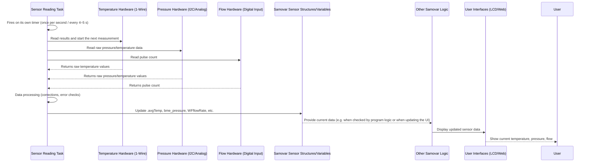

# Chapter 4: Sensor Data Acquisition

Welcome back! In the previous chapters we learned how you interact with Samovar ([Chapter 1: User Interaction (Web & LCD)](01_user_interaction__web___lcd__.md)), how it executes step-by-step instructions ([Chapter 2: Process Program Execution](02_process_program_execution_.md)) and how it manages its overall state and mode ([Chapter 3: System State and Mode Management](03_system_state___mode_management_.md)).

But how does Samovar *know* what is happening inside the pipes, the boiler or the column? How does it determine that the water is already hot enough or that the required volume of liquid has been collected?

This is where **Sensor Data Acquisition** comes in. It is Samovar's ability to collect information about the physical world using its sensors. Think of the sensors as Samovar's "eyes", "ears" and "sense of touch", constantly reporting the state of the brewing or distillation process in real time.

Without reliable sensor data, Samovar would work blind. It would not know whether the program's targets are being reached or whether a problem requiring attention has appeared (for example, overheating).

## Why Sensors Matter: A Use Case

Imagine that Samovar is running a rectification program. One of the key moments is reaching a certain vapor temperature at the top of the column, which signals the start of collecting the "heads" (the first, most volatile alcohol fraction).

To do this, Samovar must:
1.  Have a temperature sensor installed in the vapor path.
2.  Continuously read the temperature from this sensor.
3.  Compare the measured temperature with the target set in the program step.
4.  React when the target temperature is reached.

In this chapter we focus on steps 1 and 2: how Samovar connects to its sensors and receives data from them.

## Samovar's Senses: Sensor Types

Samovar uses several kinds of sensors to monitor different aspects of the process:

*   **Temperature sensors (DS18B20):** These are digital sensors installed at key points: the vapor at the top of the column, the column section (about 2/3 of its height), the cooling water (or reflux), the boiler (tank, keg) and the TCA (the tube connecting the system to the atmosphere). They send temperature data to Samovar's "brain".
*   **Pressure sensors:** atmospheric pressure is measured by a BMP180/BMP280/BME280/BME680 sensor (chosen when building the firmware, BME680 by default), the pressure inside the system by an XGZP6897D, an MPX5010D or a pressure sensor on the 1-Wire bus. This is important for correcting temperature (the boiling point changes with pressure) and for detecting problems: column flooding in the NBK mode and exceeding the pressure limit (the heating is then shut off as an emergency).
*   **Water flow sensor:** Measures the flow rate of the cooling water through the condenser. It is critical for ensuring sufficient cooling and condensation of vapor into liquid.
*   **Reflux level sensor in the column head (P-N-P sensor):** Enabled in the settings ("Use reflux level sensor during rectification"). It triggers when the reflux rises up to the sensor, which is a sign of column flooding; Samovar then reduces the heating power.
*   **pH sensor (for the Cheese mode):** the pH probe is connected to an ESP32 analog input or to an external ADS1115 ADC over I2C (input AIN0).

Each type of sensor requires slightly different hardware connections and software methods for reading data.

## How Sensor Data Acquisition Works

Samovar's microcontroller (ESP32) is like a busy scientist collecting data from several experiments at once. It uses different methods to communicate with the sensors:

*   **1-Wire:** A clever system that allows several temperature sensors (DS18B20) to work on a single data wire. Samovar sends commands over this wire to request the temperature, and each sensor responds individually using its own address. A 1-Wire pressure sensor can sit on the same bus: it is read the same way as a temperature sensor, by its address.
*   **I2C:** Another widespread system, used for BME/BMP and XGZP6897D pressure/temperature sensors, the ADS1115 ADC, as well as other devices such as the display (see Chapter 1). It uses two wires (data and clock), and the devices have addresses for individual communication.
*   **Analog or digital inputs:** The water flow sensor can be connected to a digital input to count pulses, and some pressure sensors (for example, MPX5010D) or other custom sensors can output an analog voltage proportional to the measurement, which the ESP32 reads through its ADC.

Sensor reading happens continuously in the background while Samovar is running. Two background tasks (a FreeRTOS task is a separate thread that runs in parallel with the rest of the program) poll the sensors at certain intervals: `triggerSysTicker` reads the DS18B20 sensors and the flow sensor once per second, `triggerGetClock` reads the BME/BMP atmospheric pressure sensor and the XGZP6897D/MPX5010D pressure sensor about every 4–5 seconds.

## Storing and Accessing Sensor Data

Where does the data go after it is read? Samovar's software stores the current sensor values in variables that other parts of the program can easily access.

For Dallas temperature sensors (DS18B20) the `DSSensor` structure is used:

```c++
// From Samovar.h (simplified)
struct DSSensor {
  DeviceAddress Sensor;    // Address of a specific sensor on the 1-Wire bus
  volatile float avgTemp;  // Latest temperature value (with corrections)
  float SetTemp;           // Temperature setpoint at which a reaction is required
  float BodyTemp;          // Temperature at which the body take-off started
  uint16_t Delay;          // Pump start delay (s) when the temperature goes past the setpoint
  float PrevTemp;          // Previous temperature value (for tracking changes)
  float Start_Pressure;    // Pressure at the start of the take-off
  volatile int ErrCount;   // Counter of failed readings from this sensor
  // ... other fields ...
};

// Global variables for each temperature sensor
DSSensor SteamSensor;
DSSensor PipeSensor;
DSSensor WaterSensor;
DSSensor TankSensor;
DSSensor ACPSensor; // TCA (tube connecting the system to the atmosphere)
```

The program defines a separate `DSSensor` variable for each physical measurement point (vapor, column section, water, boiler, TCA). When the sensor reading function runs, it updates the `.avgTemp` field of the corresponding variable.

Data from other sensors, for example pressure from the BME/BMP, may be stored in simpler global variables:

```c++
// From Samovar.h (simplified)
volatile float bme_temp;      // Temperature from BME/BMP
volatile float bme_pressure;  // Pressure from BME/BMP (in the correct units)
float pressure_value;         // Pressure inside the system from the XGZP/MPX/1-Wire sensor (mmHg)
```
Similarly, data from the water flow sensor is stored in variables such as `WFflowRate` and `WFtotalMilliLitres` (WF stands for Water Flow).

Most of these variables (`avgTemp`, `ErrCount`, `bme_temp`, `bme_pressure`, `WFflowRate`, `WFtotalMilliLitres`) are declared `volatile`, just like the state variables from Chapter 3. This tells the compiler that their value may change at any moment (because it is updated by a separate task), and the other parts of the program must always read the current value.

## The Sensor Reading Process

Let's look at a simplified algorithm for reading and updating sensor data:



The diagram shows that a dedicated part of the system (the background tasks `triggerSysTicker` and `triggerGetClock` in `Samovar.ino`) is responsible for talking to the sensor hardware, obtaining the raw numbers, processing them and writing the resulting values to system variables. The other parts — program logic, the web server — simply read these values as needed.

## Code Walkthrough

The main logic for reading DS18B20 temperature sensors is implemented in the `DS_getvalue()` function (`sensorinit.h`), which the `triggerSysTicker` task calls once per second.

Here is a simplified fragment of `DS_getvalue()`:

```c++
// From sensorinit.h (simplified DS_getvalue)
void DS_getvalue(void) {
  float correctT = 0; // Atmospheric pressure correction

  // The correction is calculated only if "Use pressure correction"
  // is enabled in the settings and the heating is on
  if (SamSetup.UsePreccureCorrect && bme_pressure > 0 && PowerOn) {
    correctT = (760 - bme_pressure) * 0.037;
  }

  // *** Collect the results of the measurement started in the previous cycle ***
  float ssRaw = sensors.getTempC(SteamSensor.Sensor);
  float psRaw = sensors.getTempC(PipeSensor.Sensor);
  float wsRaw = sensors.getTempC(WaterSensor.Sensor);
  float tsRaw = sensors.getTempC(TankSensor.Sensor);
  float acpRaw = sensors.getTempC(ACPSensor.Sensor);

  // The pressure correction applies only to vapor, column section and boiler;
  // water and TCA do not get it
  float ss = correctT + ssRaw;
  float ps = correctT + psRaw;
  float ws = wsRaw;
  float ts = correctT + tsRaw;
  float acp = acpRaw;

  // (with USE_PRESSURE_1WIRE the 1-Wire pressure sensor is also read here into pressure_value)

  // Start a new measurement on all sensors on the 1-Wire bus;
  // its results will be read in the next cycle, a second later
  sensors.requestTemperatures();

  // *** Process the values (in the code it is one loop over the five sensors) ***
  // A value below -10C means an error (sensor not found / disconnected, -127C)
  if (ss > -10) {
    // User calibration (delta), separate for each sensor
    float corrected = ss + SamSetup.DeltaSteamTemp;
    // 85.0C right after a sensor power glitch is the DS18B20 factory value;
    // a sudden jump (>10C) to it is not accepted and counts as an error
    if (ssRaw == 85.0 && SteamSensor.avgTemp >= 2 && fabs(corrected - SteamSensor.avgTemp) > 10) {
      SteamSensor.ErrCount++;
    } else {
      SteamSensor.avgTemp = corrected;
      SteamSensor.PrevTemp = SteamSensor.avgTemp;
      SteamSensor.ErrCount = 0; // Reset the error counter on a successful read
    }
  } else {
    // On a failed read, increment the error counter (for alarms)
    SteamSensor.ErrCount++;
  }
  // ... the same for PipeSensor (DeltaPipeTemp), WaterSensor (DeltaWaterTemp),
  //     TankSensor (DeltaTankTemp) and ACPSensor (DeltaACPTemp) ...
}
```

This simplified code shows the main steps:
1.  If pressure correction is enabled in the settings, the temperature correction for atmospheric pressure is calculated.
2.  The values are read from each sensor by its address (`sensors.getTempC(SensorAddress)`). These are the results of the measurement started in the previous cycle.
3.  All 1-Wire sensors are commanded to start a new measurement (`sensors.requestTemperatures();`). The measurement takes some time, so its results are collected a second later, on the next call.
4.  For each successful read, the pressure correction (`correctT`, only for vapor, column section and boiler) and the user calibration (`SamSetup.DeltaSteamTemp`, `SamSetup.DeltaPipeTemp`, etc.) are applied.
5.  The resulting temperature is written to the `.avgTemp` field of the `DSSensor` structure, making it available to all of the software.
6.  If a sensor did not respond correctly (the temperature is strongly negative, for example -127C, here < -10) or jumped to the factory 85C, the error counter is incremented. If it exceeds a threshold, an alarm will be raised ([Chapter 6: Safety Monitoring and Alarms](06_safety_monitoring___alarms_.md)).

Reading pressure and temperature from a BME/BMP I2C sensor is implemented in the `BME_getvalue()` function (called by the `triggerGetClock` task):

```c++
// From sensorinit.h (simplified BME_getvalue)
void BME_getvalue(bool fl) {
  if (!bmefound) { // Check whether the sensor has been initialized
    bme_temp = -1;
    bme_pressure = -1;
    return;
  }

  // Use a semaphore for exclusive access to the I2C bus (see Chapter 1)
  if (xSemaphoreTake(xI2CSemaphore, (TickType_t)(50 / portTICK_RATE_MS)) == pdTRUE) {
    #ifdef USE_BME280 // The BME280 branch as an example; BMP180/BMP280/BME680 have their own
      // Read temperature and pressure from the sensor
      bme_temp = bme.readTemperature();
      // Convert pressure from Pa to mmHg (about 0.75 mmHg per 100 Pa)
      bme_pressure = bme.readPressure() / 100 * 0.75;
    #endif

    xSemaphoreGive(xI2CSemaphore); // Release the I2C bus semaphore
  }
  // If the semaphore could not be taken (the bus is busy), the reading is skipped
  // until the next cycle and the variables keep their previous values
}
```
This shows how data is read from an I2C device (implicitly through the `Wire` library using `bme.readTemperature()` and `bme.readPressure()`) and stored in the global variables `bme_temp` and `bme_pressure`. Note the use of a semaphore to manage access to the I2C hardware (see Chapter 1). BMP180 readings are additionally smoothed by a filter (`bmp180_pressure_filter.h`) that discards single pressure outliers. The XGZP6897D and MPX5010D pressure sensors are read by the `pressure_sensor_get()` function (also in `sensorinit.h`): it writes the result to `pressure_value` in mmHg and averages it with the previous value.

For the water flow sensor, an interrupt handler (ISR, a function the processor calls immediately when a signal appears on the input) that counts pulses is used:

```c++
// From Samovar.ino (simplified ISR)
void IRAM_ATTR WFpulseCounter() {
  portENTER_CRITICAL_ISR(&waterPulseMux);
  WFpulseCount++; // Increment the counter on every detected pulse
  portEXIT_CRITICAL_ISR(&waterPulseMux);
}

// At startup (setup_attach_water_flow_interrupt(), if USE_WATERSENSOR is enabled):
attachInterrupt(WATERSENSOR_PIN, WFpulseCounter, FALLING); // Configure the pin and ISR
```
Once per second the `triggerSysTicker` task takes the accumulated pulse count and resets the counter (`water_pulse_count_take()`), and the `tick_update_water_flow()` function calculates the flow rate (`WFflowRate`, L/min, using the sensor coefficient `WF_CALIBRATION`) and the total volume (`WFtotalMilliLitres`). If there are fewer than `WATER_FLOW_MIN_PULSES` pulses per second, the flow is considered zero.

These functions run continuously, providing Samovar's system with up-to-date information about the progress of the process.

## Using Sensor Data

Where is the acquired data used? Everywhere!

*   **Display:** The LCD and web interfaces ([Chapter 1: User Interaction (Web & LCD)](01_user_interaction__web___lcd__.md)) constantly show the values of `avgTemp`, `bme_pressure`, `WFflowRate`, etc., so that you can monitor the process.
*   **Program execution:** The logic that determines the completion of a step ([Chapter 2: Process Program Execution](02_process_program_execution_.md)) depends heavily on sensor data. For example, comparing `SteamSensor.avgTemp` with the target temperature, or the number of steps made by the take-off pump (`CurrrentStepps`) with `TargetStepps` (this is how the collected volume is tracked).
*   **State management:** The overall status string is updated once per second by `tick_status_fsm()` (`logic.h`, see Chapter 3); it relies on sensor readings to indicate phases such as "Column warm-up" or "Stabilization".
*   **Safety monitoring:** Alarms ([Chapter 6: Safety Monitoring and Alarms](06_safety_monitoring___alarms_.md)) are triggered when safe limits are exceeded (for example, `WaterSensor.avgTemp >= MAX_WATER_TEMP`).
*   **Control algorithms:** The heater PID controller ([Chapter 5: Hardware Control (Actuators)](05_hardware_control__actuators__.md)) uses the temperature of the sensor selected in the program (for example, `TankSensor.avgTemp`) as the "input" for calculating power.
*   **Logging:** During a process, sensor data is sent to the server as a log line every 4 seconds and saved to a file every 16 seconds ([Chapter 7: Configuration Persistence and Logging](07_configuration_persistence_.md)) for later analysis.

By constantly updating the sensor values, Samovar maintains an up-to-date picture of the process, which allows it to make well-founded decisions and respond promptly to changes.

## Conclusion

In this chapter we studied how Samovar obtains information from the physical world through **sensor data acquisition**. We looked at the different types of sensors used (temperature, pressure, flow, level, pH) and the methods for polling them (1-Wire, I2C, digital/analog inputs). We saw how the acquired data is stored in dedicated structures and variables, making it available to all parts of the system. We also walked through simplified code examples for reading, correcting and updating temperature and pressure readings. Understanding how sensor data is acquired is fundamentally important, because the execution of programs, state management, safety systems and Samovar's control algorithms are all built on this data.

In the next chapter we will move from sensing to **Hardware Control (Actuators)**, to learn how Samovar uses sensor data and program logic to perform actions — switching on heaters, starting pumps or opening valves.

[Chapter 5: Hardware Control (Actuators)](05_hardware_control__actuators__.md)
