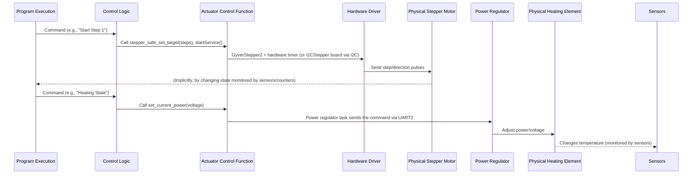

# Chapter 5: Hardware Control (Actuators)

Welcome back to the Samovar guide! In the previous chapter, [Chapter 4: Sensor Data Acquisition](04_sensor_data_acquisition_.md), we looked at how Samovar uses its sensors to "see" and collect data from the physical world – parameters such as temperature, pressure and flow rate. This real-time data gives Samovar important information about what is happening during brewing or distillation.

But merely *knowing* the temperature or the volume is not enough. Samovar is not just a monitoring device; it is a control system. It must *act*, physically interacting with the distillation or brewing equipment. It needs "hands" and a "voice" to switch things on or off, adjust power, move liquids or make sounds.

This is where **Hardware Control (Actuators)** comes into play. Actuators are the components that let Samovar physically control the installation. They are the active parts of the system that take the decisions produced by the control logic (based on program steps, system state and sensor data) and turn them into physical actions.

## Why Actuators Matter: A Use Case

Let's return to our rectification example. Suppose that Samovar, using a temperature sensor (as discussed in Chapter 4), has detected that the vapor temperature at the top of the column has reached the target value for collecting the "Hearts" (the main part of the distillate).

Knowing this temperature is useless if Samovar cannot *act* on this information. It needs to:

1.  Open a valve or switch on a pump to start collecting the liquid product.
2.  If necessary, adjust the power supplied to the heating element to maintain stable conditions.
3.  Direct the collected liquid into the right container using a distribution mechanism.
4.  Possibly even sound a buzzer to notify you of the transition to the next program step.

All of these actions are performed by **actuators**.

## Samovar's Hands and Voice: Types of Actuators

Samovar's hardware includes various actuators to perform different tasks:

*   **Heating element (controlled by a power/voltage regulator or a relay):** This is the main source of heat for the vessel. It can simply be switched on/off with a relay or, in more advanced installations, its power or voltage can be precisely regulated to maintain temperature or control the vapor rate.
*   **Cooling water valve/pump (controlled by a relay or PWM):** Controls the supply of cooling water to the condenser. It can be a simple valve (on/off via a relay) or a pump whose speed is adjusted using PWM (pulse-width modulation) based on feedback from a temperature sensor.
*   **Peristaltic pump/stepper motor (controlled by a stepper motor driver):** Used for precise control of the flow rate and total volume of collected liquid during distillation. A stepper motor provides accurate, repeatable movements — ideal for dispensing specific volumes.
*   **Stirrer motor/pump (controlled by a relay or I2C):** In brewing modes (for example, mashing) it stirs the contents of the vessel or recirculates the liquid. It is usually a simple on/off function via a relay, or control through a device on the I2C bus.
*   **Liquid distribution mechanism (controlled by a servo or relays):** Directs the collected liquid (heads, hearts, tails) into different receiving containers. It can be a servo that positions a spout, or a set of valves/relays that select the path.
*   **Buzzer (controlled by a digital output):** A simple sound alarm that notifies the user about important events (program step change, errors, etc.).

Each of these actuators is connected to Samovar's microcontroller (ESP32) through dedicated control pins or communication buses (for example, I2C or UART for power regulators). The software sends commands to these interfaces so that the actuators perform their functions.

## How Actuator Control Works

Controlling an actuator means telling it *what* to do (for example, switch on, set a speed, move to a position) and often *how much* or *how fast*. This decision-making is determined by Samovar's core logic, which combines information from the program steps ([Chapter 2](02_process_program_execution_.md)), the current system state ([Chapter 3](03_system_state___mode_management_.md)) and real-time sensor data ([Chapter 4](04_sensor_data_acquisition_.md)).

For example:
*   **Program step:** A step may require "Collect 500 ml of heads at a rate of 0.2 L/h". The program execution logic reads this, commands the stepper motor controller to move slowly for the number of steps calculated for 500 ml, and sets the container selection actuator to position 1.
*   **System state:** If the system state changes to "Heating", the control logic switches on the main heating element. If the state changes to "Alarm", heating is switched off and the buzzer is turned on.
*   **Sensor data:** If the cooling water temperature sensor reports that the water has become too hot, the valve/pump actuator may be commanded to open wider or increase its speed.

Samovar's software provides a set of functions that abstract away the low-level details of communicating with a particular actuator. These functions are the "command interface" for the actuators.

## Using Actuator Control: The Stepper Motor and Heater Example

Let's look at the control of the two most important actuators during a typical distillation program: the main heater and the liquid collection pump (the stepper motor).

According to the program steps defined in [Chapter 2](02_process_program_execution_.md), Samovar must:

1.  Switch on the main heater (usually at full power first, for warm-up).
2.  When conditions become suitable (for example, boiling starts or the column stabilizes, as determined by the sensors and state logic), reduce the heater power if necessary for stable operation.
3.  Switch on the stepper motor/pump at a certain speed and in the right direction.
4.  Track the volume of collected liquid by the number of stepper motor steps.
5.  Stop the stepper motor when the target volume for the current program step is reached.

These actions are initiated by the program execution logic calling dedicated functions to control these actuators.

## Under the Hood: The Control Flow

When Samovar decides to perform an actuator action, the command passes through the system as follows:



In this simplified flow:
1.  The **Program Execution** logic (or Samovar's general logic, depending on the mode/state) determines that an actuator action is required.
2.  It calls a function in the **Control Logic** layer (for example, `run_program` or `beer_stage_tick`).
3.  This control logic function calls a specific **Actuator Control Function** (for example, `stepper_safe_set_target` and `startService`, or `set_current_power`).
4.  The actuator control function contains code that interacts directly with the **Hardware Driver** (this may be a library or custom code for I2C, Serial or GPIO).
5.  The hardware driver sends the necessary signals or commands to the **Physical Actuator**, making it perform the required action.

This layered approach keeps the main program logic clean; it does not need to know the low-level details of *how* to talk to each device, only *which* function to call.

## Deep Dive into the Code

Let's look at simplified code fragments showing how Samovar controls its actuators.

### Stepper Motor Control (Peristaltic Pump)

The stepper motor plays a key role in precise liquid collection. The main collection pump is connected to the ESP32 directly (the `STEPPER_STEP`, `STEPPER_DIR`, `STEPPER_EN` pins from `Samovar_pin.h`) and is driven by the `stepper` object of the `GyverStepper2` library (`GStepper2<STEPPER2WIRE>`, declared in `Samovar.h`). Step pulses are generated by a hardware timer: `startService()` starts it, `stopService()` stops it, and its interrupt handler `StepperTicker()` calls `stepper.tickManual()`. Tasks access `stepper` only through the `stepper_safe_*` wrappers from `runtime_helpers.h`, which protect the object from simultaneous access by the interrupt.

```c++
// Simplified fragment from logic.h (run_program): starting collection for a program row
CurrrentStepperSpeed = get_speed_from_rate(program[num].Speed);      // L/h -> steps per second
TargetStepps = (uint32_t)program[num].Volume * SamSetup.StepperStepMl; // ml -> steps (pump calibration)
stepper_safe_set_max_speed(CurrrentStepperSpeed);
stepper_safe_set_current(0);           // Start counting steps from 0 for this row
stepper_safe_set_target(TargetStepps); // Set the number of steps
startService();                        // Start the timer that generates step pulses

// Simplified fragment from Samovar.ino
void startService(void) {
  // The timer period comes from the library (Arduino core 3.x; for core 2.x - timerAlarmWrite/timerAlarmEnable)
  timerAlarm(timer, stepper.getPeriod(), true, 0);
}

void IRAM_ATTR StepperTicker(void) { // Timer interrupt
  portENTER_CRITICAL_ISR(&timerMux);
  StepperMoving = stepper.tickManual(); // Make a step if it is time
  portEXIT_CRITICAL_ISR(&timerMux);
}
```

The speed (`CurrrentStepperSpeed`) and the total number of steps (`TargetStepps`) are calculated from the program row. The system tracks collection progress via `stepper_safe_get_current()`, and `set_pump_speed()` (`logic.h`) changes the speed on the fly.

A second pump and a stirrer can run on an I2CStepper board — a separate microcontroller (Arduino Nano) that drives the motor and receives commands over I2C. For it, `I2CStepper.h` provides `set_stepper_target()` (pump: a given number of steps), `set_stepper_by_time()` (stirrer: revolutions per minute for a given time) and `set_mixer_pump_target()` (relay 1 of the board).

```c++
// Fragment from I2CStepper.h
inline bool set_stepper_target(uint32_t speedStepsPerSecond, uint8_t direction,
                               uint32_t targetSteps, bool requireI2c) {
  I2CStepperDevice* device = i2c_stepper_selected_pump(); // The board selected as the pump
  if (!device || !device->present) return false;
  if (speedStepsPerSecond == 0 || targetSteps == 0) return i2c_stepper_stop(*device); // Zeros - stop
  // ... checking the speed and step count limits ...
  device->config.mode = I2CSTEPPER_V3_MODE_FILLING;
  device->motion.mode = I2CSTEPPER_V3_MODE_FILLING;
  device->motion.direction = direction;
  device->motion.speedStepsPerSec = speedStepsPerSecond;
  device->motion.targetSteps = targetSteps;
  return i2c_stepper_start_finite(*device); // Settings, motion parameters and the START_FINITE command
}
```

Communication with the board uses the protocol from the `I2CStepperV3` library: the ESP32 writes the settings and motion parameter blocks, then sends a command frame with a sequence number and waits until the board confirms the result. Access to the I2C bus is protected by the `xI2CSemaphore` semaphore. The board state (including the remaining steps returned by `get_stepper_status()`) is refreshed by polling every 250 ms.

### Main Heater Control (Power/Voltage)

Controlling the power of a heating element is often more complex than simple on/off. The regulator is connected to UART2 (`Serial2`, pins `RXD2`/`TXD2`) and is selected in `Samovar_ini.h`:

*   `SAMOVAR_USE_POWER` — the KVIC regulator (38400 baud, 9600 with `KVIC_USE_9600`), code in `power_regulator_kvic.h`;
*   `SAMOVAR_USE_POWER` + `SAMOVAR_USE_RMVK` — the RMVK voltage regulator (`power_regulator_rmvk.h`, `mod_rmvk.h`, `mod_rmv.ino`);
*   `SAMOVAR_USE_POWER` + `SAMOVAR_USE_SEM_AVR` — the SEM_AVR power regulator, setpoint in watts (`power_regulator_sem.h`; `SAMOVAR_USE_RMVK` is then defined automatically);
*   without `SAMOVAR_USE_POWER` the heating is controlled by relays: relay 1 (`RELE_CHANNEL1`) — the main heater, relay 4 (`RELE_CHANNEL4`) — the boost heating element.

Control uses the `set_current_power`, `set_power_mode` and `set_power` functions from `power_regulator.h`. They do not write to the port themselves: they queue a request, and a separate regulator task (`triggerPowerStatus`) sends the command to the UART.

```c++
// Simplified fragment from power_regulator.h
ActuatorCommandResult set_current_power(float Volt, uint64_t* generation) {
  // ... the setpoint is limited to 230 V (for SEM_AVR - to the power equivalent to 230 V) ...
  if (!PowerOn || heaterSafetyState.emergencyLatched) return ACTUATOR_COMMAND_FAILED; // Heating is off or an alarm
  // Below the threshold (40 V, 100 W for SEM_AVR) - sleep mode, otherwise work mode with the setpoint
  const uint64_t requestGeneration = request_regulator_state_locked(
    Volt < POWER_WORK_MODE_THRESHOLD ? SAFETY_REGULATOR_MODE_SLEEP : SAFETY_REGULATOR_MODE_WORK,
    Volt >= POWER_WORK_MODE_THRESHOLD, Volt, false);
  notify_power_worker(); // Wake up the regulator task
  return current_power_command_status(requestGeneration); // APPLIED, PENDING or FAILED
}

// The regulator task sends the command; the format depends on the model.
// power_regulator_kvic.h (KVIC): "S<voltage*10 in hex>\r"
inline bool apply_regulator_voltage_blocking(float Volt, uint64_t powerGeneration) {
  String hexString = String((int)(Volt * 10), HEX);
  const String command = "S" + hexString + "\r";
  if (!heater_uart_enqueue(UART_NUM_2, command.c_str(), command.length(), powerGeneration, true)) return false;
  target_power_volt = Volt;
  return true;
}
// RMVK: RMVK_set_out_voltge() -> "AT+VS=087" (three digits, volts)
// SEM_AVR: "АТ+VS=<setpoint>\r" (the "АТ" prefix is made of Cyrillic letters)

// Regulator mode: POWER_WORK_MODE ("0"), POWER_SPEED_MODE ("1", boost), POWER_SLEEP_MODE ("2", sleep).
// KVIC: "M<mode>\r"; RMVK: RMVK_set_on(1/0); SEM_AVR: "АТ+ON=1\r" / "АТ+ON=0\r"
inline void set_power_mode(String Mode);

ActuatorCommandResult set_power(bool On, bool enqueueResetCommand = true) {
  if (On) {
    // Refused with a message if the regulator task is not running, the emergency protection has tripped,
    // switching off is in progress, a self-test/calibration or a mode switch is running
    heater_outputs_enable_locked(SAFETY_HEATER_OUTPUT_MAIN, true); // PowerOn = true, relay 1 on
    // With a regulator: after SAMOVAR_USE_POWER_START_TIME (2 s; 3 + 2 s for SEM_AVR) the regulator is switched to boost.
    // Without a regulator: relay 4 (boost heating element) is switched on immediately as well.
  } else {
    // Relay 4 is released immediately, after 700 ms the regulator receives the sleep command,
    // another 200 ms later relay 1 is released and a reset command is queued (Chapter 3)
  }
  return ACTUATOR_COMMAND_APPLIED;
}
```

These functions show how high-level commands, such as setting the target voltage (`set_current_power`) or changing the operating mode (`set_power_mode`), are converted into specific Serial commands for the external power regulator. The `set_power(bool On)` function provides the master on/off for the whole heating circuit, including the master relay (`RELE_CHANNEL1`). Note that commands to the regulator are executed by a separate task, and the calling code receives the result (`ACTUATOR_COMMAND_APPLIED`, `ACTUATOR_COMMAND_PENDING` or `ACTUATOR_COMMAND_FAILED`); if the regulator does not respond in time, heating is switched off.

### Controlling Other Actuators (Relays, PWM, Servo, Buzzer)

The remaining actuators are controlled in a similar way — through calls to specialized functions that drive the corresponding pins or interfaces.

*   **Relays (water valve, stirrer, heater):** A simple write to a digital pin. Relay 1 — the heater (contactor), relay 2 — the stirrer in "Beer" mode, relay 3 — the cooling water valve, relay 4 — the boost heating element when no regulator is used.

    ```c++
    // Simplified fragment from valve_buzzer.h
    ActuatorCommandResult open_valve(bool Val, bool msg = true) {
      if (Val) {
        if (mode_switch_barrier_active) return ACTUATOR_COMMAND_FAILED; // A mode switch is in progress
        digitalWrite(RELE_CHANNEL3, SamSetup.rele3); // Switch on the valve relay
        valve_status = true; // Update the state flag
        // ... send a message to the user ...
      } else {
        digitalWrite(RELE_CHANNEL3, !SamSetup.rele3); // Switch off the valve relay
        valve_status = false;
        // ... send a message to the user ...
      }
      return ACTUATOR_COMMAND_APPLIED;
    }

    // Simplified fragment from beer.h
    void setHeaterPosition(bool state) {
      set_heater_state_flag(state); // Update the internal status
      if (state) {
    #ifdef SAMOVAR_USE_POWER
        set_current_power(SamSetup.StbVoltage); // With a regulator - set the voltage
    #else
        heater_boost_output_off();                        // Switch off relay 4 (boost)
        heater_enable_outputs(SAFETY_HEATER_OUTPUT_MAIN); // Switch on relay 1 (heater)
    #endif
      } else {
    #ifdef SAMOVAR_USE_POWER
        set_power_mode(POWER_SLEEP_MODE); // Put the regulator to sleep
    #else
        digitalWrite(RELE_CHANNEL1, !SamSetup.rele1);
        heater_boost_output_off();
    #endif
      }
    }
    ```
*   **PWM (water pump speed):** Using a PWM-capable pin and setting the duty cycle.

    ```c++
    // Simplified fragment from pumppwm.h
    ActuatorCommandResult set_pump_pwm(float duty) {
      duty = constrain(duty, 0, 1023); // Limit the duty cycle range (10-bit PWM)
      if (duty > 0 && mode_switch_barrier_active) return ACTUATOR_COMMAND_FAILED; // A mode switch is in progress
      // ... soft start: the first calls after switching on write PWM_START_VALUE * 10 ...
      if (duty == 0) pump_started = false;
      pump_pwm.write(duty); // Set the duty cycle on the pump pin
      water_pump_speed = duty; // Store the current speed value
      return ACTUATOR_COMMAND_APPLIED;
    }
    ```
    This function takes the specified PWM value (`duty`) and applies it to the pump through an `ESP32PWM` object (the `ESP32Servo` library, frequency `PUMP_PWM_FREQ`), regulating its speed. The value is chosen by the `set_pump_speed_pid()` PID controller based on the water temperature.
*   **Servo (liquid distribution):** Writing a position value to the servo object.

    ```c++
    // Fragment from logic.h
    void set_capacity(uint8_t cap) {
      if (cap > CAPACITY_NUM) return; // Container number out of range
      capacity_num = cap; // Store the current container number
    #ifdef SERVO_PIN // If a servo motor is used
      // Calculate the target position based on the container number and calibration
      int p = ((int)cap * SERVO_ANGLE) / (int)CAPACITY_NUM + servoDelta[cap];
      servo.write(p); // Move the servo motor to position 'p'
    #elif USER_SERVO // If a user-defined servo function is used
      user_set_capacity(cap); // Call the user-defined function
    #endif
    }
    ```
    This function takes the desired receiving container number (`cap`) and moves the connected servo motor (a `Servo` object of the `ESP32Servo` library) to the corresponding physical position.
*   **Buzzer:** Toggling the `BZZ_PIN` digital output; the series of beeps is timed by a function called from the main `loop()`.

    ```c++
    // Simplified fragment from valve_buzzer.h
    void set_buzzer(bool fl) {
      if (fl && SamSetup.UseBuzzer) { // Switch on only if requested and allowed in the settings
        buzzer_active = true;         // Start a series of beeps
        buzzer_beep_count = 0;
        buzzer_state = false;
        buzzer_next_time = millis();  // Start immediately
      } else {
        buzzer_active = false;
        buzzer_beep_count = 0;
        buzzer_state = false;
        digitalWrite(BZZ_PIN, LOW);   // Make sure the pin is LOW when switched off
      }
    }

    // Called from loop() on every pass
    void process_buzzer() {
      if (!buzzer_active) return;
      if ((int32_t)(millis() - buzzer_next_time) >= 0) {
        if (buzzer_state) {
          digitalWrite(BZZ_PIN, LOW);       // Switch the buzzer off
          buzzer_state = false;
          if (++buzzer_beep_count >= 5) buzzer_active = false; // A series of 5 beeps is finished
          else buzzer_next_time = millis() + 600;              // 600 ms pause
        } else {
          digitalWrite(BZZ_PIN, HIGH);      // Switch the buzzer on
          buzzer_state = true;
          buzzer_next_time = millis() + 400; // 400 ms beep
        }
      }
    }
    ```
    The `set_buzzer` function starts a series of beeps, and `process_buzzer` (called from the main `loop()`) switches the buzzer on and off by time: five 400 ms beeps with 600 ms pauses, providing audible feedback to the user.

These examples show that regardless of the specific hardware, the pattern is the same: the main logic calls a function with high-level parameters, and that function implements the low-level interaction (digitalWrite, PWM, serial commands, I2C messages) needed for the actuator to perform the action.

## Conclusion

In this chapter we got acquainted with **Hardware Control (Actuators)** — Samovar's ability to physically interact with brewing and distillation equipment. We looked at the variety of actuators it uses — from heaters and pumps to valves and buzzers — and understood that they are the "hands" and "voice" of the system. We saw how the control logic, using program steps ([Chapter 2](02_process_program_execution_.md)), system state ([Chapter 3](03_system_state___mode_management_.md)) and sensor data ([Chapter 4](04_sensor_data_acquisition_.md)), calls specialized functions to control these mechanisms. We looked at simplified code examples for controlling the stepper motor, the heater, relays, the PWM pump, the servo and the buzzer, showing how the software abstracts away the complexity of the hardware. Understanding actuator control is essential, because this is how Samovar turns internal decisions into real actions, automating your process.

In the next chapter we will discuss [Safety Monitoring and Alarms](06_safety_monitoring___alarms_.md) and learn how Samovar uses sensors and actuators to prevent dangerous situations and notify you if something goes wrong.

[Chapter 6: Safety Monitoring and Alarms](06_safety_monitoring___alarms_.md)
