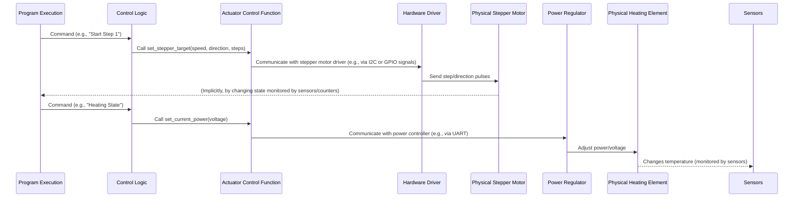

# Chapter 5: Hardware Control (Actuators)

Welcome back to the Samovar guide! In the previous chapter, [Chapter 4: Sensor Data Acquisition](04_sensor_data_acquisition_.md), we looked at how Samovar uses its sensors to "see" and collect data from the physical world – parameters such as temperature, pressure and flow rate. This real-time data gives Samovar important information about what is happening during brewing or distillation.

But merely *knowing* the temperature or the volume is not enough. Samovar is not just a monitoring device; it is a control system. It must *act*, physically interacting with the distillation or brewing equipment. It needs "hands" and a "voice" to switch things on or off, adjust power, move liquids or make sounds.

This is where **Hardware Control (Actuators)** comes into play. Actuators are the components that let Samovar physically control the installation. They are the active parts of the system that take the decisions produced by the control logic (based on program steps, system state and sensor data) and turn them into physical actions.

## Why Actuators Matter: A Use Case

Let's return to our rectification example. Suppose that Samovar, using a temperature sensor (as discussed in Chapter 4), has detected that the vapor temperature at the top of the column has reached the target value for collecting the "Hearts" (the main part of the distillate).

Knowing this temperature is useless if Samovar cannot *act* on this information. It needs to:

1.  Open a valve or switch on a pump to start collecting the liquid product.
2.  If necessary, adjust the power supplied to the heating element to maintain stable conditions.
3.  Direct the collected liquid into the right container using a distribution mechanism.
4.  Possibly even sound a buzzer to notify you of the transition to the next program step.

All of these actions are performed by **actuators**.

## Samovar's Hands and Voice: Types of Actuators

Samovar's hardware includes various actuators to perform different tasks:

*   **Heating element (controlled by a power/voltage regulator or a relay):** This is the main source of heat for the vessel. It can simply be switched on/off with a relay or, in more advanced installations, its power or voltage can be precisely regulated to maintain temperature or control the vapor rate.
*   **Cooling water valve/pump (controlled by a relay or PWM):** Controls the supply of cooling water to the condenser. It can be a simple valve (on/off via a relay) or a pump whose speed is adjusted using PWM (pulse-width modulation) based on feedback from a temperature sensor.
*   **Peristaltic pump/stepper motor (controlled by a stepper motor driver):** Used for precise control of the flow rate and total volume of collected liquid during distillation. A stepper motor provides accurate, repeatable movements — ideal for dispensing specific volumes.
*   **Stirrer motor/pump (controlled by a relay or I2C):** In brewing modes (for example, mashing) it stirs the contents of the vessel or recirculates the liquid. It is usually a simple on/off function via a relay, or control through a device on the I2C bus.
*   **Liquid distribution mechanism (controlled by a servo or relays):** Directs the collected liquid (heads, hearts, tails) into different receiving containers. It can be a servo that positions a spout, or a set of valves/relays that select the path.
*   **Buzzer (controlled by a digital output):** A simple sound alarm that notifies the user about important events (program step change, errors, etc.).

Each of these actuators is connected to Samovar's microcontroller (ESP32) through dedicated control pins or communication buses (for example, I2C or UART for power regulators). The software sends commands to these interfaces so that the actuators perform their functions.

## How Actuator Control Works

Controlling an actuator means telling it *what* to do (for example, switch on, set a speed, move to a position) and often *how much* or *how fast*. This decision-making is determined by Samovar's core logic, which combines information from the program steps ([Chapter 2](02_process_program_execution_.md)), the current system state ([Chapter 3](03_system_state___mode_management_.md)) and real-time sensor data ([Chapter 4](04_sensor_data_acquisition_.md)).

For example:
*   **Program step:** A step may require "Collect 500 ml of heads at a rate of 0.2 L/h". The program execution logic reads this, commands the stepper motor controller to move slowly for the number of steps calculated for 500 ml, and sets the container selection actuator to position 1.
*   **System state:** If the system state changes to "Heating", the control logic switches on the main heating element. If the state changes to "Alarm", heating is switched off and the buzzer is turned on.
*   **Sensor data:** If the cooling water temperature sensor reports that the water has become too hot, the valve/pump actuator may be commanded to open wider or increase its speed.

Samovar's software provides a set of functions that abstract away the low-level details of communicating with a particular actuator. These functions are the "command interface" for the actuators.

## Using Actuator Control: The Stepper Motor and Heater Example

Let's look at the control of the two most important actuators during a typical distillation program: the main heater and the liquid collection pump (the stepper motor).

According to the program steps defined in [Chapter 2](02_process_program_execution_.md), Samovar must:

1.  Switch on the main heater (usually at full power first, for warm-up).
2.  When conditions become suitable (for example, boiling starts or the column stabilizes, as determined by the sensors and state logic), reduce the heater power if necessary for stable operation.
3.  Switch on the stepper motor/pump at a certain speed and in the right direction.
4.  Track the volume of collected liquid by the number of stepper motor steps.
5.  Stop the stepper motor when the target volume for the current program step is reached.

These actions are initiated by the program execution logic calling dedicated functions to control these actuators.

## Under the Hood: The Control Flow

When Samovar decides to perform an actuator action, the command passes through the system as follows:



In this simplified flow:
1.  The **Program Execution** logic (or Samovar's general logic, depending on the mode/state) determines that an actuator action is required.
2.  It calls a function in the **Control Logic** layer (for example, `run_program` or `check_alarm_beer`).
3.  This control logic function calls a specific **Actuator Control Function** (for example, `set_stepper_target` or `set_current_power`).
4.  The actuator control function contains code that interacts directly with the **Hardware Driver** (this may be a library or custom code for I2C, Serial or GPIO).
5.  The hardware driver sends the necessary signals or commands to the **Physical Actuator**, making it perform the required action.

This layered approach keeps the main program logic clean; it does not need to know the low-level details of *how* to talk to each device, only *which* function to call.

## Deep Dive into the Code

Let's look at simplified code fragments showing how Samovar controls its actuators.

### Stepper Motor Control (Peristaltic Pump)

The stepper motor plays a key role in precise liquid collection. Samovar uses a function like `set_stepper_target` to control it. This function can drive the stepper motor driver directly through GPIO or, as shown in the `I2CStepper.h` file, communicate over I2C with a separate microcontroller (for example, an Arduino Nano) that drives the motor.

```c++
// Simplified fragment from I2CStepper.h (or logic.h, if the I2C stepper is not used)
bool set_stepper_target(uint16_t spd, uint8_t direction, uint32_t target) {
  // ... (check: is an I2C device used, or direct GPIO control) ...

  if (!use_I2C_dev) {
    // Direct control via GPIO using the GyverStepper2 library
    stepper.setMaxSpeed(spd);
    //stepper.setSpeed(spd); // Note: setSpeed is deprecated in newer versions of GyverStepper2
    stepper.setCurrent(0); // Start counting steps from 0 for this task
    stepper.setTarget(target); // Set the number of steps

    // Start the service that generates step pulses (usually via a timer)
    startService(); // Function that enables the motion timer/service
    return true;
  } else {
    // Control over I2C to a separate stepper motor driver board
    if (xSemaphoreTake(xI2CSemaphore, (TickType_t)(1000 / portTICK_RATE_MS)) == pdTRUE) {
      // Send the command and parameters (speed, direction, target) over I2C
      I2C2.writeByte(use_I2C_dev, 0, spd >> 8); // High byte of speed
      I2C2.writeByte(use_I2C_dev, 1, spd);     // Low byte of speed
      I2C2.writeByte(use_I2C_dev, 2, direction); // Direction (0 or 1)
      I2C2.writeByte(use_I2C_dev, 3, target >> 24); // Target steps (4 bytes)
      I2C2.writeByte(use_I2C_dev, 4, target >> 16);
      I2C2.writeByte(use_I2C_dev, 5, target >> 8);
      I2C2.writeByte(use_I2C_dev, 6, target);
      // Send the command byte so the I2C device processes the command
      I2C2.writeByte(use_I2C_dev, 8, 1); // Example: start the motor
      I2C2.writeByte(use_I2C_dev, 8, 0); // Example: reset/ready

      xSemaphoreGive(xI2CSemaphore); // Release the I2C bus
      return true;
    } else {
      // Handle an I2C communication error
      return false;
    }
  }
}
```

This function receives the desired speed (`spd`), the direction and the total number of steps (`target`) for the current program step. It then either uses the `GyverStepper2` library for direct control or sends the parameters over I2C to an external stepper motor driver. The `startService()` function (or the I2C command) initiates the actual motor movement. The system tracks `stepper.getCurrent()` (when using `GyverStepper2`) or reads the current step counter over I2C to monitor progress toward `target`.

### Main Heater Control (Power/Voltage)

Controlling the power of a heating element is often more complex than simple on/off. Samovar uses a power/voltage regulator, probably controlled over a serial connection (UART). Functions such as `set_current_power` and `set_power_mode` are used for this.

```c++
// Simplified fragment from logic.h/mod_rmvk.h (Serial control is assumed)
void set_current_power(float Volt) {
  if (!PowerOn) return; // Control power only if the system is on

  target_power_volt = Volt; // Store the target voltage

  // Send a command over Serial to the power regulator board
  // The command format depends on the regulator model (e.g., KVIC, RMVK)
#ifdef SAMOVAR_USE_RMVK // If the RMVK regulator is used over Serial
  // Command of the form "AT+VS=Volt\r"
  if (xSemaphoreTake(xSemaphoreAVR, (TickType_t)((RMVK_DEFAULT_READ_TIMEOUT * 3) / portTICK_RATE_MS)) == pdTRUE) {
    String Cmd = "";
    int V = Volt; // RMVK usually expects an integer voltage
    if (V < 100) Cmd = "0"; // Add a leading zero if needed
    Cmd += String(V);
    Serial2.print("AT+VS=" + Cmd + "\r"); // Send the command via Serial2
    vTaskDelay(RMVK_READ_DELAY / portTICK_PERIOD_MS); // Wait for execution
    xSemaphoreGive(xSemaphoreAVR); // Release the Serial2 semaphore
  }
#else // If another regulator over Serial
  // Command of the form "S[hex_voltage]\r"
  String hexString = String((int)(Volt * 10), HEX); // Convert voltage*10 to a hex string
  Serial2.print("S" + hexString + "\r"); // Send the command via Serial2
  vTaskDelay(300 / portTICK_PERIOD_MS); // Wait for execution
#endif
}

void set_power_mode(String Mode) {
  // Switch the regulator to different modes (e.g., standby, regulation)
  // The specific strings and commands depend on the regulator
  Serial2.print("M" + Mode + "\r"); // Send the mode command via Serial2
  vTaskDelay(300 / portTICK_PERIOD_MS); // Wait for execution
}

void set_power(bool On) {
  if (alarm_event && On) {
    return; // Do not switch on power while an alarm is active
  }
  PowerOn = On; // Update the internal power state flag
  if (On) {
    digitalWrite(RELE_CHANNEL1, SamSetup.rele1); // Switch on the system's main relay
    // ... possibly other actions, such as setting the regulator's initial mode ...
    set_power_mode(POWER_SPEED_MODE); // Set the fast warm-up mode
  } else {
    // ... possibly switching off auxiliary relays ...
    set_power_mode(POWER_SLEEP_MODE); // Put the regulator into standby/off mode
    digitalWrite(RELE_CHANNEL1, !SamSetup.rele1); // Switch off the system's main relay
    queue_samovar_reset_command(); // Signal a system reset/cleanup (Chapter 3)
  }
}
```

These functions show how high-level commands, such as setting the target voltage (`set_current_power`) or changing the operating mode (`set_power_mode`), are converted into specific Serial commands for the external power regulator. The `set_power(bool On)` function provides the master on/off for the whole heating circuit, including the master relay (`RELE_CHANNEL1`). Note the use of semaphores to manage access to the shared Serial interface.

### Controlling Other Actuators (Relays, PWM, Servo, Buzzer)

The remaining actuators are controlled in a similar way — through calls to specialized functions that drive the corresponding pins or interfaces.

*   **Relays (water valve, stirrer, auxiliary heaters):** A simple write to a digital pin.

    ```c++
    // Simplified fragment from logic.h/beer.h
    void open_valve(bool Val, bool msg = true) {
      valve_status = Val; // Update the state flag
      if (Val) {
        digitalWrite(RELE_CHANNEL3, SamSetup.rele3); // Switch on the valve relay
        // ... send a message to the user if msg == true ...
      } else {
        digitalWrite(RELE_CHANNEL3, !SamSetup.rele3); // Switch off the valve relay
        // ... send a message to the user if msg == true ...
      }
    }

    void setHeaterPosition(bool state) {
      heater_state = state; // Update the internal status
      if (state) {
        // The function may control different equipment depending on SAMOVAR_USE_POWER
    #ifndef SAMOVAR_USE_POWER
        // If there is no power regulator — simply switch on the main heater relay
        digitalWrite(RELE_CHANNEL1, SamSetup.rele1);
        // Or switch on specific auxiliary heaters
        digitalWrite(RELE_CHANNEL4, !SamSetup.rele4); // Example: auxiliary heater relay
    #endif
      } else {
    #ifndef SAMOVAR_USE_POWER
        digitalWrite(RELE_CHANNEL1, !SamSetup.rele1);
        digitalWrite(RELE_CHANNEL4, !SamSetup.rele4); // Example: auxiliary heater relay
    #endif
      }
    }
    ```
*   **PWM (water pump speed):** Using a PWM-capable pin and setting the duty cycle.

    ```c++
    // Simplified fragment from pumppwm.h
    void set_pump_pwm(float duty) {
      // ... safety checks (e.g., if alarm_event == true) ...
      duty = constrain(duty, 0, 1023); // Limit the duty cycle range
      pump_pwm.write(duty); // Set the duty cycle on the corresponding pin
      water_pump_speed = duty; // Store the current speed value
      // ... pump start logic (e.g., a starting boost) ...
    }
    ```
    This function takes the specified PWM value (`duty`) and applies it to the pump using the `ESP32PWM` library, regulating its speed.
*   **Servo (liquid distribution):** Writing a position value to the servo object.

    ```c++
    // Simplified fragment from logic.h
    void set_capacity(uint8_t cap) {
      capacity_num = cap; // Store the current container number
    #ifdef SERVO_PIN // If a servo motor is used
      // Calculate the target position based on the container number and calibration
      int p = ((int)cap * SERVO_ANGLE) / (int)CAPACITY_NUM + servoDelta[cap];
      servo.write(p); // Move the servo motor to position 'p'
    #elif USER_SERVO // If a user-defined servo function is used
      user_set_capacity(cap); // Call the user-defined function
    #endif
    }
    ```
    This function takes the desired receiving container number (`cap`) and moves the connected servo motor to the corresponding physical position.
*   **Buzzer:** Toggling a digital output, often controlled by a separate task to generate sound patterns.

    ```c++
    // Simplified fragment from logic.h (called from the main code)
    void set_buzzer(bool fl) {
      if (fl && SamSetup.UseBuzzer) { // Switch on only if requested and allowed in the settings
        // Signal the buzzer task to start beeping
        BuzzerTaskFl = true;
        // ... make sure the buzzer task is running (create it if necessary) ...
      } else {
        // Signal the buzzer task to stop, or stop it directly
        // ... logic for stopping the buzzer task when it is not needed ...
        digitalWrite(BZZ_PIN, LOW); // Make sure the pin is LOW when switched off
      }
    }

    // Simplified fragment from triggerBuzzerTask (runs in a separate task)
    void triggerBuzzerTask(void *parameter) {
      while (true) {
        if (BuzzerTaskFl) {
          digitalWrite(BZZ_PIN, HIGH); // Switch the buzzer on
          vTaskDelay(beep_duration / portTICK_PERIOD_MS); // Wait
          digitalWrite(BZZ_PIN, LOW); // Switch the buzzer off
          vTaskDelay(silent_duration / portTICK_PERIOD_MS); // Wait
          // ... logic for counting beeps and resetting BuzzerTaskFl ...
        } else {
          vTaskDelay(sleep_duration / portTICK_PERIOD_MS); // Sleep when not beeping
        }
      }
    }
    ```
    The `set_buzzer` function signals the `triggerBuzzerTask` task (a background FreeRTOS task) to start sounding the buzzer, providing audible feedback to the user.

These examples show that regardless of the specific hardware, the pattern is the same: the main logic calls a function with high-level parameters, and that function implements the low-level interaction (digitalWrite, PWM, serial commands, I2C messages) needed for the actuator to perform the action.

## Conclusion

In this chapter we got acquainted with **Hardware Control (Actuators)** — Samovar's ability to physically interact with brewing and distillation equipment. We looked at the variety of actuators it uses — from heaters and pumps to valves and buzzers — and understood that they are the "hands" and "voice" of the system. We saw how the control logic, using program steps ([Chapter 2](02_process_program_execution_.md)), system state ([Chapter 3](03_system_state___mode_management_.md)) and sensor data ([Chapter 4](04_sensor_data_acquisition_.md)), calls specialized functions to control these mechanisms. We looked at simplified code examples for controlling the stepper motor, the heater, relays, the PWM pump, the servo and the buzzer, showing how the software abstracts away the complexity of the hardware. Understanding actuator control is essential, because this is how Samovar turns internal decisions into real actions, automating your process.

In the next chapter we will discuss [Safety Monitoring and Alarms](06_safety_monitoring___alarms_.md) and learn how Samovar uses sensors and actuators to prevent dangerous situations and notify you if something goes wrong.

[Chapter 6: Safety Monitoring and Alarms](06_safety_monitoring___alarms_.md)
