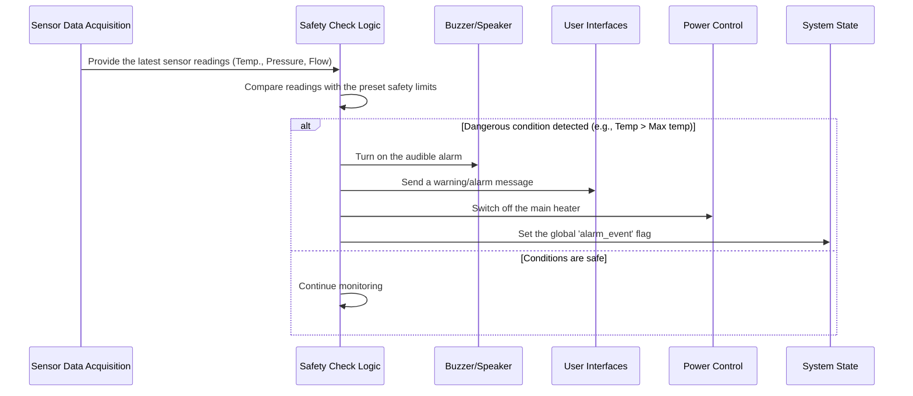

# Chapter 6: Safety Monitoring and Alarms

Welcome back! In the previous chapter, [Chapter 5: Hardware Control (Actuators)](05_hardware_control__actuators__.md), we saw how Samovar uses its "hands" and "voice" — the actuators — to control the brewing and distillation process: it switches on heaters, starts pumps and directs liquid. But what happens if one of these actions or some system state becomes dangerous? What if the heater runs too long or the cooling water stops flowing, leading to dangerous temperatures or pressures?

This is where **Safety Monitoring and Alarms** comes into action. Think of this part of the Samovar system as a built-in guardian or watchdog. Its main task is to constantly watch the process, detect when something goes wrong or becomes dangerous, and immediately take action to prevent equipment damage or a hazardous situation.

Without a safety system, Samovar would blindly follow its program even when conditions became critical. A reliable safety system is absolutely necessary for the safe operation of brewing and distillation equipment, especially when it involves heating flammable liquids or working under pressure.

## Why Safety Monitoring Is So Important: A Practical Example

Consider a critical situation: failure of the cooling water supply. Cooling water is needed to condense vapor back into liquid in the condenser. If it stops flowing, the vapor keeps rising but does not condense. This can quickly lead to dangerously high temperatures in the column and potentially to high pressure if the system is not equipped with a proper relief valve.

A reliable safety system must:

1.  Continuously monitor the cooling water temperature (using a sensor, as described in [Chapter 4: Sensor Data Acquisition](04_sensor_data_acquisition_.md)).
2.  If necessary, monitor the water flow (using a flow sensor).
3.  Check whether the readings exceed the safe limits.
4.  If a dangerous limit is reached, immediately:
    *   Sound a loud alarm (using the buzzer from [Chapter 5: Hardware Control (Actuators)](05_hardware_control__actuators__.md)).
    *   Display a clear warning message ([Chapter 1: User Interaction (Web and LCD)](01_user_interaction__web___lcd__.md)).
    *   Take protective measures, for example, immediately switch off the main heating element ([Chapter 5: Hardware Control (Actuators)](05_hardware_control__actuators__.md)).

This chapter explains how Samovar implements this important safety function.

## The Guardian at Work: Key Concepts

The safety system combines several elements that we have already discussed:

1.  **Monitoring:** This is the continuous reading of sensor data ([Chapter 4: Sensor Data Acquisition](04_sensor_data_acquisition_.md)). The system does not merely display the data — it specifically checks it against preset safety limits.
2.  **Critical conditions:** These are the specific situations that trigger the safety system. They are defined by thresholds set when the firmware is built (in `Samovar_ini.h` and `Samovar_pin.h`) or in the settings (`SamSetup`). Examples:
    *   Temperature sensors exceed the maximum allowed value (`MAX_WATER_TEMP`, `MAX_STEAM_TEMP`, `MAX_ACP_TEMP`).
    *   No cooling water flow for longer than `WF_ALARM_COUNT` seconds (checked by the flow sensor).
    *   Pressure exceeds the safe limit (`SamSetup.MaxPressureValue`).
    *   High liquid level in the column head (an indication of flooding, monitored by the head level sensor).
    *   A sensor failure (no data from the vapor, water, tank or TCA sensor during operation) or a press of the emergency button.
3.  **Alarm signals:** When a critical condition is detected, the system raises an alarm. It can be:
    *   Audible: the buzzer (if it is enabled in the settings).
    *   Visual/text: messages in the web interface.
    *   Remote: via Blynk ([Chapter 8: Network and External Communication](08_network___external_communication_.md)) — a message on virtual pin V26 and a push notification to the mobile app. Alarms arrive with the header "Тревога!" ("Alarm!"), warnings with the header "Предупреждение!" ("Warning!").
4.  **Protective actions:** These are automatic steps to reduce the danger. The most common and important one is switching off the main heating element. Other actions include stopping the pumps and the mixer, closing the water valve (in rectification, distillation, BK and NBK the cooling keeps running for 3 more minutes if water is flowing) and resetting the process state ([Chapter 3: System State and Mode Management](03_system_state___mode_management_.md)).

The safety checks run regardless of which process program ([Chapter 2: Process Program Execution](02_process_program_execution_.md)) is running: they are called by a background task, not by the program steps. The set of checks is chosen by the current operating mode ([Chapter 3: System State and Mode Management](03_system_state___mode_management_.md)).

## How Safety Monitoring Works: A Simple Algorithm

The basic safety monitoring process is simple:



This happens once per second: the `SysTicker` background task (file `Samovar.ino`) reads the sensors and right after that calls `mode_dispatch_alarm()`, which runs the check for the current mode. The key here is vigilance and fast reaction.

## Deep Dive into the Code: the `check_alarm` Functions

The safety monitoring logic is split into functions, one per mode. Which one is called is decided by the mode table in `mode_registry.h`:

*   rectification — `check_alarm()` (`alarm.h`);
*   distillation — `check_alarm_distiller()` (`distiller.h`);
*   BK — `check_alarm_bk()` (`BK.h`);
*   NBK — `check_nbk_critical_alarms()` and `check_alarm_nbk()` (`nbk.h`);
*   beer — `mode_alarm_beer()`, cheese — `mode_alarm_cheese()` (`mode_registry.h`);
*   sous-vide — `check_alarm_suvid()` (`suvid.h`), Lua — `check_alarm_lua()` (`lua.h`).

Checks shared by several modes (water and TCA overheating, no water flow, the hot water warning) live in `mode_common.h`.

First, let's see where the alarm limits are defined (in `Samovar_ini.h`):

```c++
// From Samovar_ini.h (simplified)
// Limit value settings for automation control

// Water temperature at which the operator will be notified
#define ALARM_WATER_TEMP 70
// Maximum water temperature at which the power will be switched off
#define MAX_WATER_TEMP 75
// Maximum vapor temperature at which the power will be switched off
#define MAX_STEAM_TEMP 98.8
// Maximum TCA temperature at which the power will be switched off
#define MAX_ACP_TEMP 75

// WF_ALARM_COUNT (seconds without water flow before the alarm, 20 by default) is defined in Samovar_pin.h,
// the pressure limit MaxPressureValue is in the settings (SamSetup)
```

These `#define` lines set the most important safety thresholds. The safety check code compares the actual sensor readings with these values.

All emergency stops go through a single function — `request_emergency_stop(reason)` from `alarm.h`. It immediately drops the heater relays and latches the alarm, sets `alarm_event = true` and turns on the buzzer. The rest is done by `perform_emergency_stop()`, which is called by the main `loop()`: it sends the message with the reason (`ALARM_MSG`), switches the power off (`set_power(false)`), closes the water or keeps the cooling running for 3 more minutes, stops the pumps and the mixer and resets the process state.

Now let's look at a simplified version of the `check_alarm()` function from `alarm.h` (rectification mode):

```c++
// Simplified fragment from alarm.h (the check_alarm function)

void check_alarm() {
  // Clear the water warning pause if 30 seconds have passed
  mode_clear_alarm_pause_if_expired();

  // --- Sensor failure during operation ---
  if (PowerOn) {
    // The vapor, water and tank sensors are not assigned — switch the heating off with a normal command
    // (rectification_ds_sensors_assigned(), SAMOVAR_POWER_OFF)
    // No data from the vapor, water, TCA or tank sensor — emergency stop:
    if (optional_sensor_failed(SteamSensor) && process_sensor_failed("Ректификация", "пара")) return; // "Rectification", "vapor"
    if (!mode_check_powered_cooling_sensors("Ректификация")) return;
    if (optional_sensor_failed(TankSensor) && process_sensor_failed("Ректификация", "куба")) return; // "Rectification", "tank"
  }

  // --- Head level sensor (flooding) ---
#ifdef USE_HEAD_LEVEL_SENSOR
  if (SamSetup.UseHLS && PowerOn) {
    // head_level_sensor_holded() polls the whls sensor button (held = high level)
    if (head_level_sensor_holded() && alarm_h_min == 0) {
      if (current_program_type() != 'C') {
        set_buzzer(true); // Sound the alarm signal
        SendMsg("Сработал датчик захлёба!", ALARM_MSG); // "The flooding sensor has triggered!"
      }
      // On a 'C' line (pre-flooding) there is no alarm: the sensor trigger is a normal part of the program.
#ifdef SAMOVAR_USE_POWER
      // This alarm causes a *reduction* of power rather than a shutdown,
      // so that the column can clear the accumulated liquid.
      SendMsg((String)PWR_MSG + " снижаем с " + (String)target_power_volt, NOTIFY_MSG); // PWR_MSG + " reducing from " + target_power_volt
      // Reduce by 1 V (by 3% for the SEM_AVR regulator), but not below the working threshold
      set_current_power(max(target_power_volt - 1 * PWR_FACTOR, power_work_mode_threshold()));
#endif
      // The process is inertial — wait 40 seconds before the next reaction
      alarm_h_min = millis() + 1000 * 40;
    }
    // The timer has expired — the check is active again. If the cause of the alarm
    // has still not been eliminated, the alarm will trigger again on the next pass.
    if (alarm_h_min > 0 && (int32_t)(millis() - alarm_h_min) >= 0) alarm_h_min = 0;
    // ... on a 'C' line the power is restored after TIME_C minutes and then raised little by little
  }
#endif

  // ... control of the water valve and the cooling pump

  // --- Critical temperatures ---
  if ((SteamSensor.avgTemp >= MAX_STEAM_TEMP || WaterSensor.avgTemp >= MAX_WATER_TEMP ||
       TankSensor.avgTemp >= SamSetup.DistTemp || sensor_temp_at_least(ACPSensor, MAX_ACP_TEMP)) && PowerOn) {
    String s = "";
    if (SteamSensor.avgTemp >= MAX_STEAM_TEMP) s = s + " Пара"; // " Vapor"
    else if (WaterSensor.avgTemp >= MAX_WATER_TEMP) s = s + " Воды"; // " Water"
    else if (sensor_temp_at_least(ACPSensor, MAX_ACP_TEMP)) s = s + " ТСА"; // " TCA"

    if (TankSensor.avgTemp >= SamSetup.DistTemp) {
      // The tank temperature has reached the set value — this is a normal finish, not an alarm
      SendMsg("Лимит максимальной температуры куба. Программа завершена.", NOTIFY_MSG); // "Maximum tank temperature limit. Program finished."
      queue_samovar_command(SAMOVAR_POWER); // if the queue did not accept the command — emergency stop
    } else
      request_emergency_stop("Аварийное отключение! Превышена максимальная температура" + s); // "Emergency shutdown! Maximum temperature exceeded"
  }

  // --- Water flow (flow sensor, USE_WATERSENSOR) ---
  // WFAlarmCount — how many seconds in a row there has been no flow while water should be flowing.
  // More than WF_ALARM_COUNT — siren and "Аварийное отключение! Прекращена подача воды." ("Emergency shutdown! Water supply has stopped.")
  mode_request_water_flow_emergency_if_needed();

  // --- Hot water warning (threshold ALARM_WATER_TEMP - 5, i.e. 65 °C) ---
  if (mode_water_pre_alarm_due()) { // WaterSensor.avgTemp >= ALARM_WATER_TEMP - 5 && PowerOn && alarm_t_min == 0
    mode_warn_water_hot(); // buzzer and WARNING_MSG "Высокая температура воды: ... Проверьте охлаждение." ("High water temperature: ... Check the cooling.")
#ifdef SAMOVAR_USE_POWER
    // At ALARM_WATER_TEMP (70 °C) and above — ALARM_MSG "Критическая температура воды! Ошибка подачи воды. ..." ("Critical water temperature! Water supply error. ...")
    // and a power reduction by 5 V (by 8% for SEM_AVR), but not below the working threshold
    mode_reduce_power_for_water_alarm_by_volts("Критическая температура воды! ...", 5);
#endif
    mode_set_alarm_pause_ms(30000); // alarm_t_min: the next reaction no earlier than 30 seconds later
  }

  // ... transition from heat-up to stabilization, boiling detection
}
```

The pressure limit is not checked in `check_alarm()` but directly in `SysTicker` (`Samovar.ino`), once per second and in all modes. The check exists if the firmware is built with a pressure sensor (`USE_PRESSURE_XGZ`, `USE_PRESSURE_MPX` or `USE_PRESSURE_1WIRE`) and a limit greater than zero is set in the settings:

```c++
// Simplified fragment from Samovar.ino (the SysTicker task)
if (SamSetup.MaxPressureValue > 0 && pressure_value >= SamSetup.MaxPressureValue) {
  if (!pressure_alarm_sent) {
    request_emergency_stop("Превышено предельное давление!"); // "Pressure limit exceeded!"
    pressure_alarm_sent = true;
  }
}
// pressure_alarm_sent is cleared when the pressure drops below the limit by 5% (at least 5 units)
```

These fragments are the heart of the safety system. They show:

*   Reading the latest sensor values (for example, `SteamSensor.avgTemp`, `WaterSensor.avgTemp`, `ACPSensor.avgTemp`, `TankSensor.avgTemp`, `WFAlarmCount`, `pressure_value`).
*   Comparing these values with the limits from `Samovar_ini.h` and `Samovar_pin.h` (`MAX_STEAM_TEMP`, `MAX_WATER_TEMP`, `MAX_ACP_TEMP`, `ALARM_WATER_TEMP`, `WF_ALARM_COUNT`) or from `SamSetup` (`MaxPressureValue`, `DistTemp`).
*   Actions when a limit is exceeded:
    *   Calling `set_buzzer(true)` to sound the alarm.
    *   Calling `SendMsg()` to notify the user through the web interface and Blynk.
    *   Calling `request_emergency_stop()` for an emergency stop: switching off the heating and all the protective actions described above (a critical action).
    *   Calling `set_current_power()` to reduce power (a less critical action, for example in case of flooding or hot water).
    *   Setting the `alarm_event = true;` flag (inside the emergency stop). This is an important global variable indicating that an emergency stop has occurred.
*   Using timers (`alarm_t_min`, `alarm_h_min`) or counters (`WFAlarmCount`) to avoid false triggers caused by short-term fluctuations or to give time to recover after a minor event (for example, a brief trigger of the flooding sensor).

The checks of the other modes are built the same way but take their specifics into account:

*   distillation and BK — water and TCA overheating, sensor failure, water flow and the hot water warning;
*   NBK — sensor failure, program errors, insufficient cooling (TCA above 60 °C or water above `MAX_WATER_TEMP` for 60 seconds in a row), pressure sensor failure (no readings for more than 60 seconds); the end of the wash and flooding usually finish the program normally, and if that fails — with an emergency stop;
*   beer — water and TCA overheating on the fermentation line `F`, wort overheating in the tank (above `BOILING_TEMP + 5`) on any line, water flow;
*   cheese — the same checks as in beer mode.

## Alarms and System State

When a critical alarm occurs, the safety system not only switches off the equipment but also affects the overall system state ([Chapter 3: System State and Mode Management](03_system_state___mode_management_.md)). The emergency stop resets the process state, and the alarm latch (`heater_safety_latched()`) and the `alarm_event` flag tell the rest of Samovar's logic about the critical event.

While the latch is set, the heating does not switch on: attempts to start a process (for example, with the "Start" («Старт») button) are rejected, and the alarm reason is kept so that the operator can see why the heating is blocked. The `SAMOVAR_RESET` command does not clear the latch. To work again after an alarm, eliminate the cause and reboot the controller.

## Conclusion

In this chapter we got acquainted with Samovar's important role as a guardian through **Safety Monitoring and Alarms**. We saw how the system constantly watches sensor data, comparing it with the specified critical limits. When a dangerous condition is detected, such as water overheating or no flow, the system raises alarm signals (audible and visual) and immediately takes protective measures, first of all by switching off the heating element. We looked at simplified code examples showing how the sensors are checked (the `check_alarm` functions), how the limits are defined (`Samovar_ini.h`) and how the emergency stop is performed (`request_emergency_stop`, `set_power`, `set_buzzer`). We also touched on the `alarm_event` flag and the alarm latch, which signal the critical safety state to the rest of Samovar's code. Understanding the safety system gives confidence that Samovar is designed not only for automation but also for safe operation.

Safety limits and settings are extremely important and may need to be adjusted for your specific equipment or conditions. In the next chapter, [Chapter 7: Configuration Persistence](07_configuration_persistence_.md), we will learn how these important settings, as well as program definitions and calibration values, are stored permanently and are not lost when Samovar is powered off.

[Chapter 7: Configuration Persistence](07_configuration_persistence_.md)
