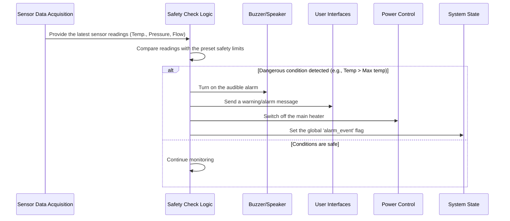

# Chapter 6: Safety Monitoring and Alarms

Welcome back! In the previous chapter, [Chapter 5: Hardware Control (Actuators)](05_hardware_control__actuators__.md), we saw how Samovar uses its "hands" and "voice" — the actuators — to control the brewing and distillation process: it switches on heaters, starts pumps and directs liquid. But what happens if one of these actions or some system state becomes dangerous? What if the heater runs too long or the cooling water stops flowing, leading to dangerous temperatures or pressures?

This is where **Safety Monitoring and Alarms** comes into action. Think of this part of the Samovar system as a built-in guardian or watchdog. Its main task is to constantly watch the process, detect when something goes wrong or becomes dangerous, and immediately take action to prevent equipment damage or a hazardous situation.

Without a safety system, Samovar would blindly follow its program even when conditions became critical. A reliable safety system is absolutely necessary for the safe operation of brewing and distillation equipment, especially when it involves heating flammable liquids or working under pressure.

## Why Safety Monitoring Is So Important: A Practical Example

Consider a critical situation: failure of the cooling water supply. Cooling water is needed to condense vapor back into liquid in the condenser. If it stops flowing, the vapor keeps rising but does not condense. This can quickly lead to dangerously high temperatures in the column and potentially to high pressure if the system is not equipped with a proper relief valve.

A reliable safety system must:

1.  Continuously monitor the cooling water temperature (using a sensor, as described in [Chapter 4: Sensor Data Acquisition](04_sensor_data_acquisition__.md)).
2.  If necessary, monitor the water flow (using a flow sensor).
3.  Check whether the readings exceed the safe limits.
4.  If a dangerous limit is reached, immediately:
    *   Sound a loud alarm (using the buzzer from [Chapter 5: Hardware Control (Actuators)](05_hardware_control__actuators__.md)).
    *   Display a clear warning message ([Chapter 1: User Interaction (Web and LCD)](01_user_interaction__web___lcd__.md)).
    *   Take protective measures, for example, immediately switch off the main heating element ([Chapter 5: Hardware Control (Actuators)](05_hardware_control__actuators__.md)).

This chapter explains how Samovar implements this important safety function.

## The Guardian at Work: Key Concepts

The safety system combines several elements that we have already discussed:

1.  **Monitoring:** This is the continuous reading of sensor data ([Chapter 4: Sensor Data Acquisition](04_sensor_data_acquisition__.md)). The system does not merely display the data — it specifically checks it against preset safety limits.
2.  **Critical conditions:** These are the specific situations that trigger the safety system. They are defined by thresholds set in Samovar's configuration (often in a header file such as `Samovar_ini.h` or in the settings). Examples:
    *   Temperature sensors exceed the maximum allowed value (`MAX_WATER_TEMP`, `MAX_STEAM_TEMP`).
    *   No cooling water flow for a certain period of time (checked by the flow sensor or the water outlet temperature).
    *   Pressure exceeds the safe limit (`MaxPressureValue`).
    *   High liquid level in the column head (an indication of flooding, monitored by the head level sensor).
3.  **Alarm signals:** When a critical condition is detected, the system raises an alarm. It can be:
    *   Audible: a buzzer or another sound signal.
    *   Visual/text: messages on the LCD or the web interface.
    *   Remote: notifications over the network ([Chapter 8: Network and External Communication](08_network___external_communication__.md)), for example Telegram or MQTT.
4.  **Protective actions:** These are automatic steps to reduce the danger. The most common and important one is switching off the main heating element. Other actions may include stopping pumps, closing valves or changing the system state ([Chapter 3: System State and Mode Management](03_system_state___mode_management__.md)) to "Error" or "Alarm".

The safety system is always active, regardless of which process program ([Chapter 2: Process Program Execution](02_process_program_execution__.md)) is running and what the main system state is ([Chapter 3: System State and Mode Management](03_system_state___mode_management__.md)). It is an independent layer focused solely on safety.

## How Safety Monitoring Works: A Simple Algorithm

The basic safety monitoring process is simple:



This happens repeatedly — many times per second or minute, depending on the sensor update rate and how often the safety check function is called in the program's main loop. The key here is vigilance and fast reaction.

## Deep Dive into the Code: the `check_alarm` Functions

The safety monitoring logic is implemented primarily in functions named like `check_alarm()`, `check_alarm_beer()` and `check_alarm_nbk()`, depending on the operating mode. These functions are often called from the main `loop()` or as part of the handling functions of the corresponding modes ([Chapter 3: System State and Mode Management](03_system_state___mode_management__.md)).

Let's look at simplified fragments from `logic.h` (general safety checks applied in rectification mode) and possibly from `distiller.h` or `nbk.h`.

First, let's see where the alarm limits are often defined (in `Samovar_ini.h`):

```c++
// From Samovar_ini.h (simplified)
// Limit value settings for automation control

// Water temperature at which the operator will be notified
#define ALARM_WATER_TEMP 70
// Maximum water temperature at which the power will be switched off
#define MAX_WATER_TEMP 75
// Maximum vapor temperature at which the power will be switched off
#define MAX_STEAM_TEMP 98.8
// Maximum TCA temperature at which the power will be switched off
#define MAX_ACP_TEMP 75

// ... other safety settings, such as WF_ALARM_COUNT (flow sensor threshold), MaxPressureValue, etc.
```

These `#define` lines set the most important safety thresholds. The safety check code compares the actual sensor readings with these values.

Now let's look at a simplified version of the `check_alarm()` function from `logic.h`, focused on critical temperature alarms:

```c++
// Simplified fragment from logic.h (the check_alarm function)

void check_alarm() {
  // --- Check for critical temperature alarms ---
  // If ANY of these temperatures exceeds the absolute maximum AND power is on...
  if ((SteamSensor.avgTemp >= MAX_STEAM_TEMP ||
       WaterSensor.avgTemp >= MAX_WATER_TEMP ||
       ACPSensor.avgTemp >= MAX_ACP_TEMP) && PowerOn) {

    // ... then the emergency shutdown is triggered!
    delay(1000); // Short pause so other commands can complete
    set_buzzer(true); // Sound the alarm!
    set_power(false); // Switch off the power immediately!

    // Build the message about the exceeded temperature limit
    String s = "";
    if (SteamSensor.avgTemp >= MAX_STEAM_TEMP) s += " Пара"; // " Steam"
    if (WaterSensor.avgTemp >= MAX_WATER_TEMP) { if (s.length() > 0) s+= " и"; s += " Воды"; } // " and" / " Water"
    if (ACPSensor.avgTemp >= MAX_ACP_TEMP) { if (s.length() > 0) s+= " и"; s += " ТСА"; } // " and" / " TCA"

    SendMsg("Аварийное отключение! Превышена максимальная температура" + s, ALARM_MSG); // Critical message ("Emergency shutdown! Maximum temperature exceeded")

    // Global flag that an alarm has occurred (prevents restarting the system, etc.)
    alarm_event = true;

    // Note: the system state may also be updated here or by the power-off handler (see Chapter 3)

    return; // Stop further checks in this cycle, a critical alarm has occurred.
  }

  // --- Check for warnings / less critical alarms ---

  // Check for the high cooling water temperature warning (threshold lower than MAX_WATER_TEMP)
  // Use a delay timer (alarm_t_min) to avoid frequent triggering
  if ((WaterSensor.avgTemp >= ALARM_WATER_TEMP - 5) && PowerOn && alarm_t_min == 0) {
    set_buzzer(true); // Sound the warning signal (may differ from the critical one)
    SendMsg(("Критическая температура воды!"), WARNING_MSG); // Warning ("Critical water temperature!")

    // If desired, take less drastic measures, for example, reduce power (if there is a regulator)
    #ifdef SAMOVAR_USE_POWER
    if (WaterSensor.avgTemp >= ALARM_WATER_TEMP) {
        SendMsg("Критическая температура воды! Понижаем " + (String)PWR_MSG, ALARM_MSG); // "Critical water temperature! Reducing " + PWR_MSG
        // Example: reduce power by a fixed amount/percentage
        set_current_power(target_power_volt * 0.9); // Reduce power by 10%
    }
    #endif

    // Set a timer so that it does not trigger again immediately
    alarm_t_min = millis() + 1000 * 30; // Wait 30 seconds before the next trigger
  }

  // --- Check for a water flow sensor alarm ---
  #ifdef USE_WATERSENSOR
  // Check whether the water flow counter (WFAlarmCount, incremented when there is no flow)
  // exceeds the limit (WF_ALARM_COUNT) and power is on
  if (WFAlarmCount > WF_ALARM_COUNT && PowerOn) {
      set_buzzer(true); // Sound the alarm
      // Signal the system to perform shutdown and cleanup (see the synchronizing command in Chapter 3)
      queue_samovar_command(SAMOVAR_POWER);
      SendMsg(("Аварийное отключение! Прекращена подача воды."), ALARM_MSG); // Critical message ("Emergency shutdown! Water supply has stopped.")
      alarm_event = true; // Global alarm flag
      return; // Stop further checks
  }
  #endif

  // --- Check for a head level sensor alarm (flooding) ---
  #ifdef USE_HEAD_LEVEL_SENSOR
  // Check whether the level sensor button (whls) is held ("stuck" — high liquid level)
  // and whether a previous trigger is not already being handled (alarm_h_min timer) and power is on
  if (SamSetup.UseHLS && PowerOn) {
      whls.tick(); // Update the button state
      if (whls.isHolded() && alarm_h_min == 0) {
          whls.resetStates(); // Reset the state after detection
          set_buzzer(true); // Sound the alarm signal
          SendMsg(("Сработал датчик захлёба!"), ALARM_MSG); // Critical message ("The flooding sensor has triggered!")

          // This alarm often causes a *reduction* of power rather than a complete shutdown
          // This allows the column to clear the accumulated liquid.
          #ifdef SAMOVAR_USE_POWER
          // Save the current power before reducing it
          prev_target_power_volt = target_power_volt;
          // Reduce power significantly (e.g., by 20%)
          set_current_power(target_power_volt * 0.8);
          SendMsg((String)PWR_MSG + " снижаем с " + (String)target_power_volt, NOTIFY_MSG); // PWR_MSG + " reducing from " + target_power_volt
          #endif

          // Set a recovery timer before checking for the alarm again
          alarm_h_min = millis() + 1000 * 40; // Wait 40 seconds
      }
       // Check whether the timer for re-enabling the check has expired
      if (alarm_h_min > 0 && millis() >= alarm_h_min) {
        whls.resetStates(); // Reset the button state once more
        alarm_h_min = 0; // Reset the timer
        // If the cause of the alarm has still not been eliminated (e.g., whls.isHolded() is true again)
        // the alarm will trigger again in the next cycle.
      }
  }
  #endif

  // --- Check for a pressure sensor alarm ---
  // Check whether the pressure value (pressure_value, from the pressure sensor)
  // exceeds the maximum allowed (SamSetup.MaxPressureValue) and power is on
  #ifdef USE_PRESSURE_MPX // Example for the MPX pressure sensor
  if (use_pressure_sensor && pressure_value >= SamSetup.MaxPressureValue && PowerOn) {
      set_buzzer(true); // Sound the alarm
      set_power(false); // Switch off the power
      SendMsg(("Аварийное отключение! Превышено максимальное давление."), ALARM_MSG); // Critical message ("Emergency shutdown! Maximum pressure exceeded.")
      alarm_event = true; // Global alarm flag
      return; // Stop further checks
  }
  #endif

  // ... other checks may be here as well (e.g., exceeding the number of sensor read errors)

  // If a critical alarm was *already* detected in a previous cycle (alarm_event == true),
  // the system remains in the alarm state until reset (handled elsewhere).
  // The checks above look for *new* critical conditions.
}
```

This function (and its variations for other modes) is the heart of the safety system. It shows:

*   Reading the latest sensor values (for example, `SteamSensor.avgTemp`, `WaterSensor.avgTemp`, `ACPSensor.avgTemp`, `WFAlarmCount`, `pressure_value`).
*   Comparing these values with the limits from `Samovar_ini.h` (`MAX_STEAM_TEMP`, `MAX_WATER_TEMP`, `ALARM_WATER_TEMP`, `WF_ALARM_COUNT`, `MaxPressureValue`) or from `SamSetup`.
*   Actions when a limit is exceeded:
    *   Calling `set_buzzer(true)` to sound the alarm.
    *   Calling `SendMsg()` to notify the user through the interfaces.
    *   Calling `set_power(false)` to switch off the main heater (a critical action).
    *   Calling `set_current_power()` to reduce power (a less critical action, for example in case of flooding).
    *   Setting the `alarm_event = true;` flag. This is an important global variable indicating that an emergency stop has occurred. Other parts of the code ([Chapter 3: System State and Mode Management](03_system_state___mode_management__.md), [Chapter 1: User Interaction (Web and LCD)](01_user_interaction__web___lcd__.md)) check this flag to prevent an accidental restart until the user acknowledges and resets the alarm state.
*   Using timers (`alarm_t_min`, `alarm_h_min`) or counters (`WFAlarmCount`) to avoid false triggers caused by short-term fluctuations or to give time to recover after a minor event (for example, a brief trigger of the flooding sensor).

The `check_alarm_beer()` and `check_alarm_nbk()` functions contain similar logic but are adapted to the safety specifics of those modes (for example, different temperature limits or pressure control logic relevant to beer brewing or NBK).

## Alarms and System State

When a critical alarm occurs, the safety system not only switches off the equipment but also affects the overall system state ([Chapter 3: System State and Mode Management](03_system_state___mode_management__.md)). The `alarm_event` flag is the main way of passing information about the critical event to the rest of Samovar's logic.

The main `loop()` function or the mode handlers check `alarm_event`. If it is set, the execution of program steps or reactions to user commands (for example, "Start" («Старт»)) are usually stopped. To resume operation after an alarm, the user must explicitly reset the system (usually via a button or a command that resets the `alarm_event` flag and the state, for example the `SAMOVAR_RESET` command described in Chapter 3).

## Conclusion

In this chapter we got acquainted with Samovar's important role as a guardian through **Safety Monitoring and Alarms**. We saw how the system constantly watches sensor data, comparing it with the specified critical limits. When a dangerous condition is detected, such as water overheating or no flow, the system raises alarm signals (audible and visual) and immediately takes protective measures, first of all by switching off the heating element. We looked at simplified code examples showing how the sensors are checked (the `check_alarm` functions), how the limits are defined (`Samovar_ini.h`) and how the actuators are used to eliminate the danger (`set_power`, `set_buzzer`). We also touched on the `alarm_event` flag, which signals the critical safety state to the rest of Samovar's code. Understanding the safety system gives confidence that Samovar is designed not only for automation but also for safe operation.

Safety limits and settings are extremely important and may need to be adjusted for your specific equipment or conditions. In the next chapter, [Chapter 7: Configuration Persistence](07_configuration_persistence__.md), we will learn how these important settings, as well as program definitions and calibration values, are stored permanently and are not lost when Samovar is powered off.

[Chapter 7: Configuration Persistence](07_configuration_persistence__.md)
