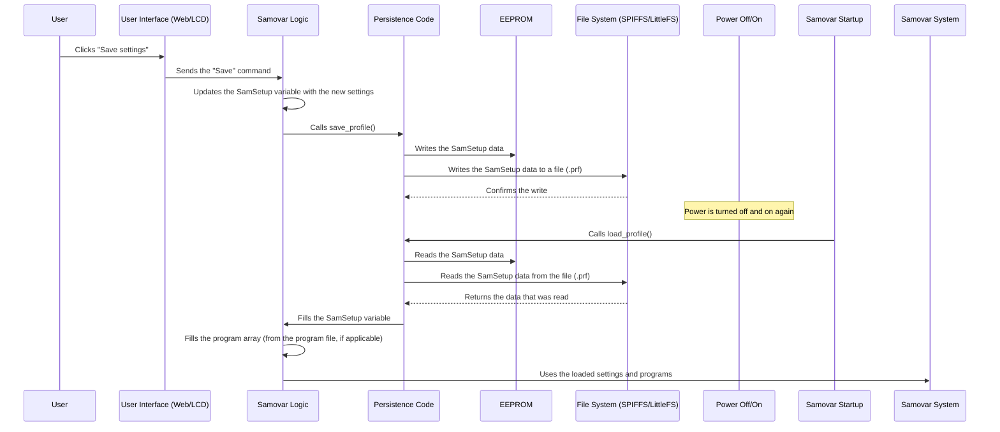

# Chapter 7: Configuration Persistence

Welcome back to the Samovar tutorial! So far on our journey we have looked at how you interact with Samovar ([Chapter 1: User Interaction (Web & LCD)](01_user_interaction__web___lcd__.md)), how it executes process programs ([Chapter 2: Process Program Execution](02_process_program_execution_.md)), how it manages its overall state ([Chapter 3: System State & Mode Management](03_system_state___mode_management_.md)), how it collects data from sensors ([Chapter 4: Sensor Data Acquisition](04_sensor_data_acquisition_.md)), how it controls hardware ([Chapter 5: Hardware Control (Actuators)](05_hardware_control__actuators__.md)), and how it keeps things safe with alarms ([Chapter 6: Safety Monitoring & Alarms](06_safety_monitoring___alarms_.md)).

But imagine that you have spent time carefully calibrating the temperature sensors, fine-tuning the pump speed and designing the perfect step-by-step program for your favorite distillate. You switch Samovar off, switch it on again... and all those custom settings and programs are gone! That would be incredibly annoying.

This is where **configuration persistence** comes to the rescue. It is Samovar's ability to remember its settings, calibration values and your carefully created process programs even after the power is turned off. It is like saving your progress and settings in a video game so that you can come back later and continue from the same place.

Without a persistence mechanism you would have to set everything up manually every time you want to use Samovar. Persistence makes the device convenient and practical for real use.

## Why Persistence Matters: A Use Case

Suppose you have just calibrated your peristaltic pump (the one that precisely regulates the take-off of liquid, see [Chapter 5: Hardware Control (Actuators)](05_hardware_control__actuators__.md)). This calibration tells Samovar how many stepper motor steps it takes to dispense one milliliter of liquid. You entered this value (`StepperStepMl`) on the settings page of the web interface.

If you want this value to still be correct the *next* time Samovar is switched on, it has to be stored somewhere that does not lose data when the power is cut.

The system also has to remember:
*   Your Wi-Fi credentials (SSID and password).
*   Calibration offsets for the temperature sensors.
*   Safety thresholds for temperature or pressure.
*   PID controller tuning parameters for Beer mode.
*   The whole list of steps of the selected process program (Heads, Hearts, Tails, Mashing, etc.).

All of this information has to be saved and loaded automatically.

## Where Does Samovar Store Information?

Unlike main memory (RAM), which loses all data when the power is cut, Samovar's microcontroller (ESP32) has special kinds of memory that can retain data:

1.  **EEPROM (Electrically Erasable Programmable Read-Only Memory):** A small memory area suited to storing small amounts of configuration data, such as numbers, flags and short strings. It is rated for many read/write cycles, but its size is limited.
2.  **SPIFFS / LittleFS:** File systems designed for flash memory (similar to what is used in USB drives or SD cards, but built into the ESP32). They are well suited to storing larger amounts of data, for example text files (web pages, log files, program definitions) and large data structures. Samovar can use either SPIFFS or LittleFS depending on the specific hardware or configuration. The code often uses the term `SPIFFS` even when LittleFS is running under the hood.

Samovar uses a combination of these storage methods so that all the necessary configuration and program data is preserved.

## What Needs to Be Saved?

Samovar has a main data structure (a container) that holds most of the important settings. In the code it is defined as the `SetupEEPROM` structure.

```c++
// From Samovar.h (simplified)
struct SetupEEPROM {
  uint8_t flag;                 // Internal flag (e.g., for versioning)
  float DeltaSteamTemp;         // Calibration offset of the steam sensor
  float DeltaPipeTemp;          // Calibration offset of the pipe sensor
  // ... other calibration values ...
  uint16_t StepperStepMl;       // Stepper motor steps per 1 ml (pump calibration!)
  bool UsePreccureCorrect;      // Pressure correction
  uint8_t TimeZone;             // Time zone setting
  float HeaterResistant;        // Heater resistance (for power calculation)
  uint8_t LogPeriod;            // Data logging period
  char SteamColor[20];          // Web interface colors
  // ... other interface parameters (colors, buzzer flags) ...
  uint8_t SteamAdress[8];       // Saved address of the steam sensor
  // ... saved addresses of other sensors ...
  bool useautospeed;            // Pump auto-speed setting
  uint8_t autospeed;            // Pump auto-speed percentage
  char blynkauth[33];           // Blynk authentication token
  char videourl[120];           // Video URL
  float DistTemp;               // Distillation end temperature
  int Mode;                     // Last used mode
  // ... PID settings (Kp, Ki, Kd), settings of other modes (Beer, NBK) ...
  bool UseBuzzer;               // Buzzer enable flag
  float MaxPressureValue;       // Maximum pressure limit
  char tg_token[50];            // Telegram bot token
  char tg_chat_id[14];          // Telegram chat ID
  // ... other safety settings and general parameters ...
};

SetupEEPROM SamSetup; // This variable holds ALL current settings
```

The `SamSetup` variable (of type `SetupEEPROM`) is where Samovar keeps *all* of these settings while it is running. When it is time to save, the contents of `SamSetup` are written to non-volatile memory. At startup they are read back from memory and fill `SamSetup` with the saved values.

Process programs (the `WProgram` array, see [Chapter 2: Process Program Execution](02_process_program_execution_.md)) are often saved and loaded separately, usually into files on SPIFFS/LittleFS, especially if they are edited through the web interface. This gives flexibility when editing and storing several programs.

## How Saving and Loading Work

The process of saving the configuration involves two main actions:

1.  **Saving:** Writing the current `SamSetup` structure and, possibly, the current program array to non-volatile memory. This usually happens when the user explicitly clicks the "Save" button in the web interface, or after certain critical events.
2.  **Loading:** Reading the saved `SamSetup` structure and the program data from non-volatile memory into the `SamSetup` variable and the program arrays when Samovar starts. This happens automatically after every power-on or power reset.

Let us visualize the save/load process:



The diagram shows that saving is copying the contents of the `SamSetup` variable into memory, and loading is copying data *from* memory *into* the `SamSetup` variable (and the program arrays). The main handlers in the code are the `save_profile()` and `load_profile()` functions.

## Diving Into the Code

Let us look at how this is implemented in Samovar's code.

### The `SamSetup` Structure (Simplified)

As shown above, the `SetupEEPROM` structure is a template for storing settings. The global variable `SamSetup` holds the live configuration.

```c++
// From Samovar.h
struct SetupEEPROM {
  uint8_t flag; // Internal flag
  float DeltaSteamTemp; // Sensor offset
  // ... many other settings ...
  uint16_t StepperStepMl; // Pump calibration!
  int Mode; // Last used mode
  // ... more settings ...
};

SetupEEPROM SamSetup; // In the current RAM
```

While Samovar is running, any changes made through the web interface (for example, changing `StepperStepMl` or `DeltaSteamTemp`) update the corresponding fields of the `SamSetup` variable *in RAM*. These changes are temporary until a save operation takes place.

### Saving Settings: `save_profile()`

The `save_profile()` function is called to make the current settings in `SamSetup` permanent.

```c++
// From FS.ino
void save_profile() {
  // Get the file name based on the current Samovar mode (Samovar_CR_Mode)
  String filename = get_prf_name();

  // Open a file on SPIFFS/LittleFS for writing. FILE_WRITE creates or overwrites.
  File file = SPIFFS.open(filename, FILE_WRITE);
  if (!file) {
    Serial.println(F("Не удалось открыть файл конфигурации для записи")); // Failed to open the configuration file for writing
    // Error handling, possibly sending a message to the user
    SendMsg("Не удалось сохранить файл конфигурации!", ALARM_MSG); // Failed to save the configuration file!
    return;
  }

  // Write the entire contents of the SamSetup structure to the file
  // sizeof(SamSetup) is the total size of the structure in bytes
  file.write((uint8_t *)&SamSetup, sizeof(SamSetup));
  file.close(); // Close the file to guarantee the write

  // Also write the settings to EEPROM as a backup or alternative
  // EEPROM.put(address, data) writes data at an address
  EEPROM.put(0, SamSetup); // Write SamSetup starting at address 0
  EEPROM.commit(); // Guarantee that the changes are saved to the EEPROM flash

  Serial.println(F("Конфигурация сохранена.")); // Configuration saved.
  SendMsg("Настройки сохранены!", NOTIFY_MSG); // Settings saved! (notify the user)
}
```

This function takes the `SamSetup` variable and writes its "raw" bytes to a `.prf` profile file on the file system. The same data is also written to EEPROM. Writing to two places provides fault tolerance. The `EEPROM.commit()` call is required to complete the write to the EEPROM flash.

Usually this function is called by the web server handler when the `/save` form is submitted (see Chapter 1).

```c++
// From WebServer.ino (see Chapter 1)
server.on("/save", HTTP_POST, [](AsyncWebServerRequest *request) {
  handleSave(request); // This function reads parameters from the POST request and updates SamSetup
  save_profile(); // <-- After updating, call the save
  request->send(200, "text/plain", "OK");
});
```

The `handleSave` function (not shown in full, but it iterates over the form data) updates the `SamSetup` variable in RAM. *Then* `save_profile()` is called to write the updated values to memory.

### Loading Settings: `load_profile()` and `read_config()`

Loading happens automatically in Samovar's `setup()` function (code that runs once when the device starts). It calls the `read_config()` function, which in turn calls `load_profile()`.

```c++
// From Samovar.ino (simplified setup())
void setup() {
  // ... system initialization ...
  EEPROM.begin(sizeof(SamSetup)); // Initialize EEPROM for the required size
  read_config(); // Call the settings-loading function
  // ... rest of setup ...
}

// From FS.ino
void read_config() {
  // First read from EEPROM (may be stale or default)
  EEPROM.get(0, SamSetup);

  // Determine the file name based on the mode stored in SamSetup (from EEPROM)
  // NOTE: Samovar_CR_Mode is used internally and usually corresponds to the last saved mode
  Samovar_CR_Mode = (SAMOVAR_MODE)SamSetup.Mode;
  String filename = get_prf_name();

  // Check whether the profile file exists on the file system
  if (SPIFFS.exists(filename)) {
    // If the file exists, open it for reading
    File file = SPIFFS.open(filename, FILE_READ);
    if (!file) {
       Serial.println(F("Не удалось открыть файл конфигурации для чтения")); // Failed to open the configuration file for reading
       // Error handling
       return;
    }

    // Read the entire contents of the file directly into the SamSetup structure
    file.read((uint8_t *)&SamSetup, sizeof(SamSetup));
    file.close(); // Close the file

    // Update the current operating mode based on the loaded setting
    Samovar_Mode = (SAMOVAR_MODE)SamSetup.Mode;

    Serial.println(F("Конфигурация загружена из файла.")); // Configuration loaded from file.
  } else {
    // If there is no profile file (first start or the file was deleted),
    // try to save the current SamSetup (default or from EEPROM)
    // This guarantees that a file is created for future saves.
    Serial.println(F("Файл конфигурации не найден, создаётся по умолчанию.")); // Configuration file not found, creating the default one.
    save_profile();
  }

  // ... Additional logic for initializing other settings or sensors based on SamSetup ...
  SteamSensor.SetTemp = SamSetup.SetSteamTemp; // Copy the loaded value into the current sensor variable
  // ... copying other loaded settings into working variables ...

  // Validation of the loaded data (checking for NaN, zeros, etc.), setting defaults
  if (isnan(SamSetup.Kp)) { SamSetup.Kp = 150; }
  // ... validation of other settings ...
}
```

The `read_config()` function first reads the `SamSetup` structure from EEPROM. Then it checks whether the corresponding profile file (`.prf`) exists on the file system. If the file exists, the `SamSetup` structure is read *from the file*, overwriting what was read from EEPROM. This gives priority to the settings saved in the file, which are easier to manage through the web interface. If there is no file, `save_profile()` is called to create a file with the default settings (or those that were in EEPROM). Finally, the values from `SamSetup` are copied into other variables used throughout the code, and validation is performed.

### Saving Programs

Process programs (the `program` array) are usually saved separately from the main `SamSetup` structure. They are often edited on a dedicated web interface page and saved as files (for example, `/rectificat.prg`, `/beer.prg`) on the file system.

The `create_data()` function, which is called at the start of a program run (see Chapter 2), includes logic for saving the *current* program configuration to a file named `prg.csv` or similar, depending on the mode. This serves as a record of the specific program that was run.

```c++
// From FS.ino (simplified create_data)
void create_data() {
  // ... close the previous log file if it is open ...

  // Save the current program to a file based on the active mode
  if (Samovar_Mode == SAMOVAR_RECTIFICATION_MODE) {
      File filePrg = SPIFFS.open("/prg.csv", FILE_WRITE);
      // get_program(CAPACITY_NUM * 2) formats the program array into a string
      filePrg.println(get_program(CAPACITY_NUM * 2));
      filePrg.close();
  }
  // ... similar logic for the BEER, DISTILLATION and NBK modes, saving their own programs ...

  // ... log file management logic (data.csv) ...
}
```

Loading the program array (`program[30]`) usually happens when the user *selects* a program through the web interface or LCD, rather than automatically at startup. The web interface provides a mechanism for choosing a program file from the file system and loading its contents into the active `program` array for execution. The `/program` endpoint in `WebServer.ino` is responsible for saving and loading program files in response to web requests.

```c++
// From WebServer.ino (see Chapter 1)
server.on("/program", HTTP_POST, [](AsyncWebServerRequest *request) {
  web_program(request); // This function loads/saves program files
});
```

The `web_program` function (not shown) contains the logic for reading/writing program data to/from SPIFFS/LittleFS files, filling or saving the global `program` array.

## Conclusion

In this chapter we looked at **configuration persistence**, the essential mechanism that lets Samovar remember settings and process programs between power-ups. We learned that Samovar uses non-volatile memory, such as **EEPROM** and the **SPIFFS/LittleFS file system**, for permanent data storage. We saw how the main configuration is managed by the `SamSetup` structure, and how the `save_profile()` function writes it to memory, while `load_profile()` (called from `read_config()`) loads it at startup. We also looked at how process programs are usually saved and loaded as separate files on the file system, managed through the web interface and the corresponding code. Understanding the persistence mechanism lets Samovar keep your important individual settings, making operation more efficient and reliable.

In the final chapter we will look at [Network & External Communication](08_network___external_communication_.md), exploring how Samovar connects to your network, serves the web interface discussed earlier and, possibly, interacts with other services such as Blynk or Telegram.

[Chapter 8: Network & External Communication](08_network___external_communication_.md)
