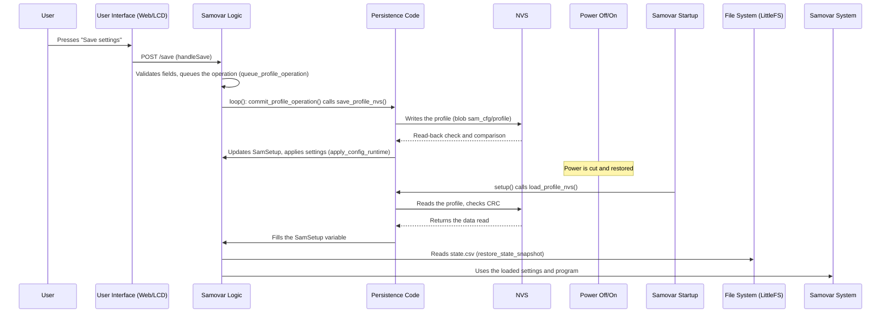

# Chapter 7: Configuration Persistence

Welcome back to the Samovar tutorial! So far on our journey we have looked at how you interact with Samovar ([Chapter 1: User Interaction (Web & LCD)](01_user_interaction__web___lcd__.md)), how it executes process programs ([Chapter 2: Process Program Execution](02_process_program_execution_.md)), how it manages its overall state ([Chapter 3: System State & Mode Management](03_system_state___mode_management_.md)), how it collects data from sensors ([Chapter 4: Sensor Data Acquisition](04_sensor_data_acquisition_.md)), how it controls hardware ([Chapter 5: Hardware Control (Actuators)](05_hardware_control__actuators__.md)), and how it keeps things safe with alarms ([Chapter 6: Safety Monitoring & Alarms](06_safety_monitoring___alarms_.md)).

But imagine that you have spent time carefully calibrating the temperature sensors, fine-tuning the pump speed and designing the perfect step-by-step program for your favorite distillate. You switch Samovar off, switch it on again... and all those custom settings and programs are gone! That would be incredibly annoying.

This is where **configuration persistence** comes to the rescue. It is Samovar's ability to remember its settings, calibration values and your carefully created process programs even after the power is turned off. It is like saving your progress and settings in a video game so that you can come back later and continue from the same place.

Without a persistence mechanism you would have to set everything up manually every time you want to use Samovar. Persistence makes the device convenient and practical for real use.

## Why Persistence Matters: A Use Case

Suppose you have just calibrated your peristaltic pump (the one that precisely regulates the take-off of liquid, see [Chapter 5: Hardware Control (Actuators)](05_hardware_control__actuators__.md)). This calibration tells Samovar how many stepper motor steps it takes to dispense one milliliter of liquid. You entered this value (`StepperStepMl`) on the settings page of the web interface.

If you want this value to still be correct the *next* time Samovar is switched on, it has to be stored somewhere that does not lose data when the power is cut.

The system also has to remember:
*   Your Wi-Fi credentials (SSID and password).
*   Calibration offsets for the temperature sensors.
*   Safety thresholds for temperature or pressure.
*   PID controller tuning parameters for Beer mode.
*   The whole list of steps of the selected process program (Heads, Hearts, Tails, Mashing, etc.).

All of this information has to be saved and loaded automatically.

## Where Does Samovar Store Information?

Unlike main memory (RAM), which loses all data when the power is cut, Samovar's microcontroller (ESP32) has special kinds of memory that can retain data:

1.  **NVS (Non-Volatile Storage, a "key — value" store):** A small flash partition (`nvs` in `partitions.csv`) where the ESP32 stores named values. Samovar keeps its settings profile here: the whole `SetupEEPROM` structure as one binary block (blob) under the key `profile` in the `sam_cfg` namespace. The block carries a format number and a CRC32 checksum (`profile_store.h`), so corrupted data is detected on read.
2.  **LittleFS:** A file system in flash memory (the `spiffs` partition in `partitions.csv`). It is well suited to files: web pages, the process log (`data.csv`, `data_old.csv`), the recorded program (`prg.csv`), the state snapshot (`state.csv`), program templates (`program_fruit.txt` etc.), Lua scripts. `Samovar.h` sets `#define USE_LittleFS` and makes the name `SPIFFS` an alias of `LittleFS` (`#define SPIFFS LittleFS`), so the code says `SPIFFS.open(...)` while LittleFS is what actually runs.

Samovar uses a combination of these storage methods so that all the necessary configuration and program data are saved.

## What Needs to Be Saved?

Samovar has a main data structure (container) that holds most of the important settings. In the code it is defined as the `SetupEEPROM` structure (despite the name, it is stored in NVS).

```c++
// From Samovar.h (simplified)
struct SetupEEPROM {
  uint8_t flag;                 // Flag for writing to memory
  float DeltaSteamTemp;         // Calibration offset of the steam sensor
  float DeltaPipeTemp;          // Calibration offset of the column sensor
  // ... other calibration values and setpoints ...
  uint16_t StepperStepMl;       // Stepper motor steps per 1 ml (pump calibration!)
  bool UsePreccureCorrect;      // Hearts take-off temperature correction by pressure
  uint8_t TimeZone;             // Time zone setting
  float HeaterResistant;        // Heater resistance (for power calculation)
  char SteamColor[20];          // Temperature colors in the web interface
  // ... other colors, relay levels rele1..rele4 ...
  uint8_t SteamAdress[8];       // Saved address of the steam sensor
  // ... saved addresses of the other sensors ...
  bool useautospeed;            // Automatic take-off speed correction
  uint8_t autospeed;            // Speed change percentage
  char blynkauth[33];           // Blynk token
  char videourl[120];           // Camera video URL
  float DistTemp;               // Distillation end temperature
  int Mode;                     // Last used mode
  float Kp, Ki, Kd;             // Heating PID controller coefficients
  bool UseBuzzer;               // Buzzer enable flag
  float MaxPressureValue;       // Pressure that triggers an alarm
  // ... settings for NBK (including the NBK program), Sous Vide, beer, cheese (pH calibration), etc. ...
};

SetupEEPROM SamSetup; // This variable holds ALL current settings
```

The `SamSetup` variable (of type `SetupEEPROM`) is where Samovar keeps *all* these settings while running. When something needs to be saved, the new settings are written to NVS. At startup the profile is read from NVS and fills `SamSetup` with the saved values.

Process programs (the `program` array of `WProgram` structures, see [Chapter 2: Process Program Execution](02_process_program_execution_.md)) are stored separately from the profile, in LittleFS files (the `state.csv` snapshot). The exception is the four-row NBK program: it is stored directly in the profile (fields `NbkProgramLength`, `NbkProgramHSpeed` … `NbkProgramWPower`).

## How Saving and Loading Work

Configuration persistence involves two main actions:

1.  **Saving:** Writing new settings to NVS. This happens when the user presses the "Save" button in the web interface, saves settings from the LCD menu, switches the mode, and also after PID autotuning or pump calibration.
2.  **Loading:** Reading the profile from NVS into the `SamSetup` variable and restoring the program from the `state.csv` snapshot when Samovar starts. This happens automatically after every power-up or reset.

Let's visualize the save/load process:



The diagram shows that saving means writing the new settings to NVS, and loading means copying data *from* NVS *into* the `SamSetup` variable (and the program from the snapshot into the `program` array). The main functions in the code are `save_profile_nvs()` and `load_profile_nvs()` from `NVS_Manager.ino`.

## Diving into the Code

Let's look at how this is implemented in Samovar's code.

### The `SamSetup` Structure (Simplified)

As shown above, the `SetupEEPROM` structure is the template for storing settings. The global `SamSetup` variable holds the live configuration.

```c++
// From Samovar.h
struct SetupEEPROM {
  uint8_t flag; // Flag for writing to memory
  float DeltaSteamTemp; // Sensor offset
  // ... many other settings ...
  uint16_t StepperStepMl; // Pump calibration!
  int Mode; // Last used mode
  // ... more settings ...
};

SetupEEPROM SamSetup; // In current RAM
```

The web interface does not change `SamSetup` directly. The request handler builds a copy of the settings with the new values (for example, `StepperStepMl` or `DeltaSteamTemp`) and queues it. The main `loop()` first writes this copy to NVS and only after a successful write copies it into `SamSetup` *in RAM*.

### Saving Settings: `save_profile_nvs()`

The `save_profile_nvs()` function (from `NVS_Manager.ino`) makes the settings passed to it permanent.

```c++
// From NVS_Manager.ino (simplified)
PersistResult save_profile_nvs(const SetupEEPROM& candidate) {
  // Pack the structure fields into a byte block and add a header with CRC32
  uint8_t payload[ProfileCodec::PAYLOAD_SIZE] = {};
  if (!encode_setup_payload(candidate, payload)) return PERSIST_READBACK_PAYLOAD_ENCODING;
  ProfileCodec::Blob encoded{};
  ProfileCodec::encode(payload, encoded);

  // Write the block to NVS: namespace "sam_cfg", key "profile"
  Preferences writer;
  if (!writer.begin(SAMOVAR_PROFILE_NAMESPACE, false)) return PERSIST_OPEN_FAILED;
  const size_t written = writer.putBytes(SAMOVAR_PROFILE_KEY, encoded.bytes, ProfileCodec::BLOB_SIZE);
  writer.end();
  if (written != ProfileCodec::BLOB_SIZE) return PERSIST_SHORT_WRITE;

  // Read back what was written, check the CRC and compare byte by byte
  // ... nvs_open(), nvs_read_blob(), ProfileCodec::decode(), memcmp() ...
  return PERSIST_OK;
}
```

This function packs the settings into a block with a format number and a checksum and writes it to NVS. Right after writing, the block is read back and compared with what was written, so a flash error does not go unnoticed. The result is returned as a `PersistResult` code; on error the user gets a message ("Settings not saved: …").

Usually this function is called after the `/save` form is submitted (see Chapter 1):

```c++
// From WebServer.ino (see Chapter 1)
server.on("/save", HTTP_POST, [](AsyncWebServerRequest *request) {
  handleSave(request); // Validates the fields, builds a copy of the settings and queues the operation
});

// From Samovar.ino: loop() -> process_profile_operation() -> commit_profile_operation()
const PersistResult persistResult = save_profile_nvs(settingsToSave);
```

The `handleSave` function validates each form field (an unknown or invalid field gets an error response) and calls `queue_profile_operation()`. *Then*, in the main loop, `commit_profile_operation()` calls `save_profile_nvs()` and, on success, updates `SamSetup` and applies the settings (`apply_config_runtime()`).

### Loading Settings: `load_profile_nvs()`

Loading happens automatically in Samovar's `setup()` function (the code that runs once when the device starts).

```c++
// From Samovar.ino (simplified setup())
void setup() {
  init_power_outputs_safe_off(); // Heating outputs to a safe state before reading settings
  // ...
  SetupEEPROM startupProfile{};
  PersistResult profilePersistResult = PERSIST_OK;
  ProfileLoadResult profileResult = load_profile_nvs(startupProfile, profilePersistResult);
  if (profileResult == PROFILE_LOAD_NOT_FOUND) {
    // No profile yet (first start): defaults, written to NVS right away
    set_default_setup_profile(startupProfile);
    // ... save_profile_nvs(startupProfile) ...
  }
  if (profileResult != PROFILE_LOAD_OK) {
    // Profile is corrupted: report it and run on safe defaults
    report_degraded_boot("load", profile_load_result_code(profileResult));
    set_default_setup_profile(startupProfile);
  }
  // Range check of the heater resistance
  startupProfile.HeaterResistant = trusted_heater_resistance(startupProfile.HeaterResistant);
  SamSetup = startupProfile;
  // ... FS_init(), apply_config_runtime(), restore_state_snapshot() and the rest of setup ...
}
```

The `load_profile_nvs()` function reads the block from NVS and checks its size and checksum. If there is no profile, the defaults (`set_default_setup_profile()`) are used and written to NVS right away. If the profile is corrupted, Samovar reports it and starts on safe defaults (heating relays off). Then the values from `SamSetup` are applied to the working variables (`apply_config_runtime()`), for example sensor addresses and setpoints.

### Saving Programs

Process programs (the `program` array, up to `PROGRAM_MAX` = 30 rows) are stored separately from the `SamSetup` profile. A program is edited as text on the program page of the web interface and sent to the device with a `/program` request; it can also be loaded from a file on the computer or from a template (`program_fruit.txt`, `program_grain.txt`, `program_shugar.txt`, `program_bk.txt`).

The `create_data()` function, which is called when a program starts (see Chapter 2), writes the program of the current mode to the `prg.csv` file. This serves as a record of the specific program that was run.

```c++
// From FS.ino (simplified create_data)
bool create_data() {
  // Write the program of the current mode to a file (the format depends on the mode)
  String programText = serialize_program_for_mode(Samovar_Mode);
  if (programText.length() > 0) {
    File filePrg = SPIFFS.open("/prg.csv", FILE_WRITE);
    if (!filePrg) return false;
    filePrg.print(programText);
    filePrg.close();
  }

  // ... log rotation: data.csv -> data_old.csv, creating a new data.csv ...
  return true;
}
```

To keep the program from being lost on reboot, Samovar periodically (normally every 30 seconds, and immediately when heating is switched off) writes a state snapshot to the `state.csv` file (`process_state_snapshot()` → `write_state_snapshot()` in `FS.ino`). The first line of the snapshot holds `key=value` fields (mode, program row number, heating state, session number, etc.), followed by the program text. At startup `restore_state_snapshot()` reads the snapshot and, if the mode matches, restores the program into the `program` array.

```c++
// From WebServer.ino (see Chapter 1)
server.on("/program", HTTP_POST, [](AsyncWebServerRequest *request) {
  web_program(request); // Accepts the program text (WProgram field)
});
```

The `web_program` function (not shown) validates the request parameters, parses the program text according to the format of the current mode and puts it into the same operation queue as the settings. The main loop applies the program (`commit_profile_operation()`); while a process is running, only the rows after the current one can be changed.

## Conclusion

In this chapter we looked at **configuration persistence**, the essential mechanism that lets Samovar remember settings and process programs between power-ups. We learned that Samovar uses non-volatile memory: **NVS** for the settings profile and the **LittleFS file system** for files. We saw how the main configuration is managed by the `SamSetup` structure, how the `save_profile_nvs()` function writes it to NVS with a checksum and read-back verification, and how `load_profile_nvs()` loads it at startup. We also looked at how process programs are saved in files on the file system (`state.csv`, `prg.csv`) and restored after a reboot. Understanding the persistence mechanism lets Samovar keep your important individual settings, making operation more efficient and reliable.

In the final chapter we will look at [Network & External Communication](08_network___external_communication_.md), exploring how Samovar connects to your network, serves the web interface discussed earlier and communicates with the samovar-tool.ru server via Blynk.

[Chapter 8: Network & External Communication](08_network___external_communication_.md)
