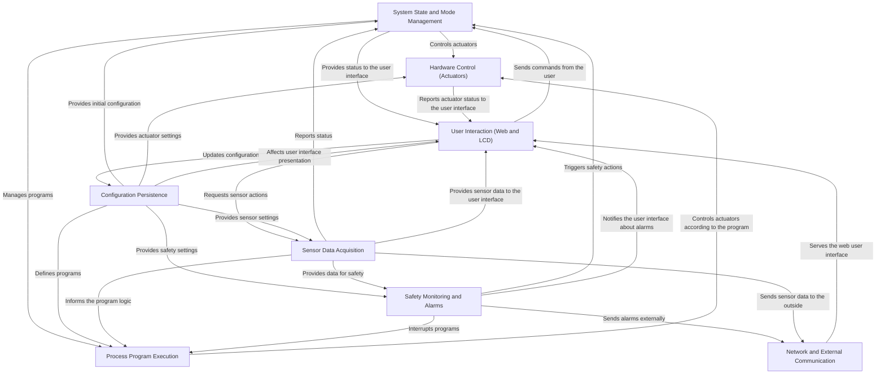

# Technical Documentation: Samovar

Samovar is an automated system designed for **automating distillation, rectification, beer column (BK and NBK), beer brewing, cheese making and sous vide processes**.
It *monitors* various sensors (such as temperature and pressure),
*controls* equipment (heaters, pumps, valves) and follows predefined
*process programs* to automate tasks such as rectification or brewing beer.
Users *interact* with the system through a web interface or an LCD
(as well as through the mobile apps and the samovar-tool.ru website, connected via Blynk),
and the system includes important *safety monitoring* and *external communication* features.
Settings and programs are *saved* for persistent configuration.

## Visual Overview

## Chapters

1. [User Interaction (Web and LCD)
](01_user_interaction__web___lcd__.md)
2. [Process Program Execution
](02_process_program_execution_.md)
3. [System State and Mode Management
](03_system_state___mode_management_.md)
4. [Sensor Data Acquisition
](04_sensor_data_acquisition_.md)
5. [Hardware Control (Actuators)
](05_hardware_control__actuators__.md)
6. [Safety Monitoring and Alarms
](06_safety_monitoring___alarms_.md)
7. [Configuration Persistence
](07_configuration_persistence_.md)
8. [Network and External Communication
](08_network___external_communication_.md)
