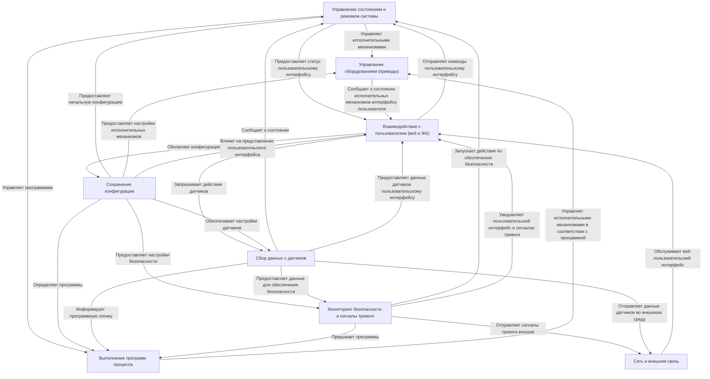

# Техническая документация: Самовар

Самовар -- это автоматизированная система, предназначенная для **автоматизации процессов дистилляции, ректификации и пивоварения**.
Она *контролирует* различные датчики (такие как температура и давление),
*управляет* оборудованием (нагреватели, насосы, клапаны) и следует заранее заданным
*программам процессов* для автоматизации таких задач, как ректификация или варка пива.
Пользователи *взаимодействуют* с системой через веб-интерфейс или ЖК-экран,
а система включает в себя важные функции *мониторинга безопасности* и *внешней связи*.
Настройки и программы *сохраняются* для постоянной конфигурации.

## Визуальный обзор

## Главы

1. [Взаимодействие с пользователем (веб и ЖК-дисплей)
](01_user_interaction__web___lcd__.md)
2. [Выполнение программы процесса
](02_process_program_execution_.md)
3. [Управление состоянием и режимом системы
](03_system_state___mode_management_.md)
4. [Сбор данных датчиков
](04_sensor_data_acquisition_.md)
5. [Управление оборудованием (приводы)
](05_hardware_control__actuators__.md)
6. [Мониторинг безопасности и сигналы тревоги
](06_safety_monitoring___alarms_.md)
7. [Сохранение конфигурации
](07_configuration_persistence_.md)
8. [Сеть и внешняя связь
](08_network___external_communication_.md)
