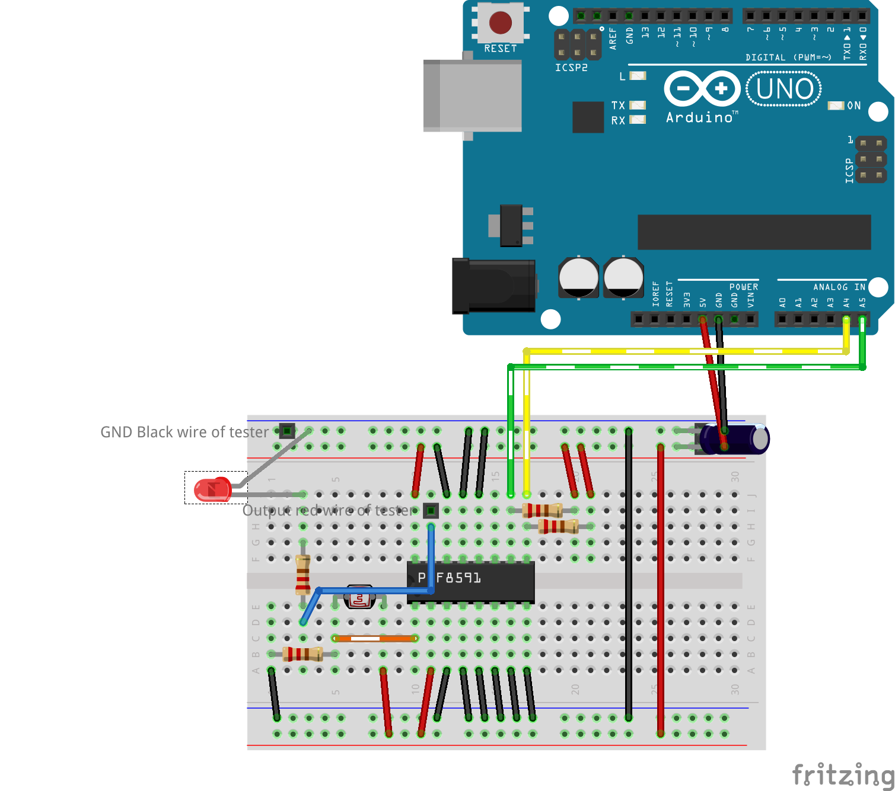
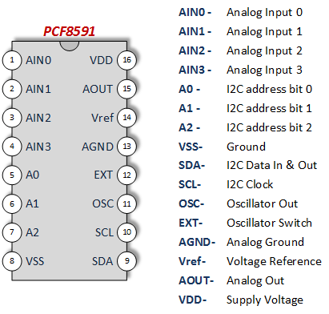
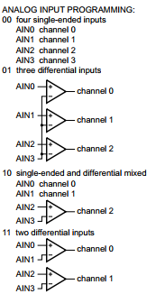

# PCF8591 I2C Analog I/O Expander Library


[](https://www.ardu-badge.com/PCF8591%20library) 
[]()  
[](LICENSE)

A simple and efficient library to use the PCF8591 I2C 8-bit A/D and D/A converter with Arduino, ESP8266, ESP32, and other platforms. It provides 4 analog inputs and 1 analog output.

**Author:** Renzo Mischianti  
**Website:** [www.mischianti.org](https://www.mischianti.org/category/my-libraries/pcf8591-i2c-analog-expander/)  
**GitHub:** [xreef/PCF8591_library](https://github.com/xreef/PCF8591_library)

---

## 📚 Documentation & Articles
Complete documentation, tutorials, and examples are available on mischianti.org.

- 🌐 **[PCF8591 Main Article](https://mischianti.org/pcf8591-i2c-analog-i-o-expander/)**: The primary guide for this library with wiring diagrams and detailed explanations.
- 🛠️ **[I2C Scanner](https://playground.arduino.cc/Main/I2cScanner)**: A utility to find the I2C address of your device.
- 💬 **[Support Forum (English)](https://www.mischianti.org/forums/forum/mischiantis-libraries/pcf8591-i2c-analog-expander/)**: Get help and discuss the library.
- 💬 **[Forum di Supporto (Italiano)](https://www.mischianti.org/it/forums/forum/le-librerie-di-mischianti/pcf8591-expander-analogico-i2c/)**: Ottieni supporto e discuti della libreria.

---

## 📋 Table of Contents
- [Features](#-features)
- [Supported Platforms](#-supported-platforms)
- [Installation](#-installation)
- [Hardware Setup](#-hardware-setup)
- [API Overview](#-api-overview)
- [Basic Usage](#-basic-usage)
- [Advanced Reading Modes](#-advanced-reading-modes)
- [Voltage Functions](#-voltage-functions)
- [Changelog](#-changelog)
- [License](#-license)
- [Contributing](#-contributing)
- [Support & Contact](#-support--contact)

## ✨ Features

- **4 Analog Inputs**: Read up to 4 analog channels over I2C.
- **1 Analog Output**: Provides a true analog voltage output.
- **8-Bit Resolution**: Both ADC and DAC operate at 8-bit resolution (0-255).
- **Multiple Input Modes**: Supports four single-ended inputs, three differential inputs, and combined modes.
- **Efficient Reading**: Read all 4 input channels in a single I2C transaction with `analogReadAll()`.
- **Voltage Conversion**: Built-in functions (`voltageRead`, `voltageWrite`) to work directly with voltage levels.
- **Flexible I2C Configuration**: Custom I2C pins (SDA, SCL) can be specified for platforms like ESP8266/ESP32.

## 🎯 Supported Platforms

| Platform | Support | Notes |
|---|---|---|
| ESP32 | ✅ | Full support |
| ESP8266 | ✅ | Full support |
| Raspberry Pi Pico (RP2040) | ✅ | Full support |
| Arduino (AVR, Uno, Mega, UNO R4) | ✅ | Full support |
| Arduino SAMD (Nano 33 IoT, etc.) | ✅ | Full support |
| STM32 | ✅ | Full support |

## 📦 Installation

### Arduino IDE (Library Manager)
1. Open Arduino IDE.
2. Go to `Sketch` > `Include Library` > `Manage Libraries...`.
3. Search for "**PCF8591_library**" by Renzo Mischianti.
4. Click `Install`.

### PlatformIO
Add the library to your `platformio.ini` file:
```ini
lib_deps = xreef/PCF8591 library
```

### Manual Installation
1. Download the latest release from [GitHub](https://github.com/xreef/PCF8591_library/releases).
2. Unzip the folder and rename it to `PCF8591_library`.
3. Move it to your Arduino `libraries` folder.
4. Restart the Arduino IDE.

---

## 🔌 Hardware Setup

Here is a typical wiring diagram for the PCF8591 module.



And here is the pinout of the IC:



## 🚀 API Overview

### Constructor
```cpp
// Basic constructor with I2C address
PCF8591(uint8_t address);

// For ESP8266/ESP32 with custom SDA/SCL pins
PCF8591(uint8_t address, uint8_t sda, uint8_t scl);
```

### Core Functions
```cpp
// Initialize the library (must be called in setup())
bool begin();

// Read all 4 analog inputs at once
PCF8591::AnalogInput analogReadAll();

// Read a single analog input channel
int analogRead(uint8_t channel, uint8_t mode = FOUR_SINGLE_ENDED);

// Write a value (0-255) to the analog output
void analogWrite(uint8_t value);

// Read the voltage from a specified analog pin
float voltageRead(uint8_t analogPin, bool microcontrollerReferenceVoltage = true, float referenceVoltage = 5.0);

// Write a voltage level to the analog output
void voltageWrite(float value, bool microcontrollerReferenceVoltage = true, float referenceVoltage = 5.0);
```

## 💡 Basic Usage

Here is a simple example of how to read an analog input and write to the analog output.

```cpp
#include <Wire.h>
#include <PCF8591.h>

// Set I2C address (e.g., 0x48)
PCF8591 pcf8591(0x48);

void setup() {
  Serial.begin(115200);

  // Initialize the PCF8591
  if (!pcf8591.begin()) {
    Serial.println("Couldn't find PCF8591");
    while (1);
  }

  Serial.println("PCF8591 initialized!");
}

void loop() {
  // Write a value (e.g., 128) to the analog output
  pcf8591.analogWrite(128);

  // Read a single analog input (AIN0)
  int analogValue = pcf8591.analogRead(AIN0);
  Serial.print("Value from AIN0: ");
  Serial.println(analogValue);

  // Read all analog inputs at once
  PCF8591::AnalogInput allValues = pcf8591.analogReadAll();
  Serial.print("AIN0: "); Serial.print(allValues.ain0);
  Serial.print(" | AIN1: "); Serial.print(allValues.ain1);
  Serial.print(" | AIN2: "); Serial.print(allValues.ain2);
  Serial.print(" | AIN3: "); Serial.println(allValues.ain3);

  delay(500);
}
```

## 🔬 Advanced Reading Modes

The PCF8591 supports different analog input configurations, which can be selected using the `analogRead` function.



```cpp
// Example: Read the differential value between AIN0 and AIN1
int differentialValue = pcf8591.analogRead(CHANNEL0, THREE_DIFFERENTIAL_INPUT);

// Example: Read AIN0 as single-ended and AIN1, AIN2 as differential
int value = pcf8591.analogRead(CHANNEL0, AIN0_SINGLE_AIN1_AIN2_DIFFERENTIAL);
```

## ⚡ Voltage Functions

The library provides helper functions to work directly with voltage values, abstracting the 8-bit conversion.

```cpp
void setup() {
  // ... setup code ...
  pcf8591.begin();
}

void loop() {
  // Set the analog output to 2.7 Volts
  // Assumes the microcontroller VCC is the reference voltage.
  pcf8591.voltageWrite(2.7);

  delay(1000);

  // Read the voltage from analog input AIN0
  float inputVoltage = pcf8591.voltageRead(AIN0);
  Serial.print("Voltage at AIN0: ");
  Serial.print(inputVoltage);
  Serial.println(" V");

  delay(1000);
}
```

## 📝 Changelog
- 31/10/2025: v1.1.3 Minor change and README update
- 01/02/2024: v1.1.2 Add the possibility to insert address at begin() function
- 10/07/2023: v1.1.1 Add support for Arduino UNO R4
- 16/02/2023: v1.1.0 Fix STM32 support, add support for RP2040, and add custom SERCOM for SAMD.
- 06/04/2022: v1.0.2 Fix package size

## 📄 License
This library is released under the MIT License. See the `LICENSE` file for more details.

Copyright (c) 2019-2025 Renzo Mischianti

## 🤝 Contributing
Contributions are welcome! Please fork the repository, create a feature branch, and submit a pull request.

## 📞 Support & Contact
- **Documentation:** [https://www.mischianti.org/category/my-libraries/pcf8591-i2c-analog-expander/](https://www.mischianti.org/category/my-libraries/pcf8591-i2c-analog-expander/)
- **GitHub Issues:** [https://github.com/xreef/PCF8591_library/issues](https://github.com/xreef/PCF8591_library/issues)
- **Author:** Renzo Mischianti ([@xreef](https://github.com/xreef))

---

⭐ If this library helped your project, please give it a star on GitHub!
